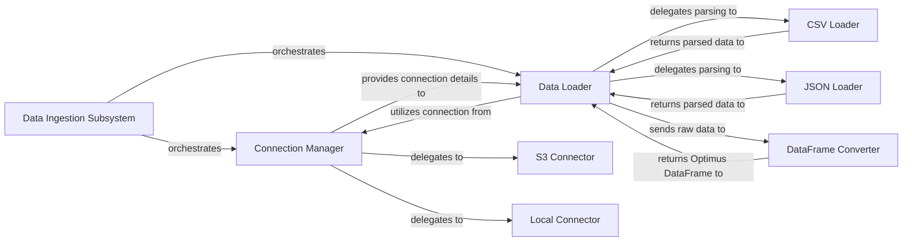

## Details

The Data Ingestion Subsystem serves as the primary entry point for all data loading and connection operations within Optimus. It orchestrates both the `Connection Manager` and the `Data Loader`. The `Connection Manager` is responsible for establishing connections to various data sources, delegating to specific connectors like `S3 Connector` and `Local Connector`, and subsequently providing connection details to the `Data Loader`. The `Data Loader` then utilizes these connection details to delegate the parsing of diverse file formats to specialized components such as the `CSV Loader` and `JSON Loader`. Once data is parsed, these format-specific loaders return the processed data back to the `Data Loader`, which then sends this raw data to the `DataFrame Converter` for transformation into a standardized Optimus DataFrame. This structured flow ensures consistent data ingestion regardless of the source or format.

### Data Ingestion Subsystem
The overarching module responsible for providing a unified interface for all data connection and loading operations within Optimus. It acts as the entry point for external modules requiring data.

**Related Classes/Methods**:

- <a href="https://github.com/hi-primus/optimus/blob/develop/optimus/engines/base/io/load.py" target="_blank" rel="noopener noreferrer">`optimus.engines.base.io.load`</a>
- <a href="https://github.com/hi-primus/optimus/blob/develop/optimus/engines/base/io/connect.py" target="_blank" rel="noopener noreferrer">`optimus.engines.base.io.connect`</a>

### Connection Manager
This component serves as a factory and orchestrator for establishing connections to various external data sources, such as S3, local file systems, HDFS, GCS, and MAS. It abstracts the complexities of different storage systems, providing a consistent interface.

**Related Classes/Methods**:

- <a href="https://github.com/hi-primus/optimus/blob/develop/optimus/engines/base/io/connect.py" target="_blank" rel="noopener noreferrer">`optimus.engines.base.io.connect`</a>

### Data Loader
This component provides a unified, high-level API for loading data from diverse file formats (e.g., CSV, JSON, Parquet) into Optimus DataFrames. It orchestrates the parsing and conversion process, delegating to format-specific implementations.

**Related Classes/Methods**:

- <a href="https://github.com/hi-primus/optimus/blob/develop/optimus/engines/base/io/load.py" target="_blank" rel="noopener noreferrer">`optimus.engines.base.io.load`</a>

### S3 Connector
A specific adapter responsible for handling the logic of connecting to and interacting with Amazon S3 storage, including authentication and data retrieval.

**Related Classes/Methods**:

- <a href="https://github.com/hi-primus/optimus/blob/develop/optimus/engines/base/io/connect.py#L210-L212" target="_blank" rel="noopener noreferrer">`optimus.engines.base.io.connect.S3`:210-212</a>

### Local Connector
Manages connections and operations on the local file system, providing a standardized way to access files stored locally.

**Related Classes/Methods**:

- <a href="https://github.com/hi-primus/optimus/blob/develop/optimus/engines/base/io/connect.py#L214-L216" target="_blank" rel="noopener noreferrer">`optimus.engines.base.io.connect.Local`:214-216</a>

### CSV Loader
Contains the specific implementation details for reading and parsing data from CSV formatted files, handling various CSV specific options.

**Related Classes/Methods**:

- <a href="https://github.com/hi-primus/optimus/blob/develop/optimus/engines/base/io/load.py#L31-L32" target="_blank" rel="noopener noreferrer">`optimus.engines.base.io.load._csv`:31-32</a>

### JSON Loader
Contains the specific implementation details for reading and parsing data from JSON formatted files, including handling different JSON structures.

**Related Classes/Methods**:

- <a href="https://github.com/hi-primus/optimus/blob/develop/optimus/engines/base/io/load.py#L34-L35" target="_blank" rel="noopener noreferrer">`optimus.engines.base.io.load._json`:34-35</a>

### DataFrame Converter
A utility method responsible for converting raw loaded data (from various formats) into the standardized Optimus DataFrame structure, ensuring consistency across different data sources and formats for subsequent processing.

**Related Classes/Methods**:

- <a href="https://github.com/hi-primus/optimus/blob/develop/optimus/engines/base/io/load.py" target="_blank" rel="noopener noreferrer">`optimus.engines.base.io.load.df`</a>

### [FAQ](https://github.com/CodeBoarding/GeneratedOnBoardings/tree/main?tab=readme-ov-file#faq)