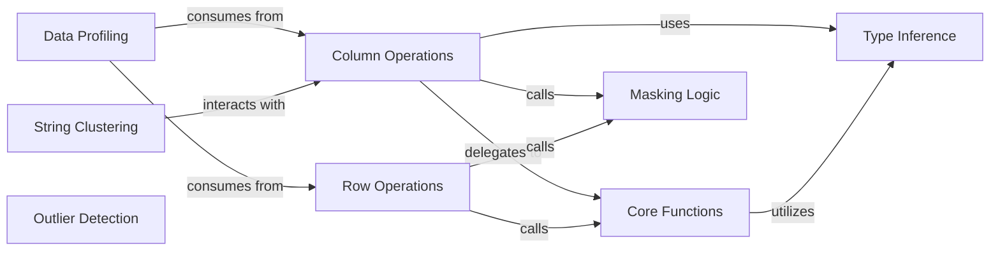

## Details

The `Data Processing & Analysis` subsystem in `optimus` is responsible for comprehensive data cleaning, transformation, feature engineering, profiling, and quality checks. It forms the core of the library's data manipulation capabilities, adhering to the Data Flow and Engine Agnosticism architectural biases.

### Column Operations
Acts as the primary interface for column-wise data transformations, cleaning, and feature engineering. This is a core component for comprehensive column-level data manipulation, including type conversions, string operations, date/time parsing, and phonetic algorithms.

**Related Classes/Methods**:

- <a href="https://github.com/hi-primus/optimus/blob/develop/optimus/engines/base/columns.py" target="_blank" rel="noopener noreferrer">`optimus.engines.base.columns`</a>

### Row Operations
Manages row-wise data manipulation, including filtering, sorting, and counting. Essential for data subsetting and reordering.

**Related Classes/Methods**:

- <a href="https://github.com/hi-primus/optimus/blob/develop/optimus/engines/base/rows.py" target="_blank" rel="noopener noreferrer">`optimus.engines.base.rows`</a>

### Data Profiling
Central for generating comprehensive data profiles, providing insights into data quality and characteristics. It calculates and merges data profiles, offering statistical summaries and metadata.

**Related Classes/Methods**:

- <a href="https://github.com/hi-primus/optimus/blob/develop/optimus/engines/base/profile.py" target="_blank" rel="noopener noreferrer">`optimus.engines.base.profile`</a>

### Type Inference
Crucial for automatic data type inference and pattern detection, which underpins many data quality and transformation steps. It determines data types and identifies patterns within data, supporting data validation and automated processing.

**Related Classes/Methods**:

- <a href="https://github.com/hi-primus/optimus/blob/develop/optimus/infer.py" target="_blank" rel="noopener noreferrer">`optimus.infer`</a>

### Core Functions
Serves as a foundational utility layer, offering atomic data processing functions consumed by other components. Provides a wide range of fundamental data processing utilities (e.g., type conversions, statistical calculations, string processing, date/time extraction).

**Related Classes/Methods**:

- <a href="https://github.com/hi-primus/optimus/blob/develop/optimus/engines/base/functions.py" target="_blank" rel="noopener noreferrer">`optimus.engines.base.functions`</a>

### Masking Logic
Provides the core logic for creating boolean masks, fundamental for filtering and conditional operations across columns and rows. It offers the underlying logic for creating masks based on various conditions (e.g., missing values, nulls, duplicates, regex matches).

**Related Classes/Methods**:

- <a href="https://github.com/hi-primus/optimus/blob/develop/optimus/engines/base/mask.py" target="_blank" rel="noopener noreferrer">`optimus.engines.base.mask`</a>

### String Clustering
Focuses on data standardization and cleaning by grouping similar strings, implementing algorithms for data cleaning and standardization.

**Related Classes/Methods**:

- <a href="https://github.com/hi-primus/optimus/blob/develop/optimus/engines/base/stringclustering.py" target="_blank" rel="noopener noreferrer">`optimus.engines.base.stringclustering`</a>

### Outlier Detection
Provides abstract and concrete implementations for outlier detection methods (e.g., MAD, Tukey's fences), offering common methods for identifying anomalous data points.

**Related Classes/Methods**:

- <a href="https://github.com/hi-primus/optimus/blob/develop/optimus/outliers/abstract_outliers_bounds.py" target="_blank" rel="noopener noreferrer">`optimus.outliers.abstract_outliers_bounds`</a>

### [FAQ](https://github.com/CodeBoarding/GeneratedOnBoardings/tree/main?tab=readme-ov-file#faq)