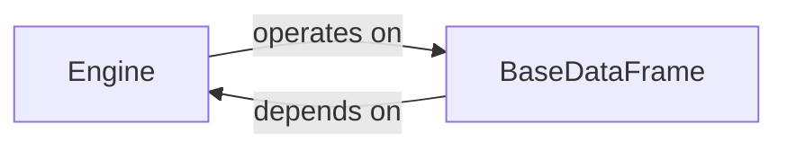

## Details

The Engine Abstraction Layer subsystem is primarily defined by the optimus/engines/base/engine.py and optimus/engines/base/basedataframe.py files. These files contain the core abstract interfaces that enable Optimus to operate independently of the underlying data processing engine.

### Engine
Defines the abstract interface for all Optimus data processing engines. It acts as a factory and manager for concrete engine instances (e.g., Pandas, Dask, cuDF), ensuring that the correct engine implementation is used for operations. This component is fundamental for achieving engine agnosticism by providing a standardized way to interact with different computational backends.

**Related Classes/Methods**:

- <a href="https://github.com/hi-primus/optimus/blob/develop/optimus/optimus.py" target="_blank" rel="noopener noreferrer">`Engine`</a>

### BaseDataFrame
Provides a comprehensive, engine-agnostic API for DataFrame manipulations. This class serves as the core abstraction for all data operations, allowing users to interact with data without needing to know the specific underlying engine. It encapsulates common DataFrame operations, making the user experience consistent across various engines.

**Related Classes/Methods**:

- <a href="https://github.com/hi-primus/optimus/blob/develop/optimus/engines/base/basedataframe.py#L30-L1020" target="_blank" rel="noopener noreferrer">`BaseDataFrame`:30-1020</a>

### [FAQ](https://github.com/CodeBoarding/GeneratedOnBoardings/tree/main?tab=readme-ov-file#faq)