```mermaid
graph LR
    Engine_Abstraction_Layer["Engine Abstraction Layer"]
    Pandas_Engine_Adapter["Pandas Engine Adapter"]
    Dask_Engine_Adapter["Dask Engine Adapter"]
    Spark_Engine_Adapter["Spark Engine Adapter"]
    cuDF_Engine_Adapter["cuDF Engine Adapter"]
    Polars_Engine_Adapter["Polars Engine Adapter"]
    Vaex_Engine_Adapter["Vaex Engine Adapter"]
    Ibis_Engine_Adapter["Ibis Engine Adapter"]
    Pandas_Framework["Pandas Framework"]
    Dask_Framework["Dask Framework"]
    Spark_Framework["Spark Framework"]
    cuDF_Framework["cuDF Framework"]
    Polars_Framework["Polars Framework"]
    Vaex_Framework["Vaex Framework"]
    Ibis_Framework["Ibis Framework"]
    DataFrame_Module_Pandas_["DataFrame Module (Pandas)"]
    Columns_Module_Pandas_["Columns Module (Pandas)"]
    Functions_Module_Pandas_["Functions Module (Pandas)"]
    IO_Package_Pandas_["IO Package (Pandas)"]
    ML_Package_Pandas_["ML Package (Pandas)"]
    DataFrame_Module_Dask_["DataFrame Module (Dask)"]
    Columns_Module_Dask_["Columns Module (Dask)"]
    Functions_Module_Dask_["Functions Module (Dask)"]
    IO_Package_Dask_["IO Package (Dask)"]
    ML_Package_Dask_["ML Package (Dask)"]
    DataFrame_Module_Spark_["DataFrame Module (Spark)"]
    Columns_Module_Spark_["Columns Module (Spark)"]
    Functions_Module_Spark_["Functions Module (Spark)"]
    IO_Package_Spark_["IO Package (Spark)"]
    ML_Package_Spark_["ML Package (Spark)"]
    DataFrame_Module_cuDF_["DataFrame Module (cuDF)"]
    Columns_Module_cuDF_["Columns Module (cuDF)"]
    Functions_Module_cuDF_["Functions Module (cuDF)"]
    IO_Package_cuDF_["IO Package (cuDF)"]
    ML_Package_cuDF_["ML Package (cuDF)"]
    DataFrame_Module_Polars_["DataFrame Module (Polars)"]
    Columns_Module_Polars_["Columns Module (Polars)"]
    Functions_Module_Polars_["Functions Module (Polars)"]
    IO_Package_Polars_["IO Package (Polars)"]
    DataFrame_Module_Vaex_["DataFrame Module (Vaex)"]
    Columns_Module_Vaex_["Columns Module (Vaex)"]
    Functions_Module_Vaex_["Functions Module (Vaex)"]
    IO_Package_Vaex_["IO Package (Vaex)"]
    DataFrame_Module_Ibis_["DataFrame Module (Ibis)"]
    Columns_Module_Ibis_["Columns Module (Ibis)"]
    Functions_Module_Ibis_["Functions Module (Ibis)"]
    IO_Package_Ibis_["IO Package (Ibis)"]
    Pandas_Engine_Adapter -- "implements" --> Engine_Abstraction_Layer
    Dask_Engine_Adapter -- "implements" --> Engine_Abstraction_Layer
    Spark_Engine_Adapter -- "implements" --> Engine_Abstraction_Layer
    cuDF_Engine_Adapter -- "implements" --> Engine_Abstraction_Layer
    Polars_Engine_Adapter -- "implements" --> Engine_Abstraction_Layer
    Vaex_Engine_Adapter -- "implements" --> Engine_Abstraction_Layer
    Ibis_Engine_Adapter -- "implements" --> Engine_Abstraction_Layer
    Pandas_Engine_Adapter -- "interacts with" --> Pandas_Framework
    Dask_Engine_Adapter -- "interacts with" --> Dask_Framework
    Spark_Engine_Adapter -- "interacts with" --> Spark_Framework
    cuDF_Engine_Adapter -- "interacts with" --> cuDF_Framework
    Polars_Engine_Adapter -- "interacts with" --> Polars_Framework
    Vaex_Engine_Adapter -- "interacts with" --> Vaex_Framework
    Ibis_Engine_Adapter -- "interacts with" --> Ibis_Framework
    DataFrame_Module_Pandas_ -- "depends on" --> Pandas_Engine_Adapter
    Columns_Module_Pandas_ -- "depends on" --> Pandas_Engine_Adapter
    Columns_Module_Pandas_ -- "depends on" --> DataFrame_Module_Pandas_
    Functions_Module_Pandas_ -- "depends on" --> Pandas_Engine_Adapter
    IO_Package_Pandas_ -- "depends on" --> Pandas_Engine_Adapter
    ML_Package_Pandas_ -- "depends on" --> Pandas_Engine_Adapter
    ML_Package_Pandas_ -- "depends on" --> DataFrame_Module_Pandas_
    DataFrame_Module_Dask_ -- "depends on" --> Dask_Engine_Adapter
    Columns_Module_Dask_ -- "depends on" --> Dask_Engine_Adapter
    Columns_Module_Dask_ -- "depends on" --> DataFrame_Module_Dask_
    Functions_Module_Dask_ -- "depends on" --> Dask_Engine_Adapter
    IO_Package_Dask_ -- "depends on" --> Dask_Engine_Adapter
    ML_Package_Dask_ -- "depends on" --> Dask_Engine_Adapter
    ML_Package_Dask_ -- "depends on" --> DataFrame_Module_Dask_
    DataFrame_Module_Spark_ -- "depends on" --> Spark_Engine_Adapter
    Columns_Module_Spark_ -- "depends on" --> Spark_Engine_Adapter
    Columns_Module_Spark_ -- "depends on" --> DataFrame_Module_Spark_
    Functions_Module_Spark_ -- "depends on" --> Spark_Engine_Adapter
    IO_Package_Spark_ -- "depends on" --> Spark_Engine_Adapter
    ML_Package_Spark_ -- "depends on" --> Spark_Engine_Adapter
    ML_Package_Spark_ -- "depends on" --> DataFrame_Module_Spark_
    DataFrame_Module_cuDF_ -- "depends on" --> cuDF_Engine_Adapter
    Columns_Module_cuDF_ -- "depends on" --> cuDF_Engine_Adapter
    Columns_Module_cuDF_ -- "depends on" --> DataFrame_Module_cuDF_
    Functions_Module_cuDF_ -- "depends on" --> cuDF_Engine_Adapter
    IO_Package_cuDF_ -- "depends on" --> cuDF_Engine_Adapter
    ML_Package_cuDF_ -- "depends on" --> cuDF_Engine_Adapter
    ML_Package_cuDF_ -- "depends on" --> DataFrame_Module_cuDF_
    DataFrame_Module_Polars_ -- "depends on" --> Polars_Engine_Adapter
    Columns_Module_Polars_ -- "depends on" --> Polars_Engine_Adapter
    Functions_Module_Polars_ -- "depends on" --> Polars_Engine_Adapter
    IO_Package_Polars_ -- "depends on" --> Polars_Engine_Adapter
    DataFrame_Module_Vaex_ -- "depends on" --> Vaex_Engine_Adapter
    Columns_Module_Vaex_ -- "depends on" --> Vaex_Engine_Adapter
    Functions_Module_Vaex_ -- "depends on" --> Vaex_Engine_Adapter
    IO_Package_Vaex_ -- "depends on" --> Vaex_Engine_Adapter
    DataFrame_Module_Ibis_ -- "depends on" --> Ibis_Engine_Adapter
    Columns_Module_Ibis_ -- "depends on" --> Ibis_Engine_Adapter
    Functions_Module_Ibis_ -- "depends on" --> Ibis_Engine_Adapter
    IO_Package_Ibis_ -- "depends on" --> Ibis_Engine_Adapter
    click Engine_Abstraction_Layer href "https://github.com/CodeBoarding/GeneratedOnBoardings/blob/main/optimus/Engine_Abstraction_Layer.md" "Details"
```

## Details

The optimus.engines subsystem provides a robust and extensible architecture for data processing by abstracting various data manipulation frameworks behind a common interface. At its core, the Engine Abstraction Layer defines the fundamental operations, ensuring consistency across different backends. Concrete Engine Adapters (e.g., Pandas, Dask, Spark) implement this abstraction, translating high-level Optimus commands into framework-specific calls. Each adapter encapsulates the complexities of its underlying External Framework, managing data structures, column operations, utility functions, I/O, and, for some, machine learning capabilities through dedicated internal modules. This design allows Optimus to seamlessly switch between data processing engines, offering flexibility and performance optimization without requiring changes to the core application logic.

### Engine Abstraction Layer [[Expand]](./Engine_Abstraction_Layer.md)
An abstract layer defining common interfaces and methods for data processing operations (e.g., DataFrame manipulation, column operations, I/O, ML functions). It serves as the contract that all concrete engine adapters must adhere to, enabling the core Optimus API to remain engine-agnostic.

**Related Classes/Methods**:

- <a href="https://github.com/hi-primus/optimus/blob/develop/optimus/engines/base/engine.py#L13-L92" target="_blank" rel="noopener noreferrer">`optimus.engines.base.engine.BaseEngine`:13-92</a>

### Pandas Engine Adapter
The concrete adapter for the Pandas data processing framework. It implements the Engine Abstraction Layer interfaces by translating abstract operations into Pandas-specific code, managing Pandas DataFrame operations, column functions, I/O, and ML integrations.

**Related Classes/Methods**:

- <a href="https://github.com/hi-primus/optimus/blob/develop/optimus/engines/pandas/engine.py#L14-L66" target="_blank" rel="noopener noreferrer">`optimus.engines.pandas.engine.PandasEngine`:14-66</a>

### Dask Engine Adapter
The concrete adapter for the Dask data processing framework. It implements the Engine Abstraction Layer interfaces by translating abstract operations into Dask-specific code, managing Dask DataFrame operations, column functions, I/O, and ML integrations.

**Related Classes/Methods**:

- <a href="https://github.com/hi-primus/optimus/blob/develop/optimus/engines/dask/engine.py#L14-L167" target="_blank" rel="noopener noreferrer">`optimus.engines.dask.engine.DaskEngine`:14-167</a>

### Spark Engine Adapter
The concrete adapter for the Apache Spark data processing framework. It implements the Engine Abstraction Layer interfaces by translating abstract operations into Spark-specific code, managing Spark DataFrame operations, column functions, I/O, and ML integrations.

**Related Classes/Methods**:

- <a href="https://github.com/hi-primus/optimus/blob/develop/optimus/engines/spark/engine.py#L28-L454" target="_blank" rel="noopener noreferrer">`optimus.engines.spark.engine.SparkEngine`:28-454</a>

### cuDF Engine Adapter
The concrete adapter for the cuDF (CUDA Dataframe) data processing framework. It implements the Engine Abstraction Layer interfaces by translating abstract operations into cuDF-specific code, managing cuDF DataFrame operations, column functions, I/O, and ML integrations.

**Related Classes/Methods**:

- <a href="https://github.com/hi-primus/optimus/blob/develop/optimus/engines/cudf/engine.py#L11-L63" target="_blank" rel="noopener noreferrer">`optimus.engines.cudf.engine.CUDFEngine`:11-63</a>

### Polars Engine Adapter
The concrete adapter for the Polars data processing framework. It implements the Engine Abstraction Layer interfaces by translating abstract operations into Polars-specific code, managing Polars DataFrame operations, column functions, and I/O.

**Related Classes/Methods**:

- <a href="https://github.com/hi-primus/optimus/blob/develop/optimus/engines/polars/engine.py#L15-L67" target="_blank" rel="noopener noreferrer">`optimus.engines.polars.engine.PolarsEngine`:15-67</a>

### Vaex Engine Adapter
The concrete adapter for the Vaex data processing framework. It implements the Engine Abstraction Layer interfaces by translating abstract operations into Vaex-specific code, managing Vaex DataFrame operations, column functions, and I/O.

**Related Classes/Methods**:

- <a href="https://github.com/hi-primus/optimus/blob/develop/optimus/engines/vaex/engine.py#L9-L40" target="_blank" rel="noopener noreferrer">`optimus.engines.vaex.engine.VaexEngine`:9-40</a>

### Ibis Engine Adapter
The concrete adapter for the Ibis data processing framework. It implements the Engine Abstraction Layer interfaces by translating abstract operations into Ibis-specific code, managing Ibis DataFrame operations, column functions, and I/O.

**Related Classes/Methods**:

- <a href="https://github.com/hi-primus/optimus/blob/develop/optimus/engines/ibis/engine.py#L9-L43" target="_blank" rel="noopener noreferrer">`optimus.engines.ibis.engine.IbisEngine`:9-43</a>

### Pandas Framework
External data processing framework.

**Related Classes/Methods**: _None_

### Dask Framework
External data processing framework.

**Related Classes/Methods**: _None_

### Spark Framework
External data processing framework.

**Related Classes/Methods**: _None_

### cuDF Framework
External data processing framework.

**Related Classes/Methods**: _None_

### Polars Framework
External data processing framework.

**Related Classes/Methods**: _None_

### Vaex Framework
External data processing framework.

**Related Classes/Methods**: _None_

### Ibis Framework
External data processing framework.

**Related Classes/Methods**: _None_

### DataFrame Module (Pandas)
Implements core DataFrame operations (e.g., transformations, aggregations, joins) by leveraging the underlying engine's DataFrame capabilities. It depends on the Engine Adapter to access the engine instance.

**Related Classes/Methods**:

- <a href="https://github.com/hi-primus/optimus/blob/develop/optimus/engines/pandas/dataframe.py#L6-L64" target="_blank" rel="noopener noreferrer">`optimus.engines.pandas.dataframe.PandasDataFrame`:6-64</a>
- <a href="https://github.com/hi-primus/optimus/blob/develop/docs/source/conf.py" target="_blank" rel="noopener noreferrer">``</a>

### Columns Module (Pandas)
Provides functions for manipulating and analyzing individual columns or series within a DataFrame. It depends on the Engine Adapter and DataFrame Module to perform column-specific operations.

**Related Classes/Methods**:

- <a href="https://github.com/hi-primus/optimus/blob/develop/optimus/engines/pandas/columns.py" target="_blank" rel="noopener noreferrer">`optimus.engines.pandas.columns.PandasSeries`</a>
- <a href="https://github.com/hi-primus/optimus/blob/develop/docs/source/conf.py" target="_blank" rel="noopener noreferrer">``</a>

### Functions Module (Pandas)
Contains general utility functions and mathematical computations applicable to the specific engine's data structures. It depends on the Engine Adapter for engine-specific computations.

**Related Classes/Methods**:

- <a href="https://github.com/hi-primus/optimus/blob/develop/optimus/engines/pandas/functions.py#L9-L103" target="_blank" rel="noopener noreferrer">`optimus.engines.pandas.functions.PandasFunctions`:9-103</a>
- <a href="https://github.com/hi-primus/optimus/blob/develop/docs/source/conf.py" target="_blank" rel="noopener noreferrer">``</a>

### IO Package (Pandas)
Handles data loading from and saving to various sources and formats (e.g., CSV, Parquet, databases), adapting to the engine's I/O mechanisms. It depends on the Engine Adapter for engine-specific I/O operations.

**Related Classes/Methods**:

- <a href="https://github.com/hi-primus/optimus/blob/develop/docs/source/conf.py" target="_blank" rel="noopener noreferrer">``</a>

### ML Package (Pandas)
Offers machine learning algorithms and utilities, leveraging the underlying engine's capabilities for data preparation and model execution. It depends on the Engine Adapter and DataFrame Module for ML-related data handling. (Note: Only present for Pandas, Dask, Spark, cuDF based on project structure).

**Related Classes/Methods**:

- <a href="https://github.com/hi-primus/optimus/blob/develop/docs/source/conf.py" target="_blank" rel="noopener noreferrer">``</a>

### DataFrame Module (Dask)
Implements core DataFrame operations (e.g., transformations, aggregations, joins) by leveraging the underlying engine's DataFrame capabilities. It depends on the Engine Adapter to access the engine instance.

**Related Classes/Methods**:

- <a href="https://github.com/hi-primus/optimus/blob/develop/optimus/engines/dask/dataframe.py#L10-L77" target="_blank" rel="noopener noreferrer">`optimus.engines.dask.dataframe.DaskDataFrame`:10-77</a>
- <a href="https://github.com/hi-primus/optimus/blob/develop/docs/source/conf.py" target="_blank" rel="noopener noreferrer">``</a>

### Columns Module (Dask)
Provides functions for manipulating and analyzing individual columns or series within a DataFrame. It depends on the Engine Adapter and DataFrame Module to perform column-specific operations.

**Related Classes/Methods**:

- <a href="https://github.com/hi-primus/optimus/blob/develop/optimus/engines/dask/columns.py" target="_blank" rel="noopener noreferrer">`optimus.engines.dask.columns.DaskSeries`</a>
- <a href="https://github.com/hi-primus/optimus/blob/develop/docs/source/conf.py" target="_blank" rel="noopener noreferrer">``</a>

### Functions Module (Dask)
Contains general utility functions and mathematical computations applicable to the specific engine's data structures. It depends on the Engine Adapter for engine-specific computations.

**Related Classes/Methods**:

- <a href="https://github.com/hi-primus/optimus/blob/develop/optimus/engines/dask/functions.py#L12-L128" target="_blank" rel="noopener noreferrer">`optimus.engines.dask.functions.DaskFunctions`:12-128</a>
- <a href="https://github.com/hi-primus/optimus/blob/develop/docs/source/conf.py" target="_blank" rel="noopener noreferrer">``</a>

### IO Package (Dask)
Handles data loading from and saving to various sources and formats (e.g., CSV, Parquet, databases), adapting to the engine's I/O mechanisms. It depends on the Engine Adapter for engine-specific I/O operations.

**Related Classes/Methods**:

- <a href="https://github.com/hi-primus/optimus/blob/develop/docs/source/conf.py" target="_blank" rel="noopener noreferrer">``</a>

### ML Package (Dask)
Offers machine learning algorithms and utilities, leveraging the underlying engine's capabilities for data preparation and model execution. It depends on the Engine Adapter and DataFrame Module for ML-related data handling.

**Related Classes/Methods**:

- <a href="https://github.com/hi-primus/optimus/blob/develop/docs/source/conf.py" target="_blank" rel="noopener noreferrer">``</a>

### DataFrame Module (Spark)
Implements core DataFrame operations (e.g., transformations, aggregations, joins) by leveraging the underlying engine's DataFrame capabilities. It depends on the Engine Adapter to access the engine instance.

**Related Classes/Methods**:

- <a href="https://github.com/hi-primus/optimus/blob/develop/optimus/engines/spark/dataframe.py#L17-L380" target="_blank" rel="noopener noreferrer">`optimus.engines.spark.dataframe.SparkDataFrame`:17-380</a>
- <a href="https://github.com/hi-primus/optimus/blob/develop/docs/source/conf.py" target="_blank" rel="noopener noreferrer">``</a>

### Columns Module (Spark)
Provides functions for manipulating and analyzing individual columns or series within a DataFrame. It depends on the Engine Adapter and DataFrame Module to perform column-specific operations.

**Related Classes/Methods**:

- <a href="https://github.com/hi-primus/optimus/blob/develop/optimus/engines/spark/columns.py" target="_blank" rel="noopener noreferrer">`optimus.engines.spark.columns.SparkSeries`</a>
- <a href="https://github.com/hi-primus/optimus/blob/develop/docs/source/conf.py" target="_blank" rel="noopener noreferrer">``</a>

### Functions Module (Spark)
Contains general utility functions and mathematical computations applicable to the specific engine's data structures. It depends on the Engine Adapter for engine-specific computations.

**Related Classes/Methods**:

- <a href="https://github.com/hi-primus/optimus/blob/develop/optimus/engines/spark/functions.py#L15-L328" target="_blank" rel="noopener noreferrer">`optimus.engines.spark.functions.SparkFunctions`:15-328</a>
- <a href="https://github.com/hi-primus/optimus/blob/develop/docs/source/conf.py" target="_blank" rel="noopener noreferrer">``</a>

### IO Package (Spark)
Handles data loading from and saving to various sources and formats (e.g., CSV, Parquet, databases), adapting to the engine's I/O mechanisms. It depends on the Engine Adapter for engine-specific I/O operations.

**Related Classes/Methods**:

- <a href="https://github.com/hi-primus/optimus/blob/develop/docs/source/conf.py" target="_blank" rel="noopener noreferrer">``</a>

### ML Package (Spark)
Offers machine learning algorithms and utilities, leveraging the underlying engine's capabilities for data preparation and model execution. It depends on the Engine Adapter and DataFrame Module for ML-related data handling.

**Related Classes/Methods**:

- <a href="https://github.com/hi-primus/optimus/blob/develop/docs/source/conf.py" target="_blank" rel="noopener noreferrer">``</a>

### DataFrame Module (cuDF)
Implements core DataFrame operations (e.g., transformations, aggregations, joins) by leveraging the underlying engine's DataFrame capabilities. It depends on the Engine Adapter to access the engine instance.

**Related Classes/Methods**:

- <a href="https://github.com/hi-primus/optimus/blob/develop/optimus/engines/cudf/dataframe.py#L7-L63" target="_blank" rel="noopener noreferrer">`optimus.engines.cudf.dataframe.CUDFDataFrame`:7-63</a>
- <a href="https://github.com/hi-primus/optimus/blob/develop/docs/source/conf.py" target="_blank" rel="noopener noreferrer">``</a>

### Columns Module (cuDF)
Provides functions for manipulating and analyzing individual columns or series within a DataFrame. It depends on the Engine Adapter and DataFrame Module to perform column-specific operations.

**Related Classes/Methods**:

- <a href="https://github.com/hi-primus/optimus/blob/develop/optimus/engines/cudf/columns.py" target="_blank" rel="noopener noreferrer">`optimus.engines.cudf.columns.CUDFSeries`</a>
- <a href="https://github.com/hi-primus/optimus/blob/develop/docs/source/conf.py" target="_blank" rel="noopener noreferrer">``</a>

### Functions Module (cuDF)
Contains general utility functions and mathematical computations applicable to the specific engine's data structures. It depends on the Engine Adapter for engine-specific computations.

**Related Classes/Methods**:

- <a href="https://github.com/hi-primus/optimus/blob/develop/optimus/engines/cudf/functions.py#L9-L120" target="_blank" rel="noopener noreferrer">`optimus.engines.cudf.functions.CUDFFunctions`:9-120</a>
- <a href="https://github.com/hi-primus/optimus/blob/develop/docs/source/conf.py" target="_blank" rel="noopener noreferrer">``</a>

### IO Package (cuDF)
Handles data loading from and saving to various sources and formats (e.g., CSV, Parquet, databases), adapting to the engine's I/O mechanisms. It depends on the Engine Adapter for engine-specific I/O operations.

**Related Classes/Methods**:

- <a href="https://github.com/hi-primus/optimus/blob/develop/docs/source/conf.py" target="_blank" rel="noopener noreferrer">``</a>

### ML Package (cuDF)
Offers machine learning algorithms and utilities, leveraging the underlying engine's capabilities for data preparation and model execution. It depends on the Engine Adapter and DataFrame Module for ML-related data handling.

**Related Classes/Methods**:

- <a href="https://github.com/hi-primus/optimus/blob/develop/docs/source/conf.py" target="_blank" rel="noopener noreferrer">``</a>

### DataFrame Module (Polars)
Implements core DataFrame operations (e.g., transformations, aggregations, joins) by leveraging the underlying engine's DataFrame capabilities. It depends on the Engine Adapter to access the engine instance.

**Related Classes/Methods**:

- <a href="https://github.com/hi-primus/optimus/blob/develop/optimus/engines/polars/dataframe.py#L6-L77" target="_blank" rel="noopener noreferrer">`optimus.engines.polars.dataframe.PolarsDataFrame`:6-77</a>
- <a href="https://github.com/hi-primus/optimus/blob/develop/docs/source/conf.py" target="_blank" rel="noopener noreferrer">``</a>

### Columns Module (Polars)
Provides functions for manipulating and analyzing individual columns or series within a DataFrame. It depends on the Engine Adapter and DataFrame Module to perform column-specific operations.

**Related Classes/Methods**:

- <a href="https://github.com/hi-primus/optimus/blob/develop/optimus/engines/polars/columns.py" target="_blank" rel="noopener noreferrer">`optimus.engines.polars.columns.PolarsSeries`</a>
- <a href="https://github.com/hi-primus/optimus/blob/develop/docs/source/conf.py" target="_blank" rel="noopener noreferrer">``</a>

### Functions Module (Polars)
Contains general utility functions and mathematical computations applicable to the specific engine's data structures. It depends on the Engine Adapter for engine-specific computations.

**Related Classes/Methods**:

- <a href="https://github.com/hi-primus/optimus/blob/develop/optimus/engines/polars/functions.py#L8-L101" target="_blank" rel="noopener noreferrer">`optimus.engines.polars.functions.PolarsFunctions`:8-101</a>
- <a href="https://github.com/hi-primus/optimus/blob/develop/docs/source/conf.py" target="_blank" rel="noopener noreferrer">``</a>

### IO Package (Polars)
Handles data loading from and saving to various sources and formats (e.g., CSV, Parquet, databases), adapting to the engine's I/O mechanisms. It depends on the Engine Adapter for engine-specific I/O operations.

**Related Classes/Methods**:

- <a href="https://github.com/hi-primus/optimus/blob/develop/docs/source/conf.py" target="_blank" rel="noopener noreferrer">``</a>

### DataFrame Module (Vaex)
Implements core DataFrame operations (e.g., transformations, aggregations, joins) by leveraging the underlying engine's DataFrame capabilities. It depends on the Engine Adapter to access the engine instance.

**Related Classes/Methods**:

- <a href="https://github.com/hi-primus/optimus/blob/develop/optimus/engines/vaex/dataframe.py#L9-L109" target="_blank" rel="noopener noreferrer">`optimus.engines.vaex.dataframe.VaexDataFrame`:9-109</a>
- <a href="https://github.com/hi-primus/optimus/blob/develop/docs/source/conf.py" target="_blank" rel="noopener noreferrer">``</a>

### Columns Module (Vaex)
Provides functions for manipulating and analyzing individual columns or series within a DataFrame. It depends on the Engine Adapter and DataFrame Module to perform column-specific operations.

**Related Classes/Methods**:

- <a href="https://github.com/hi-primus/optimus/blob/develop/optimus/engines/vaex/columns.py" target="_blank" rel="noopener noreferrer">`optimus.engines.vaex.columns.VaexSeries`</a>
- <a href="https://github.com/hi-primus/optimus/blob/develop/docs/source/conf.py" target="_blank" rel="noopener noreferrer">``</a>

### Functions Module (Vaex)
Contains general utility functions and mathematical computations applicable to the specific engine's data structures. It depends on the Engine Adapter for engine-specific computations.

**Related Classes/Methods**:

- <a href="https://github.com/hi-primus/optimus/blob/develop/optimus/engines/vaex/functions.py#L10-L164" target="_blank" rel="noopener noreferrer">`optimus.engines.vaex.functions.VaexFunctions`:10-164</a>
- <a href="https://github.com/hi-primus/optimus/blob/develop/docs/source/conf.py" target="_blank" rel="noopener noreferrer">``</a>

### IO Package (Vaex)
Handles data loading from and saving to various sources and formats (e.g., CSV, Parquet, databases), adapting to the engine's I/O mechanisms. It depends on the Engine Adapter for engine-specific I/O operations.

**Related Classes/Methods**:

- <a href="https://github.com/hi-primus/optimus/blob/develop/docs/source/conf.py" target="_blank" rel="noopener noreferrer">``</a>

### DataFrame Module (Ibis)
Implements core DataFrame operations (e.g., transformations, aggregations, joins) by leveraging the underlying engine's DataFrame capabilities. It depends on the Engine Adapter to access the engine instance.

**Related Classes/Methods**:

- <a href="https://github.com/hi-primus/optimus/blob/develop/optimus/engines/ibis/dataframe.py#L5-L86" target="_blank" rel="noopener noreferrer">`optimus.engines.ibis.dataframe.IbisDataFrame`:5-86</a>
- <a href="https://github.com/hi-primus/optimus/blob/develop/docs/source/conf.py" target="_blank" rel="noopener noreferrer">``</a>

### Columns Module (Ibis)
Provides functions for manipulating and analyzing individual columns or series within a DataFrame. It depends on the Engine Adapter and DataFrame Module to perform column-specific operations.

**Related Classes/Methods**:

- <a href="https://github.com/hi-primus/optimus/blob/develop/optimus/engines/ibis/columns.py" target="_blank" rel="noopener noreferrer">`optimus.engines.ibis.columns.IbisSeries`</a>
- <a href="https://github.com/hi-primus/optimus/blob/develop/docs/source/conf.py" target="_blank" rel="noopener noreferrer">``</a>

### Functions Module (Ibis)
Contains general utility functions and mathematical computations applicable to the specific engine's data structures. It depends on the Engine Adapter for engine-specific computations.

**Related Classes/Methods**:

- <a href="https://github.com/hi-primus/optimus/blob/develop/optimus/engines/ibis/functions.py#L12-L160" target="_blank" rel="noopener noreferrer">`optimus.engines.ibis.functions.IbisFunctions`:12-160</a>
- <a href="https://github.com/hi-primus/optimus/blob/develop/docs/source/conf.py" target="_blank" rel="noopener noreferrer">``</a>

### IO Package (Ibis)
Handles data loading from and saving to various sources and formats (e.g., CSV, Parquet, databases), adapting to the engine's I/O mechanisms. It depends on the Engine Adapter for engine-specific I/O operations.

**Related Classes/Methods**:

- <a href="https://github.com/hi-primus/optimus/blob/develop/docs/source/conf.py" target="_blank" rel="noopener noreferrer">``</a>

### [FAQ](https://github.com/CodeBoarding/GeneratedOnBoardings/tree/main?tab=readme-ov-file#faq)