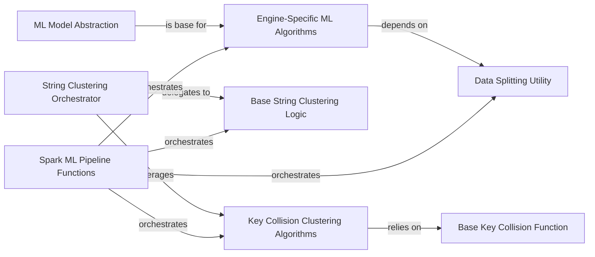

## Details

The `optimus` ML subsystem is designed with a strong emphasis on engine-agnosticism and modularity, primarily facilitating machine learning operations across various data processing backends like Pandas, Dask, and Spark. At its core, the `ML Model Abstraction` provides a unified interface for diverse machine learning algorithms, which are then concretely implemented by `Engine-Specific ML Algorithms` tailored for performance on their respective engines. Data preparation is handled by the `Data Splitting Utility`, which works in conjunction with these algorithms. For specialized text processing, the `String Clustering Orchestrator` manages string clustering tasks, delegating to the `Base String Clustering Logic` for fundamental operations and leveraging `Key Collision Clustering Algorithms` for advanced, engine-optimized key collision detection. The `Base Key Collision Function` provides underlying utilities for these collision algorithms. Finally, `Spark ML Pipeline Functions` integrate and orchestrate these components into sequential workflows specifically for the Spark environment, ensuring a streamlined execution of complex ML tasks.

### ML Model Abstraction
A foundational component providing a standardized interface for all machine learning models, ensuring engine agnosticism.

**Related Classes/Methods**:

- <a href="https://github.com/hi-primus/optimus/blob/develop/optimus/engines/base/ml/models.py#L1-L100" target="_blank" rel="noopener noreferrer">`optimus.engines.base.ml.models`:1-100</a>

### Engine-Specific ML Algorithms
Implementations of various machine learning algorithms (e.g., linear regression, k-means) tailored for specific data processing engines like Pandas, Dask, or Spark.

**Related Classes/Methods**:

- <a href="https://github.com/hi-primus/optimus/blob/develop/optimus/engines/pandas/ml/models.py#L1-L100" target="_blank" rel="noopener noreferrer">`optimus.engines.pandas.ml.models`:1-100</a>

### Data Splitting Utility
Manages the preparation of datasets for machine learning tasks, typically by splitting them into training and testing sets.

**Related Classes/Methods**:

- <a href="https://github.com/hi-primus/optimus/blob/develop/optimus/engines/pandas/ml/models.py#L1-L100" target="_blank" rel="noopener noreferrer">`optimus.engines.pandas.ml.models`:1-100</a>

### Base String Clustering Logic
Encapsulates the fundamental logic for general string clustering operations, serving as a core reusable component for data transformation.

**Related Classes/Methods**:

- <a href="https://github.com/hi-primus/optimus/blob/develop/optimus/engines/base/stringclustering.py#L1-L100" target="_blank" rel="noopener noreferrer">`optimus.engines.base.stringclustering`:1-100</a>

### String Clustering Orchestrator
Acts as the high-level entry point for initiating string clustering operations, delegating to the core clustering logic and specialized algorithms.

**Related Classes/Methods**:

- <a href="https://github.com/hi-primus/optimus/blob/develop/optimus/engines/base/stringclustering.py#L1-L100" target="_blank" rel="noopener noreferrer">`optimus.engines.base.stringclustering`:1-100</a>

### Key Collision Clustering Algorithms
Specialized implementations of string clustering algorithms (e.g., fingerprint, n-gram fingerprint) optimized for different engines (cuDF, Pandas, Spark).

**Related Classes/Methods**:

- <a href="https://github.com/hi-primus/optimus/blob/develop/optimus/engines/base/ml/models.py#L1-L100" target="_blank" rel="noopener noreferrer">`optimus.engines.base.ml.models`:1-100</a>

### Base Key Collision Function
Provides common, underlying functionalities and utilities for key collision-based string clustering, supporting the specialized algorithms.

**Related Classes/Methods**:

- <a href="https://github.com/hi-primus/optimus/blob/develop/optimus/engines/base/ml/models.py#L1-L100" target="_blank" rel="noopener noreferrer">`optimus.engines.base.ml.models`:1-100</a>

### Spark ML Pipeline Functions
Manage the sequential flow and execution of machine learning models and transformations within a pipeline context, specifically for the Spark engine.

**Related Classes/Methods**:

- <a href="https://github.com/hi-primus/optimus/blob/develop/optimus/engines/spark/ml/pipelines.py#L1-L100" target="_blank" rel="noopener noreferrer">`optimus.engines.spark.ml.pipelines`:1-100</a>

### [FAQ](https://github.com/CodeBoarding/GeneratedOnBoardings/tree/main?tab=readme-ov-file#faq)