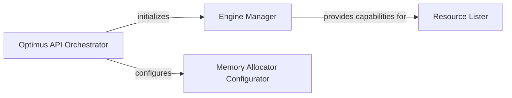

## Details

The Optimus subsystem is centered around the Optimus API Orchestrator, which serves as the primary entry point for users. This orchestrator is responsible for initializing the chosen data processing environment by delegating to the Engine Manager. The Engine Manager abstracts the specifics of various underlying engines (e.g., Pandas, Dask, cuDF), ensuring engine-agnostic operation. For performance-critical GPU workloads, the orchestrator also interacts with the Memory Allocator Configurator to optimize memory management, particularly through the RAPIDS Memory Manager. While not directly implemented within the orchestrator's entry point, the Resource Lister component is conceptually linked to the capabilities provided by the initialized Engine Manager, allowing for introspection of the active data environment. This architecture promotes modularity and adaptability across different data processing backends.

### Optimus API Orchestrator
The primary entry point and orchestrator, managing global settings and providing the top-level interface for user interaction. It embodies the API Layer pattern and initiates the overall Pipeline/Workflow by setting up the necessary environment.

**Related Classes/Methods**:

- <a href="https://github.com/hi-primus/optimus/blob/develop/optimus/optimus.py#L98-L145" target="_blank" rel="noopener noreferrer">`optimus.optimus.optimus`:98-145</a>

### Engine Manager
Manages and executes functions specific to the underlying data processing engine (e.g., Pandas, Dask, Spark). This component is a core part of the Engine Abstraction Layer, abstracting engine-specific details from the main API and allowing Optimus to be engine-agnostic.

**Related Classes/Methods**:

- <a href="https://github.com/hi-primus/optimus/blob/develop/optimus/optimus.py#L98-L145" target="_blank" rel="noopener noreferrer">`optimus.optimus.optimus`:98-145</a>

### Memory Allocator Configurator
Handles the configuration and activation of specialized memory allocators, such as the RAPIDS Memory Manager (RMM), primarily for performance optimization in GPU-accelerated environments. This is a utility component crucial for optimizing the Data Processing aspect of the library.

**Related Classes/Methods**:

- <a href="https://github.com/hi-primus/optimus/blob/develop/optimus/optimus.py#L98-L145" target="_blank" rel="noopener noreferrer">`optimus.optimus.optimus`:98-145</a>

### Resource Lister
Provides introspection capabilities by enumerating or listing available resources, configurations, or data structures within the Optimus environment. This often includes engine-specific components, supporting the dynamic nature of the Engine Abstraction Layer.

**Related Classes/Methods**: _None_

### [FAQ](https://github.com/CodeBoarding/GeneratedOnBoardings/tree/main?tab=readme-ov-file#faq)