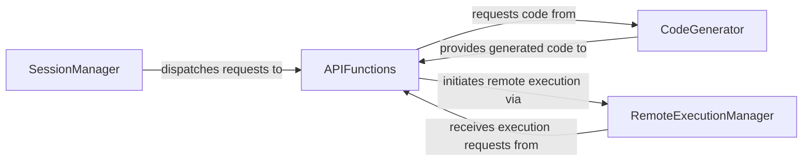

## Details

The Remote Execution & Server subsystem encompasses the server-side components responsible for handling client requests, orchestrating Optimus operations, dynamically generating code, and managing remote execution.

### SessionManager
Acts as the primary entry point for client requests, managing the lifecycle of user sessions and orchestrating the initial dispatch of requests to the appropriate functional components. This component is crucial for establishing and maintaining the server's connection with external applications.

**Related Classes/Methods**:

- <a href="https://github.com/hi-primus/optimus/blob/develop/optimus/server/session.py" target="_blank" rel="noopener noreferrer">`SessionManager`</a>

### APIFunctions
Exposes the core Optimus functionalities as server-side operations. It acts as an orchestrator, translating incoming requests into specific Optimus operations, leveraging code generation for dynamic execution, and initiating remote execution when necessary.

**Related Classes/Methods**:

- <a href="https://github.com/hi-primus/optimus/blob/develop/optimus/server/functions.py" target="_blank" rel="noopener noreferrer">`APIFunctions`</a>

### CodeGenerator
Dynamically generates Python code snippets for various Optimus operations, including dataframe transformations, masking, clustering, engine-specific operations, and connection management. This enables flexible and on-the-fly execution of complex data processing logic.

**Related Classes/Methods**:

- <a href="https://github.com/hi-primus/optimus/blob/develop/optimus/server/code.py" target="_blank" rel="noopener noreferrer">`CodeGenerator`</a>

### RemoteExecutionManager
Facilitates the execution of Optimus operations on a remote instance. It manages the lifecycle of variables and the submission of tasks to the remote environment, abstracting the complexities of distributed execution.

**Related Classes/Methods**:

- <a href="https://github.com/hi-primus/optimus/blob/develop/optimus/engines/base/remote.py" target="_blank" rel="noopener noreferrer">`RemoteExecutionManager`</a>

### [FAQ](https://github.com/CodeBoarding/GeneratedOnBoardings/tree/main?tab=readme-ov-file#faq)