```mermaid
graph LR
    Optimus_Core_API["Optimus Core API"]
    Data_Ingestion["Data Ingestion"]
    Engine_Abstraction_Layer["Engine Abstraction Layer"]
    Data_Processing_Analysis["Data Processing & Analysis"]
    ML_Capabilities["ML Capabilities"]
    Engine_Adapters["Engine Adapters"]
    Remote_Execution_Server["Remote Execution & Server"]
    Optimus_Core_API -- "requests data loading from" --> Data_Ingestion
    Optimus_Core_API -- "delegates tasks to" --> Engine_Abstraction_Layer
    Remote_Execution_Server -- "sends commands to" --> Optimus_Core_API
    Data_Ingestion -- "outputs loaded data to" --> Engine_Abstraction_Layer
    Engine_Abstraction_Layer -- "delegates operations to" --> Engine_Adapters
    Engine_Adapters -- "returns processed data to" --> Engine_Abstraction_Layer
    Engine_Abstraction_Layer -- "exposes data to" --> Data_Processing_Analysis
    Data_Processing_Analysis -- "returns transformed data to" --> Engine_Abstraction_Layer
    Engine_Abstraction_Layer -- "feeds data to" --> ML_Capabilities
    Data_Processing_Analysis -- "provides pre-processed data to" --> ML_Capabilities
    click Optimus_Core_API href "https://github.com/CodeBoarding/GeneratedOnBoardings/blob/main/optimus/Optimus_Core_API.md" "Details"
    click Data_Ingestion href "https://github.com/CodeBoarding/GeneratedOnBoardings/blob/main/optimus/Data_Ingestion.md" "Details"
    click Engine_Abstraction_Layer href "https://github.com/CodeBoarding/GeneratedOnBoardings/blob/main/optimus/Engine_Abstraction_Layer.md" "Details"
    click Data_Processing_Analysis href "https://github.com/CodeBoarding/GeneratedOnBoardings/blob/main/optimus/Data_Processing_Analysis.md" "Details"
    click ML_Capabilities href "https://github.com/CodeBoarding/GeneratedOnBoardings/blob/main/optimus/ML_Capabilities.md" "Details"
    click Engine_Adapters href "https://github.com/CodeBoarding/GeneratedOnBoardings/blob/main/optimus/Engine_Adapters.md" "Details"
    click Remote_Execution_Server href "https://github.com/CodeBoarding/GeneratedOnBoardings/blob/main/optimus/Remote_Execution_Server.md" "Details"
```

## Details

The Optimus project is structured around a core API that orchestrates data operations. Data is ingested through a dedicated component, which then feeds into an Engine Abstraction Layer. This layer provides a unified interface for various data processing engines, with specific Engine Adapters implementing the functionalities for frameworks like Pandas, Dask, and Spark. Data undergoes extensive processing and analysis, including cleaning, transformation, and profiling, before being utilized by the ML Capabilities component for model training and related tasks. Remote execution and server functionalities allow external applications to interact with the Optimus core. This modular design ensures flexibility, scalability, and clear separation of concerns, facilitating both local and distributed data processing workflows.

### Optimus Core API [[Expand]](./Optimus_Core_API.md)
The primary entry point and orchestrator, managing global settings and providing the top-level interface for user interaction.

**Related Classes/Methods**:

- <a href="https://github.com/hi-primus/optimus/blob/develop/optimus/optimus.py" target="_blank" rel="noopener noreferrer">`optimus.optimus.py`</a>

### Data Ingestion [[Expand]](./Data_Ingestion.md)
Manages connections to various data sources and handles loading data in diverse formats.

**Related Classes/Methods**:

- <a href="https://github.com/hi-primus/optimus/blob/develop/optimus/engines/base/io/load.py" target="_blank" rel="noopener noreferrer">`optimus/engines/base/io/load.py`</a>
- <a href="https://github.com/hi-primus/optimus/blob/develop/optimus/engines/base/io/connect.py" target="_blank" rel="noopener noreferrer">`optimus/engines/base/io/connect.py`</a>
- <a href="https://github.com/hi-primus/optimus/blob/develop/optimus/engines/base/io/drivers/" target="_blank" rel="noopener noreferrer">`optimus/engines/base/io/drivers/`</a>

### Engine Abstraction Layer [[Expand]](./Engine_Abstraction_Layer.md)
Provides a unified, engine-agnostic interface for common DataFrame operations, abstracting underlying engine complexities.

**Related Classes/Methods**:

- <a href="https://github.com/hi-primus/optimus/blob/develop/optimus/engines/base/engine.py" target="_blank" rel="noopener noreferrer">`optimus/engines/base/engine.py`</a>
- <a href="https://github.com/hi-primus/optimus/blob/develop/optimus/engines/base/basedataframe.py" target="_blank" rel="noopener noreferrer">`optimus/engines/base/basedataframe.py`</a>

### Data Processing & Analysis [[Expand]](./Data_Processing_Analysis.md)
Implements comprehensive data cleaning, transformation, feature engineering, profiling, and quality checks.

**Related Classes/Methods**:

- <a href="https://github.com/hi-primus/optimus/blob/develop/optimus/engines/base/columns.py" target="_blank" rel="noopener noreferrer">`optimus/engines/base/columns.py`</a>
- <a href="https://github.com/hi-primus/optimus/blob/develop/optimus/engines/base/rows.py" target="_blank" rel="noopener noreferrer">`optimus/engines/base/rows.py`</a>
- <a href="https://github.com/hi-primus/optimus/blob/develop/optimus/engines/base/functions.py" target="_blank" rel="noopener noreferrer">`optimus/engines/base/functions.py`</a>
- <a href="https://github.com/hi-primus/optimus/blob/develop/optimus/infer.py" target="_blank" rel="noopener noreferrer">`optimus/infer.py`</a>
- <a href="https://github.com/hi-primus/optimus/blob/develop/optimus/engines/base/profile.py" target="_blank" rel="noopener noreferrer">`optimus/engines/base/profile.py`</a>
- <a href="https://github.com/hi-primus/optimus/blob/develop/optimus/engines/base/stringclustering.py" target="_blank" rel="noopener noreferrer">`optimus/engines/base/stringclustering.py`</a>
- <a href="https://github.com/hi-primus/optimus/blob/develop/optimus/outliers/" target="_blank" rel="noopener noreferrer">`optimus/outliers/`</a>

### ML Capabilities [[Expand]](./ML_Capabilities.md)
Offers machine learning functionalities, including model training and related data transformations.

**Related Classes/Methods**:

- <a href="https://github.com/hi-primus/optimus/blob/develop/optimus/engines/base/ml/models.py" target="_blank" rel="noopener noreferrer">`optimus/engines/base/ml/models.py`</a>
- <a href="https://github.com/hi-primus/optimus/blob/develop/optimus/engines/base/stringclustering.py" target="_blank" rel="noopener noreferrer">`optimus/engines/base/stringclustering.py`</a>

### Engine Adapters [[Expand]](./Engine_Adapters.md)
Concrete implementations of the Engine Abstraction Layer for specific data processing frameworks (e.g., Pandas, Dask, Spark, cuDF).

**Related Classes/Methods**:

- <a href="https://github.com/hi-primus/optimus/blob/develop/optimus/engines/pandas/" target="_blank" rel="noopener noreferrer">`optimus/engines/pandas/`</a>
- <a href="https://github.com/hi-primus/optimus/blob/develop/optimus/engines/dask/" target="_blank" rel="noopener noreferrer">`optimus/engines/dask/`</a>
- <a href="https://github.com/hi-primus/optimus/blob/develop/optimus/engines/spark/" target="_blank" rel="noopener noreferrer">`optimus/engines/spark/`</a>
- <a href="https://github.com/hi-primus/optimus/blob/develop/optimus/engines/cudf/" target="_blank" rel="noopener noreferrer">`optimus/engines/cudf/`</a>
- <a href="https://github.com/hi-primus/optimus/blob/develop/optimus/engines/dask_cudf/" target="_blank" rel="noopener noreferrer">`optimus/engines/dask_cudf/`</a>
- <a href="https://github.com/hi-primus/optimus/blob/develop/optimus/engines/vaex/" target="_blank" rel="noopener noreferrer">`optimus/engines/vaex/`</a>
- <a href="https://github.com/hi-primus/optimus/blob/develop/optimus/engines/polars/" target="_blank" rel="noopener noreferrer">`optimus/engines/polars/`</a>
- <a href="https://github.com/hi-primus/optimus/blob/develop/optimus/engines/ibis/" target="_blank" rel="noopener noreferrer">`optimus/engines/ibis/`</a>

### Remote Execution & Server [[Expand]](./Remote_Execution_Server.md)
Facilitates remote execution of Optimus operations and provides a server interface for external applications.

**Related Classes/Methods**:

- <a href="https://github.com/hi-primus/optimus/blob/develop/optimus/engines/base/remote.py" target="_blank" rel="noopener noreferrer">`optimus/engines/base/remote.py`</a>
- <a href="https://github.com/hi-primus/optimus/blob/develop/optimus/server/session.py" target="_blank" rel="noopener noreferrer">`optimus/server/session.py`</a>
- <a href="https://github.com/hi-primus/optimus/blob/develop/optimus/server/functions.py" target="_blank" rel="noopener noreferrer">`optimus/server/functions.py`</a>
- <a href="https://github.com/hi-primus/optimus/blob/develop/optimus/server/code.py" target="_blank" rel="noopener noreferrer">`optimus/server/code.py`</a>

### [FAQ](https://github.com/CodeBoarding/GeneratedOnBoardings/tree/main?tab=readme-ov-file#faq)