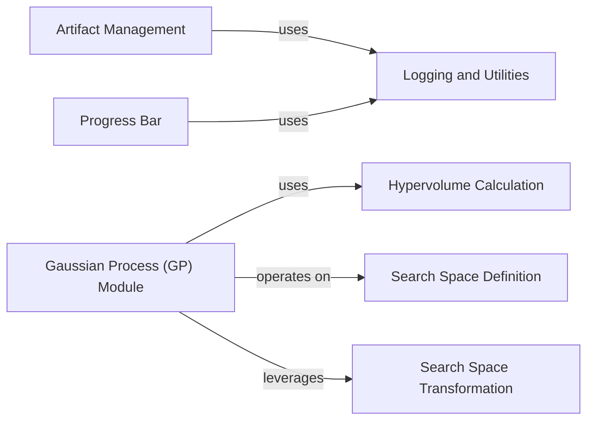

## Component Details

This graph outlines the internal structure and interactions of the `Auxiliary Services` component within Optuna. It details how foundational utilities for logging, experimental features, and deprecation warnings support various specialized services such as artifact management, hyperparameter search space definition and transformation, Gaussian Process-based calculations, hypervolume computations for multi-objective optimization, and progress bar display.

### Artifact Management
Manages the storage, retrieval, and listing of artifacts associated with Optuna studies, supporting various backends like filesystem, GCS, and Boto3. It also includes retry mechanisms for artifact operations.

**Related Classes/Methods**:

- <a href="https://github.com/optuna/optuna/blob/master/optuna/artifacts/_upload.py#L55-L116" target="_blank" rel="noopener noreferrer">`optuna.artifacts._upload:upload_artifact` (55:116)</a>
- <a href="https://github.com/optuna/optuna/blob/master/optuna/artifacts/_filesystem.py#L15-L72" target="_blank" rel="noopener noreferrer">`optuna.artifacts._filesystem.FileSystemArtifactStore` (15:72)</a>
- <a href="https://github.com/optuna/optuna/blob/master/optuna/artifacts/_gcs.py#L19-L87" target="_blank" rel="noopener noreferrer">`optuna.artifacts._gcs.GCSArtifactStore` (19:87)</a>
- <a href="https://github.com/optuna/optuna/blob/master/optuna/artifacts/_boto3.py#L21-L93" target="_blank" rel="noopener noreferrer">`optuna.artifacts._boto3.Boto3ArtifactStore` (21:93)</a>
- <a href="https://github.com/optuna/optuna/blob/master/optuna/artifacts/_backoff.py#L19-L109" target="_blank" rel="noopener noreferrer">`optuna.artifacts._backoff.Backoff` (19:109)</a>
- <a href="https://github.com/optuna/optuna/blob/master/optuna/artifacts/_list_artifact_meta.py#L13-L98" target="_blank" rel="noopener noreferrer">`optuna.artifacts._list_artifact_meta:get_all_artifact_meta` (13:98)</a>

### Logging and Utilities
Provides core utility functions for logging configuration, handling experimental and deprecated features through decorators, converting positional arguments to keyword arguments, and managing lazy imports to improve startup performance.

**Related Classes/Methods**:

- <a href="https://github.com/optuna/optuna/blob/master/optuna/logging.py#L96-L103" target="_blank" rel="noopener noreferrer">`optuna.logging:get_logger` (96:103)</a>
- <a href="https://github.com/optuna/optuna/blob/master/optuna/_experimental.py#L52-L88" target="_blank" rel="noopener noreferrer">`optuna._experimental:experimental_func` (52:88)</a>
- <a href="https://github.com/optuna/optuna/blob/master/optuna/_deprecated.py#L55-L119" target="_blank" rel="noopener noreferrer">`optuna._deprecated:deprecated_func` (55:119)</a>
- <a href="https://github.com/optuna/optuna/blob/master/optuna/_convert_positional_args.py#L49-L139" target="_blank" rel="noopener noreferrer">`optuna._convert_positional_args:convert_positional_args` (49:139)</a>
- <a href="https://github.com/optuna/optuna/blob/master/optuna/_imports.py#L97-L104" target="_blank" rel="noopener noreferrer">`optuna._imports:try_import` (97:104)</a>

### Search Space Transformation
Handles the transformation of the optimization search space, particularly for numerical parameters, enabling samplers to operate on a standardized or transformed representation of the search space.

**Related Classes/Methods**:

- <a href="https://github.com/optuna/optuna/blob/master/optuna/_transform.py#L14-L168" target="_blank" rel="noopener noreferrer">`optuna._transform._SearchSpaceTransform` (14:168)</a>

### Search Space Definition
Defines and manipulates the search space for optimization parameters. It includes functionalities for grouping decomposed search spaces and calculating the intersection of search spaces.

**Related Classes/Methods**:

- <a href="https://github.com/optuna/optuna/blob/master/optuna/search_space/group_decomposed.py#L40-L66" target="_blank" rel="noopener noreferrer">`optuna.search_space.group_decomposed._GroupDecomposedSearchSpace` (40:66)</a>
- <a href="https://github.com/optuna/optuna/blob/master/optuna/search_space/intersection.py#L58-L115" target="_blank" rel="noopener noreferrer">`optuna.search_space.intersection.IntersectionSearchSpace` (58:115)</a>

### Gaussian Process (GP) Module
Provides the foundational components for Gaussian Process-based optimization, including kernel functions, posterior calculations, acquisition functions (e.g., Expected Improvement), and mixed-variable optimization strategies. It is a key dependency for the GPSampler.

**Related Classes/Methods**:

- <a href="https://github.com/optuna/optuna/blob/master/optuna/_gp/prior.py#L19-L36" target="_blank" rel="noopener noreferrer">`optuna._gp.prior:default_log_prior` (19:36)</a>
- <a href="https://github.com/optuna/optuna/blob/master/optuna/_gp/optim_sample.py#L9-L20" target="_blank" rel="noopener noreferrer">`optuna._gp.optim_sample:optimize_acqf_sample` (9:20)</a>
- <a href="https://github.com/optuna/optuna/blob/master/optuna/_gp/gp.py#L93-L110" target="_blank" rel="noopener noreferrer">`optuna._gp.gp:kernel` (93:110)</a>
- <a href="https://github.com/optuna/optuna/blob/master/optuna/_gp/acqf.py#L292-L331" target="_blank" rel="noopener noreferrer">`optuna._gp.acqf:eval_acqf` (292:331)</a>
- <a href="https://github.com/optuna/optuna/blob/master/optuna/_gp/optim_mixed.py#L273-L330" target="_blank" rel="noopener noreferrer">`optuna._gp.optim_mixed:optimize_acqf_mixed` (273:330)</a>
- <a href="https://github.com/optuna/optuna/blob/master/optuna/_gp/search_space.py#L118-L152" target="_blank" rel="noopener noreferrer">`optuna._gp.search_space:get_search_space_and_normalized_params` (118:152)</a>

### Hypervolume Calculation
Focuses on calculating the hypervolume metric, which is crucial for evaluating the performance of multi-objective optimization algorithms. It includes implementations for different dimensions and related geometric operations like box decomposition.

**Related Classes/Methods**:

- <a href="https://github.com/optuna/optuna/blob/master/optuna/_hypervolume/wfg.py#L124-L193" target="_blank" rel="noopener noreferrer">`optuna._hypervolume.wfg:compute_hypervolume` (124:193)</a>
- <a href="https://github.com/optuna/optuna/blob/master/optuna/_hypervolume/hssp.py#L43-L77" target="_blank" rel="noopener noreferrer">`optuna._hypervolume.hssp:_lazy_contribs_update` (43:77)</a>
- <a href="https://github.com/optuna/optuna/blob/master/optuna/_hypervolume/box_decomposition.py#L31-L94" target="_blank" rel="noopener noreferrer">`optuna._hypervolume.box_decomposition:_get_upper_bound_set` (31:94)</a>

### Progress Bar
Displays the progress of an optimization study, providing visual feedback to the user during long-running optimization processes.

**Related Classes/Methods**:

- <a href="https://github.com/optuna/optuna/blob/master/optuna/progress_bar.py#L32-L125" target="_blank" rel="noopener noreferrer">`optuna.progress_bar._ProgressBar` (32:125)</a>

### [FAQ](https://github.com/CodeBoarding/GeneratedOnBoardings/tree/main?tab=readme-ov-file#faq)