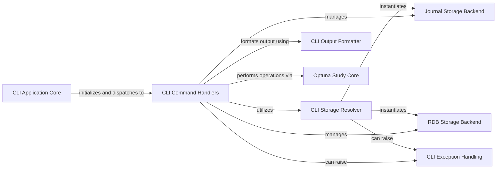

## Component Details

This graph illustrates the architecture of the Optuna Command Line Interface subsystem. The main flow starts with the `CLI Application Core` which parses command-line arguments and dispatches them to specific `CLI Command Handlers`. These handlers interact with the `Optuna Study Core` to perform operations on studies and trials. The `CLI Storage Resolver` is responsible for setting up the correct storage backend, which can be either a `Journal Storage Backend` or an `RDB Storage Backend`. Finally, the `CLI Output Formatter` is used by the command handlers to present the results to the user. Error conditions are managed by the `CLI Exception Handling` component.

### CLI Application Core
This component represents the main entry point and setup logic for the Optuna command-line interface, including argument parsing, command registration, and initial configuration.

**Related Classes/Methods**:

- <a href="https://github.com/optuna/optuna/blob/master/optuna/cli.py#L979-L1007" target="_blank" rel="noopener noreferrer">`optuna.cli.main` (979:1007)</a>
- <a href="https://github.com/optuna/optuna/blob/master/optuna/cli.py#L917-L928" target="_blank" rel="noopener noreferrer">`optuna.cli._get_parser` (917:928)</a>
- <a href="https://github.com/optuna/optuna/blob/master/optuna/cli.py#L893-L914" target="_blank" rel="noopener noreferrer">`optuna.cli._add_commands` (893:914)</a>
- <a href="https://github.com/optuna/optuna/blob/master/optuna/cli.py#L931-L944" target="_blank" rel="noopener noreferrer">`optuna.cli._preprocess_argv` (931:944)</a>
- <a href="https://github.com/optuna/optuna/blob/master/optuna/cli.py#L947-L962" target="_blank" rel="noopener noreferrer">`optuna.cli._set_verbosity` (947:962)</a>
- <a href="https://github.com/optuna/optuna/blob/master/optuna/cli.py#L965-L976" target="_blank" rel="noopener noreferrer">`optuna.cli._set_log_file` (965:976)</a>

### CLI Command Handlers
This component encompasses the various command classes that implement specific functionalities of the Optuna CLI, such as creating, deleting, or querying studies and trials. Each handler typically takes action based on user input.

**Related Classes/Methods**:

- <a href="https://github.com/optuna/optuna/blob/master/optuna/cli.py#L307-L352" target="_blank" rel="noopener noreferrer">`optuna.cli._CreateStudy` (307:352)</a>
- <a href="https://github.com/optuna/optuna/blob/master/optuna/cli.py#L355-L365" target="_blank" rel="noopener noreferrer">`optuna.cli._DeleteStudy` (355:365)</a>
- <a href="https://github.com/optuna/optuna/blob/master/optuna/cli.py#L368-L388" target="_blank" rel="noopener noreferrer">`optuna.cli._StudySetUserAttribute` (368:388)</a>
- <a href="https://github.com/optuna/optuna/blob/master/optuna/cli.py#L391-L412" target="_blank" rel="noopener noreferrer">`optuna.cli._StudyNames` (391:412)</a>
- <a href="https://github.com/optuna/optuna/blob/master/optuna/cli.py#L415-L467" target="_blank" rel="noopener noreferrer">`optuna.cli._Studies` (415:467)</a>
- <a href="https://github.com/optuna/optuna/blob/master/optuna/cli.py#L470-L517" target="_blank" rel="noopener noreferrer">`optuna.cli._Trials` (470:517)</a>
- <a href="https://github.com/optuna/optuna/blob/master/optuna/cli.py#L520-L570" target="_blank" rel="noopener noreferrer">`optuna.cli._BestTrial` (520:570)</a>
- <a href="https://github.com/optuna/optuna/blob/master/optuna/cli.py#L573-L622" target="_blank" rel="noopener noreferrer">`optuna.cli._BestTrials` (573:622)</a>
- <a href="https://github.com/optuna/optuna/blob/master/optuna/cli.py#L625-L652" target="_blank" rel="noopener noreferrer">`optuna.cli._StorageUpgrade` (625:652)</a>
- <a href="https://github.com/optuna/optuna/blob/master/optuna/cli.py#L655-L757" target="_blank" rel="noopener noreferrer">`optuna.cli._Ask` (655:757)</a>
- <a href="https://github.com/optuna/optuna/blob/master/optuna/cli.py#L760-L811" target="_blank" rel="noopener noreferrer">`optuna.cli._Tell` (760:811)</a>

### CLI Storage Resolver
This component is responsible for resolving and validating the storage URL provided to the CLI, ensuring that a valid storage backend can be instantiated for Optuna operations.

**Related Classes/Methods**:

- <a href="https://github.com/optuna/optuna/blob/master/optuna/cli.py#L57-L79" target="_blank" rel="noopener noreferrer">`optuna.cli._get_storage` (57:79)</a>
- <a href="https://github.com/optuna/optuna/blob/master/optuna/cli.py#L42-L54" target="_blank" rel="noopener noreferrer">`optuna.cli._check_storage_url` (42:54)</a>

### CLI Output Formatter
This component handles the transformation and presentation of Optuna data (like study summaries or trial details) into a human-readable format suitable for command-line output.

**Related Classes/Methods**:

- <a href="https://github.com/optuna/optuna/blob/master/optuna/cli.py#L244-L270" target="_blank" rel="noopener noreferrer">`optuna.cli._format_output` (244:270)</a>
- <a href="https://github.com/optuna/optuna/blob/master/optuna/cli.py#L98-L153" target="_blank" rel="noopener noreferrer">`optuna.cli._convert_to_dict` (98:153)</a>
- <a href="https://github.com/optuna/optuna/blob/master/optuna/cli.py#L82-L95" target="_blank" rel="noopener noreferrer">`optuna.cli._format_value` (82:95)</a>
- <a href="https://github.com/optuna/optuna/blob/master/optuna/cli.py#L204-L241" target="_blank" rel="noopener noreferrer">`optuna.cli._dump_table` (204:241)</a>
- <a href="https://github.com/optuna/optuna/blob/master/optuna/cli.py#L162-L188" target="_blank" rel="noopener noreferrer">`optuna.cli.CellValue` (162:188)</a>

### Optuna Study Core
This fundamental component provides the core logic for managing optimization studies, including creation, loading, querying study properties, and interacting with trials (asking for new parameters, telling results).

**Related Classes/Methods**:

- <a href="https://github.com/optuna/optuna/blob/master/optuna/study/study.py#L1178-L1316" target="_blank" rel="noopener noreferrer">`optuna.study.study.create_study` (1178:1316)</a>
- <a href="https://github.com/optuna/optuna/blob/master/optuna/study/study.py#L1329-L1407" target="_blank" rel="noopener noreferrer">`optuna.study.study.load_study` (1329:1407)</a>
- <a href="https://github.com/optuna/optuna/blob/master/optuna/study/study.py#L1675-L1726" target="_blank" rel="noopener noreferrer">`optuna.study.study.get_all_study_names` (1675:1726)</a>
- <a href="https://github.com/optuna/optuna/blob/master/optuna/study/study.py#L1575-L1672" target="_blank" rel="noopener noreferrer">`optuna.study.study.get_all_study_summaries` (1575:1672)</a>
- <a href="https://github.com/optuna/optuna/blob/master/optuna/study/study.py#L680-L722" target="_blank" rel="noopener noreferrer">`optuna.study.study.Study.set_user_attr` (680:722)</a>
- <a href="https://github.com/optuna/optuna/blob/master/optuna/study/study.py#L1064-L1071" target="_blank" rel="noopener noreferrer">`optuna.study.study.Study._is_multi_objective` (1064:1071)</a>
- <a href="https://github.com/optuna/optuna/blob/master/optuna/study/study.py#L501-L585" target="_blank" rel="noopener noreferrer">`optuna.study.study.Study.ask` (501:585)</a>
- <a href="https://github.com/optuna/optuna/blob/master/optuna/study/study.py#L587-L678" target="_blank" rel="noopener noreferrer">`optuna.study.study.Study.tell` (587:678)</a>

### Journal Storage Backend
This component implements a journal-based storage mechanism for Optuna studies, supporting both file-based and Redis-backed persistence. It handles the low-level details of reading from and writing to the journal.

**Related Classes/Methods**:

- <a href="https://github.com/optuna/optuna/blob/master/optuna/storages/journal/_storage.py#L51-L380" target="_blank" rel="noopener noreferrer">`optuna.storages.journal._storage.JournalStorage` (51:380)</a>
- <a href="https://github.com/optuna/optuna/blob/master/optuna/storages/journal/_redis.py#L19-L100" target="_blank" rel="noopener noreferrer">`optuna.storages.journal._redis.JournalRedisBackend` (19:100)</a>
- <a href="https://github.com/optuna/optuna/blob/master/optuna/storages/journal/_redis.py#L106-L107" target="_blank" rel="noopener noreferrer">`optuna.storages.journal._redis.JournalRedisStorage` (106:107)</a>
- <a href="https://github.com/optuna/optuna/blob/master/optuna/storages/journal/_file.py#L22-L109" target="_blank" rel="noopener noreferrer">`optuna.storages.journal._file.JournalFileBackend` (22:109)</a>
- <a href="https://github.com/optuna/optuna/blob/master/optuna/storages/journal/_file.py#L298-L299" target="_blank" rel="noopener noreferrer">`optuna.storages.journal._file.JournalFileStorage` (298:299)</a>

### RDB Storage Backend
This component provides a relational database management system (RDBMS) based storage solution for Optuna studies, handling database connections, schema management, and data persistence.

**Related Classes/Methods**:

- <a href="https://github.com/optuna/optuna/blob/master/optuna/storages/_rdb/storage.py#L103-L1028" target="_blank" rel="noopener noreferrer">`optuna.storages._rdb.storage.RDBStorage` (103:1028)</a>

### CLI Exception Handling
This component defines and manages exceptions that are specific to the Optuna command-line interface, ensuring proper error reporting and graceful exit in case of invalid usage or operational failures.

**Related Classes/Methods**:

- <a href="https://github.com/optuna/optuna/blob/master/optuna/exceptions.py#L57-L63" target="_blank" rel="noopener noreferrer">`optuna.exceptions.CLIUsageError` (57:63)</a>

### [FAQ](https://github.com/CodeBoarding/GeneratedOnBoardings/tree/main?tab=readme-ov-file#faq)