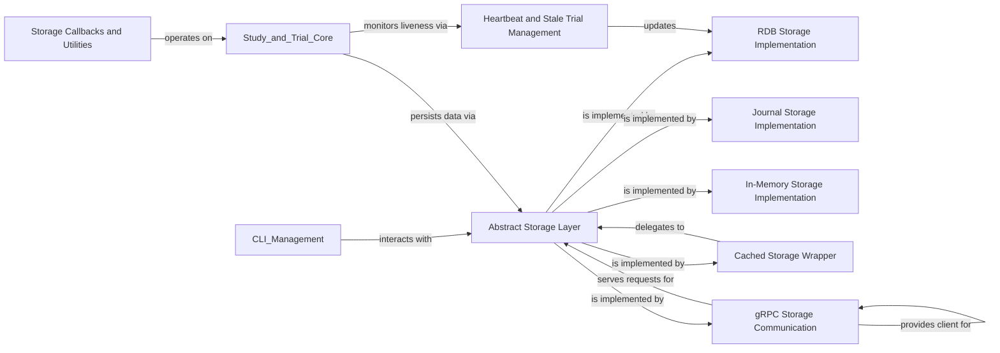

## Component Details

The Data Storage subsystem in Optuna is responsible for the persistent and transient management of study and trial data. It provides a flexible architecture through an abstract base storage class, allowing for various concrete implementations such as relational databases, in-memory storage, journal-based file and Redis storage, and distributed gRPC communication. This design ensures that Optuna can adapt to different operational environments and data persistence requirements, while also handling concerns like caching, heartbeat mechanisms for trial liveness, and callback utilities for robust operation.

### Abstract Storage Layer
Defines the common interface and base functionalities for all Optuna storage implementations, ensuring consistent interaction with study and trial data.

**Related Classes/Methods**:

- <a href="https://github.com/optuna/optuna/blob/master/optuna/storages/_base.py#L21-L625" target="_blank" rel="noopener noreferrer">`optuna.storages._base.BaseStorage` (21:625)</a>
- <a href="https://github.com/optuna/optuna/blob/master/optuna/storages/_base.py#L280-L303" target="_blank" rel="noopener noreferrer">`optuna.storages._base.BaseStorage:get_trial_id_from_study_id_trial_number` (280:303)</a>
- <a href="https://github.com/optuna/optuna/blob/master/optuna/storages/_base.py#L305-L323" target="_blank" rel="noopener noreferrer">`optuna.storages._base.BaseStorage:get_trial_number_from_id` (305:323)</a>
- <a href="https://github.com/optuna/optuna/blob/master/optuna/storages/_base.py#L325-L343" target="_blank" rel="noopener noreferrer">`optuna.storages._base.BaseStorage:get_trial_param` (325:343)</a>
- <a href="https://github.com/optuna/optuna/blob/master/optuna/storages/_base.py#L491-L513" target="_blank" rel="noopener noreferrer">`optuna.storages._base.BaseStorage:get_n_trials` (491:513)</a>
- <a href="https://github.com/optuna/optuna/blob/master/optuna/storages/_base.py#L515-L552" target="_blank" rel="noopener noreferrer">`optuna.storages._base.BaseStorage:get_best_trial` (515:552)</a>
- <a href="https://github.com/optuna/optuna/blob/master/optuna/storages/_base.py#L554-L569" target="_blank" rel="noopener noreferrer">`optuna.storages._base.BaseStorage:get_trial_params` (554:569)</a>
- <a href="https://github.com/optuna/optuna/blob/master/optuna/storages/_base.py#L571-L585" target="_blank" rel="noopener noreferrer">`optuna.storages._base.BaseStorage:get_trial_user_attrs` (571:585)</a>
- <a href="https://github.com/optuna/optuna/blob/master/optuna/storages/_base.py#L587-L601" target="_blank" rel="noopener noreferrer">`optuna.storages._base.BaseStorage:get_trial_system_attrs` (587:601)</a>
- <a href="https://github.com/optuna/optuna/blob/master/optuna/storages/_base.py#L607-L625" target="_blank" rel="noopener noreferrer">`optuna.storages._base.BaseStorage:check_trial_is_updatable` (607:625)</a>
- `optuna.storages:get_storage` (full file reference)

### RDB Storage Implementation
Provides a persistent storage solution for Optuna studies and trials using relational databases, including schema management and data persistence.

**Related Classes/Methods**:

- <a href="https://github.com/optuna/optuna/blob/master/optuna/storages/_rdb/storage.py#L103-L1028" target="_blank" rel="noopener noreferrer">`optuna.storages._rdb.storage.RDBStorage` (103:1028)</a>
- <a href="https://github.com/optuna/optuna/blob/master/optuna/storages/_rdb/storage.py#L199-L242" target="_blank" rel="noopener noreferrer">`optuna.storages._rdb.storage.RDBStorage:__init__` (199:242)</a>
- <a href="https://github.com/optuna/optuna/blob/master/optuna/storages/_rdb/storage.py#L251-L267" target="_blank" rel="noopener noreferrer">`optuna.storages._rdb.storage.RDBStorage:__setstate__` (251:267)</a>
- <a href="https://github.com/optuna/optuna/blob/master/optuna/storages/_rdb/storage.py#L269-L294" target="_blank" rel="noopener noreferrer">`optuna.storages._rdb.storage.RDBStorage:create_new_study` (269:294)</a>
- <a href="https://github.com/optuna/optuna/blob/master/optuna/storages/_rdb/storage.py#L296-L299" target="_blank" rel="noopener noreferrer">`optuna.storages._rdb.storage.RDBStorage:delete_study` (296:299)</a>
- <a href="https://github.com/optuna/optuna/blob/master/optuna/storages/_rdb/storage.py#L302-L310" target="_blank" rel="noopener noreferrer">`optuna.storages._rdb.storage.RDBStorage:_create_unique_study_name` (302:310)</a>
- <a href="https://github.com/optuna/optuna/blob/master/optuna/storages/_rdb/storage.py#L312-L322" target="_blank" rel="noopener noreferrer">`optuna.storages._rdb.storage.RDBStorage:set_study_user_attr` (312:322)</a>
- <a href="https://github.com/optuna/optuna/blob/master/optuna/storages/_rdb/storage.py#L324-L334" target="_blank" rel="noopener noreferrer">`optuna.storages._rdb.storage.RDBStorage:set_study_system_attr` (324:334)</a>
- <a href="https://github.com/optuna/optuna/blob/master/optuna/storages/_rdb/storage.py#L336-L341" target="_blank" rel="noopener noreferrer">`optuna.storages._rdb.storage.RDBStorage:get_study_id_from_name` (336:341)</a>
- <a href="https://github.com/optuna/optuna/blob/master/optuna/storages/_rdb/storage.py#L343-L348" target="_blank" rel="noopener noreferrer">`optuna.storages._rdb.storage.RDBStorage:get_study_name_from_id` (343:348)</a>
- <a href="https://github.com/optuna/optuna/blob/master/optuna/storages/_rdb/storage.py#L350-L355" target="_blank" rel="noopener noreferrer">`optuna.storages._rdb.storage.RDBStorage:get_study_directions` (350:355)</a>
- <a href="https://github.com/optuna/optuna/blob/master/optuna/storages/_rdb/storage.py#L357-L364" target="_blank" rel="noopener noreferrer">`optuna.storages._rdb.storage.RDBStorage:get_study_user_attrs` (357:364)</a>
- <a href="https://github.com/optuna/optuna/blob/master/optuna/storages/_rdb/storage.py#L366-L373" target="_blank" rel="noopener noreferrer">`optuna.storages._rdb.storage.RDBStorage:get_study_system_attrs` (366:373)</a>
- <a href="https://github.com/optuna/optuna/blob/master/optuna/storages/_rdb/storage.py#L375-L383" target="_blank" rel="noopener noreferrer">`optuna.storages._rdb.storage.RDBStorage:get_trial_user_attrs` (375:383)</a>
- <a href="https://github.com/optuna/optuna/blob/master/optuna/storages/_rdb/storage.py#L385-L393" target="_blank" rel="noopener noreferrer">`optuna.storages._rdb.storage.RDBStorage:get_trial_system_attrs` (385:393)</a>
- <a href="https://github.com/optuna/optuna/blob/master/optuna/storages/_rdb/storage.py#L395-L434" target="_blank" rel="noopener noreferrer">`optuna.storages._rdb.storage.RDBStorage:get_all_studies` (395:434)</a>
- <a href="https://github.com/optuna/optuna/blob/master/optuna/storages/_rdb/storage.py#L436-L437" target="_blank" rel="noopener noreferrer">`optuna.storages._rdb.storage.RDBStorage:create_new_trial` (436:437)</a>
- <a href="https://github.com/optuna/optuna/blob/master/optuna/storages/_rdb/storage.py#L439-L501" target="_blank" rel="noopener noreferrer">`optuna.storages._rdb.storage.RDBStorage:_create_new_trial` (439:501)</a>
- <a href="https://github.com/optuna/optuna/blob/master/optuna/storages/_rdb/storage.py#L503-L576" target="_blank" rel="noopener noreferrer">`optuna.storages._rdb.storage.RDBStorage:_get_prepared_new_trial` (503:576)</a>
- <a href="https://github.com/optuna/optuna/blob/master/optuna/storages/_rdb/storage.py#L578-L588" target="_blank" rel="noopener noreferrer">`optuna.storages._rdb.storage.RDBStorage:set_trial_param` (578:588)</a>
- <a href="https://github.com/optuna/optuna/blob/master/optuna/storages/_rdb/storage.py#L590-L608" target="_blank" rel="noopener noreferrer">`optuna.storages._rdb.storage.RDBStorage:_set_trial_param_without_commit` (590:608)</a>
- <a href="https://github.com/optuna/optuna/blob/master/optuna/storages/_rdb/storage.py#L610-L618" target="_blank" rel="noopener noreferrer">`optuna.storages._rdb.storage.RDBStorage:get_trial_param` (610:618)</a>
- <a href="https://github.com/optuna/optuna/blob/master/optuna/storages/_rdb/storage.py#L620-L644" target="_blank" rel="noopener noreferrer">`optuna.storages._rdb.storage.RDBStorage:set_trial_state_values` (620:644)</a>
- <a href="https://github.com/optuna/optuna/blob/master/optuna/storages/_rdb/storage.py#L646-L661" target="_blank" rel="noopener noreferrer">`optuna.storages._rdb.storage.RDBStorage:_set_trial_value_without_commit` (646:661)</a>
- <a href="https://github.com/optuna/optuna/blob/master/optuna/storages/_rdb/storage.py#L663-L669" target="_blank" rel="noopener noreferrer">`optuna.storages._rdb.storage.RDBStorage:set_trial_intermediate_value` (663:669)</a>
- <a href="https://github.com/optuna/optuna/blob/master/optuna/storages/_rdb/storage.py#L671-L700" target="_blank" rel="noopener noreferrer">`optuna.storages._rdb.storage.RDBStorage:_set_trial_intermediate_value_without_commit` (671:700)</a>
- <a href="https://github.com/optuna/optuna/blob/master/optuna/storages/_rdb/storage.py#L702-L710" target="_blank" rel="noopener noreferrer">`optuna.storages._rdb.storage.RDBStorage:set_trial_user_attr` (702:710)</a>
- <a href="https://github.com/optuna/optuna/blob/master/optuna/storages/_rdb/storage.py#L712-L720" target="_blank" rel="noopener noreferrer">`optuna.storages._rdb.storage.RDBStorage:set_trial_system_attr` (712:720)</a>
- <a href="https://github.com/optuna/optuna/blob/master/optuna/storages/_rdb/storage.py#L722-L757" target="_blank" rel="noopener noreferrer">`optuna.storages._rdb.storage.RDBStorage:_set_trial_attr_without_commit` (722:757)</a>
- <a href="https://github.com/optuna/optuna/blob/master/optuna/storages/_rdb/storage.py#L759-L775" target="_blank" rel="noopener noreferrer">`optuna.storages._rdb.storage.RDBStorage:get_trial_id_from_study_id_trial_number` (759:775)</a>
- <a href="https://github.com/optuna/optuna/blob/master/optuna/storages/_rdb/storage.py#L777-L782" target="_blank" rel="noopener noreferrer">`optuna.storages._rdb.storage.RDBStorage:get_trial` (777:782)</a>
- <a href="https://github.com/optuna/optuna/blob/master/optuna/storages/_rdb/storage.py#L784-L792" target="_blank" rel="noopener noreferrer">`optuna.storages._rdb.storage.RDBStorage:get_all_trials` (784:792)</a>
- <a href="https://github.com/optuna/optuna/blob/master/optuna/storages/_rdb/storage.py#L794-L859" target="_blank" rel="noopener noreferrer">`optuna.storages._rdb.storage.RDBStorage:_get_trials` (794:859)</a>
- <a href="https://github.com/optuna/optuna/blob/master/optuna/storages/_rdb/storage.py#L861-L902" target="_blank" rel="noopener noreferrer">`optuna.storages._rdb.storage.RDBStorage:_build_frozen_trial_from_trial_model` (861:902)</a>
- <a href="https://github.com/optuna/optuna/blob/master/optuna/storages/_rdb/storage.py#L904-L918" target="_blank" rel="noopener noreferrer">`optuna.storages._rdb.storage.RDBStorage:get_best_trial` (904:918)</a>
- <a href="https://github.com/optuna/optuna/blob/master/optuna/storages/_rdb/storage.py#L956-L959" target="_blank" rel="noopener noreferrer">`optuna.storages._rdb.storage.RDBStorage:upgrade` (956:959)</a>
- <a href="https://github.com/optuna/optuna/blob/master/optuna/storages/_rdb/storage.py#L961-L964" target="_blank" rel="noopener noreferrer">`optuna.storages._rdb.storage.RDBStorage:get_current_version` (961:964)</a>
- <a href="https://github.com/optuna/optuna/blob/master/optuna/storages/_rdb/storage.py#L966-L969" target="_blank" rel="noopener noreferrer">`optuna.storages._rdb.storage.RDBStorage:get_head_version` (966:969)</a>
- <a href="https://github.com/optuna/optuna/blob/master/optuna/storages/_rdb/storage.py#L971-L974" target="_blank" rel="noopener noreferrer">`optuna.storages._rdb.storage.RDBStorage:get_all_versions` (971:974)</a>
- <a href="https://github.com/optuna/optuna/blob/master/optuna/storages/_rdb/storage.py#L976-L987" target="_blank" rel="noopener noreferrer">`optuna.storages._rdb.storage.RDBStorage:record_heartbeat` (976:987)</a>
- `optuna.storages._rdb.storage._get_stale_trial_ids` (full file reference)
- <a href="https://github.com/optuna/optuna/blob/master/optuna/storages/_rdb/storage.py#L1031-L1168" target="_blank" rel="noopener noreferrer">`optuna.storages._rdb.storage._VersionManager` (1031:1168)</a>
- <a href="https://github.com/optuna/optuna/blob/master/optuna/storages/_rdb/storage.py#L1032-L1042" target="_blank" rel="noopener noreferrer">`optuna.storages._rdb.storage._VersionManager:__init__` (1032:1042)</a>
- <a href="https://github.com/optuna/optuna/blob/master/optuna/storages/_rdb/storage.py#L1044-L1054" target="_blank" rel="noopener noreferrer">`optuna.storages._rdb.storage._VersionManager:_init_version_info_model` (1044:1054)</a>
- <a href="https://github.com/optuna/optuna/blob/master/optuna/storages/_rdb/storage.py#L1056-L1073" target="_blank" rel="noopener noreferrer">`optuna.storages._rdb.storage._VersionManager:_init_alembic` (1056:1073)</a>
- <a href="https://github.com/optuna/optuna/blob/master/optuna/storages/_rdb/storage.py#L1075-L1080" target="_blank" rel="noopener noreferrer">`optuna.storages._rdb.storage._VersionManager:_set_alembic_revision` (1075:1080)</a>
- <a href="https://github.com/optuna/optuna/blob/master/optuna/storages/_rdb/storage.py#L1082-L1111" target="_blank" rel="noopener noreferrer">`optuna.storages._rdb.storage._VersionManager:check_table_schema_compatibility` (1082:1111)</a>
- <a href="https://github.com/optuna/optuna/blob/master/optuna/storages/_rdb/storage.py#L1121-L1125" target="_blank" rel="noopener noreferrer">`optuna.storages._rdb.storage._VersionManager:get_head_version` (1121:1125)</a>
- <a href="https://github.com/optuna/optuna/blob/master/optuna/storages/_rdb/storage.py#L1127-L1131" target="_blank" rel="noopener noreferrer">`optuna.storages._rdb.storage._VersionManager:_get_base_version` (1127:1131)</a>
- <a href="https://github.com/optuna/optuna/blob/master/optuna/storages/_rdb/storage.py#L1133-L1135" target="_blank" rel="noopener noreferrer">`optuna.storages._rdb.storage._VersionManager:get_all_versions` (1133:1135)</a>
- <a href="https://github.com/optuna/optuna/blob/master/optuna/storages/_rdb/storage.py#L1137-L1145" target="_blank" rel="noopener noreferrer">`optuna.storages._rdb.storage._VersionManager:upgrade` (1137:1145)</a>
- <a href="https://github.com/optuna/optuna/blob/master/optuna/storages/_rdb/storage.py#L1147-L1155" target="_blank" rel="noopener noreferrer">`optuna.storages._rdb.storage._VersionManager:_is_alembic_supported` (1147:1155)</a>
- <a href="https://github.com/optuna/optuna/blob/master/optuna/storages/_rdb/storage.py#L1157-L1160" target="_blank" rel="noopener noreferrer">`optuna.storages._rdb.storage._VersionManager:_create_alembic_script` (1157:1160)</a>
- <a href="https://github.com/optuna/optuna/blob/master/optuna/storages/_rdb/storage.py#L1162-L1168" target="_blank" rel="noopener noreferrer">`optuna.storages._rdb.storage._VersionManager:_create_alembic_config` (1162:1168)</a>
- <a href="https://github.com/optuna/optuna/blob/master/optuna/storages/_rdb/storage.py#L71-L100" target="_blank" rel="noopener noreferrer">`optuna.storages._rdb.storage._create_scoped_session` (71:100)</a>
- <a href="https://github.com/optuna/optuna/blob/master/optuna/storages/_rdb/storage.py#L1171-L1175" target="_blank" rel="noopener noreferrer">`optuna.storages._rdb.storage.escape_alembic_config_value` (1171:1175)</a>
- <a href="https://github.com/optuna/optuna/blob/master/optuna/storages/_rdb/models.py#L55-L89" target="_blank" rel="noopener noreferrer">`optuna.storages._rdb.models.StudyModel` (55:89)</a>
- <a href="https://github.com/optuna/optuna/blob/master/optuna/storages/_rdb/models.py#L84-L89" target="_blank" rel="noopener noreferrer">`optuna.storages._rdb.models.StudyModel:find_or_raise_by_name` (84:89)</a>
- <a href="https://github.com/optuna/optuna/blob/master/optuna/storages/_rdb/models.py#L78-L81" target="_blank" rel="noopener noreferrer">`optuna.storages._rdb.models.StudyModel.find_by_name` (78:81)</a>
- <a href="https://github.com/optuna/optuna/blob/master/optuna/storages/_rdb/models.py#L63-L75" target="_blank" rel="noopener noreferrer">`optuna.storages._rdb.models.StudyModel.find_or_raise_by_id` (63:75)</a>
- <a href="https://github.com/optuna/optuna/blob/master/optuna/storages/_rdb/models.py#L92-L106" target="_blank" rel="noopener noreferrer">`optuna.storages._rdb.models.StudyDirectionModel` (92:106)</a>
- <a href="https://github.com/optuna/optuna/blob/master/optuna/storages/_rdb/models.py#L109-L138" target="_blank" rel="noopener noreferrer">`optuna.storages._rdb.models.StudyUserAttributeModel` (109:138)</a>
- <a href="https://github.com/optuna/optuna/blob/master/optuna/storages/_rdb/models.py#L122-L132" target="_blank" rel="noopener noreferrer">`optuna.storages._rdb.models.StudyUserAttributeModel.find_by_study_and_key` (122:132)</a>
- <a href="https://github.com/optuna/optuna/blob/master/optuna/storages/_rdb/models.py#L135-L138" target="_blank" rel="noopener noreferrer">`optuna.storages._rdb.models.StudyUserAttributeModel.where_study_id` (135:138)</a>
- <a href="https://github.com/optuna/optuna/blob/master/optuna/storages/_rdb/models.py#L141-L170" target="_blank" rel="noopener noreferrer">`optuna.storages._rdb.models.StudySystemAttributeModel` (141:170)</a>
- <a href="https://github.com/optuna/optuna/blob/master/optuna/storages/_rdb/models.py#L154-L164" target="_blank" rel="noopener noreferrer">`optuna.storages._rdb.models.StudySystemAttributeModel.find_by_study_and_key` (154:164)</a>
- <a href="https://github.com/optuna/optuna/blob/master/optuna/storages/_rdb/models.py#L173-L272" target="_blank" rel="noopener noreferrer">`optuna.storages._rdb.models.TrialModel` (173:272)</a>
- <a href="https://github.com/optuna/optuna/blob/master/optuna/storages/_rdb/models.py#L240-L254" target="_blank" rel="noopener noreferrer">`optuna.storages._rdb.models.TrialModel.find_or_raise_by_id` (240:254)</a>
- <a href="https://github.com/optuna/optuna/blob/master/optuna/storages/_rdb/models.py#L268-L272" target="_blank" rel="noopener noreferrer">`optuna.storages._rdb.models.TrialModel.count_past_trials` (268:272)</a>
- <a href="https://github.com/optuna/optuna/blob/master/optuna/storages/_rdb/models.py#L190-L212" target="_blank" rel="noopener noreferrer">`optuna.storages._rdb.models.TrialModel.find_max_value_trial_id` (190:212)</a>
- <a href="https://github.com/optuna/optuna/blob/master/optuna/storages/_rdb/models.py#L215-L237" target="_blank" rel="noopener noreferrer">`optuna.storages._rdb.models.TrialModel.find_min_value_trial_id` (215:237)</a>
- <a href="https://github.com/optuna/optuna/blob/master/optuna/storages/_rdb/models.py#L339-L400" target="_blank" rel="noopener noreferrer">`optuna.storages._rdb.models.TrialParamModel` (339:400)</a>
- <a href="https://github.com/optuna/optuna/blob/master/optuna/storages/_rdb/models.py#L352-L354" target="_blank" rel="noopener noreferrer">`optuna.storages._rdb.models.TrialParamModel:check_and_add` (352:354)</a>
- <a href="https://github.com/optuna/optuna/blob/master/optuna/storages/_rdb/models.py#L356-L370" target="_blank" rel="noopener noreferrer">`optuna.storages._rdb.models.TrialParamModel._check_compatibility_with_previous_trial_param_distributions` (356:370)</a>
- <a href="https://github.com/optuna/optuna/blob/master/optuna/storages/_rdb/models.py#L386-L394" target="_blank" rel="noopener noreferrer">`optuna.storages._rdb.models.TrialParamModel:find_or_raise_by_trial_and_param_name` (386:394)</a>
- <a href="https://github.com/optuna/optuna/blob/master/optuna/storages/_rdb/models.py#L373-L383" target="_blank" rel="noopener noreferrer">`optuna.storages._rdb.models.TrialParamModel.find_by_trial_and_param_name` (373:383)</a>
- <a href="https://github.com/optuna/optuna/blob/master/optuna/storages/_rdb/models.py#L403-L462" target="_blank" rel="noopener noreferrer">`optuna.storages._rdb.models.TrialValueModel` (403:462)</a>
- <a href="https://github.com/optuna/optuna/blob/master/optuna/storages/_rdb/models.py#L422-L428" target="_blank" rel="noopener noreferrer">`optuna.storages._rdb.models.TrialValueModel.value_to_stored_repr` (422:428)</a>
- <a href="https://github.com/optuna/optuna/blob/master/optuna/storages/_rdb/models.py#L444-L454" target="_blank" rel="noopener noreferrer">`optuna.storages._rdb.models.TrialValueModel.find_by_trial_and_objective` (444:454)</a>
- <a href="https://github.com/optuna/optuna/blob/master/optuna/storages/_rdb/models.py#L431-L441" target="_blank" rel="noopener noreferrer">`optuna.storages._rdb.models.TrialValueModel.stored_repr_to_value` (431:441)</a>
- <a href="https://github.com/optuna/optuna/blob/master/optuna/storages/_rdb/models.py#L465-L534" target="_blank" rel="noopener noreferrer">`optuna.storages._rdb.models.TrialIntermediateValueModel` (465:534)</a>
- <a href="https://github.com/optuna/optuna/blob/master/optuna/storages/_rdb/models.py#L485-L495" target="_blank" rel="noopener noreferrer">`optuna.storages._rdb.models.TrialIntermediateValueModel.intermediate_value_to_stored_repr` (485:495)</a>
- <a href="https://github.com/optuna/optuna/blob/master/optuna/storages/_rdb/models.py#L516-L526" target="_blank" rel="noopener noreferrer">`optuna.storages._rdb.models.TrialIntermediateValueModel.find_by_trial_and_step` (516:526)</a>
- <a href="https://github.com/optuna/optuna/blob/master/optuna/storages/_rdb/models.py#L498-L513" target="_blank" rel="noopener noreferrer">`optuna.storages._rdb.models.TrialIntermediateValueModel.stored_repr_to_intermediate_value` (498:513)</a>
- <a href="https://github.com/optuna/optuna/blob/master/optuna/storages/_rdb/models.py#L537-L558" target="_blank" rel="noopener noreferrer">`optuna.storages._rdb.models.TrialHeartbeatModel` (537:558)</a>
- <a href="https://github.com/optuna/optuna/blob/master/optuna/storages/_rdb/models.py#L549-L558" target="_blank" rel="noopener noreferrer">`optuna.storages._rdb.models.TrialHeartbeatModel.where_trial_id` (549:558)</a>
- <a href="https://github.com/optuna/optuna/blob/master/optuna/storages/_rdb/models.py#L561-L572" target="_blank" rel="noopener noreferrer">`optuna.storages._rdb.models.VersionInfoModel` (561:572)</a>
- <a href="https://github.com/optuna/optuna/blob/master/optuna/storages/_rdb/models.py#L570-L572" target="_blank" rel="noopener noreferrer">`optuna.storages._rdb.models.VersionInfoModel.find` (570:572)</a>
- `optuna.storages._rdb.alembic.versions.v2.4.0.a:upgrade` (full file reference)
- `optuna.storages._rdb.alembic.versions.v2.4.0.a.StudyDirectionModel` (full file reference)
- `optuna.storages._rdb.alembic.versions.v2.4.0.a.TrialIntermediateValueModel` (full file reference)
- `optuna.storages._rdb.alembic.versions.v2.4.0.a.TrialValueModel` (full file reference)
- `optuna.storages._rdb.alembic.versions.v1.3.0.a:downgrade` (full file reference)
- `optuna.storages._rdb.alembic.versions.v1.3.0.a.TrialSystemAttributeModel` (full file reference)
- `optuna.storages._rdb.alembic.versions.v3.0.0.c:upgrade` (full file reference)
- `optuna.storages._rdb.alembic.versions.v3.0.0.c.IntermediateValueModel.intermediate_value_to_stored_repr` (full file reference)
- `optuna.storages._rdb.alembic.versions.v3.0.0.a:migrate_new_distribution` (full file reference)
- `optuna.storages._rdb.alembic.versions.v3.0.0.a:restore_old_distribution` (full file reference)
- `optuna.storages._rdb.alembic.versions.v3.0.0.a:upgrade` (full file reference)
- `optuna.storages._rdb.alembic.versions.v3.0.0.a.persist` (full file reference)
- `optuna.storages._rdb.alembic.versions.v3.0.0.a:downgrade` (full file reference)
- `optuna.storages._rdb.alembic.versions.v3.0.0.d:upgrade` (full file reference)
- `optuna.storages._rdb.alembic.versions.v3.0.0.d.TrialValueModel.value_to_stored_repr` (full file reference)
- <a href="https://github.com/optuna/optuna/blob/master/optuna/_experimental.py#L31-L36" target="_blank" rel="noopener noreferrer">`optuna._experimental.warn_experimental_argument` (31:36)</a>

### Journal Storage Implementation
Implements a journal-based storage mechanism that logs operations and replays them to maintain study and trial states, supporting file and Redis backends.

**Related Classes/Methods**:

- <a href="https://github.com/optuna/optuna/blob/master/optuna/storages/journal/_storage.py#L51-L380" target="_blank" rel="noopener noreferrer">`optuna.storages.journal._storage.JournalStorage` (51:380)</a>
- <a href="https://github.com/optuna/optuna/blob/master/optuna/storages/journal/_storage.py#L99-L110" target="_blank" rel="noopener noreferrer">`optuna.storages.journal._storage.JournalStorage:__init__` (99:110)</a>
- <a href="https://github.com/optuna/optuna/blob/master/optuna/storages/journal/_storage.py#L119-L123" target="_blank" rel="noopener noreferrer">`optuna.storages.journal._storage.JournalStorage:__setstate__` (119:123)</a>
- <a href="https://github.com/optuna/optuna/blob/master/optuna/storages/journal/_storage.py#L145-L147" target="_blank" rel="noopener noreferrer">`optuna.storages.journal._storage.JournalStorage:_sync_with_backend` (145:147)</a>
- <a href="https://github.com/optuna/optuna/blob/master/optuna/storages/journal/_storage.py#L149-L176" target="_blank" rel="noopener noreferrer">`optuna.storages.journal._storage.JournalStorage:create_new_study` (149:176)</a>
- <a href="https://github.com/optuna/optuna/blob/master/optuna/storages/journal/_storage.py#L178-L181" target="_blank" rel="noopener noreferrer">`optuna.storages.journal._storage.JournalStorage:delete_study` (178:181)</a>
- <a href="https://github.com/optuna/optuna/blob/master/optuna/storages/journal/_storage.py#L183-L187" target="_blank" rel="noopener noreferrer">`optuna.storages.journal._storage.JournalStorage:set_study_user_attr` (183:187)</a>
- <a href="https://github.com/optuna/optuna/blob/master/optuna/storages/journal/_storage.py#L189-L193" target="_blank" rel="noopener noreferrer">`optuna.storages.journal._storage.JournalStorage:set_study_system_attr` (189:193)</a>
- <a href="https://github.com/optuna/optuna/blob/master/optuna/storages/journal/_storage.py#L195-L201" target="_blank" rel="noopener noreferrer">`optuna.storages.journal._storage.JournalStorage:get_study_id_from_name` (195:201)</a>
- <a href="https://github.com/optuna/optuna/blob/master/optuna/storages/journal/_storage.py#L203-L206" target="_blank" rel="noopener noreferrer">`optuna.storages.journal._storage.JournalStorage:get_study_name_from_id` (203:206)</a>
- <a href="https://github.com/optuna/optuna/blob/master/optuna/storages/journal/_storage.py#L208-L211" target="_blank" rel="noopener noreferrer">`optuna.storages.journal._storage.JournalStorage:get_study_directions` (208:211)</a>
- <a href="https://github.com/optuna/optuna/blob/master/optuna/storages/journal/_storage.py#L213-L216" target="_blank" rel="noopener noreferrer">`optuna.storages.journal._storage.JournalStorage:get_study_user_attrs` (213:216)</a>
- <a href="https://github.com/optuna/optuna/blob/master/optuna/storages/journal/_storage.py#L218-L221" target="_blank" rel="noopener noreferrer">`optuna.storages.journal._storage.JournalStorage:get_study_system_attrs` (218:221)</a>
- <a href="https://github.com/optuna/optuna/blob/master/optuna/storages/journal/_storage.py#L223-L226" target="_blank" rel="noopener noreferrer">`optuna.storages.journal._storage.JournalStorage:get_all_studies` (223:226)</a>
- <a href="https://github.com/optuna/optuna/blob/master/optuna/storages/journal/_storage.py#L229-L277" target="_blank" rel="noopener noreferrer">`optuna.storages.journal._storage.JournalStorage:create_new_trial` (229:277)</a>
- <a href="https://github.com/optuna/optuna/blob/master/optuna/storages/journal/_storage.py#L279-L295" target="_blank" rel="noopener noreferrer">`optuna.storages.journal._storage.JournalStorage:set_trial_param` (279:295)</a>
- <a href="https://github.com/optuna/optuna/blob/master/optuna/storages/journal/_storage.py#L297-L306" target="_blank" rel="noopener noreferrer">`optuna.storages.journal._storage.JournalStorage:get_trial_id_from_study_id_trial_number` (297:306)</a>
- <a href="https://github.com/optuna/optuna/blob/master/optuna/storages/journal/_storage.py#L308-L329" target="_blank" rel="noopener noreferrer">`optuna.storages.journal._storage.JournalStorage:set_trial_state_values` (308:329)</a>
- <a href="https://github.com/optuna/optuna/blob/master/optuna/storages/journal/_storage.py#L331-L342" target="_blank" rel="noopener noreferrer">`optuna.storages.journal._storage.JournalStorage:set_trial_intermediate_value` (331:342)</a>
- <a href="https://github.com/optuna/optuna/blob/master/optuna/storages/journal/_storage.py#L344-L352" target="_blank" rel="noopener noreferrer">`optuna.storages.journal._storage.JournalStorage:set_trial_user_attr` (344:352)</a>
- <a href="https://github.com/optuna/optuna/blob/master/optuna/storages/journal/_storage.py#L354-L362" target="_blank" rel="noopener noreferrer">`optuna.storages.journal._storage.JournalStorage:set_trial_system_attr` (354:362)</a>
- <a href="https://github.com/optuna/optuna/blob/master/optuna/storages/journal/_storage.py#L364-L367" target="_blank" rel="noopener noreferrer">`optuna.storages.journal._storage.JournalStorage:get_trial` (364:367)</a>
- <a href="https://github.com/optuna/optuna/blob/master/optuna/storages/journal/_storage.py#L369-L380" target="_blank" rel="noopener noreferrer">`optuna.storages.journal._storage.JournalStorage:get_all_trials` (369:380)</a>
- <a href="https://github.com/optuna/optuna/blob/master/optuna/storages/journal/_storage.py#L141-L143" target="_blank" rel="noopener noreferrer">`optuna.storages.journal._storage.JournalStorage._write_log` (141:143)</a>
- <a href="https://github.com/optuna/optuna/blob/master/optuna/storages/journal/_storage.py#L383-L661" target="_blank" rel="noopener noreferrer">`optuna.storages.journal._storage.JournalStorageReplayResult` (383:661)</a>
- <a href="https://github.com/optuna/optuna/blob/master/optuna/storages/journal/_storage.py#L395-L420" target="_blank" rel="noopener noreferrer">`optuna.storages.journal._storage.JournalStorageReplayResult.apply_logs` (395:420)</a>
- <a href="https://github.com/optuna/optuna/blob/master/optuna/storages/journal/_storage.py#L466-L491" target="_blank" rel="noopener noreferrer">`optuna.storages.journal._storage.JournalStorageReplayResult._apply_create_study` (466:491)</a>
- <a href="https://github.com/optuna/optuna/blob/master/optuna/storages/journal/_storage.py#L493-L498" target="_blank" rel="noopener noreferrer">`optuna.storages.journal._storage.JournalStorageReplayResult._apply_delete_study` (493:498)</a>
- <a href="https://github.com/optuna/optuna/blob/master/optuna/storages/journal/_storage.py#L500-L505" target="_blank" rel="noopener noreferrer">`optuna.storages.journal._storage.JournalStorageReplayResult._apply_set_study_user_attr` (500:505)</a>
- <a href="https://github.com/optuna/optuna/blob/master/optuna/storages/journal/_storage.py#L507-L512" target="_blank" rel="noopener noreferrer">`optuna.storages.journal._storage.JournalStorageReplayResult._apply_set_study_system_attr` (507:512)</a>
- <a href="https://github.com/optuna/optuna/blob/master/optuna/storages/journal/_storage.py#L514-L557" target="_blank" rel="noopener noreferrer">`optuna.storages.journal._storage.JournalStorageReplayResult._apply_create_trial` (514:557)</a>
- <a href="https://github.com/optuna/optuna/blob/master/optuna/storages/journal/_storage.py#L559-L590" target="_blank" rel="noopener noreferrer">`optuna.storages.journal._storage.JournalStorageReplayResult._apply_set_trial_param` (559:590)</a>
- <a href="https://github.com/optuna/optuna/blob/master/optuna/storages/journal/_storage.py#L592-L613" target="_blank" rel="noopener noreferrer">`optuna.storages.journal._storage.JournalStorageReplayResult._apply_set_trial_state_values` (592:613)</a>
- <a href="https://github.com/optuna/optuna/blob/master/optuna/storages/journal/_storage.py#L615-L624" target="_blank" rel="noopener noreferrer">`optuna.storages.journal._storage.JournalStorageReplayResult._apply_set_trial_intermediate_value` (615:624)</a>
- <a href="https://github.com/optuna/optuna/blob/master/optuna/storages/journal/_storage.py#L626-L633" target="_blank" rel="noopener noreferrer">`optuna.storages.journal._storage.JournalStorageReplayResult._apply_set_trial_user_attr` (626:633)</a>
- <a href="https://github.com/optuna/optuna/blob/master/optuna/storages/journal/_storage.py#L635-L645" target="_blank" rel="noopener noreferrer">`optuna.storages.journal._storage.JournalStorageReplayResult._apply_set_trial_system_attr` (635:645)</a>
- <a href="https://github.com/optuna/optuna/blob/master/optuna/storages/journal/_storage.py#L459-L464" target="_blank" rel="noopener noreferrer">`optuna.storages.journal._storage.JournalStorageReplayResult._study_exists` (459:464)</a>
- <a href="https://github.com/optuna/optuna/blob/master/optuna/storages/journal/_storage.py#L647-L661" target="_blank" rel="noopener noreferrer">`optuna.storages.journal._storage.JournalStorageReplayResult._trial_exists_and_updatable` (647:661)</a>
- <a href="https://github.com/optuna/optuna/blob/master/optuna/storages/journal/_storage.py#L456-L457" target="_blank" rel="noopener noreferrer">`optuna.storages.journal._storage.JournalStorageReplayResult._is_issued_by_this_worker` (456:457)</a>
- <a href="https://github.com/optuna/optuna/blob/master/optuna/storages/journal/_storage.py#L427-L428" target="_blank" rel="noopener noreferrer">`optuna.storages.journal._storage.JournalStorageReplayResult.get_all_studies` (427:428)</a>
- <a href="https://github.com/optuna/optuna/blob/master/optuna/storages/journal/_storage.py#L422-L425" target="_blank" rel="noopener noreferrer">`optuna.storages.journal._storage.JournalStorageReplayResult.get_study` (422:425)</a>
- <a href="https://github.com/optuna/optuna/blob/master/optuna/storages/journal/_storage.py#L430-L433" target="_blank" rel="noopener noreferrer">`optuna.storages.journal._storage.JournalStorageReplayResult.get_trial` (430:433)</a>
- <a href="https://github.com/optuna/optuna/blob/master/optuna/storages/journal/_storage.py#L435-L446" target="_blank" rel="noopener noreferrer">`optuna.storages.journal._storage.JournalStorageReplayResult.get_all_trials` (435:446)</a>
- <a href="https://github.com/optuna/optuna/blob/master/optuna/storages/journal/_redis.py#L19-L100" target="_blank" rel="noopener noreferrer">`optuna.storages.journal._redis.JournalRedisBackend` (19:100)</a>
- <a href="https://github.com/optuna/optuna/blob/master/optuna/storages/journal/_redis.py#L38-L44" target="_blank" rel="noopener noreferrer">`optuna.storages.journal._redis.JournalRedisBackend:__init__` (38:44)</a>
- <a href="https://github.com/optuna/optuna/blob/master/optuna/storages/journal/_redis.py#L55-L75" target="_blank" rel="noopener noreferrer">`optuna.storages.journal._redis.JournalRedisBackend:read_logs` (55:75)</a>
- <a href="https://github.com/optuna/optuna/blob/master/optuna/storages/journal/_redis.py#L77-L90" target="_blank" rel="noopener noreferrer">`optuna.storages.journal._redis.JournalRedisBackend:append_logs` (77:90)</a>
- <a href="https://github.com/optuna/optuna/blob/master/optuna/storages/journal/_redis.py#L99-L100" target="_blank" rel="noopener noreferrer">`optuna.storages.journal._redis.JournalRedisBackend._key_log_id` (99:100)</a>
- <a href="https://github.com/optuna/optuna/blob/master/optuna/storages/journal/_redis.py#L106-L107" target="_blank" rel="noopener noreferrer">`optuna.storages.journal._redis.JournalRedisStorage` (106:107)</a>
- <a href="https://github.com/optuna/optuna/blob/master/optuna/storages/journal/_file.py#L22-L109" target="_blank" rel="noopener noreferrer">`optuna.storages.journal._file.JournalFileBackend` (22:109)</a>
- <a href="https://github.com/optuna/optuna/blob/master/optuna/storages/journal/_file.py#L55-L60" target="_blank" rel="noopener noreferrer">`optuna.storages.journal._file.JournalFileBackend:__init__` (55:60)</a>
- <a href="https://github.com/optuna/optuna/blob/master/optuna/storages/journal/_file.py#L101-L109" target="_blank" rel="noopener noreferrer">`optuna.storages.journal._file.JournalFileBackend:append_logs` (101:109)</a>
- <a href="https://github.com/optuna/optuna/blob/master/optuna/storages/journal/_file.py#L122-L200" target="_blank" rel="noopener noreferrer">`optuna.storages.journal._file.JournalFileSymlinkLock` (122:200)</a>
- <a href="https://github.com/optuna/optuna/blob/master/optuna/storages/journal/_file.py#L146-L187" target="_blank" rel="noopener noreferrer">`optuna.storages.journal._file.JournalFileSymlinkLock:acquire` (146:187)</a>
- <a href="https://github.com/optuna/optuna/blob/master/optuna/storages/journal/_file.py#L189-L200" target="_blank" rel="noopener noreferrer">`optuna.storages.journal._file.JournalFileSymlinkLock.release` (189:200)</a>
- <a href="https://github.com/optuna/optuna/blob/master/optuna/storages/journal/_file.py#L203-L283" target="_blank" rel="noopener noreferrer">`optuna.storages.journal._file.JournalFileOpenLock` (203:283)</a>
- <a href="https://github.com/optuna/optuna/blob/master/optuna/storages/journal/_file.py#L227-L270" target="_blank" rel="noopener noreferrer">`optuna.storages.journal._file.JournalFileOpenLock:acquire` (227:270)</a>
- <a href="https://github.com/optuna/optuna/blob/master/optuna/storages/journal/_file.py#L272-L283" target="_blank" rel="noopener noreferrer">`optuna.storages.journal._file.JournalFileOpenLock.release` (272:283)</a>
- <a href="https://github.com/optuna/optuna/blob/master/optuna/storages/journal/_file.py#L287-L292" target="_blank" rel="noopener noreferrer">`optuna.storages.journal._file.get_lock_file` (287:292)</a>
- <a href="https://github.com/optuna/optuna/blob/master/optuna/storages/journal/_file.py#L298-L299" target="_blank" rel="noopener noreferrer">`optuna.storages.journal._file.JournalFileStorage` (298:299)</a>
- <a href="https://github.com/optuna/optuna/blob/master/optuna/_imports.py#L84-L94" target="_blank" rel="noopener noreferrer">`optuna._imports._DeferredImportExceptionContextManager.check` (84:94)</a>

### In-Memory Storage Implementation
Provides a non-persistent, in-memory storage solution for Optuna studies and trials, suitable for quick experiments or single-process optimizations.

**Related Classes/Methods**:

- <a href="https://github.com/optuna/optuna/blob/master/optuna/storages/_in_memory.py#L26-L414" target="_blank" rel="noopener noreferrer">`optuna.storages._in_memory.InMemoryStorage` (26:414)</a>
- <a href="https://github.com/optuna/optuna/blob/master/optuna/storages/_in_memory.py#L69-L89" target="_blank" rel="noopener noreferrer">`optuna.storages._in_memory.InMemoryStorage:create_new_study` (69:89)</a>
- <a href="https://github.com/optuna/optuna/blob/master/optuna/storages/_in_memory.py#L91-L100" target="_blank" rel="noopener noreferrer">`optuna.storages._in_memory.InMemoryStorage:delete_study` (91:100)</a>
- <a href="https://github.com/optuna/optuna/blob/master/optuna/storages/_in_memory.py#L102-L106" target="_blank" rel="noopener noreferrer">`optuna.storages._in_memory.InMemoryStorage:set_study_user_attr` (102:106)</a>
- <a href="https://github.com/optuna/optuna/blob/master/optuna/storages/_in_memory.py#L108-L112" target="_blank" rel="noopener noreferrer">`optuna.storages._in_memory.InMemoryStorage:set_study_system_attr` (108:112)</a>
- <a href="https://github.com/optuna/optuna/blob/master/optuna/storages/_in_memory.py#L121-L124" target="_blank" rel="noopener noreferrer">`optuna.storages._in_memory.InMemoryStorage:get_study_name_from_id` (121:124)</a>
- <a href="https://github.com/optuna/optuna/blob/master/optuna/storages/_in_memory.py#L126-L129" target="_blank" rel="noopener noreferrer">`optuna.storages._in_memory.InMemoryStorage:get_study_directions` (126:129)</a>
- <a href="https://github.com/optuna/optuna/blob/master/optuna/storages/_in_memory.py#L131-L134" target="_blank" rel="noopener noreferrer">`optuna.storages._in_memory.InMemoryStorage:get_study_user_attrs` (131:134)</a>
- <a href="https://github.com/optuna/optuna/blob/master/optuna/storages/_in_memory.py#L136-L139" target="_blank" rel="noopener noreferrer">`optuna.storages._in_memory.InMemoryStorage:get_study_system_attrs` (136:139)</a>
- <a href="https://github.com/optuna/optuna/blob/master/optuna/storages/_in_memory.py#L141-L143" target="_blank" rel="noopener noreferrer">`optuna.storages._in_memory.InMemoryStorage:get_all_studies` (141:143)</a>
- <a href="https://github.com/optuna/optuna/blob/master/optuna/storages/_in_memory.py#L145-L154" target="_blank" rel="noopener noreferrer">`optuna.storages._in_memory.InMemoryStorage:_build_frozen_study` (145:154)</a>
- <a href="https://github.com/optuna/optuna/blob/master/optuna/storages/_in_memory.py#L156-L172" target="_blank" rel="noopener noreferrer">`optuna.storages._in_memory.InMemoryStorage:create_new_trial` (156:172)</a>
- <a href="https://github.com/optuna/optuna/blob/master/optuna/storages/_in_memory.py#L175-L188" target="_blank" rel="noopener noreferrer">`optuna.storages._in_memory.InMemoryStorage:_create_running_trial` (175:188)</a>
- <a href="https://github.com/optuna/optuna/blob/master/optuna/storages/_in_memory.py#L190-L218" target="_blank" rel="noopener noreferrer">`optuna.storages._in_memory.InMemoryStorage:set_trial_param` (190:218)</a>
- <a href="https://github.com/optuna/optuna/blob/master/optuna/storages/_in_memory.py#L239-L243" target="_blank" rel="noopener noreferrer">`optuna.storages._in_memory.InMemoryStorage:get_trial_number_from_id` (239:243)</a>
- <a href="https://github.com/optuna/optuna/blob/master/optuna/storages/_in_memory.py#L245-L257" target="_blank" rel="noopener noreferrer">`optuna.storages._in_memory.InMemoryStorage:get_best_trial` (245:257)</a>
- <a href="https://github.com/optuna/optuna/blob/master/optuna/storages/_in_memory.py#L259-L264" target="_blank" rel="noopener noreferrer">`optuna.storages._in_memory.InMemoryStorage:get_trial_param` (259:264)</a>
- <a href="https://github.com/optuna/optuna/blob/master/optuna/storages/_in_memory.py#L266-L291" target="_blank" rel="noopener noreferrer">`optuna.storages._in_memory.InMemoryStorage:set_trial_state_values` (266:291)</a>
- <a href="https://github.com/optuna/optuna/blob/master/optuna/storages/_in_memory.py#L293-L324" target="_blank" rel="noopener noreferrer">`optuna.storages._in_memory.InMemoryStorage:_update_cache` (293:324)</a>
- <a href="https://github.com/optuna/optuna/blob/master/optuna/storages/_in_memory.py#L326-L336" target="_blank" rel="noopener noreferrer">`optuna.storages._in_memory.InMemoryStorage:set_trial_intermediate_value` (326:336)</a>
- <a href="https://github.com/optuna/optuna/blob/master/optuna/storages/_in_memory.py#L338-L347" target="_blank" rel="noopener noreferrer">`optuna.storages._in_memory.InMemoryStorage:set_trial_user_attr` (338:347)</a>
- <a href="https://github.com/optuna/optuna/blob/master/optuna/storages/_in_memory.py#L349-L357" target="_blank" rel="noopener noreferrer">`optuna.storages._in_memory.InMemoryStorage:set_trial_system_attr` (349:357)</a>
- <a href="https://github.com/optuna/optuna/blob/master/optuna/storages/_in_memory.py#L359-L361" target="_blank" rel="noopener noreferrer">`optuna.storages._in_memory.InMemoryStorage:get_trial` (359:361)</a>
- <a href="https://github.com/optuna/optuna/blob/master/optuna/storages/_in_memory.py#L363-L366" target="_blank" rel="noopener noreferrer">`optuna.storages._in_memory.InMemoryStorage:_get_trial` (363:366)</a>
- <a href="https://github.com/optuna/optuna/blob/master/optuna/storages/_in_memory.py#L372-L406" target="_blank" rel="noopener noreferrer">`optuna.storages._in_memory.InMemoryStorage:get_all_trials` (372:406)</a>
- <a href="https://github.com/optuna/optuna/blob/master/optuna/storages/_in_memory.py#L408-L410" target="_blank" rel="noopener noreferrer">`optuna.storages._in_memory.InMemoryStorage:_check_study_id` (408:410)</a>
- <a href="https://github.com/optuna/optuna/blob/master/optuna/storages/_in_memory.py#L412-L414" target="_blank" rel="noopener noreferrer">`optuna.storages._in_memory.InMemoryStorage:_check_trial_id` (412:414)</a>
- <a href="https://github.com/optuna/optuna/blob/master/optuna/storages/_in_memory.py#L368-L370" target="_blank" rel="noopener noreferrer">`optuna.storages._in_memory.InMemoryStorage:_set_trial` (368:370)</a>
- <a href="https://github.com/optuna/optuna/blob/master/optuna/storages/_in_memory.py#L417-L425" target="_blank" rel="noopener noreferrer">`optuna.storages._in_memory._StudyInfo` (417:425)</a>

### Cached Storage Wrapper
Provides a caching layer on top of an underlying storage backend to improve performance by reducing redundant data access.

**Related Classes/Methods**:

- <a href="https://github.com/optuna/optuna/blob/master/optuna/storages/_cached_storage.py#L34-L279" target="_blank" rel="noopener noreferrer">`optuna.storages._cached_storage._CachedStorage` (34:279)</a>
- <a href="https://github.com/optuna/optuna/blob/master/optuna/storages/_cached_storage.py#L75-L85" target="_blank" rel="noopener noreferrer">`optuna.storages._cached_storage._CachedStorage:create_new_study` (75:85)</a>
- <a href="https://github.com/optuna/optuna/blob/master/optuna/storages/_cached_storage.py#L109-L121" target="_blank" rel="noopener noreferrer">`optuna.storages._cached_storage._CachedStorage:get_study_name_from_id` (109:121)</a>
- <a href="https://github.com/optuna/optuna/blob/master/optuna/storages/_cached_storage.py#L123-L135" target="_blank" rel="noopener noreferrer">`optuna.storages._cached_storage._CachedStorage:get_study_directions` (123:135)</a>
- <a href="https://github.com/optuna/optuna/blob/master/optuna/storages/_cached_storage.py#L146-L160" target="_blank" rel="noopener noreferrer">`optuna.storages._cached_storage._CachedStorage:create_new_trial` (146:160)</a>
- <a href="https://github.com/optuna/optuna/blob/master/optuna/storages/_cached_storage.py#L205-L211" target="_blank" rel="noopener noreferrer">`optuna.storages._cached_storage._CachedStorage:get_trial` (205:211)</a>
- <a href="https://github.com/optuna/optuna/blob/master/optuna/storages/_cached_storage.py#L213-L233" target="_blank" rel="noopener noreferrer">`optuna.storages._cached_storage._CachedStorage:get_all_trials` (213:233)</a>
- <a href="https://github.com/optuna/optuna/blob/master/optuna/storages/_cached_storage.py#L235-L257" target="_blank" rel="noopener noreferrer">`optuna.storages._cached_storage._CachedStorage:_read_trials_from_remote_storage` (235:257)</a>
- <a href="https://github.com/optuna/optuna/blob/master/optuna/storages/_cached_storage.py#L198-L203" target="_blank" rel="noopener noreferrer">`optuna.storages._cached_storage._CachedStorage:_get_cached_trial` (198:203)</a>
- <a href="https://github.com/optuna/optuna/blob/master/optuna/storages/_cached_storage.py#L259-L267" target="_blank" rel="noopener noreferrer">`optuna.storages._cached_storage._CachedStorage:_add_trials_to_cache` (259:267)</a>
- <a href="https://github.com/optuna/optuna/blob/master/optuna/storages/_cached_storage.py#L22-L31" target="_blank" rel="noopener noreferrer">`optuna.storages._cached_storage._StudyInfo` (22:31)</a>

### gRPC Storage Communication
Enables Optuna to use a gRPC server as a storage backend, facilitating distributed optimization and communication between different Optuna processes.

**Related Classes/Methods**:

- <a href="https://github.com/optuna/optuna/blob/master/optuna/storages/_grpc/servicer.py#L35-L342" target="_blank" rel="noopener noreferrer">`optuna.storages._grpc.servicer.OptunaStorageProxyService` (35:342)</a>
- <a href="https://github.com/optuna/optuna/blob/master/optuna/storages/_grpc/servicer.py#L192-L208" target="_blank" rel="noopener noreferrer">`optuna.storages._grpc.servicer.OptunaStorageProxyService:CreateNewTrial` (192:208)</a>
- <a href="https://github.com/optuna/optuna/blob/master/optuna/storages/_grpc/servicer.py#L210-L227" target="_blank" rel="noopener noreferrer">`optuna.storages._grpc.servicer.OptunaStorageProxyService:SetTrialParameter` (210:227)</a>
- <a href="https://github.com/optuna/optuna/blob/master/optuna/storages/_grpc/servicer.py#L245-L261" target="_blank" rel="noopener noreferrer">`optuna.storages._grpc.servicer.OptunaStorageProxyService:SetTrialStateValues` (245:261)</a>
- <a href="https://github.com/optuna/optuna/blob/master/optuna/storages/_grpc/servicer.py#L311-L322" target="_blank" rel="noopener noreferrer">`optuna.storages._grpc.servicer.OptunaStorageProxyService:GetTrial` (311:322)</a>
- <a href="https://github.com/optuna/optuna/blob/master/optuna/storages/_grpc/servicer.py#L324-L342" target="_blank" rel="noopener noreferrer">`optuna.storages._grpc.servicer.OptunaStorageProxyService:GetTrials` (324:342)</a>
- <a href="https://github.com/optuna/optuna/blob/master/optuna/storages/_grpc/servicer.py#L373-L397" target="_blank" rel="noopener noreferrer">`optuna.storages._grpc.servicer._to_proto_trial` (373:397)</a>
- <a href="https://github.com/optuna/optuna/blob/master/optuna/storages/_grpc/servicer.py#L400-L429" target="_blank" rel="noopener noreferrer">`optuna.storages._grpc.servicer._from_proto_trial` (400:429)</a>
- <a href="https://github.com/optuna/optuna/blob/master/optuna/storages/_grpc/servicer.py#L359-L370" target="_blank" rel="noopener noreferrer">`optuna.storages._grpc.servicer._from_proto_trial_state` (359:370)</a>
- <a href="https://github.com/optuna/optuna/blob/master/optuna/storages/_grpc/servicer.py#L345-L356" target="_blank" rel="noopener noreferrer">`optuna.storages._grpc.servicer._to_proto_trial_state` (345:356)</a>
- <a href="https://github.com/optuna/optuna/blob/master/optuna/storages/_grpc/client.py#L46-L375" target="_blank" rel="noopener noreferrer">`optuna.storages._grpc.client.GrpcStorageProxy` (46:375)</a>
- <a href="https://github.com/optuna/optuna/blob/master/optuna/storages/_grpc/client.py#L75-L78" target="_blank" rel="noopener noreferrer">`optuna.storages._grpc.client.GrpcStorageProxy:__init__` (75:78)</a>
- <a href="https://github.com/optuna/optuna/blob/master/optuna/storages/_grpc/client.py#L80-L84" target="_blank" rel="noopener noreferrer">`optuna.storages._grpc.client.GrpcStorageProxy:_setup` (80:84)</a>
- <a href="https://github.com/optuna/optuna/blob/master/optuna/storages/_grpc/client.py#L86-L96" target="_blank" rel="noopener noreferrer">`optuna.storages._grpc.client.GrpcStorageProxy:wait_server_ready` (86:96)</a>
- <a href="https://github.com/optuna/optuna/blob/master/optuna/storages/_grpc/client.py#L109-L111" target="_blank" rel="noopener noreferrer">`optuna.storages._grpc.client.GrpcStorageProxy:__setstate__` (109:111)</a>
- <a href="https://github.com/optuna/optuna/blob/master/optuna/storages/_grpc/client.py#L131-L141" target="_blank" rel="noopener noreferrer">`optuna.storages._grpc.client.GrpcStorageProxy:delete_study` (131:141)</a>
- <a href="https://github.com/optuna/optuna/blob/master/optuna/storages/_grpc/client.py#L218-L238" target="_blank" rel="noopener noreferrer">`optuna.storages._grpc.client.GrpcStorageProxy:get_all_studies` (218:238)</a>
- <a href="https://github.com/optuna/optuna/blob/master/optuna/storages/_grpc/client.py#L240-L255" target="_blank" rel="noopener noreferrer">`optuna.storages._grpc.client.GrpcStorageProxy:create_new_trial` (240:255)</a>
- <a href="https://github.com/optuna/optuna/blob/master/optuna/storages/_grpc/client.py#L257-L280" target="_blank" rel="noopener noreferrer">`optuna.storages._grpc.client.GrpcStorageProxy:set_trial_param` (257:280)</a>
- <a href="https://github.com/optuna/optuna/blob/master/optuna/storages/_grpc/client.py#L282-L300" target="_blank" rel="noopener noreferrer">`optuna.storages._grpc.client.GrpcStorageProxy:set_trial_state_values` (282:300)</a>
- <a href="https://github.com/optuna/optuna/blob/master/optuna/storages/_grpc/client.py#L358-L366" target="_blank" rel="noopener noreferrer">`optuna.storages._grpc.client.GrpcStorageProxy:get_trial` (358:366)</a>
- <a href="https://github.com/optuna/optuna/blob/master/optuna/storages/_grpc/client.py#L368-L375" target="_blank" rel="noopener noreferrer">`optuna.storages._grpc.client.GrpcStorageProxy:get_all_trials` (368:375)</a>
- <a href="https://github.com/optuna/optuna/blob/master/optuna/storages/_grpc/client.py#L378-L435" target="_blank" rel="noopener noreferrer">`optuna.storages._grpc.client.GrpcClientCache` (378:435)</a>
- <a href="https://github.com/optuna/optuna/blob/master/optuna/storages/_grpc/client.py#L388-L400" target="_blank" rel="noopener noreferrer">`optuna.storages._grpc.client.GrpcClientCache:get_all_trials` (388:400)</a>
- <a href="https://github.com/optuna/optuna/blob/master/optuna/storages/_grpc/client.py#L402-L424" target="_blank" rel="noopener noreferrer">`optuna.storages._grpc.client.GrpcClientCache:_read_trials_from_remote_storage` (402:424)</a>
- <a href="https://github.com/optuna/optuna/blob/master/optuna/storages/_grpc/client.py#L426-L435" target="_blank" rel="noopener noreferrer">`optuna.storages._grpc.client.GrpcClientCache:_add_trial_to_cache` (426:435)</a>
- <a href="https://github.com/optuna/optuna/blob/master/optuna/storages/_grpc/client.py#L384-L386" target="_blank" rel="noopener noreferrer">`optuna.storages._grpc.client.GrpcClientCache.delete_study_cache` (384:386)</a>
- <a href="https://github.com/optuna/optuna/blob/master/optuna/storages/_grpc/client.py#L438-L442" target="_blank" rel="noopener noreferrer">`optuna.storages._grpc.client.GrpcClientCacheEntry` (438:442)</a>
- <a href="https://github.com/optuna/optuna/blob/master/optuna/storages/_grpc/client.py#L39-L42" target="_blank" rel="noopener noreferrer">`optuna.storages._grpc.client.create_insecure_channel` (39:42)</a>
- <a href="https://github.com/optuna/optuna/blob/master/optuna/storages/_grpc/server.py#L27-L35" target="_blank" rel="noopener noreferrer">`optuna.storages._grpc.server.make_server` (27:35)</a>
- <a href="https://github.com/optuna/optuna/blob/master/optuna/storages/_grpc/server.py#L39-L84" target="_blank" rel="noopener noreferrer">`optuna.storages._grpc.server.run_grpc_proxy_server` (39:84)</a>
- <a href="https://github.com/optuna/optuna/blob/master/optuna/storages/_grpc/auto_generated/api_pb2_grpc.py#L28-L133" target="_blank" rel="noopener noreferrer">`optuna.storages._grpc.auto_generated.api_pb2_grpc.StorageServiceStub` (28:133)</a>
- <a href="https://github.com/optuna/optuna/blob/master/optuna/storages/_grpc/auto_generated/api_pb2_grpc.py#L294-L395" target="_blank" rel="noopener noreferrer">`optuna.storages._grpc.auto_generated.api_pb2_grpc.add_StorageServiceServicer_to_server` (294:395)</a>
- <a href="https://github.com/optuna/optuna/blob/master/optuna/_experimental.py#L52-L88" target="_blank" rel="noopener noreferrer">`optuna._experimental.experimental_func` (52:88)</a>

### Heartbeat and Stale Trial Management
Implements a mechanism to track the liveness of trials and identify/handle trials that have become stale due to unexpected termination.

**Related Classes/Methods**:

- <a href="https://github.com/optuna/optuna/blob/master/optuna/storages/_heartbeat.py#L183-L191" target="_blank" rel="noopener noreferrer">`optuna.storages._heartbeat.is_heartbeat_enabled` (183:191)</a>
- <a href="https://github.com/optuna/optuna/blob/master/optuna/storages/_heartbeat.py#L135-L140" target="_blank" rel="noopener noreferrer">`optuna.storages._heartbeat.get_heartbeat_thread` (135:140)</a>
- <a href="https://github.com/optuna/optuna/blob/master/optuna/storages/_heartbeat.py#L73-L91" target="_blank" rel="noopener noreferrer">`optuna.storages._heartbeat.BaseHeartbeatThread` (73:91)</a>
- <a href="https://github.com/optuna/optuna/blob/master/optuna/storages/_heartbeat.py#L74-L75" target="_blank" rel="noopener noreferrer">`optuna.storages._heartbeat.BaseHeartbeatThread:__enter__` (74:75)</a>
- <a href="https://github.com/optuna/optuna/blob/master/optuna/storages/_heartbeat.py#L77-L83" target="_blank" rel="noopener noreferrer">`optuna.storages._heartbeat.BaseHeartbeatThread:__exit__` (77:83)</a>
- <a href="https://github.com/optuna/optuna/blob/master/optuna/storages/_heartbeat.py#L86-L87" target="_blank" rel="noopener noreferrer">`optuna.storages._heartbeat.BaseHeartbeatThread.start` (86:87)</a>
- <a href="https://github.com/optuna/optuna/blob/master/optuna/storages/_heartbeat.py#L90-L91" target="_blank" rel="noopener noreferrer">`optuna.storages._heartbeat.BaseHeartbeatThread.join` (90:91)</a>
- <a href="https://github.com/optuna/optuna/blob/master/optuna/storages/_heartbeat.py#L105-L132" target="_blank" rel="noopener noreferrer">`optuna.storages._heartbeat.HeartbeatThread` (105:132)</a>
- <a href="https://github.com/optuna/optuna/blob/master/optuna/storages/_heartbeat.py#L94-L102" target="_blank" rel="noopener noreferrer">`optuna.storages._heartbeat.NullHeartbeatThread` (94:102)</a>
- <a href="https://github.com/optuna/optuna/blob/master/optuna/storages/_heartbeat.py#L144-L180" target="_blank" rel="noopener noreferrer">`optuna.storages._heartbeat.fail_stale_trials` (144:180)</a>
- <a href="https://github.com/optuna/optuna/blob/master/optuna/_experimental.py#L52-L88" target="_blank" rel="noopener noreferrer">`optuna._experimental.experimental_func` (52:88)</a>

### Storage Callbacks and Utilities
Provides utility functions and callback mechanisms related to storage operations, such as retrying failed trials.

**Related Classes/Methods**:

- <a href="https://github.com/optuna/optuna/blob/master/optuna/storages/_callbacks.py#L12-L121" target="_blank" rel="noopener noreferrer">`optuna.storages._callbacks.RetryFailedTrialCallback` (12:121)</a>
- <a href="https://github.com/optuna/optuna/blob/master/optuna/storages/_callbacks.py#L65-L87" target="_blank" rel="noopener noreferrer">`optuna.storages._callbacks.RetryFailedTrialCallback:__call__` (65:87)</a>
- <a href="https://github.com/optuna/optuna/blob/master/optuna/storages/_callbacks.py#L91-L103" target="_blank" rel="noopener noreferrer">`optuna.storages._callbacks.RetryFailedTrialCallback:retried_trial_number` (91:103)</a>
- <a href="https://github.com/optuna/optuna/blob/master/optuna/storages/_callbacks.py#L107-L121" target="_blank" rel="noopener noreferrer">`optuna.storages._callbacks.RetryFailedTrialCallback:retry_history` (107:121)</a>
- <a href="https://github.com/optuna/optuna/blob/master/optuna/_experimental.py#L52-L88" target="_blank" rel="noopener noreferrer">`optuna._experimental.experimental_func` (52:88)</a>

### [FAQ](https://github.com/CodeBoarding/GeneratedOnBoardings/tree/main?tab=readme-ov-file#faq)