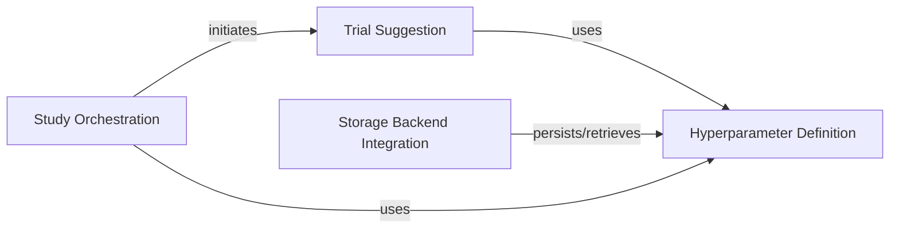

## Component Details

This graph illustrates the core components involved in defining, suggesting, storing, and orchestrating hyperparameter optimization within Optuna. The Hyperparameter Definition component establishes the types and ranges of hyperparameters. The Trial Suggestion component utilizes these definitions to propose new parameter values for trials. The Storage Backend Integration component is responsible for persisting and retrieving these hyperparameter definitions and trial data. Finally, the Study Orchestration component manages the overall optimization flow, initiating trials and interacting with the suggestion and definition components.

### Hyperparameter Definition
Defines the types and ranges of hyperparameters that can be optimized, including float, integer, and categorical distributions. It also provides utilities for converting between JSON representations and distribution objects.

**Related Classes/Methods**:

- <a href="https://github.com/optuna/optuna/blob/master/optuna/distributions.py#L31-L106" target="_blank" rel="noopener noreferrer">`optuna.distributions.BaseDistribution` (31:106)</a>
- <a href="https://github.com/optuna/optuna/blob/master/optuna/distributions.py#L109-L205" target="_blank" rel="noopener noreferrer">`optuna.distributions.FloatDistribution` (109:205)</a>
- <a href="https://github.com/optuna/optuna/blob/master/optuna/distributions.py#L318-L408" target="_blank" rel="noopener noreferrer">`optuna.distributions.IntDistribution` (318:408)</a>
- <a href="https://github.com/optuna/optuna/blob/master/optuna/distributions.py#L486-L566" target="_blank" rel="noopener noreferrer">`optuna.distributions.CategoricalDistribution` (486:566)</a>
- <a href="https://github.com/optuna/optuna/blob/master/optuna/distributions.py#L581-L622" target="_blank" rel="noopener noreferrer">`optuna.distributions.json_to_distribution` (581:622)</a>
- <a href="https://github.com/optuna/optuna/blob/master/optuna/distributions.py#L625-L636" target="_blank" rel="noopener noreferrer">`optuna.distributions.distribution_to_json` (625:636)</a>
- <a href="https://github.com/optuna/optuna/blob/master/optuna/distributions.py#L209-L232" target="_blank" rel="noopener noreferrer">`optuna.distributions.UniformDistribution` (209:232)</a>
- <a href="https://github.com/optuna/optuna/blob/master/optuna/distributions.py#L236-L259" target="_blank" rel="noopener noreferrer">`optuna.distributions.LogUniformDistribution` (236:259)</a>
- <a href="https://github.com/optuna/optuna/blob/master/optuna/distributions.py#L263-L315" target="_blank" rel="noopener noreferrer">`optuna.distributions.DiscreteUniformDistribution` (263:315)</a>
- <a href="https://github.com/optuna/optuna/blob/master/optuna/distributions.py#L412-L442" target="_blank" rel="noopener noreferrer">`optuna.distributions.IntUniformDistribution` (412:442)</a>
- <a href="https://github.com/optuna/optuna/blob/master/optuna/distributions.py#L446-L470" target="_blank" rel="noopener noreferrer">`optuna.distributions.IntLogUniformDistribution` (446:470)</a>

### Trial Suggestion
This component provides the interface for suggesting hyperparameter values within an Optuna trial. It encapsulates the logic for interacting with various distribution types to generate parameter suggestions.

**Related Classes/Methods**:

- <a href="https://github.com/optuna/optuna/blob/master/optuna/trial/_frozen.py#L33-L479" target="_blank" rel="noopener noreferrer">`optuna.trial._frozen.FrozenTrial` (33:479)</a>
- <a href="https://github.com/optuna/optuna/blob/master/optuna/trial/_frozen.py#L482-L597" target="_blank" rel="noopener noreferrer">`optuna.trial._frozen:create_trial` (482:597)</a>
- <a href="https://github.com/optuna/optuna/blob/master/optuna/trial/_fixed.py#L24-L187" target="_blank" rel="noopener noreferrer">`optuna.trial._fixed.FixedTrial` (24:187)</a>
- <a href="https://github.com/optuna/optuna/blob/master/optuna/trial/_trial.py#L31-L757" target="_blank" rel="noopener noreferrer">`optuna.trial._trial.Trial` (31:757)</a>
- <a href="https://github.com/optuna/optuna/blob/master/optuna/trial/_base.py#L17-L132" target="_blank" rel="noopener noreferrer">`optuna.trial._base.BaseTrial` (17:132)</a>

### Storage Backend Integration
This component manages the interaction with different storage backends (RDB, gRPC, Journal) for persisting and retrieving trial-related data, including the definitions of parameter distributions. It handles the serialization and deserialization of distribution objects for storage.

**Related Classes/Methods**:

- `optuna.storages._rdb.alembic.versions.v3.0.0.a:migrate_new_distribution` (full file reference)
- `optuna.storages._rdb.alembic.versions.v3.0.0.a:restore_old_distribution` (full file reference)
- <a href="https://github.com/optuna/optuna/blob/master/optuna/storages/_grpc/servicer.py#L210-L227" target="_blank" rel="noopener noreferrer">`optuna.storages._grpc.servicer.OptunaStorageProxyService:SetTrialParameter` (210:227)</a>
- <a href="https://github.com/optuna/optuna/blob/master/optuna/storages/_grpc/servicer.py#L373-L397" target="_blank" rel="noopener noreferrer">`optuna.storages._grpc.servicer:_to_proto_trial` (373:397)</a>
- <a href="https://github.com/optuna/optuna/blob/master/optuna/storages/_grpc/servicer.py#L400-L429" target="_blank" rel="noopener noreferrer">`optuna.storages._grpc.servicer:_from_proto_trial` (400:429)</a>
- <a href="https://github.com/optuna/optuna/blob/master/optuna/storages/_grpc/client.py#L257-L280" target="_blank" rel="noopener noreferrer">`optuna.storages._grpc.client.GrpcStorageProxy:set_trial_param` (257:280)</a>
- <a href="https://github.com/optuna/optuna/blob/master/optuna/storages/journal/_storage.py#L229-L277" target="_blank" rel="noopener noreferrer">`optuna.storages.journal._storage.JournalStorage:create_new_trial` (229:277)</a>
- <a href="https://github.com/optuna/optuna/blob/master/optuna/storages/journal/_storage.py#L279-L295" target="_blank" rel="noopener noreferrer">`optuna.storages.journal._storage.JournalStorage:set_trial_param` (279:295)</a>
- <a href="https://github.com/optuna/optuna/blob/master/optuna/storages/journal/_storage.py#L514-L557" target="_blank" rel="noopener noreferrer">`optuna.storages.journal._storage.JournalStorageReplayResult:_apply_create_trial` (514:557)</a>
- <a href="https://github.com/optuna/optuna/blob/master/optuna/storages/journal/_storage.py#L559-L590" target="_blank" rel="noopener noreferrer">`optuna.storages.journal._storage.JournalStorageReplayResult:_apply_set_trial_param` (559:590)</a>
- <a href="https://github.com/optuna/optuna/blob/master/optuna/storages/_base.py#L21-L625" target="_blank" rel="noopener noreferrer">`optuna.storages._base.BaseStorage` (21:625)</a>
- <a href="https://github.com/optuna/optuna/blob/master/optuna/storages/_cached_storage.py#L34-L279" target="_blank" rel="noopener noreferrer">`optuna.storages._cached_storage._CachedStorage` (34:279)</a>
- <a href="https://github.com/optuna/optuna/blob/master/optuna/storages/_in_memory.py#L26-L414" target="_blank" rel="noopener noreferrer">`optuna.storages._in_memory.InMemoryStorage` (26:414)</a>
- <a href="https://github.com/optuna/optuna/blob/master/optuna/storages/_rdb/storage.py#L103-L1028" target="_blank" rel="noopener noreferrer">`optuna.storages._rdb.storage.RDBStorage` (103:1028)</a>
- <a href="https://github.com/optuna/optuna/blob/master/optuna/storages/journal/_storage.py#L51-L380" target="_blank" rel="noopener noreferrer">`optuna.storages.journal._storage.JournalStorage` (51:380)</a>

### Study Orchestration
This component represents the high-level control flow for an Optuna study, managing the overall optimization process. It initiates new trials and interacts with other components to obtain and store trial information.

**Related Classes/Methods**:

- <a href="https://github.com/optuna/optuna/blob/master/optuna/study/study.py#L501-L585" target="_blank" rel="noopener noreferrer">`optuna.study.study.Study:ask` (501:585)</a>
- <a href="https://github.com/optuna/optuna/blob/master/optuna/study/study.py#L66-L1163" target="_blank" rel="noopener noreferrer">`optuna.study.study.Study` (66:1163)</a>

### [FAQ](https://github.com/CodeBoarding/GeneratedOnBoardings/tree/main?tab=readme-ov-file#faq)