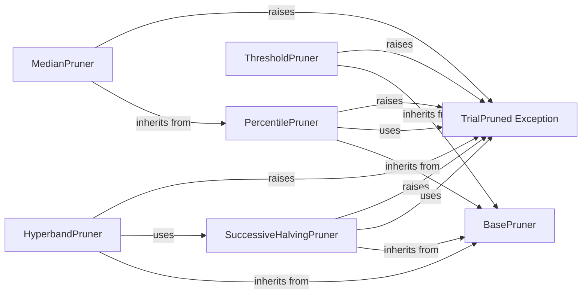

## Component Details

One paragraph explaining the functionality which is represented by this graph. What the main flow is and what is its purpose.

### TrialPruned Exception
This component defines the `TrialPruned` exception, which is raised when a trial in Optuna is pruned. It inherits from `OptunaError` and signals that the current trial should be stopped early due to a pruning decision.

**Related Classes/Methods**:

- <a href="https://github.com/optuna/optuna/blob/master/optuna/exceptions.py#L7-L54" target="_blank" rel="noopener noreferrer">`optuna.exceptions.TrialPruned` (7:54)</a>

### BasePruner
This is the abstract base class for all pruners in Optuna, defining the common interface for pruning strategies.

**Related Classes/Methods**:

- <a href="https://github.com/optuna/optuna/blob/master/optuna/pruners/_base.py#L6-L28" target="_blank" rel="noopener noreferrer">`optuna.pruners._base.BasePruner` (6:28)</a>

### SuccessiveHalvingPruner
This component implements the Asynchronous Successive Halving Algorithm for pruning. It prunes trials based on their intermediate values and promotes promising trials to the next rung. It manages resources and determines when a trial should be pruned or allowed to continue.

**Related Classes/Methods**:

- <a href="https://github.com/optuna/optuna/blob/master/optuna/pruners/_successive_halving.py#L11-L214" target="_blank" rel="noopener noreferrer">`optuna.pruners._successive_halving.SuccessiveHalvingPruner` (11:214)</a>
- <a href="https://github.com/optuna/optuna/blob/master/optuna/pruners/_successive_halving.py#L230-L235" target="_blank" rel="noopener noreferrer">`optuna.pruners._successive_halving._get_current_rung` (230:235)</a>
- <a href="https://github.com/optuna/optuna/blob/master/optuna/pruners/_successive_halving.py#L217-L227" target="_blank" rel="noopener noreferrer">`optuna.pruners._successive_halving._estimate_min_resource` (217:227)</a>
- <a href="https://github.com/optuna/optuna/blob/master/optuna/pruners/_successive_halving.py#L238-L239" target="_blank" rel="noopener noreferrer">`optuna.pruners._successive_halving._completed_rung_key` (238:239)</a>
- <a href="https://github.com/optuna/optuna/blob/master/optuna/pruners/_successive_halving.py#L242-L247" target="_blank" rel="noopener noreferrer">`optuna.pruners._successive_halving._get_competing_values` (242:247)</a>
- <a href="https://github.com/optuna/optuna/blob/master/optuna/pruners/_successive_halving.py#L250-L267" target="_blank" rel="noopener noreferrer">`optuna.pruners._successive_halving._is_trial_promotable_to_next_rung` (250:267)</a>

### ThresholdPruner
This component prunes trials if their intermediate metric values exceed an upper threshold, fall below a lower threshold, or become NaN. It provides a simple mechanism for early stopping based on predefined boundaries.

**Related Classes/Methods**:

- <a href="https://github.com/optuna/optuna/blob/master/optuna/pruners/_threshold.py#L24-L138" target="_blank" rel="noopener noreferrer">`optuna.pruners._threshold.ThresholdPruner` (24:138)</a>
- <a href="https://github.com/optuna/optuna/blob/master/optuna/pruners/_threshold.py#L11-L21" target="_blank" rel="noopener noreferrer">`optuna.pruners._threshold._check_value` (11:21)</a>

### PercentilePruner
This component prunes trials by keeping a specified percentile of the trials. It prunes a trial if its best intermediate value falls into the bottom percentile among trials at the same step. It provides helper functions for calculating percentiles and managing warm-up steps.

**Related Classes/Methods**:

- <a href="https://github.com/optuna/optuna/blob/master/optuna/pruners/_percentile.py#L70-L208" target="_blank" rel="noopener noreferrer">`optuna.pruners._percentile.PercentilePruner` (70:208)</a>
- <a href="https://github.com/optuna/optuna/blob/master/optuna/pruners/_percentile.py#L52-L67" target="_blank" rel="noopener noreferrer">`optuna.pruners._percentile._is_first_in_interval_step` (52:67)</a>
- <a href="https://github.com/optuna/optuna/blob/master/optuna/pruners/_percentile.py#L15-L21" target="_blank" rel="noopener noreferrer">`optuna.pruners._percentile._get_best_intermediate_result_over_steps` (15:21)</a>
- <a href="https://github.com/optuna/optuna/blob/master/optuna/pruners/_percentile.py#L24-L49" target="_blank" rel="noopener noreferrer">`optuna.pruners._percentile._get_percentile_intermediate_result_over_trials` (24:49)</a>

### MedianPruner
This component prunes trials using the median stopping rule. It prunes a trial if its best intermediate result is worse than the median of intermediate results from previous trials at the same step. It extends the `PercentilePruner`.

**Related Classes/Methods**:

- <a href="https://github.com/optuna/optuna/blob/master/optuna/pruners/_median.py#L4-L86" target="_blank" rel="noopener noreferrer">`optuna.pruners._median.MedianPruner` (4:86)</a>

### HyperbandPruner
This component implements the Hyperband pruning algorithm, which is an extension of Successive Halving. It manages multiple Successive Halving pruners (brackets) to efficiently explore different configurations and prune unpromising trials. It dynamically allocates resources to trials across these brackets.

**Related Classes/Methods**:

- <a href="https://github.com/optuna/optuna/blob/master/optuna/pruners/_hyperband.py#L17-L324" target="_blank" rel="noopener noreferrer">`optuna.pruners._hyperband.HyperbandPruner` (17:324)</a>
- <a href="https://github.com/optuna/optuna/blob/master/optuna/pruners/_hyperband.py#L183-L223" target="_blank" rel="noopener noreferrer">`optuna.pruners._hyperband.HyperbandPruner._try_initialization` (183:223)</a>
- <a href="https://github.com/optuna/optuna/blob/master/optuna/pruners/_hyperband.py#L238-L260" target="_blank" rel="noopener noreferrer">`optuna.pruners._hyperband.HyperbandPruner._get_bracket_id` (238:260)</a>
- <a href="https://github.com/optuna/optuna/blob/master/optuna/pruners/_hyperband.py#L262-L324" target="_blank" rel="noopener noreferrer">`optuna.pruners._hyperband.HyperbandPruner._create_bracket_study` (262:324)</a>
- <a href="https://github.com/optuna/optuna/blob/master/optuna/pruners/_hyperband.py#L225-L236" target="_blank" rel="noopener noreferrer">`optuna.pruners._hyperband.HyperbandPruner._calculate_trial_allocation_budget` (225:236)</a>
- `optuna.pruners._hyperband.HyperbandPruner._create_bracket_study._BracketStudy` (full file reference)

### [FAQ](https://github.com/CodeBoarding/GeneratedOnBoardings/tree/main?tab=readme-ov-file#faq)