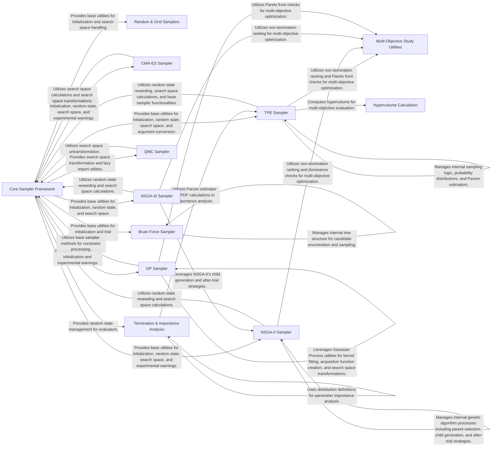

## Component Details

This graph illustrates the architecture of the 'Sampling Algorithms' subsystem within Optuna, which is responsible for generating new hyperparameter values for trials. The core functionality is built upon a 'Core Sampler Framework' that provides fundamental utilities like base interfaces, random state management, and search space transformations. Various specialized samplers, such as TPE, CMA-ES, NSGA-II/III, Random, Grid, Brute Force, QMC, and GP Samplers, extend this framework to implement diverse optimization strategies. Additionally, components for 'Termination & Importance Analysis', 'Multi-Objective Study Utilities', and 'Hypervolume Calculation' support the evaluation and management of optimization studies, particularly in multi-objective scenarios. The overall flow involves samplers proposing new trials, utilizing core utilities, and interacting with analysis and multi-objective components for evaluation and guidance.

### Core Sampler Framework
This component provides the foundational elements for all samplers, including the base sampler interface, random state management, and common utilities for search space transformations and experimental warnings. It serves as a common dependency for various sampling algorithms.

**Related Classes/Methods**:

- <a href="https://github.com/optuna/optuna/blob/master/optuna/samplers/_base.py#L21-L225" target="_blank" rel="noopener noreferrer">`optuna.samplers._base.BaseSampler` (21:225)</a>
- <a href="https://github.com/optuna/optuna/blob/master/optuna/samplers/_lazy_random_state.py#L6-L27" target="_blank" rel="noopener noreferrer">`optuna.samplers._lazy_random_state.LazyRandomState` (6:27)</a>

### Random & Grid Samplers
This component encompasses the basic random sampling strategy, the grid-based sampling approach, which systematically explores a predefined grid of parameter values, and a partial fixed sampler. These samplers are generally used for simple or exhaustive search scenarios.

**Related Classes/Methods**:

- <a href="https://github.com/optuna/optuna/blob/master/optuna/samplers/_random.py#L18-L71" target="_blank" rel="noopener noreferrer">`optuna.samplers._random.RandomSampler` (18:71)</a>
- <a href="https://github.com/optuna/optuna/blob/master/optuna/samplers/_grid.py#L32-L286" target="_blank" rel="noopener noreferrer">`optuna.samplers._grid.GridSampler` (32:286)</a>
- <a href="https://github.com/optuna/optuna/blob/master/optuna/samplers/_grid.py#L282-L286" target="_blank" rel="noopener noreferrer">`optuna.samplers._grid.GridSampler.is_exhausted` (282:286)</a>
- <a href="https://github.com/optuna/optuna/blob/master/optuna/samplers/_partial_fixed.py#L20-L123" target="_blank" rel="noopener noreferrer">`optuna.samplers._partial_fixed.PartialFixedSampler` (20:123)</a>

### TPE Sampler
This component implements the Tree-structured Parzen Estimator (TPE) algorithm, a popular Bayesian optimization method that models objective functions using Parzen estimators to propose new trials. It includes sophisticated probability distribution modeling and handles multi-objective optimization aspects.

**Related Classes/Methods**:

- <a href="https://github.com/optuna/optuna/blob/master/optuna/samplers/_tpe/sampler.py#L65-L623" target="_blank" rel="noopener noreferrer">`optuna.samplers._tpe.sampler.TPESampler` (65:623)</a>
- <a href="https://github.com/optuna/optuna/blob/master/optuna/samplers/_tpe/probability_distributions.py#L37-L122" target="_blank" rel="noopener noreferrer">`optuna.samplers._tpe.probability_distributions._MixtureOfProductDistribution` (37:122)</a>
- <a href="https://github.com/optuna/optuna/blob/master/optuna/samplers/_tpe/parzen_estimator.py#L34-L277" target="_blank" rel="noopener noreferrer">`optuna.samplers._tpe.parzen_estimator._ParzenEstimator` (34:277)</a>
- <a href="https://github.com/optuna/optuna/blob/master/optuna/samplers/_tpe/_truncnorm.py#L72-L74" target="_blank" rel="noopener noreferrer">`optuna.samplers._tpe._truncnorm:_ndtr` (72:74)</a>
- <a href="https://github.com/optuna/optuna/blob/master/optuna/samplers/_tpe/_erf.py#L108-L185" target="_blank" rel="noopener noreferrer">`optuna.samplers._tpe._erf.erf` (108:185)</a>

### CMA-ES Sampler
This component provides the Covariance Matrix Adaptation Evolution Strategy (CMA-ES) sampler, an evolutionary algorithm particularly effective for continuous optimization problems. It manages the evolution of a population based on covariance matrix adaptation.

**Related Classes/Methods**:

- <a href="https://github.com/optuna/optuna/blob/master/optuna/samplers/_cmaes.py#L46-L641" target="_blank" rel="noopener noreferrer">`optuna.samplers._cmaes.CmaEsSampler` (46:641)</a>
- <a href="https://github.com/optuna/optuna/blob/master/optuna/samplers/_cmaes.py#L644-L648" target="_blank" rel="noopener noreferrer">`optuna.samplers._cmaes._is_compatible_search_space` (644:648)</a>

### NSGA-II Sampler
This component implements the Nondominated Sorting Genetic Algorithm II (NSGA-II), a widely used multi-objective evolutionary algorithm. It employs non-dominated sorting and crowding distance to achieve both convergence and diversity in the Pareto front.

**Related Classes/Methods**:

- <a href="https://github.com/optuna/optuna/blob/master/optuna/samplers/nsgaii/_sampler.py#L29-L302" target="_blank" rel="noopener noreferrer">`optuna.samplers.nsgaii._sampler.NSGAIISampler` (29:302)</a>
- <a href="https://github.com/optuna/optuna/blob/master/optuna/samplers/nsgaii/_elite_population_selection_strategy.py#L21-L60" target="_blank" rel="noopener noreferrer">`optuna.samplers.nsgaii._elite_population_selection_strategy.NSGAIIElitePopulationSelectionStrategy` (21:60)</a>
- <a href="https://github.com/optuna/optuna/blob/master/optuna/samplers/nsgaii/_child_generation_strategy.py#L21-L101" target="_blank" rel="noopener noreferrer">`optuna.samplers.nsgaii._child_generation_strategy.NSGAIIChildGenerationStrategy` (21:101)</a>
- <a href="https://github.com/optuna/optuna/blob/master/optuna/samplers/nsgaii/_after_trial_strategy.py#L16-L35" target="_blank" rel="noopener noreferrer">`optuna.samplers.nsgaii._after_trial_strategy.NSGAIIAfterTrialStrategy` (16:35)</a>
- <a href="https://github.com/optuna/optuna/blob/master/optuna/samplers/nsgaii/_crossover.py#L29-L80" target="_blank" rel="noopener noreferrer">`optuna.samplers.nsgaii._crossover:_try_crossover` (29:80)</a>
- <a href="https://github.com/optuna/optuna/blob/master/optuna/samplers/nsgaii/_constraints_evaluation.py#L15-L85" target="_blank" rel="noopener noreferrer">`optuna.samplers.nsgaii._constraints_evaluation._constrained_dominates` (15:85)</a>
- <a href="https://github.com/optuna/optuna/blob/master/optuna/samplers/nsgaii/_crossovers/_undx.py#L16-L115" target="_blank" rel="noopener noreferrer">`optuna.samplers.nsgaii._crossovers._undx.UNDXCrossover` (16:115)</a>
- <a href="https://github.com/optuna/optuna/blob/master/optuna/samplers/_ga/_base.py#L13-L183" target="_blank" rel="noopener noreferrer">`optuna.samplers._ga._base.BaseGASampler` (13:183)</a>

### NSGA-III Sampler
This component provides the Nondominated Sorting Genetic Algorithm III (NSGA-III) sampler, an advanced extension of NSGA-II. It is specifically designed for many-objective optimization problems, utilizing a set of reference points to guide the search towards a well-distributed Pareto front.

**Related Classes/Methods**:

- <a href="https://github.com/optuna/optuna/blob/master/optuna/samplers/_nsgaiii/_sampler.py#L40-L291" target="_blank" rel="noopener noreferrer">`optuna.samplers._nsgaiii._sampler.NSGAIIISampler` (40:291)</a>
- <a href="https://github.com/optuna/optuna/blob/master/optuna/samplers/_nsgaiii/_elite_population_selection_strategy.py#L25-L101" target="_blank" rel="noopener noreferrer">`optuna.samplers._nsgaiii._elite_population_selection_strategy.NSGAIIIElitePopulationSelectionStrategy` (25:101)</a>

### Brute Force Sampler
This component implements a brute-force sampling strategy, systematically exploring all possible combinations of parameters within a defined search space. It often utilizes a tree-like structure to manage and enumerate candidate trials.

**Related Classes/Methods**:

- <a href="https://github.com/optuna/optuna/blob/master/optuna/samplers/_brute_force.py#L105-L271" target="_blank" rel="noopener noreferrer">`optuna.samplers._brute_force.BruteForceSampler` (105:271)</a>
- <a href="https://github.com/optuna/optuna/blob/master/optuna/samplers/_brute_force.py#L29-L101" target="_blank" rel="noopener noreferrer">`optuna.samplers._brute_force._TreeNode` (29:101)</a>

### QMC Sampler
This component provides the Quasi-Monte Carlo (QMC) sampler, which uses low-discrepancy sequences to generate samples. These sequences aim to fill the search space more uniformly than traditional pseudo-random samples, potentially leading to faster convergence.

**Related Classes/Methods**:

- <a href="https://github.com/optuna/optuna/blob/master/optuna/samplers/_qmc.py#L33-L318" target="_blank" rel="noopener noreferrer">`optuna.samplers._qmc.QMCSampler` (33:318)</a>
- <a href="https://github.com/optuna/optuna/blob/master/optuna/samplers/_qmc.py#L270-L295" target="_blank" rel="noopener noreferrer">`optuna.samplers._qmc.QMCSampler._sample_qmc` (270:295)</a>

### GP Sampler
This component implements a Gaussian Process (GP) based sampler, which models the objective function using Gaussian Processes. It then uses an acquisition function to intelligently propose new samples, balancing exploration and exploitation.

**Related Classes/Methods**:

- <a href="https://github.com/optuna/optuna/blob/master/optuna/samplers/_gp/sampler.py#L57-L413" target="_blank" rel="noopener noreferrer">`optuna.samplers._gp.sampler.GPSampler` (57:413)</a>
- <a href="https://github.com/optuna/optuna/blob/master/optuna/samplers/_gp/sampler.py#L48-L53" target="_blank" rel="noopener noreferrer">`optuna.samplers._gp.sampler._standardize_values` (48:53)</a>

### Termination & Importance Analysis
This component includes functionalities related to terminating optimization studies based on improvement criteria and analyzing parameter importance. It provides tools for evaluating the progress of an optimization and understanding the impact of individual parameters.

**Related Classes/Methods**: _None_

### Multi-Objective Study Utilities
This component provides core functionalities for multi-objective optimization studies, including efficient non-domination ranking algorithms and methods for identifying Pareto front solutions. These utilities are crucial for evaluating and comparing trials in multi-objective scenarios.

**Related Classes/Methods**: _None_

### Hypervolume Calculation
This component is responsible for computing hypervolume, a widely used performance indicator for multi-objective optimization algorithms. It quantifies the volume of the objective space dominated by a set of solutions relative to a reference point.

**Related Classes/Methods**: _None_

### [FAQ](https://github.com/CodeBoarding/GeneratedOnBoardings/tree/main?tab=readme-ov-file#faq)