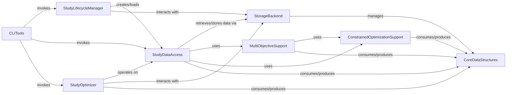

## Component Details

The Study Management subsystem in Optuna is responsible for orchestrating the lifecycle of optimization studies, from their creation and configuration to the execution of trials and the management of study-related data. It provides core functionalities for users to define, run, and analyze optimization experiments, supporting both single and multi-objective optimization, as well as constrained optimization. The subsystem interacts with various components, including storage backends for persistence, samplers and pruners for trial generation and early stopping, and visualization tools for result analysis. Its primary purpose is to provide a robust and flexible framework for hyperparameter optimization.

### StudyLifecycleManager
Manages the creation, loading, copying, and deletion of optimization studies. It provides the primary entry points for users to interact with studies.

**Related Classes/Methods**:

- <a href="https://github.com/optuna/optuna/blob/master/optuna/study/study.py#L1178-L1316" target="_blank" rel="noopener noreferrer">`optuna.study.study.create_study` (1178:1316)</a>
- <a href="https://github.com/optuna/optuna/blob/master/optuna/study/study.py#L1329-L1407" target="_blank" rel="noopener noreferrer">`optuna.study.study.load_study` (1329:1407)</a>
- <a href="https://github.com/optuna/optuna/blob/master/optuna/study/study.py#L1418-L1467" target="_blank" rel="noopener noreferrer">`optuna.study.study.delete_study` (1418:1467)</a>
- <a href="https://github.com/optuna/optuna/blob/master/optuna/study/study.py#L1481-L1572" target="_blank" rel="noopener noreferrer">`optuna.study.study.copy_study` (1481:1572)</a>
- <a href="https://github.com/optuna/optuna/blob/master/optuna/study/study.py#L1575-L1672" target="_blank" rel="noopener noreferrer">`optuna.study.study.get_all_study_summaries` (1575:1672)</a>

### StudyOptimizer
Encapsulates the core optimization loop, managing the execution of trials, handling objective function calls, and applying samplers and pruners. It also provides methods for manual trial management (ask/tell).

**Related Classes/Methods**:

- <a href="https://github.com/optuna/optuna/blob/master/optuna/study/study.py#L387-L499" target="_blank" rel="noopener noreferrer">`optuna.study.study.Study.optimize` (387:499)</a>
- <a href="https://github.com/optuna/optuna/blob/master/optuna/study/study.py#L501-L585" target="_blank" rel="noopener noreferrer">`optuna.study.study.Study.ask` (501:585)</a>
- <a href="https://github.com/optuna/optuna/blob/master/optuna/study/study.py#L587-L678" target="_blank" rel="noopener noreferrer">`optuna.study.study.Study.tell` (587:678)</a>
- <a href="https://github.com/optuna/optuna/blob/master/optuna/study/study.py#L844-L907" target="_blank" rel="noopener noreferrer">`optuna.study.study.Study.enqueue_trial` (844:907)</a>
- <a href="https://github.com/optuna/optuna/blob/master/optuna/study/study.py#L909-L979" target="_blank" rel="noopener noreferrer">`optuna.study.study.Study.add_trial` (909:979)</a>
- <a href="https://github.com/optuna/optuna/blob/master/optuna/study/study.py#L981-L1019" target="_blank" rel="noopener noreferrer">`optuna.study.study.Study.add_trials` (981:1019)</a>
- <a href="https://github.com/optuna/optuna/blob/master/optuna/study/_optimize.py#L35-L120" target="_blank" rel="noopener noreferrer">`optuna.study._optimize._optimize` (35:120)</a>
- <a href="https://github.com/optuna/optuna/blob/master/optuna/study/_optimize.py#L123-L178" target="_blank" rel="noopener noreferrer">`optuna.study._optimize._optimize_sequential` (123:178)</a>
- <a href="https://github.com/optuna/optuna/blob/master/optuna/study/_optimize.py#L181-L254" target="_blank" rel="noopener noreferrer">`optuna.study._optimize._run_trial` (181:254)</a>
- <a href="https://github.com/optuna/optuna/blob/master/optuna/study/_tell.py#L82-L179" target="_blank" rel="noopener noreferrer">`optuna.study._tell._tell_with_warning` (82:179)</a>
- <a href="https://github.com/optuna/optuna/blob/master/optuna/study/study.py#L1073-L1094" target="_blank" rel="noopener noreferrer">`optuna.study.study.Study._pop_waiting_trial_id` (1073:1094)</a>
- <a href="https://github.com/optuna/optuna/blob/master/optuna/study/study.py#L1096-L1125" target="_blank" rel="noopener noreferrer">`optuna.study.study.Study._should_skip_enqueue` (1096:1125)</a>
- <a href="https://github.com/optuna/optuna/blob/master/optuna/study/study.py#L1127-L1163" target="_blank" rel="noopener noreferrer">`optuna.study.study.Study._log_completed_trial` (1127:1163)</a>

### StudyDataAccess
Provides methods for accessing and managing study-level data, including user attributes, system attributes, and trial collections. It acts as an intermediary between the Study object and the underlying storage.

**Related Classes/Methods**:

- <a href="https://github.com/optuna/optuna/blob/master/optuna/study/study.py#L78-L96" target="_blank" rel="noopener noreferrer">`optuna.study.study.Study.__init__` (78:96)</a>
- <a href="https://github.com/optuna/optuna/blob/master/optuna/study/study.py#L103-L105" target="_blank" rel="noopener noreferrer">`optuna.study.study.Study.__setstate__` (103:105)</a>
- <a href="https://github.com/optuna/optuna/blob/master/optuna/study/study.py#L108-L119" target="_blank" rel="noopener noreferrer">`optuna.study.study.Study.best_params` (108:119)</a>
- <a href="https://github.com/optuna/optuna/blob/master/optuna/study/study.py#L122-L136" target="_blank" rel="noopener noreferrer">`optuna.study.study.Study.best_value` (122:136)</a>
- <a href="https://github.com/optuna/optuna/blob/master/optuna/study/study.py#L139-L155" target="_blank" rel="noopener noreferrer">`optuna.study.study.Study.best_trial` (139:155)</a>
- <a href="https://github.com/optuna/optuna/blob/master/optuna/study/study.py#L158-L174" target="_blank" rel="noopener noreferrer">`optuna.study.study.Study.best_trials` (158:174)</a>
- <a href="https://github.com/optuna/optuna/blob/master/optuna/study/study.py#L177-L196" target="_blank" rel="noopener noreferrer">`optuna.study.study.Study.direction` (177:196)</a>
- <a href="https://github.com/optuna/optuna/blob/master/optuna/study/study.py#L199-L206" target="_blank" rel="noopener noreferrer">`optuna.study.study.Study.directions` (199:206)</a>
- <a href="https://github.com/optuna/optuna/blob/master/optuna/study/study.py#L209-L224" target="_blank" rel="noopener noreferrer">`optuna.study.study.Study.trials` (209:224)</a>
- <a href="https://github.com/optuna/optuna/blob/master/optuna/study/study.py#L226-L266" target="_blank" rel="noopener noreferrer">`optuna.study.study.Study.get_trials` (226:266)</a>
- <a href="https://github.com/optuna/optuna/blob/master/optuna/study/study.py#L268-L286" target="_blank" rel="noopener noreferrer">`optuna.study.study.Study._get_trials` (268:286)</a>
- <a href="https://github.com/optuna/optuna/blob/master/optuna/study/study.py#L288-L323" target="_blank" rel="noopener noreferrer">`optuna.study.study.Study._get_best_trial` (288:323)</a>
- <a href="https://github.com/optuna/optuna/blob/master/optuna/study/study.py#L680-L722" target="_blank" rel="noopener noreferrer">`optuna.study.study.Study.set_user_attr` (680:722)</a>
- <a href="https://github.com/optuna/optuna/blob/master/optuna/study/study.py#L326-L362" target="_blank" rel="noopener noreferrer">`optuna.study.study.Study.user_attrs` (326:362)</a>
- <a href="https://github.com/optuna/optuna/blob/master/optuna/study/study.py#L376-L385" target="_blank" rel="noopener noreferrer">`optuna.study.study.Study.metric_names` (376:385)</a>
- <a href="https://github.com/optuna/optuna/blob/master/optuna/study/study.py#L1022-L1062" target="_blank" rel="noopener noreferrer">`optuna.study.study.Study.set_metric_names` (1022:1062)</a>
- <a href="https://github.com/optuna/optuna/blob/master/optuna/study/study.py#L1064-L1071" target="_blank" rel="noopener noreferrer">`optuna.study.study.Study._is_multi_objective` (1064:1071)</a>
- <a href="https://github.com/optuna/optuna/blob/master/optuna/study/_dataframe.py#L92-L111" target="_blank" rel="noopener noreferrer">`optuna.study._dataframe._trials_dataframe` (92:111)</a>
- <a href="https://github.com/optuna/optuna/blob/master/optuna/study/_dataframe.py#L22-L83" target="_blank" rel="noopener noreferrer">`optuna.study._dataframe._create_records_and_aggregate_column` (22:83)</a>
- <a href="https://github.com/optuna/optuna/blob/master/optuna/study/_dataframe.py#L86-L89" target="_blank" rel="noopener noreferrer">`optuna.study._dataframe._flatten_columns` (86:89)</a>
- <a href="https://github.com/optuna/optuna/blob/master/optuna/study/_tell.py#L23-L40" target="_blank" rel="noopener noreferrer">`optuna.study._tell._get_frozen_trial` (23:40)</a>
- <a href="https://github.com/optuna/optuna/blob/master/optuna/study/_tell.py#L43-L58" target="_blank" rel="noopener noreferrer">`optuna.study._tell._check_state_and_values` (43:58)</a>
- <a href="https://github.com/optuna/optuna/blob/master/optuna/study/_tell.py#L61-L79" target="_blank" rel="noopener noreferrer">`optuna.study._tell._check_values_are_feasible` (61:79)</a>

### StorageBackend
Manages the persistent storage of Optuna studies and trials. It provides concrete implementations for different storage types (in-memory, relational database, journal) and handles the serialization/deserialization of data.

**Related Classes/Methods**:

- <a href="https://github.com/optuna/optuna/blob/master/optuna/storages/_in_memory.py#L141-L143" target="_blank" rel="noopener noreferrer">`optuna.storages._in_memory.InMemoryStorage.get_all_studies` (141:143)</a>
- <a href="https://github.com/optuna/optuna/blob/master/optuna/storages/_in_memory.py#L145-L154" target="_blank" rel="noopener noreferrer">`optuna.storages._in_memory.InMemoryStorage._build_frozen_study` (145:154)</a>
- <a href="https://github.com/optuna/optuna/blob/master/optuna/storages/_in_memory.py#L266-L291" target="_blank" rel="noopener noreferrer">`optuna.storages._in_memory.InMemoryStorage.set_trial_state_values` (266:291)</a>
- <a href="https://github.com/optuna/optuna/blob/master/optuna/storages/_in_memory.py#L293-L324" target="_blank" rel="noopener noreferrer">`optuna.storages._in_memory.InMemoryStorage._update_cache` (293:324)</a>
- <a href="https://github.com/optuna/optuna/blob/master/optuna/storages/_rdb/storage.py#L395-L434" target="_blank" rel="noopener noreferrer">`optuna.storages._rdb.storage.RDBStorage.get_all_studies` (395:434)</a>
- <a href="https://github.com/optuna/optuna/blob/master/optuna/storages/_rdb/storage.py#L861-L902" target="_blank" rel="noopener noreferrer">`optuna.storages._rdb.storage.RDBStorage._build_frozen_trial_from_trial_model` (861:902)</a>
- <a href="https://github.com/optuna/optuna/blob/master/optuna/storages/journal/_storage.py#L149-L176" target="_blank" rel="noopener noreferrer">`optuna.storages.journal._storage.JournalStorage.create_new_study` (149:176)</a>
- <a href="https://github.com/optuna/optuna/blob/master/optuna/storages/journal/_storage.py#L195-L201" target="_blank" rel="noopener noreferrer">`optuna.storages.journal._storage.JournalStorage.get_study_id_from_name` (195:201)</a>
- <a href="https://github.com/optuna/optuna/blob/master/optuna/storages/journal/_storage.py#L203-L206" target="_blank" rel="noopener noreferrer">`optuna.storages.journal._storage.JournalStorage.get_study_name_from_id` (203:206)</a>
- <a href="https://github.com/optuna/optuna/blob/master/optuna/storages/journal/_storage.py#L208-L211" target="_blank" rel="noopener noreferrer">`optuna.storages.journal._storage.JournalStorage.get_study_directions` (208:211)</a>
- <a href="https://github.com/optuna/optuna/blob/master/optuna/storages/journal/_storage.py#L213-L216" target="_blank" rel="noopener noreferrer">`optuna.storages.journal._storage.JournalStorage.get_study_user_attrs` (213:216)</a>
- <a href="https://github.com/optuna/optuna/blob/master/optuna/storages/journal/_storage.py#L218-L221" target="_blank" rel="noopener noreferrer">`optuna.storages.journal._storage.JournalStorage.get_study_system_attrs` (218:221)</a>
- <a href="https://github.com/optuna/optuna/blob/master/optuna/storages/journal/_storage.py#L223-L226" target="_blank" rel="noopener noreferrer">`optuna.storages.journal._storage.JournalStorage.get_all_studies` (223:226)</a>
- <a href="https://github.com/optuna/optuna/blob/master/optuna/storages/journal/_storage.py#L364-L367" target="_blank" rel="noopener noreferrer">`optuna.storages.journal._storage.JournalStorage.get_trial` (364:367)</a>
- <a href="https://github.com/optuna/optuna/blob/master/optuna/storages/journal/_storage.py#L369-L380" target="_blank" rel="noopener noreferrer">`optuna.storages.journal._storage.JournalStorage.get_all_trials` (369:380)</a>
- <a href="https://github.com/optuna/optuna/blob/master/optuna/storages/journal/_storage.py#L466-L491" target="_blank" rel="noopener noreferrer">`optuna.storages.journal._storage.JournalStorageReplayResult._apply_create_study` (466:491)</a>
- <a href="https://github.com/optuna/optuna/blob/master/optuna/storages/journal/_storage.py#L514-L557" target="_blank" rel="noopener noreferrer">`optuna.storages.journal._storage.JournalStorageReplayResult._apply_create_trial` (514:557)</a>
- <a href="https://github.com/optuna/optuna/blob/master/optuna/storages/journal/_storage.py#L592-L613" target="_blank" rel="noopener noreferrer">`optuna.storages.journal._storage.JournalStorageReplayResult._apply_set_trial_state_values` (592:613)</a>
- <a href="https://github.com/optuna/optuna/blob/master/optuna/storages/journal/_storage.py#L427-L428" target="_blank" rel="noopener noreferrer">`optuna.storages.journal._storage.JournalStorageReplayResult.get_all_studies` (427:428)</a>
- <a href="https://github.com/optuna/optuna/blob/master/optuna/storages/journal/_storage.py#L422-L425" target="_blank" rel="noopener noreferrer">`optuna.storages.journal._storage.JournalStorageReplayResult.get_study` (422:425)</a>
- <a href="https://github.com/optuna/optuna/blob/master/optuna/storages/journal/_storage.py#L430-L433" target="_blank" rel="noopener noreferrer">`optuna.storages.journal._storage.JournalStorageReplayResult.get_trial` (430:433)</a>
- <a href="https://github.com/optuna/optuna/blob/master/optuna/storages/journal/_storage.py#L435-L446" target="_blank" rel="noopener noreferrer">`optuna.storages.journal._storage.JournalStorageReplayResult.get_all_trials` (435:446)</a>

### MultiObjectiveSupport
Provides utilities and algorithms specifically for multi-objective optimization, including Pareto front computation, non-domination ranking, and hypervolume calculations.

**Related Classes/Methods**:

- <a href="https://github.com/optuna/optuna/blob/master/optuna/study/_multi_objective.py#L38-L41" target="_blank" rel="noopener noreferrer">`optuna.study._multi_objective._get_pareto_front_trials` (38:41)</a>
- <a href="https://github.com/optuna/optuna/blob/master/optuna/study/_multi_objective.py#L251-L258" target="_blank" rel="noopener noreferrer">`optuna.study._multi_objective._normalize_value` (251:258)</a>
- <a href="https://github.com/optuna/optuna/blob/master/optuna/study/_multi_objective.py#L44-L119" target="_blank" rel="noopener noreferrer">`optuna.study._multi_objective._fast_non_domination_rank` (44:119)</a>
- <a href="https://github.com/optuna/optuna/blob/master/optuna/study/_multi_objective.py#L156-L165" target="_blank" rel="noopener noreferrer">`optuna.study._multi_objective._is_pareto_front_for_unique_sorted` (156:165)</a>
- <a href="https://github.com/optuna/optuna/blob/master/optuna/study/_multi_objective.py#L168-L181" target="_blank" rel="noopener noreferrer">`optuna.study._multi_objective._is_pareto_front` (168:181)</a>
- <a href="https://github.com/optuna/optuna/blob/master/optuna/study/_multi_objective.py#L184-L216" target="_blank" rel="noopener noreferrer">`optuna.study._multi_objective._calculate_nondomination_rank` (184:216)</a>
- <a href="https://github.com/optuna/optuna/blob/master/optuna/study/_multi_objective.py#L219-L248" target="_blank" rel="noopener noreferrer">`optuna.study._multi_objective._dominates` (219:248)</a>
- <a href="https://github.com/optuna/optuna/blob/master/optuna/samplers/_gp/sampler.py#L261-L388" target="_blank" rel="noopener noreferrer">`optuna.samplers._gp.sampler.GPSampler.sample_relative` (261:388)</a>
- <a href="https://github.com/optuna/optuna/blob/master/optuna/samplers/_nsgaiii/_elite_population_selection_strategy.py#L44-L101" target="_blank" rel="noopener noreferrer">`optuna.samplers._nsgaiii._elite_population_selection_strategy.NSGAIIIElitePopulationSelectionStrategy.__call__` (44:101)</a>
- <a href="https://github.com/optuna/optuna/blob/master/optuna/samplers/_nsgaiii/_elite_population_selection_strategy.py#L127-L166" target="_blank" rel="noopener noreferrer">`optuna.samplers._nsgaiii._elite_population_selection_strategy._normalize_objective_values` (127:166)</a>
- <a href="https://github.com/optuna/optuna/blob/master/optuna/samplers/nsgaii/_elite_population_selection_strategy.py#L117-L139" target="_blank" rel="noopener noreferrer">`optuna.samplers.nsgaii._elite_population_selection_strategy._rank_population` (117:139)</a>
- <a href="https://github.com/optuna/optuna/blob/master/optuna/samplers/nsgaii/_constraints_evaluation.py#L15-L85" target="_blank" rel="noopener noreferrer">`optuna.samplers.nsgaii._constraints_evaluation._constrained_dominates` (15:85)</a>
- <a href="https://github.com/optuna/optuna/blob/master/optuna/samplers/_tpe/sampler.py#L692-L723" target="_blank" rel="noopener noreferrer">`optuna.samplers._tpe.sampler._split_complete_trials_multi_objective` (692:723)</a>
- <a href="https://github.com/optuna/optuna/blob/master/optuna/samplers/_tpe/sampler.py#L768-L799" target="_blank" rel="noopener noreferrer">`optuna.samplers._tpe.sampler._calculate_weights_below_for_multi_objective` (768:799)</a>
- <a href="https://github.com/optuna/optuna/blob/master/optuna/_hypervolume/hssp.py#L80-L118" target="_blank" rel="noopener noreferrer">`optuna._hypervolume.hssp._solve_hssp_on_unique_loss_vals` (80:118)</a>
- <a href="https://github.com/optuna/optuna/blob/master/optuna/_hypervolume/hssp.py#L8-L40" target="_blank" rel="noopener noreferrer">`optuna._hypervolume.hssp._solve_hssp_2d` (8:40)</a>
- <a href="https://github.com/optuna/optuna/blob/master/optuna/_hypervolume/wfg.py#L86-L121" target="_blank" rel="noopener noreferrer">`optuna._hypervolume.wfg._compute_exclusive_hv` (86:121)</a>
- <a href="https://github.com/optuna/optuna/blob/master/optuna/_hypervolume/wfg.py#L124-L193" target="_blank" rel="noopener noreferrer">`optuna._hypervolume.wfg.compute_hypervolume` (124:193)</a>
- <a href="https://github.com/optuna/optuna/blob/master/optuna/_gp/acqf.py#L167-L223" target="_blank" rel="noopener noreferrer">`optuna._gp.acqf.MultiObjectiveAcquisitionFunctionParams.from_acqf_params` (167:223)</a>
- <a href="https://github.com/optuna/optuna/blob/master/optuna/visualization/_pareto_front.py#L177-L328" target="_blank" rel="noopener noreferrer">`optuna.visualization._pareto_front._get_pareto_front_info` (177:328)</a>

### CLITools
Provides the command-line interface for users to interact with Optuna studies and trials, enabling operations like study creation, deletion, attribute setting, and trial inspection.

**Related Classes/Methods**:

- <a href="https://github.com/optuna/optuna/blob/master/optuna/cli.py#L342-L352" target="_blank" rel="noopener noreferrer">`optuna.cli._CreateStudy.take_action` (342:352)</a>
- <a href="https://github.com/optuna/optuna/blob/master/optuna/cli.py#L361-L365" target="_blank" rel="noopener noreferrer">`optuna.cli._DeleteStudy.take_action` (361:365)</a>
- <a href="https://github.com/optuna/optuna/blob/master/optuna/cli.py#L380-L388" target="_blank" rel="noopener noreferrer">`optuna.cli._StudySetUserAttribute.take_action` (380:388)</a>
- <a href="https://github.com/optuna/optuna/blob/master/optuna/cli.py#L404-L412" target="_blank" rel="noopener noreferrer">`optuna.cli._StudyNames.take_action` (404:412)</a>
- <a href="https://github.com/optuna/optuna/blob/master/optuna/cli.py#L441-L467" target="_blank" rel="noopener noreferrer">`optuna.cli._Studies.take_action` (441:467)</a>
- <a href="https://github.com/optuna/optuna/blob/master/optuna/cli.py#L495-L517" target="_blank" rel="noopener noreferrer">`optuna.cli._Trials.take_action` (495:517)</a>
- <a href="https://github.com/optuna/optuna/blob/master/optuna/cli.py#L545-L570" target="_blank" rel="noopener noreferrer">`optuna.cli._BestTrial.take_action` (545:570)</a>
- <a href="https://github.com/optuna/optuna/blob/master/optuna/cli.py#L598-L622" target="_blank" rel="noopener noreferrer">`optuna.cli._BestTrials.take_action` (598:622)</a>
- <a href="https://github.com/optuna/optuna/blob/master/optuna/cli.py#L689-L757" target="_blank" rel="noopener noreferrer">`optuna.cli._Ask.take_action` (689:757)</a>
- <a href="https://github.com/optuna/optuna/blob/master/optuna/cli.py#L781-L811" target="_blank" rel="noopener noreferrer">`optuna.cli._Tell.take_action` (781:811)</a>

### CoreDataStructures
Defines the fundamental data structures used throughout Optuna to represent studies, trials, and their various states and attributes.

**Related Classes/Methods**:

- <a href="https://github.com/optuna/optuna/blob/master/optuna/trial/_frozen.py#L33-L479" target="_blank" rel="noopener noreferrer">`optuna.trial._frozen.FrozenTrial` (33:479)</a>
- <a href="https://github.com/optuna/optuna/blob/master/optuna/trial/_state.py#L4-L36" target="_blank" rel="noopener noreferrer">`optuna.trial._state.TrialState` (4:36)</a>
- <a href="https://github.com/optuna/optuna/blob/master/optuna/study/_frozen.py#L13-L89" target="_blank" rel="noopener noreferrer">`optuna.study._frozen.FrozenStudy` (13:89)</a>
- <a href="https://github.com/optuna/optuna/blob/master/optuna/study/_study_direction.py#L4-L18" target="_blank" rel="noopener noreferrer">`optuna.study._study_direction.StudyDirection` (4:18)</a>
- <a href="https://github.com/optuna/optuna/blob/master/optuna/study/_study_summary.py#L16-L123" target="_blank" rel="noopener noreferrer">`optuna.study._study_summary.StudySummary` (16:123)</a>
- <a href="https://github.com/optuna/optuna/blob/master/optuna/trial/_frozen.py#L482-L597" target="_blank" rel="noopener noreferrer">`optuna.trial._frozen.create_trial` (482:597)</a>

### ConstrainedOptimizationSupport
Provides specific functionalities for handling constrained optimization problems, primarily focused on identifying feasible trials based on defined constraints.

**Related Classes/Methods**:

- <a href="https://github.com/optuna/optuna/blob/master/optuna/study/_constrained_optimization.py#L11-L27" target="_blank" rel="noopener noreferrer">`optuna.study._constrained_optimization._get_feasible_trials` (11:27)</a>

### [FAQ](https://github.com/CodeBoarding/GeneratedOnBoardings/tree/main?tab=readme-ov-file#faq)