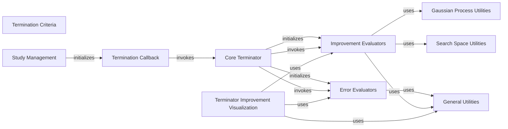

## Component Details

The Termination Criteria subsystem in Optuna provides mechanisms for early stopping of optimization studies. It leverages various evaluators to determine if an optimization process should be terminated based on convergence criteria, including regret bound evaluation and error evaluation strategies. The core of this subsystem is the `Core Terminator` which orchestrates the termination decision by utilizing `Error Evaluators` and `Improvement Evaluators`. The `Termination Callback` integrates this logic into the Optuna optimization loop, allowing the terminator to be invoked at each trial. Visualization components also exist to help users understand the termination behavior.

### Termination Criteria
Provides mechanisms for early stopping of optimization based on convergence criteria, utilizing regret bound evaluation and error evaluation strategies.

**Related Classes/Methods**:

- <a href="https://github.com/optuna/optuna/blob/master/optuna/terminator/callback.py#L15-L73" target="_blank" rel="noopener noreferrer">`optuna.terminator.callback.TerminatorCallback` (15:73)</a>
- <a href="https://github.com/optuna/optuna/blob/master/optuna/terminator/terminator.py#L26-L136" target="_blank" rel="noopener noreferrer">`optuna.terminator.terminator.Terminator` (26:136)</a>
- <a href="https://github.com/optuna/optuna/blob/master/optuna/terminator/erroreval.py#L109-L129" target="_blank" rel="noopener noreferrer">`optuna.terminator.erroreval.StaticErrorEvaluator` (109:129)</a>
- <a href="https://github.com/optuna/optuna/blob/master/optuna/terminator/erroreval.py#L31-L85" target="_blank" rel="noopener noreferrer">`optuna.terminator.erroreval.CrossValidationErrorEvaluator` (31:85)</a>
- <a href="https://github.com/optuna/optuna/blob/master/optuna/terminator/improvement/evaluator.py#L115-L211" target="_blank" rel="noopener noreferrer">`optuna.terminator.improvement.evaluator.RegretBoundEvaluator` (115:211)</a>
- <a href="https://github.com/optuna/optuna/blob/master/optuna/terminator/improvement/evaluator.py#L215-L257" target="_blank" rel="noopener noreferrer">`optuna.terminator.improvement.evaluator.BestValueStagnationEvaluator` (215:257)</a>
- <a href="https://github.com/optuna/optuna/blob/master/optuna/terminator/improvement/emmr.py#L43-L272" target="_blank" rel="noopener noreferrer">`optuna.terminator.improvement.emmr.EMMREvaluator` (43:272)</a>

### Study Management
This component is responsible for the creation and overall management of Optuna optimization studies, serving as an entry point for defining and running optimization trials.

**Related Classes/Methods**:

- <a href="https://github.com/optuna/optuna/blob/master/tutorial/20_recipes/012_artifact_tutorial.py#L376-L421" target="_blank" rel="noopener noreferrer">`optuna.tutorial.20_recipes.012_artifact_tutorial:main` (376:421)</a>
- <a href="https://github.com/optuna/optuna/blob/master/optuna/study/study.py#L1178-L1316" target="_blank" rel="noopener noreferrer">`optuna.study.study.create_study` (1178:1316)</a>

### Termination Callback
This component provides a callable interface that integrates the termination logic into Optuna's optimization loop, allowing the `Terminator` to be invoked at each trial.

**Related Classes/Methods**:

- <a href="https://github.com/optuna/optuna/blob/master/optuna/terminator/callback.py#L15-L73" target="_blank" rel="noopener noreferrer">`optuna.terminator.callback.TerminatorCallback` (15:73)</a>
- <a href="https://github.com/optuna/optuna/blob/master/optuna/terminator/callback.py#L65-L66" target="_blank" rel="noopener noreferrer">`optuna.terminator.callback.TerminatorCallback:__init__` (65:66)</a>
- <a href="https://github.com/optuna/optuna/blob/master/optuna/terminator/callback.py#L68-L73" target="_blank" rel="noopener noreferrer">`optuna.terminator.callback.TerminatorCallback:__call__` (68:73)</a>

### Core Terminator
The central component that orchestrates the termination decision-making process. It initializes and utilizes various error and improvement evaluators to determine if an optimization study should be stopped.

**Related Classes/Methods**:

- <a href="https://github.com/optuna/optuna/blob/master/optuna/terminator/terminator.py#L26-L136" target="_blank" rel="noopener noreferrer">`optuna.terminator.terminator.Terminator` (26:136)</a>
- <a href="https://github.com/optuna/optuna/blob/master/optuna/terminator/terminator.py#L101-L112" target="_blank" rel="noopener noreferrer">`optuna.terminator.terminator.Terminator:__init__` (101:112)</a>
- <a href="https://github.com/optuna/optuna/blob/master/optuna/terminator/terminator.py#L114-L117" target="_blank" rel="noopener noreferrer">`optuna.terminator.terminator.Terminator:_initialize_error_evaluator` (114:117)</a>
- <a href="https://github.com/optuna/optuna/blob/master/optuna/terminator/terminator.py#L119-L136" target="_blank" rel="noopener noreferrer">`optuna.terminator.terminator.Terminator:should_terminate` (119:136)</a>

### Error Evaluators
This component provides mechanisms to evaluate the error of the optimization process, such as static error evaluation or cross-validation error reporting, which are crucial inputs for the `Core Terminator`. It also includes median error evaluation.

**Related Classes/Methods**:

- <a href="https://github.com/optuna/optuna/blob/master/optuna/terminator/erroreval.py#L89-L105" target="_blank" rel="noopener noreferrer">`optuna.terminator.erroreval.report_cross_validation_scores` (89:105)</a>
- <a href="https://github.com/optuna/optuna/blob/master/optuna/terminator/erroreval.py#L109-L129" target="_blank" rel="noopener noreferrer">`optuna.terminator.erroreval.StaticErrorEvaluator` (109:129)</a>
- <a href="https://github.com/optuna/optuna/blob/master/optuna/terminator/erroreval.py#L31-L85" target="_blank" rel="noopener noreferrer">`optuna.terminator.erroreval.CrossValidationErrorEvaluator` (31:85)</a>
- <a href="https://github.com/optuna/optuna/blob/master/optuna/terminator/median_erroreval.py#L16-L86" target="_blank" rel="noopener noreferrer">`optuna.terminator.median_erroreval.MedianErrorEvaluator` (16:86)</a>

### Improvement Evaluators
This component assesses the improvement of the optimization process based on various evaluation methods, including regret bound calculations, EMMR, and best value stagnation, providing metrics for the `Core Terminator` to decide on early stopping.

**Related Classes/Methods**:

- <a href="https://github.com/optuna/optuna/blob/master/optuna/terminator/improvement/evaluator.py#L115-L211" target="_blank" rel="noopener noreferrer">`optuna.terminator.improvement.evaluator.RegretBoundEvaluator` (115:211)</a>
- <a href="https://github.com/optuna/optuna/blob/master/optuna/terminator/improvement/evaluator.py#L137-L148" target="_blank" rel="noopener noreferrer">`optuna.terminator.improvement.evaluator.RegretBoundEvaluator:__init__` (137:148)</a>
- <a href="https://github.com/optuna/optuna/blob/master/optuna/terminator/improvement/evaluator.py#L160-L196" target="_blank" rel="noopener noreferrer">`optuna.terminator.improvement.evaluator.RegretBoundEvaluator:evaluate` (160:196)</a>
- <a href="https://github.com/optuna/optuna/blob/master/optuna/terminator/improvement/evaluator.py#L50-L102" target="_blank" rel="noopener noreferrer">`optuna.terminator.improvement.evaluator._compute_standardized_regret_bound` (50:102)</a>
- <a href="https://github.com/optuna/optuna/blob/master/optuna/terminator/improvement/evaluator.py#L37-L47" target="_blank" rel="noopener noreferrer">`optuna.terminator.improvement.evaluator._get_beta` (37:47)</a>
- `optuna.terminator.improvement.evaluator._validate_input` (full file reference)
- `optuna.terminator.improvement.evaluator._get_top_n` (full file reference)
- <a href="https://github.com/optuna/optuna/blob/master/optuna/terminator/improvement/emmr.py#L43-L272" target="_blank" rel="noopener noreferrer">`optuna.terminator.improvement.emmr.EMMREvaluator` (43:272)</a>
- <a href="https://github.com/optuna/optuna/blob/master/optuna/terminator/improvement/emmr.py#L108-L121" target="_blank" rel="noopener noreferrer">`optuna.terminator.improvement.emmr.EMMREvaluator:__init__` (108:121)</a>
- <a href="https://github.com/optuna/optuna/blob/master/optuna/terminator/improvement/emmr.py#L123-L272" target="_blank" rel="noopener noreferrer">`optuna.terminator.improvement.emmr.EMMREvaluator:evaluate` (123:272)</a>
- <a href="https://github.com/optuna/optuna/blob/master/optuna/terminator/improvement/emmr.py#L343-L383" target="_blank" rel="noopener noreferrer">`optuna.terminator.improvement.emmr._compute_gp_posterior_cov_two_thetas` (343:383)</a>
- <a href="https://github.com/optuna/optuna/blob/master/optuna/terminator/improvement/emmr.py#L275-L303" target="_blank" rel="noopener noreferrer">`optuna.terminator.improvement.emmr._compute_gp_posterior` (275:303)</a>
- <a href="https://github.com/optuna/optuna/blob/master/optuna/terminator/improvement/emmr.py#L306-L340" target="_blank" rel="noopener noreferrer">`optuna.terminator.improvement.emmr._posterior_of_batched_theta` (306:340)</a>
- <a href="https://github.com/optuna/optuna/blob/master/optuna/terminator/improvement/evaluator.py#L215-L257" target="_blank" rel="noopener noreferrer">`optuna.terminator.improvement.evaluator.BestValueStagnationEvaluator` (215:257)</a>

### Gaussian Process Utilities
This component provides fundamental Gaussian Process (GP) functionalities, including acquisition function creation, evaluation, optimization, kernel fitting, and posterior calculations, which are essential for various improvement evaluators.

**Related Classes/Methods**:

- <a href="https://github.com/optuna/optuna/blob/master/optuna/_gp/acqf.py#L226-L254" target="_blank" rel="noopener noreferrer">`optuna._gp.acqf.create_acqf_params` (226:254)</a>
- <a href="https://github.com/optuna/optuna/blob/master/optuna/_gp/acqf.py#L334-L336" target="_blank" rel="noopener noreferrer">`optuna._gp.acqf.eval_acqf_no_grad` (334:336)</a>
- <a href="https://github.com/optuna/optuna/blob/master/optuna/_gp/optim_sample.py#L9-L20" target="_blank" rel="noopener noreferrer">`optuna._gp.optim_sample.optimize_acqf_sample` (9:20)</a>
- <a href="https://github.com/optuna/optuna/blob/master/optuna/_gp/search_space.py#L118-L152" target="_blank" rel="noopener noreferrer">`optuna._gp.search_space.get_search_space_and_normalized_params` (118:152)</a>
- <a href="https://github.com/optuna/optuna/blob/master/optuna/_gp/gp.py#L241-L282" target="_blank" rel="noopener noreferrer">`optuna._gp.gp.fit_kernel_params` (241:282)</a>
- <a href="https://github.com/optuna/optuna/blob/master/optuna/_gp/gp.py#L41-L54" target="_blank" rel="noopener noreferrer">`optuna._gp.gp.warn_and_convert_inf` (41:54)</a>
- <a href="https://github.com/optuna/optuna/blob/master/optuna/_gp/gp.py#L120-L136" target="_blank" rel="noopener noreferrer">`optuna._gp.gp.posterior` (120:136)</a>
- <a href="https://github.com/optuna/optuna/blob/master/optuna/_gp/gp.py#L93-L110" target="_blank" rel="noopener noreferrer">`optuna._gp.gp.kernel` (93:110)</a>
- <a href="https://github.com/optuna/optuna/blob/master/optuna/_gp/gp.py#L113-L117" target="_blank" rel="noopener noreferrer">`optuna._gp.gp.kernel_at_zero_distance` (113:117)</a>

### Search Space Utilities
This component offers utilities for manipulating and intersecting search spaces, which is crucial for defining the domain of optimization problems.

**Related Classes/Methods**:

- <a href="https://github.com/optuna/optuna/blob/master/optuna/search_space/intersection.py#L118-L149" target="_blank" rel="noopener noreferrer">`optuna.search_space.intersection.intersection_search_space` (118:149)</a>

### Terminator Improvement Visualization
This component is responsible for generating visual representations of the termination improvement, helping users understand the behavior of the terminator and the optimization process. It includes both Plotly and Matplotlib based visualizations.

**Related Classes/Methods**:

- `optuna.docs.visualization_examples.optuna.visualization.plot_terminator_improvement:objective` (full file reference)
- `optuna.docs.visualization_matplotlib_examples.optuna.visualization.matplotlib.terminator_improvement:objective` (full file reference)
- <a href="https://github.com/optuna/optuna/blob/master/optuna/visualization/_terminator_improvement.py#L38-L80" target="_blank" rel="noopener noreferrer">`optuna.visualization._terminator_improvement:plot_terminator_improvement` (38:80)</a>
- <a href="https://github.com/optuna/optuna/blob/master/optuna/visualization/_terminator_improvement.py#L83-L132" target="_blank" rel="noopener noreferrer">`optuna.visualization._terminator_improvement._get_improvement_info` (83:132)</a>
- <a href="https://github.com/optuna/optuna/blob/master/optuna/visualization/_terminator_improvement.py#L191-L226" target="_blank" rel="noopener noreferrer">`optuna.visualization._terminator_improvement._get_improvement_plot` (191:226)</a>
- <a href="https://github.com/optuna/optuna/blob/master/optuna/visualization/_terminator_improvement.py#L135-L151" target="_blank" rel="noopener noreferrer">`optuna.visualization._terminator_improvement._get_improvement_scatter` (135:151)</a>
- <a href="https://github.com/optuna/optuna/blob/master/optuna/visualization/_terminator_improvement.py#L154-L169" target="_blank" rel="noopener noreferrer">`optuna.visualization._terminator_improvement._get_error_scatter` (154:169)</a>
- <a href="https://github.com/optuna/optuna/blob/master/optuna/visualization/_terminator_improvement.py#L172-L188" target="_blank" rel="noopener noreferrer">`optuna.visualization._terminator_improvement._get_y_range` (172:188)</a>
- <a href="https://github.com/optuna/optuna/blob/master/optuna/visualization/matplotlib/_terminator_improvement.py#L27-L71" target="_blank" rel="noopener noreferrer">`optuna.visualization.matplotlib._terminator_improvement:plot_terminator_improvement` (27:71)</a>
- <a href="https://github.com/optuna/optuna/blob/master/optuna/visualization/matplotlib/_terminator_improvement.py#L74-L117" target="_blank" rel="noopener noreferrer">`optuna.visualization.matplotlib._terminator_improvement:_get_improvement_plot` (74:117)</a>

### General Utilities
This component groups various general-purpose utilities, including experimental feature markers, deferred import checks, and lazy random state management, which support different parts of the Optuna system.

**Related Classes/Methods**:

- <a href="https://github.com/optuna/optuna/blob/master/optuna/_experimental.py#L91-L139" target="_blank" rel="noopener noreferrer">`optuna._experimental.experimental_class` (91:139)</a>
- <a href="https://github.com/optuna/optuna/blob/master/optuna/_experimental.py#L52-L88" target="_blank" rel="noopener noreferrer">`optuna._experimental.experimental_func` (52:88)</a>
- <a href="https://github.com/optuna/optuna/blob/master/optuna/_imports.py#L84-L94" target="_blank" rel="noopener noreferrer">`optuna._imports._DeferredImportExceptionContextManager.check` (84:94)</a>
- <a href="https://github.com/optuna/optuna/blob/master/optuna/samplers/_lazy_random_state.py#L6-L27" target="_blank" rel="noopener noreferrer">`optuna.samplers._lazy_random_state.LazyRandomState` (6:27)</a>

### [FAQ](https://github.com/CodeBoarding/GeneratedOnBoardings/tree/main?tab=readme-ov-file#faq)