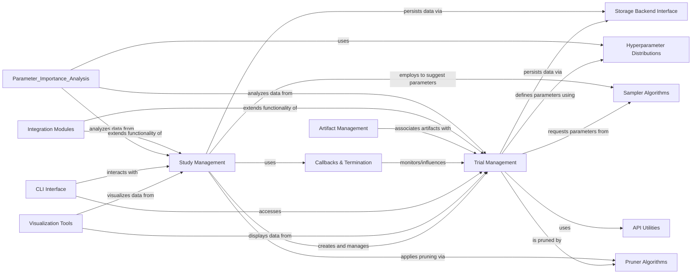

## Component Details

This graph illustrates the core components involved in Optuna's optimization process, focusing on how individual trials are managed, how studies orchestrate these trials, and the various algorithms and utilities that support the hyperparameter optimization lifecycle. It highlights the flow from trial creation and parameter suggestion to result reporting, pruning, and persistence, along with external interactions for visualization and command-line control.

### Trial Management
Handles individual optimization trials, providing methods for suggesting hyperparameter values, reporting intermediate results, and managing trial states. It serves as the interface for an objective function to interact with the Optuna study.

**Related Classes/Methods**:

- <a href="https://github.com/optuna/optuna/blob/master/optuna/trial/_frozen.py#L33-L479" target="_blank" rel="noopener noreferrer">`optuna.trial._frozen.FrozenTrial` (33:479)</a>
- <a href="https://github.com/optuna/optuna/blob/master/optuna/trial/_base.py#L17-L132" target="_blank" rel="noopener noreferrer">`optuna.trial._base.BaseTrial` (17:132)</a>
- <a href="https://github.com/optuna/optuna/blob/master/optuna/trial/_fixed.py#L24-L187" target="_blank" rel="noopener noreferrer">`optuna.trial._fixed.FixedTrial` (24:187)</a>
- <a href="https://github.com/optuna/optuna/blob/master/optuna/trial/_trial.py#L31-L757" target="_blank" rel="noopener noreferrer">`optuna.trial._trial.Trial` (31:757)</a>
- `optuna.trial.create_trial` (482:534)
- <a href="https://github.com/optuna/optuna/blob/master/optuna/trial/_state.py#L4-L36" target="_blank" rel="noopener noreferrer">`optuna.trial._state.TrialState` (4:36)</a>
- `optuna.trial._lazy_trial_system_attrs._LazyTrialSystemAttrs` (760:770)

### Study Management
This component is responsible for orchestrating the entire optimization process. It manages a collection of trials, provides interfaces for running new trials, accessing historical trial data, and setting/getting study-level attributes. It includes functions for creating, loading, deleting, and copying studies, as well as methods for asking for new trials and telling their results.

**Related Classes/Methods**:

- <a href="https://github.com/optuna/optuna/blob/master/optuna/study/study.py#L66-L1163" target="_blank" rel="noopener noreferrer">`optuna.study.study.Study` (66:1163)</a>
- <a href="https://github.com/optuna/optuna/blob/master/optuna/study/study.py#L1178-L1316" target="_blank" rel="noopener noreferrer">`optuna.study.study.create_study` (1178:1316)</a>
- <a href="https://github.com/optuna/optuna/blob/master/optuna/study/study.py#L1329-L1407" target="_blank" rel="noopener noreferrer">`optuna.study.study.load_study` (1329:1407)</a>
- <a href="https://github.com/optuna/optuna/blob/master/optuna/study/study.py#L1418-L1467" target="_blank" rel="noopener noreferrer">`optuna.study.study.delete_study` (1418:1467)</a>
- <a href="https://github.com/optuna/optuna/blob/master/optuna/study/study.py#L1481-L1572" target="_blank" rel="noopener noreferrer">`optuna.study.study.copy_study` (1481:1572)</a>
- <a href="https://github.com/optuna/optuna/blob/master/optuna/study/study.py#L1575-L1672" target="_blank" rel="noopener noreferrer">`optuna.study.study.get_all_study_summaries` (1575:1672)</a>
- <a href="https://github.com/optuna/optuna/blob/master/optuna/study/study.py#L1675-L1726" target="_blank" rel="noopener noreferrer">`optuna.study.study.get_all_study_names` (1675:1726)</a>
- <a href="https://github.com/optuna/optuna/blob/master/optuna/study/_optimize.py#L35-L120" target="_blank" rel="noopener noreferrer">`optuna.study._optimize` (35:120)</a>
- `optuna.study._tell` (full file reference)
- `optuna.study._constrained_optimization` (full file reference)
- `optuna.study._multi_objective` (full file reference)
- `optuna.study._study_summary` (full file reference)
- `optuna.study._dataframe` (full file reference)
- `optuna.study._frozen` (full file reference)
- `optuna.study._study_direction` (full file reference)

### Hyperparameter Distributions
This component defines the various types of mathematical distributions from which hyperparameters are sampled during the optimization process. It includes classes for float, integer, and categorical distributions, along with utilities for converting and validating distribution objects.

**Related Classes/Methods**:

- <a href="https://github.com/optuna/optuna/blob/master/optuna/distributions.py#L109-L205" target="_blank" rel="noopener noreferrer">`optuna.distributions.FloatDistribution` (109:205)</a>
- <a href="https://github.com/optuna/optuna/blob/master/optuna/distributions.py#L318-L408" target="_blank" rel="noopener noreferrer">`optuna.distributions.IntDistribution` (318:408)</a>
- <a href="https://github.com/optuna/optuna/blob/master/optuna/distributions.py#L486-L566" target="_blank" rel="noopener noreferrer">`optuna.distributions.CategoricalDistribution` (486:566)</a>
- <a href="https://github.com/optuna/optuna/blob/master/optuna/distributions.py#L581-L622" target="_blank" rel="noopener noreferrer">`optuna.distributions.json_to_distribution` (581:622)</a>
- <a href="https://github.com/optuna/optuna/blob/master/optuna/distributions.py#L729-L785" target="_blank" rel="noopener noreferrer">`optuna.distributions._convert_old_distribution_to_new_distribution` (729:785)</a>
- <a href="https://github.com/optuna/optuna/blob/master/optuna/distributions.py#L263-L315" target="_blank" rel="noopener noreferrer">`optuna.distributions.DiscreteUniformDistribution` (263:315)</a>
- <a href="https://github.com/optuna/optuna/blob/master/optuna/distributions.py#L446-L470" target="_blank" rel="noopener noreferrer">`optuna.distributions.IntLogUniformDistribution` (446:470)</a>
- <a href="https://github.com/optuna/optuna/blob/master/optuna/distributions.py#L412-L442" target="_blank" rel="noopener noreferrer">`optuna.distributions.IntUniformDistribution` (412:442)</a>
- <a href="https://github.com/optuna/optuna/blob/master/optuna/distributions.py#L236-L259" target="_blank" rel="noopener noreferrer">`optuna.distributions.LogUniformDistribution` (236:259)</a>
- <a href="https://github.com/optuna/optuna/blob/master/optuna/distributions.py#L209-L232" target="_blank" rel="noopener noreferrer">`optuna.distributions.UniformDistribution` (209:232)</a>

### Storage Backend Interface
This component provides an abstract interface for Optuna to interact with various persistent storage solutions. It handles operations like creating new trials, setting trial states, and managing study attributes across different storage backends (e.g., in-memory, relational databases, gRPC, or journal-based).

**Related Classes/Methods**:

- <a href="https://github.com/optuna/optuna/blob/master/optuna/storages/_heartbeat.py#L183-L191" target="_blank" rel="noopener noreferrer">`optuna.storages._heartbeat.is_heartbeat_enabled` (183:191)</a>
- <a href="https://github.com/optuna/optuna/blob/master/optuna/storages/_grpc/servicer.py#L35-L342" target="_blank" rel="noopener noreferrer">`optuna.storages._grpc.servicer.OptunaStorageProxyService` (35:342)</a>
- <a href="https://github.com/optuna/optuna/blob/master/optuna/storages/_grpc/servicer.py#L359-L370" target="_blank" rel="noopener noreferrer">`optuna.storages._grpc.servicer._from_proto_trial_state` (359:370)</a>
- <a href="https://github.com/optuna/optuna/blob/master/optuna/storages/_grpc/servicer.py#L373-L397" target="_blank" rel="noopener noreferrer">`optuna.storages._grpc.servicer._to_proto_trial` (373:397)</a>
- <a href="https://github.com/optuna/optuna/blob/master/optuna/storages/_grpc/client.py#L46-L375" target="_blank" rel="noopener noreferrer">`optuna.storages._grpc.client.GrpcStorageProxy` (46:375)</a>
- <a href="https://github.com/optuna/optuna/blob/master/optuna/storages/journal/_storage.py#L383-L661" target="_blank" rel="noopener noreferrer">`optuna.storages.journal._storage.JournalStorageReplayResult` (383:661)</a>
- <a href="https://github.com/optuna/optuna/blob/master/optuna/storages/_callbacks.py#L12-L121" target="_blank" rel="noopener noreferrer">`optuna.storages._callbacks.RetryFailedTrialCallback` (12:121)</a>
- <a href="https://github.com/optuna/optuna/blob/master/optuna/storages/_base.py#L21-L625" target="_blank" rel="noopener noreferrer">`optuna.storages._base.BaseStorage` (21:625)</a>
- <a href="https://github.com/optuna/optuna/blob/master/optuna/storages/_cached_storage.py#L34-L279" target="_blank" rel="noopener noreferrer">`optuna.storages._cached_storage._CachedStorage` (34:279)</a>
- <a href="https://github.com/optuna/optuna/blob/master/optuna/storages/_in_memory.py#L26-L414" target="_blank" rel="noopener noreferrer">`optuna.storages._in_memory.InMemoryStorage` (26:414)</a>
- <a href="https://github.com/optuna/optuna/blob/master/optuna/storages/_rdb/storage.py#L103-L1028" target="_blank" rel="noopener noreferrer">`optuna.storages._rdb.storage.RDBStorage` (103:1028)</a>
- <a href="https://github.com/optuna/optuna/blob/master/optuna/storages/journal/_base.py#L77-L86" target="_blank" rel="noopener noreferrer">`optuna.storages.journal._base.BaseJournalLogStorage` (77:86)</a>
- <a href="https://github.com/optuna/optuna/blob/master/optuna/storages/journal/_file.py#L22-L109" target="_blank" rel="noopener noreferrer">`optuna.storages.journal._file.JournalFileBackend` (22:109)</a>
- <a href="https://github.com/optuna/optuna/blob/master/optuna/storages/journal/_redis.py#L19-L100" target="_blank" rel="noopener noreferrer">`optuna.storages.journal._redis.JournalRedisBackend` (19:100)</a>
- <a href="https://github.com/optuna/optuna/blob/master/optuna/storages/journal/_storage.py#L51-L380" target="_blank" rel="noopener noreferrer">`optuna.storages.journal._storage.JournalStorage` (51:380)</a>

### Sampler Algorithms
This component implements the core logic for suggesting new hyperparameter values for trials. It contains various optimization algorithms (samplers) that guide the search for optimal parameters within the defined distributions.

**Related Classes/Methods**:

- <a href="https://github.com/optuna/optuna/blob/master/optuna/samplers/_brute_force.py#L105-L271" target="_blank" rel="noopener noreferrer">`optuna.samplers._brute_force.BruteForceSampler` (105:271)</a>
- <a href="https://github.com/optuna/optuna/blob/master/optuna/samplers/_brute_force.py#L29-L101" target="_blank" rel="noopener noreferrer">`optuna.samplers._brute_force._TreeNode` (29:101)</a>
- <a href="https://github.com/optuna/optuna/blob/master/benchmarks/asv/optimize.py#L31-L41" target="_blank" rel="noopener noreferrer">`optuna.benchmarks.asv.optimize.create_sampler` (31:41)</a>
- <a href="https://github.com/optuna/optuna/blob/master/optuna/samplers/_base.py#L21-L225" target="_blank" rel="noopener noreferrer">`optuna.samplers._base.BaseSampler` (21:225)</a>
- <a href="https://github.com/optuna/optuna/blob/master/optuna/samplers/_cmaes.py#L46-L641" target="_blank" rel="noopener noreferrer">`optuna.samplers._cmaes.CmaEsSampler` (46:641)</a>
- <a href="https://github.com/optuna/optuna/blob/master/optuna/samplers/_ga/_base.py#L13-L183" target="_blank" rel="noopener noreferrer">`optuna.samplers._ga._base.BaseGASampler` (13:183)</a>
- <a href="https://github.com/optuna/optuna/blob/master/optuna/samplers/_gp/sampler.py#L57-L413" target="_blank" rel="noopener noreferrer">`optuna.samplers._gp.sampler.GPSampler` (57:413)</a>
- <a href="https://github.com/optuna/optuna/blob/master/optuna/samplers/_grid.py#L32-L286" target="_blank" rel="noopener noreferrer">`optuna.samplers._grid.GridSampler` (32:286)</a>
- <a href="https://github.com/optuna/optuna/blob/master/optuna/samplers/_nsgaiii/_sampler.py#L40-L291" target="_blank" rel="noopener noreferrer">`optuna.samplers._nsgaiii._sampler.NSGAIIISampler` (40:291)</a>
- <a href="https://github.com/optuna/optuna/blob/master/optuna/samplers/_partial_fixed.py#L20-L123" target="_blank" rel="noopener noreferrer">`optuna.samplers._partial_fixed.PartialFixedSampler` (20:123)</a>
- <a href="https://github.com/optuna/optuna/blob/master/optuna/samplers/_qmc.py#L33-L318" target="_blank" rel="noopener noreferrer">`optuna.samplers._qmc.QMCSampler` (33:318)</a>
- <a href="https://github.com/optuna/optuna/blob/master/optuna/samplers/_random.py#L18-L71" target="_blank" rel="noopener noreferrer">`optuna.samplers._random.RandomSampler` (18:71)</a>
- <a href="https://github.com/optuna/optuna/blob/master/optuna/samplers/_tpe/sampler.py#L65-L623" target="_blank" rel="noopener noreferrer">`optuna.samplers._tpe.sampler.TPESampler` (65:623)</a>
- <a href="https://github.com/optuna/optuna/blob/master/optuna/samplers/nsgaii/_sampler.py#L29-L302" target="_blank" rel="noopener noreferrer">`optuna.samplers.nsgaii._sampler.NSGAIISampler` (29:302)</a>

### Pruner Algorithms
This component implements various pruning algorithms that can stop unpromising trials early during the optimization process, saving computational resources.

**Related Classes/Methods**:

- <a href="https://github.com/optuna/optuna/blob/master/optuna/pruners/_base.py#L6-L28" target="_blank" rel="noopener noreferrer">`optuna.pruners._base.BasePruner` (6:28)</a>
- <a href="https://github.com/optuna/optuna/blob/master/optuna/pruners/_hyperband.py#L17-L324" target="_blank" rel="noopener noreferrer">`optuna.pruners._hyperband.HyperbandPruner` (17:324)</a>
- <a href="https://github.com/optuna/optuna/blob/master/optuna/pruners/_median.py#L4-L86" target="_blank" rel="noopener noreferrer">`optuna.pruners._median.MedianPruner` (4:86)</a>
- <a href="https://github.com/optuna/optuna/blob/master/optuna/pruners/_nop.py#L5-L47" target="_blank" rel="noopener noreferrer">`optuna.pruners._nop.NopPruner` (5:47)</a>
- <a href="https://github.com/optuna/optuna/blob/master/optuna/pruners/_patient.py#L12-L130" target="_blank" rel="noopener noreferrer">`optuna.pruners._patient.PatientPruner` (12:130)</a>
- <a href="https://github.com/optuna/optuna/blob/master/optuna/pruners/_percentile.py#L70-L208" target="_blank" rel="noopener noreferrer">`optuna.pruners._percentile.PercentilePruner` (70:208)</a>
- <a href="https://github.com/optuna/optuna/blob/master/optuna/pruners/_successive_halving.py#L11-L214" target="_blank" rel="noopener noreferrer">`optuna.pruners._successive_halving.SuccessiveHalvingPruner` (11:214)</a>
- <a href="https://github.com/optuna/optuna/blob/master/optuna/pruners/_threshold.py#L24-L138" target="_blank" rel="noopener noreferrer">`optuna.pruners._threshold.ThresholdPruner` (24:138)</a>
- <a href="https://github.com/optuna/optuna/blob/master/optuna/pruners/_wilcoxon.py#L24-L220" target="_blank" rel="noopener noreferrer">`optuna.pruners._wilcoxon.WilcoxonPruner` (24:220)</a>

### Visualization Tools
This component provides functionalities for visualizing optimization results, including various plots to analyze trial performance, hyperparameter relationships, and study progress.

**Related Classes/Methods**:

- `optuna.visualization._contour` (full file reference)
- `optuna.visualization._edf` (full file reference)
- `optuna.visualization._hypervolume_history` (full file reference)
- `optuna.visualization._intermediate_values` (full file reference)
- `optuna.visualization._optimization_history` (full file reference)
- `optuna.visualization._parallel_coordinate` (full file reference)
- `optuna.visualization._param_importances` (full file reference)
- `optuna.visualization._pareto_front` (full file reference)
- `optuna.visualization._rank` (full file reference)
- `optuna.visualization._slice` (full file reference)
- `optuna.visualization._terminator_improvement` (full file reference)
- `optuna.visualization._timeline` (full file reference)
- `optuna.visualization._utils` (full file reference)
- `optuna.visualization.matplotlib` (full file reference)

### CLI Interface
This component provides command-line interface functionalities for interacting with Optuna studies, allowing users to manage studies, trials, and view results from the terminal.

**Related Classes/Methods**:

- <a href="https://github.com/optuna/optuna/blob/master/optuna/cli.py#L655-L757" target="_blank" rel="noopener noreferrer">`optuna.cli._Ask` (655:757)</a>
- <a href="https://github.com/optuna/optuna/blob/master/optuna/cli.py#L520-L570" target="_blank" rel="noopener noreferrer">`optuna.cli._BestTrial` (520:570)</a>
- <a href="https://github.com/optuna/optuna/blob/master/optuna/cli.py#L573-L622" target="_blank" rel="noopener noreferrer">`optuna.cli._BestTrials` (573:622)</a>
- <a href="https://github.com/optuna/optuna/blob/master/optuna/cli.py#L307-L352" target="_blank" rel="noopener noreferrer">`optuna.cli._CreateStudy` (307:352)</a>
- <a href="https://github.com/optuna/optuna/blob/master/optuna/cli.py#L355-L365" target="_blank" rel="noopener noreferrer">`optuna.cli._DeleteStudy` (355:365)</a>
- <a href="https://github.com/optuna/optuna/blob/master/optuna/cli.py#L625-L652" target="_blank" rel="noopener noreferrer">`optuna.cli._StorageUpgrade` (625:652)</a>
- <a href="https://github.com/optuna/optuna/blob/master/optuna/cli.py#L415-L467" target="_blank" rel="noopener noreferrer">`optuna.cli._Studies` (415:467)</a>
- <a href="https://github.com/optuna/optuna/blob/master/optuna/cli.py#L391-L412" target="_blank" rel="noopener noreferrer">`optuna.cli._StudyNames` (391:412)</a>
- <a href="https://github.com/optuna/optuna/blob/master/optuna/cli.py#L368-L388" target="_blank" rel="noopener noreferrer">`optuna.cli._StudySetUserAttribute` (368:388)</a>
- <a href="https://github.com/optuna/optuna/blob/master/optuna/cli.py#L760-L811" target="_blank" rel="noopener noreferrer">`optuna.cli._Tell` (760:811)</a>
- <a href="https://github.com/optuna/optuna/blob/master/optuna/cli.py#L470-L517" target="_blank" rel="noopener noreferrer">`optuna.cli._Trials` (470:517)</a>

### API Utilities
This component provides helper functions and decorators to manage API deprecations and argument conversions. Its purpose is to ensure backward compatibility while guiding users towards newer, recommended API usages.

**Related Classes/Methods**:

- <a href="https://github.com/optuna/optuna/blob/master/optuna/_deprecated.py#L55-L119" target="_blank" rel="noopener noreferrer">`optuna._deprecated.deprecated_func` (55:119)</a>
- <a href="https://github.com/optuna/optuna/blob/master/optuna/_convert_positional_args.py#L49-L139" target="_blank" rel="noopener noreferrer">`optuna._convert_positional_args.convert_positional_args` (49:139)</a>

### Callbacks & Termination
This component provides callback mechanisms that allow users to inject custom logic at various points during the optimization process, such as after each trial or at specific stages of a study. It also includes mechanisms for automatically terminating optimization studies based on various criteria, such as error evaluation or stagnation of improvement, to prevent unnecessary computations.

**Related Classes/Methods**:

- `optuna._callbacks` (full file reference)
- <a href="https://github.com/optuna/optuna/blob/master/optuna/terminator/callback.py#L15-L73" target="_blank" rel="noopener noreferrer">`optuna.terminator.callback.TerminatorCallback` (15:73)</a>
- <a href="https://github.com/optuna/optuna/blob/master/optuna/terminator/erroreval.py#L31-L85" target="_blank" rel="noopener noreferrer">`optuna.terminator.erroreval.CrossValidationErrorEvaluator` (31:85)</a>
- <a href="https://github.com/optuna/optuna/blob/master/optuna/terminator/erroreval.py#L109-L129" target="_blank" rel="noopener noreferrer">`optuna.terminator.erroreval.StaticErrorEvaluator` (109:129)</a>
- <a href="https://github.com/optuna/optuna/blob/master/optuna/terminator/improvement/emmr.py#L43-L272" target="_blank" rel="noopener noreferrer">`optuna.terminator.improvement.emmr.EMMREvaluator` (43:272)</a>
- <a href="https://github.com/optuna/optuna/blob/master/optuna/terminator/improvement/evaluator.py#L215-L257" target="_blank" rel="noopener noreferrer">`optuna.terminator.improvement.evaluator.BestValueStagnationEvaluator` (215:257)</a>
- <a href="https://github.com/optuna/optuna/blob/master/optuna/terminator/improvement/evaluator.py#L115-L211" target="_blank" rel="noopener noreferrer">`optuna.terminator.improvement.evaluator.RegretBoundEvaluator` (115:211)</a>
- <a href="https://github.com/optuna/optuna/blob/master/optuna/terminator/median_erroreval.py#L16-L86" target="_blank" rel="noopener noreferrer">`optuna.terminator.median_erroreval.MedianErrorEvaluator` (16:86)</a>
- <a href="https://github.com/optuna/optuna/blob/master/optuna/terminator/terminator.py#L26-L136" target="_blank" rel="noopener noreferrer">`optuna.terminator.terminator.Terminator` (26:136)</a>

### Artifact Management
This component handles the storage and retrieval of artifacts associated with optimization trials, such as trained models or data files, allowing for better reproducibility and analysis of experiments.

**Related Classes/Methods**:

- <a href="https://github.com/optuna/optuna/blob/master/optuna/artifacts/_backoff.py#L19-L109" target="_blank" rel="noopener noreferrer">`optuna.artifacts._backoff.Backoff` (19:109)</a>
- `optuna.artifacts._boto3` (full file reference)
- `optuna.artifacts._download` (full file reference)
- `optuna.artifacts._filesystem` (full file reference)
- `optuna.artifacts._gcs` (full file reference)
- `optuna.artifacts._list_artifact_meta` (full file reference)
- <a href="https://github.com/optuna/optuna/blob/master/optuna/artifacts/_protocol.py#L16-L61" target="_blank" rel="noopener noreferrer">`optuna.artifacts._protocol.ArtifactStore` (16:61)</a>
- `optuna.artifacts._upload` (full file reference)
- <a href="https://github.com/optuna/optuna/blob/master/optuna/artifacts/exceptions.py#L4-L12" target="_blank" rel="noopener noreferrer">`optuna.artifacts.exceptions.ArtifactNotFound` (4:12)</a>

### Integration Modules
This component provides integrations with various popular machine learning frameworks and libraries, enabling seamless use of Optuna within existing workflows.

**Related Classes/Methods**:

- `optuna.integration.allennlp` (full file reference)
- `optuna.integration.botorch` (full file reference)
- `optuna.integration.catboost` (full file reference)
- `optuna.integration.chainer` (full file reference)
- `optuna.integration.chainermn` (full file reference)
- `optuna.integration.cma` (full file reference)
- `optuna.integration.dask` (full file reference)
- `optuna.integration.fastaiv2` (full file reference)
- `optuna.integration.keras` (full file reference)
- `optuna.integration.lightgbm` (full file reference)
- `optuna.integration.mlflow` (full file reference)
- `optuna.integration.mxnet` (full file reference)
- `optuna.integration.pytorch_distributed` (full file reference)
- `optuna.integration.pytorch_ignite` (full file reference)
- `optuna.integration.pytorch_lightning` (full file reference)
- `optuna.integration.shap` (full file reference)
- `optuna.integration.sklearn` (full file reference)
- `optuna.integration.skorch` (full file reference)
- `optuna.integration.tensorboard` (full file reference)
- `optuna.integration.tensorflow` (full file reference)
- `optuna.integration.tfkeras` (full file reference)
- `optuna.integration.wandb` (full file reference)
- `optuna.integration.xgboost` (full file reference)

### [FAQ](https://github.com/CodeBoarding/GeneratedOnBoardings/tree/main?tab=readme-ov-file#faq)