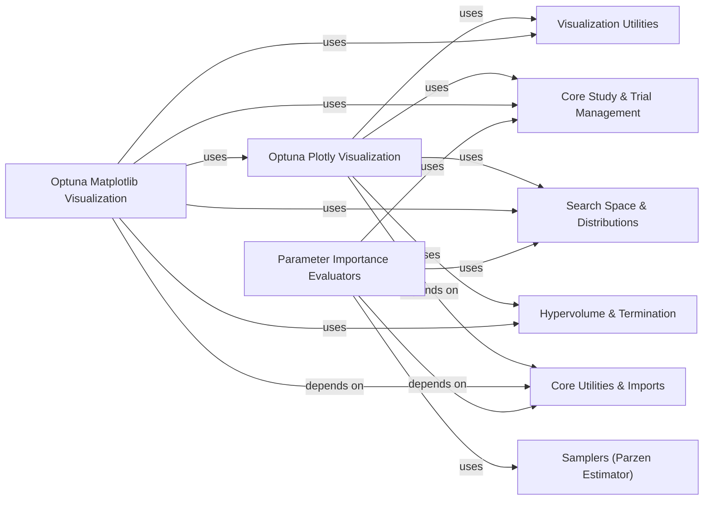

## Component Details

This subsystem provides a comprehensive suite of functionalities for visualizing optimization results and analyzing hyperparameter importance within the Optuna framework. It offers various plot types, supporting both Plotly and Matplotlib backends, to help users understand the optimization process and the impact of different parameters. Additionally, it includes robust methods for evaluating the importance of hyperparameters, aiding in model interpretation and refinement.

### Optuna Plotly Visualization
This component is responsible for generating various plots to visualize optimization results using the Plotly library. It includes functions for creating slice plots, rank plots, intermediate value plots, parallel coordinate plots, parameter importances plots, Pareto front plots, optimization history plots, hypervolume history plots, contour plots, EDF plots, terminator improvement plots, and timeline plots.

**Related Classes/Methods**:

- <a href="https://github.com/optuna/optuna/blob/master/optuna/visualization/_slice.py#L143-L173" target="_blank" rel="noopener noreferrer">`optuna.visualization._slice:plot_slice` (143:173)</a>
- <a href="https://github.com/optuna/optuna/blob/master/optuna/visualization/_slice.py#L90-L140" target="_blank" rel="noopener noreferrer">`optuna.visualization._slice:_get_slice_plot_info` (90:140)</a>
- <a href="https://github.com/optuna/optuna/blob/master/optuna/visualization/_slice.py#L176-L219" target="_blank" rel="noopener noreferrer">`optuna.visualization._slice:_get_slice_plot` (176:219)</a>
- <a href="https://github.com/optuna/optuna/blob/master/optuna/visualization/_slice.py#L52-L87" target="_blank" rel="noopener noreferrer">`optuna.visualization._slice:_get_slice_subplot_info` (52:87)</a>
- <a href="https://github.com/optuna/optuna/blob/master/optuna/visualization/_slice.py#L222-L272" target="_blank" rel="noopener noreferrer">`optuna.visualization._slice:_generate_slice_subplot` (222:272)</a>
- <a href="https://github.com/optuna/optuna/blob/master/optuna/visualization/_rank.py#L66-L100" target="_blank" rel="noopener noreferrer">`optuna.visualization._rank:plot_rank` (66:100)</a>
- <a href="https://github.com/optuna/optuna/blob/master/optuna/visualization/_rank.py#L112-L170" target="_blank" rel="noopener noreferrer">`optuna.visualization._rank:_get_rank_info` (112:170)</a>
- <a href="https://github.com/optuna/optuna/blob/master/optuna/visualization/_rank.py#L173-L207" target="_blank" rel="noopener noreferrer">`optuna.visualization._rank:_get_rank_subplot_info` (173:207)</a>
- <a href="https://github.com/optuna/optuna/blob/master/optuna/visualization/_rank.py#L210-L257" target="_blank" rel="noopener noreferrer">`optuna.visualization._rank:_get_axis_info` (210:257)</a>
- <a href="https://github.com/optuna/optuna/blob/master/optuna/visualization/_rank.py#L260-L286" target="_blank" rel="noopener noreferrer">`optuna.visualization._rank:_get_rank_subplot` (260:286)</a>
- <a href="https://github.com/optuna/optuna/blob/master/optuna/visualization/_rank.py#L303-L392" target="_blank" rel="noopener noreferrer">`optuna.visualization._rank:_get_rank_plot` (303:392)</a>
- <a href="https://github.com/optuna/optuna/blob/master/optuna/visualization/_intermediate_values.py#L29-L53" target="_blank" rel="noopener noreferrer">`optuna.visualization._intermediate_values:_get_intermediate_plot_info` (29:53)</a>
- <a href="https://github.com/optuna/optuna/blob/master/optuna/visualization/_intermediate_values.py#L56-L69" target="_blank" rel="noopener noreferrer">`optuna.visualization._intermediate_values:plot_intermediate_values` (56:69)</a>
- <a href="https://github.com/optuna/optuna/blob/master/optuna/visualization/_intermediate_values.py#L72-L102" target="_blank" rel="noopener noreferrer">`optuna.visualization._intermediate_values:_get_intermediate_plot` (72:102)</a>
- <a href="https://github.com/optuna/optuna/blob/master/optuna/visualization/_parallel_coordinate.py#L50-L85" target="_blank" rel="noopener noreferrer">`optuna.visualization._parallel_coordinate:plot_parallel_coordinate` (50:85)</a>
- <a href="https://github.com/optuna/optuna/blob/master/optuna/visualization/_parallel_coordinate.py#L88-L115" target="_blank" rel="noopener noreferrer">`optuna.visualization._parallel_coordinate:_get_parallel_coordinate_plot` (88:115)</a>
- <a href="https://github.com/optuna/optuna/blob/master/optuna/visualization/_parallel_coordinate.py#L118-L273" target="_blank" rel="noopener noreferrer">`optuna.visualization._parallel_coordinate:_get_parallel_coordinate_info` (118:273)</a>
- <a href="https://github.com/optuna/optuna/blob/master/optuna/visualization/_parallel_coordinate.py#L302-L303" target="_blank" rel="noopener noreferrer">`optuna.visualization._parallel_coordinate:_truncate_label` (302:303)</a>
- <a href="https://github.com/optuna/optuna/blob/master/optuna/visualization/_param_importances.py#L32-L68" target="_blank" rel="noopener noreferrer">`optuna.visualization._param_importances:_get_importances_info` (32:68)</a>
- <a href="https://github.com/optuna/optuna/blob/master/optuna/visualization/_param_importances.py#L71-L110" target="_blank" rel="noopener noreferrer">`optuna.visualization._param_importances:_get_importances_infos` (71:110)</a>
- <a href="https://github.com/optuna/optuna/blob/master/optuna/visualization/_param_importances.py#L113-L169" target="_blank" rel="noopener noreferrer">`optuna.visualization._param_importances:plot_param_importances` (113:169)</a>
- <a href="https://github.com/optuna/optuna/blob/master/optuna/visualization/_param_importances.py#L172-L197" target="_blank" rel="noopener noreferrer">`optuna.visualization._param_importances:_get_importances_plot` (172:197)</a>
- <a href="https://github.com/optuna/optuna/blob/master/optuna/visualization/_param_importances.py#L207-L210" target="_blank" rel="noopener noreferrer">`optuna.visualization._param_importances:_make_hovertext` (207:210)</a>
- <a href="https://github.com/optuna/optuna/blob/master/optuna/visualization/_param_importances.py#L213-L219" target="_blank" rel="noopener noreferrer">`optuna.visualization._param_importances:_get_hover_template` (213:219)</a>
- <a href="https://github.com/optuna/optuna/blob/master/optuna/visualization/_param_importances.py#L200-L204" target="_blank" rel="noopener noreferrer">`optuna.visualization._param_importances:_get_distribution` (200:204)</a>
- <a href="https://github.com/optuna/optuna/blob/master/optuna/visualization/_pareto_front.py#L37-L106" target="_blank" rel="noopener noreferrer">`optuna.visualization._pareto_front:plot_pareto_front` (37:106)</a>
- <a href="https://github.com/optuna/optuna/blob/master/optuna/visualization/_pareto_front.py#L109-L174" target="_blank" rel="noopener noreferrer">`optuna.visualization._pareto_front:_get_pareto_front_plot` (109:174)</a>
- <a href="https://github.com/optuna/optuna/blob/master/optuna/visualization/_pareto_front.py#L177-L328" target="_blank" rel="noopener noreferrer">`optuna.visualization._pareto_front:_get_pareto_front_info` (177:328)</a>
- <a href="https://github.com/optuna/optuna/blob/master/optuna/visualization/_pareto_front.py#L345-L384" target="_blank" rel="noopener noreferrer">`optuna.visualization._pareto_front:_make_scatter_object` (345:384)</a>
- <a href="https://github.com/optuna/optuna/blob/master/optuna/visualization/_pareto_front.py#L387-L419" target="_blank" rel="noopener noreferrer">`optuna.visualization._pareto_front:_make_marker` (387:419)</a>
- <a href="https://github.com/optuna/optuna/blob/master/optuna/visualization/_optimization_history.py#L47-L169" target="_blank" rel="noopener noreferrer">`optuna.visualization._optimization_history:_get_optimization_history_info_list` (47:169)</a>
- <a href="https://github.com/optuna/optuna/blob/master/optuna/visualization/_optimization_history.py#L172-L203" target="_blank" rel="noopener noreferrer">`optuna.visualization._optimization_history:plot_optimization_history` (172:203)</a>
- <a href="https://github.com/optuna/optuna/blob/master/optuna/visualization/_optimization_history.py#L135-L163" target="_blank" rel="noopener noreferrer">`optuna.visualization._optimization_history:_get_optimization_history_info_list._aggregate` (135:163)</a>
- <a href="https://github.com/optuna/optuna/blob/master/optuna/visualization/_hypervolume_history.py#L30-L63" target="_blank" rel="noopener noreferrer">`optuna.visualization._hypervolume_history:plot_hypervolume_history` (30:63)</a>
- <a href="https://github.com/optuna/optuna/blob/master/optuna/visualization/_hypervolume_history.py#L83-L140" target="_blank" rel="noopener noreferrer">`optuna.visualization._hypervolume_history:_get_hypervolume_history_info` (83:140)</a>
- <a href="https://github.com/optuna/optuna/blob/master/optuna/visualization/_hypervolume_history.py#L66-L80" target="_blank" rel="noopener noreferrer">`optuna.visualization._hypervolume_history:_get_hypervolume_history_plot` (66:80)</a>
- <a href="https://github.com/optuna/optuna/blob/master/optuna/visualization/_contour.py#L66-L101" target="_blank" rel="noopener noreferrer">`optuna.visualization._contour:plot_contour` (66:101)</a>
- <a href="https://github.com/optuna/optuna/blob/master/optuna/visualization/_contour.py#L104-L179" target="_blank" rel="noopener noreferrer">`optuna.visualization._contour:_get_contour_plot` (104:179)</a>
- <a href="https://github.com/optuna/optuna/blob/master/optuna/visualization/_contour.py#L182-L235" target="_blank" rel="noopener noreferrer">`optuna.visualization._contour:_get_contour_subplot` (182:235)</a>
- <a href="https://github.com/optuna/optuna/blob/master/optuna/visualization/_contour.py#L238-L252" target="_blank" rel="noopener noreferrer">`optuna.visualization._contour:_create_scatter` (238:252)</a>
- <a href="https://github.com/optuna/optuna/blob/master/optuna/visualization/_contour.py#L255-L303" target="_blank" rel="noopener noreferrer">`optuna.visualization._contour:_get_contour_info` (255:303)</a>
- <a href="https://github.com/optuna/optuna/blob/master/optuna/visualization/_contour.py#L306-L360" target="_blank" rel="noopener noreferrer">`optuna.visualization._contour:_get_contour_subplot_info` (306:360)</a>
- <a href="https://github.com/optuna/optuna/blob/master/optuna/visualization/_contour.py#L368-L432" target="_blank" rel="noopener noreferrer">`optuna.visualization._contour:_get_axis_info` (368:432)</a>
- <a href="https://github.com/optuna/optuna/blob/master/optuna/visualization/_contour.py#L363-L365" target="_blank" rel="noopener noreferrer">`optuna.visualization._contour:_satisfy_constraints` (363:365)</a>
- <a href="https://github.com/optuna/optuna/blob/master/optuna/visualization/_edf.py#L38-L98" target="_blank" rel="noopener noreferrer">`optuna.visualization._edf:plot_edf` (38:98)</a>
- <a href="https://github.com/optuna/optuna/blob/master/optuna/visualization/_edf.py#L101-L148" target="_blank" rel="noopener noreferrer">`optuna.visualization._edf:_get_edf_info` (101:148)</a>
- <a href="https://github.com/optuna/optuna/blob/master/optuna/visualization/_terminator_improvement.py#L38-L80" target="_blank" rel="noopener noreferrer">`optuna.visualization._terminator_improvement:plot_terminator_improvement` (38:80)</a>
- <a href="https://github.com/optuna/optuna/blob/master/optuna/visualization/_terminator_improvement.py#L83-L132" target="_blank" rel="noopener noreferrer">`optuna.visualization._terminator_improvement:_get_improvement_info` (83:132)</a>
- <a href="https://github.com/optuna/optuna/blob/master/optuna/visualization/_terminator_improvement.py#L191-L226" target="_blank" rel="noopener noreferrer">`optuna.visualization._terminator_improvement:_get_improvement_plot` (191:226)</a>
- <a href="https://github.com/optuna/optuna/blob/master/optuna/visualization/_terminator_improvement.py#L135-L151" target="_blank" rel="noopener noreferrer">`optuna.visualization._terminator_improvement:_get_improvement_scatter` (135:151)</a>
- <a href="https://github.com/optuna/optuna/blob/master/optuna/visualization/_terminator_improvement.py#L154-L169" target="_blank" rel="noopener noreferrer">`optuna.visualization._terminator_improvement:_get_error_scatter` (154:169)</a>
- <a href="https://github.com/optuna/optuna/blob/master/optuna/visualization/_terminator_improvement.py#L172-L188" target="_blank" rel="noopener noreferrer">`optuna.visualization._terminator_improvement:_get_y_range` (172:188)</a>
- <a href="https://github.com/optuna/optuna/blob/master/optuna/visualization/_timeline.py#L33-L57" target="_blank" rel="noopener noreferrer">`optuna.visualization._timeline:plot_timeline` (33:57)</a>
- <a href="https://github.com/optuna/optuna/blob/master/optuna/visualization/_timeline.py#L60-L75" target="_blank" rel="noopener noreferrer">`optuna.visualization._timeline:_get_max_datetime_complete` (60:75)</a>
- <a href="https://github.com/optuna/optuna/blob/master/optuna/visualization/_timeline.py#L78-L91" target="_blank" rel="noopener noreferrer">`optuna.visualization._timeline:_is_running_trials_in_study` (78:91)</a>
- <a href="https://github.com/optuna/optuna/blob/master/optuna/visualization/_timeline.py#L94-L137" target="_blank" rel="noopener noreferrer">`optuna.visualization._timeline:_get_timeline_info` (94:137)</a>
- <a href="https://github.com/optuna/optuna/blob/master/optuna/visualization/_timeline.py#L140-L168" target="_blank" rel="noopener noreferrer">`optuna.visualization._timeline:_get_timeline_plot` (140:168)</a>
- <a href="https://github.com/optuna/optuna/blob/master/optuna/visualization/_timeline.py#L171-L187" target="_blank" rel="noopener noreferrer">`optuna.visualization._timeline:_plot_bars` (171:187)</a>
- `optuna.visualization._plotly_imports` (full file reference)

### Optuna Matplotlib Visualization
This component provides an alternative visualization backend using Matplotlib for various plots. It mirrors the functionality of the Plotly visualization component but uses Matplotlib for rendering.

**Related Classes/Methods**:

- <a href="https://github.com/optuna/optuna/blob/master/optuna/visualization/matplotlib/_slice.py#L27-L59" target="_blank" rel="noopener noreferrer">`optuna.visualization.matplotlib._slice:plot_slice` (27:59)</a>
- <a href="https://github.com/optuna/optuna/blob/master/optuna/visualization/matplotlib/_slice.py#L62-L100" target="_blank" rel="noopener noreferrer">`optuna.visualization.matplotlib._slice:_get_slice_plot` (62:100)</a>
- <a href="https://github.com/optuna/optuna/blob/master/optuna/visualization/matplotlib/_slice.py#L103-L146" target="_blank" rel="noopener noreferrer">`optuna.visualization.matplotlib._slice:_generate_slice_subplot` (103:146)</a>
- <a href="https://github.com/optuna/optuna/blob/master/optuna/visualization/matplotlib/_slice.py#L149-L164" target="_blank" rel="noopener noreferrer">`optuna.visualization.matplotlib._slice:_get_categorical_plot_values` (149:164)</a>
- <a href="https://github.com/optuna/optuna/blob/master/optuna/visualization/matplotlib/_slice.py#L167-L184" target="_blank" rel="noopener noreferrer">`optuna.visualization.matplotlib._slice:_calc_lim_with_padding` (167:184)</a>
- <a href="https://github.com/optuna/optuna/blob/master/optuna/visualization/matplotlib/_rank.py#L22-L56" target="_blank" rel="noopener noreferrer">`optuna.visualization.matplotlib._rank:plot_rank` (22:56)</a>
- <a href="https://github.com/optuna/optuna/blob/master/optuna/visualization/matplotlib/_rank.py#L59-L101" target="_blank" rel="noopener noreferrer">`optuna.visualization.matplotlib._rank:_get_rank_plot` (59:101)</a>
- <a href="https://github.com/optuna/optuna/blob/master/optuna/visualization/matplotlib/_rank.py#L104-L128" target="_blank" rel="noopener noreferrer">`optuna.visualization.matplotlib._rank:_add_rank_subplot` (104:128)</a>
- <a href="https://github.com/optuna/optuna/blob/master/optuna/visualization/matplotlib/_intermediate_values.py#L17-L38" target="_blank" rel="noopener noreferrer">`optuna.visualization.matplotlib._intermediate_values:plot_intermediate_values` (17:38)</a>
- <a href="https://github.com/optuna/optuna/blob/master/optuna/visualization/matplotlib/_parallel_coordinate.py#L22-L60" target="_blank" rel="noopener noreferrer">`optuna.visualization.matplotlib._parallel_coordinate:plot_parallel_coordinate` (22:60)</a>
- <a href="https://github.com/optuna/optuna/blob/master/optuna/visualization/matplotlib/_param_importances.py#L30-L77" target="_blank" rel="noopener noreferrer">`optuna.visualization.matplotlib._param_importances:plot_param_importances` (30:77)</a>
- <a href="https://github.com/optuna/optuna/blob/master/optuna/visualization/matplotlib/_param_importances.py#L80-L112" target="_blank" rel="noopener noreferrer">`optuna.visualization.matplotlib._param_importances:_get_importances_plot` (80:112)</a>
- <a href="https://github.com/optuna/optuna/blob/master/optuna/visualization/matplotlib/_param_importances.py#L115-L130" target="_blank" rel="noopener noreferrer">`optuna.visualization.matplotlib._param_importances:_set_bar_labels` (115:130)</a>
- <a href="https://github.com/optuna/optuna/blob/master/optuna/visualization/matplotlib/_pareto_front.py#L21-L91" target="_blank" rel="noopener noreferrer">`optuna.visualization.matplotlib._pareto_front:plot_pareto_front` (21:91)</a>
- <a href="https://github.com/optuna/optuna/blob/master/optuna/visualization/matplotlib/_pareto_front.py#L94-L100" target="_blank" rel="noopener noreferrer">`optuna.visualization.matplotlib._pareto_front:_get_pareto_front_plot` (94:100)</a>
- <a href="https://github.com/optuna/optuna/blob/master/optuna/visualization/matplotlib/_pareto_front.py#L103-L140" target="_blank" rel="noopener noreferrer">`optuna.visualization.matplotlib._pareto_front:_get_pareto_front_2d` (103:140)</a>
- <a href="https://github.com/optuna/optuna/blob/master/optuna/visualization/matplotlib/_pareto_front.py#L143-L190" target="_blank" rel="noopener noreferrer">`optuna.visualization.matplotlib._pareto_front:_get_pareto_front_3d` (143:190)</a>
- <a href="https://github.com/optuna/optuna/blob/master/optuna/visualization/matplotlib/_optimization_history.py#L26-L66" target="_blank" rel="noopener noreferrer">`optuna.visualization.matplotlib._optimization_history:plot_optimization_history` (26:66)</a>
- <a href="https://github.com/optuna/optuna/blob/master/optuna/visualization/matplotlib/_hypervolume_history.py#L20-L57" target="_blank" rel="noopener noreferrer">`optuna.visualization.matplotlib._hypervolume_history:plot_hypervolume_history` (20:57)</a>
- <a href="https://github.com/optuna/optuna/blob/master/optuna/visualization/matplotlib/_contour.py#L34-L72" target="_blank" rel="noopener noreferrer">`optuna.visualization.matplotlib._contour:plot_contour` (34:72)</a>
- <a href="https://github.com/optuna/optuna/blob/master/optuna/visualization/matplotlib/_contour.py#L75-L116" target="_blank" rel="noopener noreferrer">`optuna.visualization.matplotlib._contour:_get_contour_plot` (75:116)</a>
- <a href="https://github.com/optuna/optuna/blob/master/optuna/visualization/matplotlib/_contour.py#L119-L121" target="_blank" rel="noopener noreferrer">`optuna.visualization.matplotlib._contour:_set_cmap` (119:121)</a>
- <a href="https://github.com/optuna/optuna/blob/master/optuna/visualization/matplotlib/_contour.py#L135-L136" target="_blank" rel="noopener noreferrer">`optuna.visualization.matplotlib._contour:_LabelEncoder:fit_transform` (135:136)</a>
- <a href="https://github.com/optuna/optuna/blob/master/optuna/visualization/matplotlib/_contour.py#L132-L133" target="_blank" rel="noopener noreferrer">`optuna.visualization.matplotlib._contour:_LabelEncoder.transform` (132:133)</a>
- <a href="https://github.com/optuna/optuna/blob/master/optuna/visualization/matplotlib/_contour.py#L128-L130" target="_blank" rel="noopener noreferrer">`optuna.visualization.matplotlib._contour:_LabelEncoder.fit` (128:130)</a>
- <a href="https://github.com/optuna/optuna/blob/master/optuna/visualization/matplotlib/_contour.py#L124-L142" target="_blank" rel="noopener noreferrer">`optuna.visualization.matplotlib._contour:_LabelEncoder` (124:142)</a>
- <a href="https://github.com/optuna/optuna/blob/master/optuna/visualization/matplotlib/_contour.py#L138-L139" target="_blank" rel="noopener noreferrer">`optuna.visualization.matplotlib._contour:_LabelEncoder.get_labels` (138:139)</a>
- <a href="https://github.com/optuna/optuna/blob/master/optuna/visualization/matplotlib/_contour.py#L141-L142" target="_blank" rel="noopener noreferrer">`optuna.visualization.matplotlib._contour:_LabelEncoder.get_indices` (141:142)</a>
- <a href="https://github.com/optuna/optuna/blob/master/optuna/visualization/matplotlib/_contour.py#L157-L184" target="_blank" rel="noopener noreferrer">`optuna.visualization.matplotlib._contour:_calculate_axis_data` (157:184)</a>
- <a href="https://github.com/optuna/optuna/blob/master/optuna/visualization/matplotlib/_contour.py#L187-L236" target="_blank" rel="noopener noreferrer">`optuna.visualization.matplotlib._contour:_calculate_griddata` (187:236)</a>
- <a href="https://github.com/optuna/optuna/blob/master/optuna/visualization/matplotlib/_contour.py#L297-L320" target="_blank" rel="noopener noreferrer">`optuna.visualization.matplotlib._contour:_create_zmap` (297:320)</a>
- <a href="https://github.com/optuna/optuna/blob/master/optuna/visualization/matplotlib/_contour.py#L323-L364" target="_blank" rel="noopener noreferrer">`optuna.visualization.matplotlib._contour:_interpolate_zmap` (323:364)</a>
- <a href="https://github.com/optuna/optuna/blob/master/optuna/visualization/matplotlib/_contour.py#L239-L294" target="_blank" rel="noopener noreferrer">`optuna.visualization.matplotlib._contour:_generate_contour_subplot` (239:294)</a>
- <a href="https://github.com/optuna/optuna/blob/master/optuna/visualization/matplotlib/_contour.py#L145-L154" target="_blank" rel="noopener noreferrer">`optuna.visualization.matplotlib._contour:_filter_missing_values` (145:154)</a>
- <a href="https://github.com/optuna/optuna/blob/master/optuna/visualization/matplotlib/_edf.py#L22-L82" target="_blank" rel="noopener noreferrer">`optuna.visualization.matplotlib._edf:plot_edf` (22:82)</a>
- <a href="https://github.com/optuna/optuna/blob/master/optuna/visualization/matplotlib/_terminator_improvement.py#L27-L71" target="_blank" rel="noopener noreferrer">`optuna.visualization.matplotlib._terminator_improvement:plot_terminator_improvement` (27:71)</a>
- <a href="https://github.com/optuna/optuna/blob/master/optuna/visualization/matplotlib/_terminator_improvement.py#L74-L117" target="_blank" rel="noopener noreferrer">`optuna.visualization.matplotlib._terminator_improvement:_get_improvement_plot` (74:117)</a>
- <a href="https://github.com/optuna/optuna/blob/master/optuna/visualization/matplotlib/_timeline.py#L23-L50" target="_blank" rel="noopener noreferrer">`optuna.visualization.matplotlib._timeline:plot_timeline` (23:50)</a>
- <a href="https://github.com/optuna/optuna/blob/master/optuna/visualization/matplotlib/_timeline.py#L60-L113" target="_blank" rel="noopener noreferrer">`optuna.visualization.matplotlib._timeline:_get_timeline_plot` (60:113)</a>
- <a href="https://github.com/optuna/optuna/blob/master/optuna/visualization/matplotlib/_timeline.py#L53-L57" target="_blank" rel="noopener noreferrer">`optuna.visualization.matplotlib._timeline:_get_state_name` (53:57)</a>
- `optuna.visualization.matplotlib._matplotlib_imports` (full file reference)

### Visualization Utilities
This component contains common utility functions used across different visualization modules, such as checking plot arguments, filtering non-finite values, and handling log scales.

**Related Classes/Methods**:

- <a href="https://github.com/optuna/optuna/blob/master/optuna/visualization/_utils.py#L26-L40" target="_blank" rel="noopener noreferrer">`optuna.visualization._utils:is_available` (26:40)</a>
- <a href="https://github.com/optuna/optuna/blob/master/optuna/visualization/_utils.py#L98-L102" target="_blank" rel="noopener noreferrer">`optuna.visualization._utils:_get_param_values` (98:102)</a>
- <a href="https://github.com/optuna/optuna/blob/master/optuna/visualization/_utils.py#L189-L201" target="_blank" rel="noopener noreferrer">`optuna.visualization._utils:_make_hovertext` (189:201)</a>
- <a href="https://github.com/optuna/optuna/blob/master/optuna/visualization/_utils.py#L180-L186" target="_blank" rel="noopener noreferrer">`optuna.visualization._utils:_make_json_compatible` (180:186)</a>
- <a href="https://github.com/optuna/optuna/blob/master/optuna/visualization/_utils.py#L49-L69" target="_blank" rel="noopener noreferrer">`optuna.visualization._utils._check_plot_args` (49:69)</a>
- <a href="https://github.com/optuna/optuna/blob/master/optuna/visualization/_utils.py#L132-L173" target="_blank" rel="noopener noreferrer">`optuna.visualization._utils._filter_nonfinite` (132:173)</a>
- <a href="https://github.com/optuna/optuna/blob/master/optuna/visualization/_utils.py#L72-L78" target="_blank" rel="noopener noreferrer">`optuna.visualization._utils._is_log_scale` (72:78)</a>
- <a href="https://github.com/optuna/optuna/blob/master/optuna/visualization/_utils.py#L81-L95" target="_blank" rel="noopener noreferrer">`optuna.visualization._utils._is_numerical` (81:95)</a>
- <a href="https://github.com/optuna/optuna/blob/master/optuna/visualization/_utils.py#L176-L177" target="_blank" rel="noopener noreferrer">`optuna.visualization._utils._is_reverse_scale` (176:177)</a>
- <a href="https://github.com/optuna/optuna/blob/master/optuna/visualization/_utils.py#L105-L129" target="_blank" rel="noopener noreferrer">`optuna.visualization._utils._get_skipped_trial_numbers` (105:129)</a>
- `optuna.visualization._utils.COLOR_SCALE` (full file reference)

### Parameter Importance Evaluators
This component encompasses the base functionalities and concrete implementations for evaluating the importance of parameters in an Optuna study, including Mean Decrease Impurity, FANOVA, and PED-ANOVA methods.

**Related Classes/Methods**:

- `optuna.importance.get_param_importances` (full file reference)
- <a href="https://github.com/optuna/optuna/blob/master/optuna/importance/_mean_decrease_impurity.py#L24-L95" target="_blank" rel="noopener noreferrer">`optuna.importance._mean_decrease_impurity.MeanDecreaseImpurityImportanceEvaluator` (24:95)</a>
- <a href="https://github.com/optuna/optuna/blob/master/optuna/importance/_fanova/_evaluator.py#L20-L132" target="_blank" rel="noopener noreferrer">`optuna.importance._fanova._evaluator.FanovaImportanceEvaluator` (20:132)</a>
- <a href="https://github.com/optuna/optuna/blob/master/optuna/importance/_ped_anova/evaluator.py#L62-L227" target="_blank" rel="noopener noreferrer">`optuna.importance._ped_anova.evaluator.PedAnovaImportanceEvaluator` (62:227)</a>
- <a href="https://github.com/optuna/optuna/blob/master/optuna/importance/_base.py#L72-L112" target="_blank" rel="noopener noreferrer">`optuna.importance._base:_get_distributions` (72:112)</a>
- <a href="https://github.com/optuna/optuna/blob/master/optuna/importance/_base.py#L115-L142" target="_blank" rel="noopener noreferrer">`optuna.importance._base:_check_evaluate_args` (115:142)</a>
- <a href="https://github.com/optuna/optuna/blob/master/optuna/importance/_base.py#L145-L156" target="_blank" rel="noopener noreferrer">`optuna.importance._base:_get_filtered_trials` (145:156)</a>
- <a href="https://github.com/optuna/optuna/blob/master/optuna/importance/_base.py#L168-L169" target="_blank" rel="noopener noreferrer">`optuna.importance._base:_get_trans_params` (168:169)</a>
- <a href="https://github.com/optuna/optuna/blob/master/optuna/importance/_base.py#L172-L175" target="_blank" rel="noopener noreferrer">`optuna.importance._base:_get_target_values` (172:175)</a>
- <a href="https://github.com/optuna/optuna/blob/master/optuna/importance/_base.py#L178-L185" target="_blank" rel="noopener noreferrer">`optuna.importance._base:_sort_dict_by_importance` (178:185)</a>
- <a href="https://github.com/optuna/optuna/blob/master/optuna/importance/_base.py#L159-L165" target="_blank" rel="noopener noreferrer">`optuna.importance._base:_param_importances_to_dict` (159:165)</a>
- <a href="https://github.com/optuna/optuna/blob/master/optuna/importance/_ped_anova/scott_parzen_estimator.py#L16-L88" target="_blank" rel="noopener noreferrer">`optuna.importance._ped_anova.scott_parzen_estimator._ScottParzenEstimator` (16:88)</a>

### Core Study & Trial Management
This component handles the fundamental concepts of Optuna studies and trials, including their creation, state management, and retrieval, as well as specific functionalities for multi-objective optimization like Pareto front identification.

**Related Classes/Methods**:

- <a href="https://github.com/optuna/optuna/blob/master/optuna/study/study.py#L66-L1163" target="_blank" rel="noopener noreferrer">`optuna.study.Study` (66:1163)</a>
- `optuna.trial.FrozenTrial` (full file reference)
- `optuna.trial.TrialState` (full file reference)
- <a href="https://github.com/optuna/optuna/blob/master/optuna/study/_multi_objective.py#L14-L35" target="_blank" rel="noopener noreferrer">`optuna.study._multi_objective._get_pareto_front_trials_by_trials` (14:35)</a>

### Core Utilities & Imports
This component provides general utility functions and manages the conditional loading of external dependencies, ensuring the robustness and flexibility of the Optuna library.

**Related Classes/Methods**:

- <a href="https://github.com/optuna/optuna/blob/master/optuna/_imports.py#L84-L94" target="_blank" rel="noopener noreferrer">`optuna._imports._DeferredImportExceptionContextManager.check` (84:94)</a>
- <a href="https://github.com/optuna/optuna/blob/master/optuna/_imports.py#L75-L82" target="_blank" rel="noopener noreferrer">`optuna._imports._DeferredImportExceptionContextManager.is_successful` (75:82)</a>
- <a href="https://github.com/optuna/optuna/blob/master/optuna/_experimental.py#L52-L88" target="_blank" rel="noopener noreferrer">`optuna._experimental.experimental_func` (52:88)</a>
- <a href="https://github.com/optuna/optuna/blob/master/optuna/_experimental.py#L31-L36" target="_blank" rel="noopener noreferrer">`optuna._experimental.warn_experimental_argument` (31:36)</a>

### Hypervolume & Termination
This component provides specialized functionalities for calculating hypervolume in multi-objective optimization and for evaluating criteria that can lead to early termination of an optimization process.

**Related Classes/Methods**:

- <a href="https://github.com/optuna/optuna/blob/master/optuna/_hypervolume/wfg.py#L124-L193" target="_blank" rel="noopener noreferrer">`optuna._hypervolume.wfg.compute_hypervolume` (124:193)</a>
- <a href="https://github.com/optuna/optuna/blob/master/optuna/terminator/improvement/evaluator.py#L115-L211" target="_blank" rel="noopener noreferrer">`optuna.terminator.improvement.evaluator.RegretBoundEvaluator` (115:211)</a>
- <a href="https://github.com/optuna/optuna/blob/master/optuna/terminator/erroreval.py#L109-L129" target="_blank" rel="noopener noreferrer">`optuna.terminator.erroreval.StaticErrorEvaluator` (109:129)</a>
- <a href="https://github.com/optuna/optuna/blob/master/optuna/terminator/erroreval.py#L31-L85" target="_blank" rel="noopener noreferrer">`optuna.terminator.erroreval.CrossValidationErrorEvaluator` (31:85)</a>

### Search Space & Distributions
This component defines and manages the various types of parameter distributions that constitute the search space for optimization, along with utilities for transforming and intersecting these spaces.

**Related Classes/Methods**:

- <a href="https://github.com/optuna/optuna/blob/master/optuna/distributions.py#L486-L566" target="_blank" rel="noopener noreferrer">`optuna.distributions.CategoricalDistribution` (486:566)</a>
- <a href="https://github.com/optuna/optuna/blob/master/optuna/distributions.py#L318-L408" target="_blank" rel="noopener noreferrer">`optuna.distributions.IntDistribution` (318:408)</a>
- <a href="https://github.com/optuna/optuna/blob/master/optuna/search_space/intersection.py#L118-L149" target="_blank" rel="noopener noreferrer">`optuna.search_space.intersection.intersection_search_space` (118:149)</a>
- <a href="https://github.com/optuna/optuna/blob/master/optuna/_transform.py#L14-L168" target="_blank" rel="noopener noreferrer">`optuna._transform._SearchSpaceTransform` (14:168)</a>

### Samplers (Parzen Estimator)
This component provides sampling-related functionalities, specifically focusing on density estimation techniques like the Parzen Estimator, which are crucial for certain optimization algorithms.

**Related Classes/Methods**:

- <a href="https://github.com/optuna/optuna/blob/master/optuna/samplers/_tpe/parzen_estimator.py#L35-L74" target="_blank" rel="noopener noreferrer">`optuna.samplers._tpe.parzen_estimator._ParzenEstimator.__init__` (35:74)</a>
- <a href="https://github.com/optuna/optuna/blob/master/optuna/samplers/_tpe/parzen_estimator.py#L80-L82" target="_blank" rel="noopener noreferrer">`optuna.samplers._tpe.parzen_estimator._ParzenEstimator.log_pdf` (80:82)</a>

### [FAQ](https://github.com/CodeBoarding/GeneratedOnBoardings/tree/main?tab=readme-ov-file#faq)