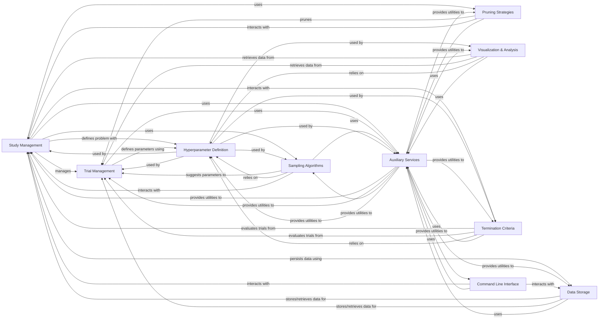

## Component Details

The Optuna framework is designed for hyperparameter optimization. Its main flow involves defining an optimization study, managing individual trials within that study, suggesting new hyperparameter values using various sampling algorithms, and pruning unpromising trials early. The system persists study and trial data through a flexible storage layer and provides extensive visualization and analysis tools. Auxiliary services support core functionalities, and a command-line interface allows for direct interaction with studies.

### Study Management
Manages the lifecycle of optimization studies, including creation, loading, deletion, and overall study attributes. It orchestrates the optimization process by interacting with samplers, pruners, and storage systems, and handles multi-objective and constrained optimization aspects.

**Related Classes/Methods**:

- <a href="https://github.com/optuna/optuna/blob/master/optuna/study/study.py#L66-L1163" target="_blank" rel="noopener noreferrer">`optuna.study.study.Study` (66:1163)</a>
- <a href="https://github.com/optuna/optuna/blob/master/optuna/study/study.py#L1178-L1316" target="_blank" rel="noopener noreferrer">`optuna.study.study.create_study` (1178:1316)</a>
- <a href="https://github.com/optuna/optuna/blob/master/optuna/study/study.py#L1329-L1407" target="_blank" rel="noopener noreferrer">`optuna.study.study.load_study` (1329:1407)</a>
- <a href="https://github.com/optuna/optuna/blob/master/optuna/study/study.py#L1418-L1467" target="_blank" rel="noopener noreferrer">`optuna.study.study.delete_study` (1418:1467)</a>
- <a href="https://github.com/optuna/optuna/blob/master/optuna/study/study.py#L1481-L1572" target="_blank" rel="noopener noreferrer">`optuna.study.study.copy_study` (1481:1572)</a>
- <a href="https://github.com/optuna/optuna/blob/master/optuna/study/study.py#L1575-L1672" target="_blank" rel="noopener noreferrer">`optuna.study.study.get_all_study_summaries` (1575:1672)</a>
- <a href="https://github.com/optuna/optuna/blob/master/optuna/study/_optimize.py#L35-L120" target="_blank" rel="noopener noreferrer">`optuna.study._optimize._optimize` (35:120)</a>
- <a href="https://github.com/optuna/optuna/blob/master/optuna/study/_multi_objective.py#L38-L41" target="_blank" rel="noopener noreferrer">`optuna.study._multi_objective._get_pareto_front_trials` (38:41)</a>
- <a href="https://github.com/optuna/optuna/blob/master/optuna/study/_constrained_optimization.py#L11-L27" target="_blank" rel="noopener noreferrer">`optuna.study._constrained_optimization._get_feasible_trials` (11:27)</a>
- <a href="https://github.com/optuna/optuna/blob/master/optuna/study/_tell.py#L82-L179" target="_blank" rel="noopener noreferrer">`optuna.study._tell._tell_with_warning` (82:179)</a>
- <a href="https://github.com/optuna/optuna/blob/master/optuna/study/_study_summary.py#L16-L123" target="_blank" rel="noopener noreferrer">`optuna.study._study_summary.StudySummary` (16:123)</a>
- <a href="https://github.com/optuna/optuna/blob/master/optuna/study/_study_direction.py#L4-L18" target="_blank" rel="noopener noreferrer">`optuna.study._study_direction.StudyDirection` (4:18)</a>
- <a href="https://github.com/optuna/optuna/blob/master/optuna/study/_frozen.py#L13-L89" target="_blank" rel="noopener noreferrer">`optuna.study._frozen.FrozenStudy` (13:89)</a>
- <a href="https://github.com/optuna/optuna/blob/master/optuna/study/_optimize.py#L123-L178" target="_blank" rel="noopener noreferrer">`optuna.study._optimize._optimize_sequential` (123:178)</a>
- <a href="https://github.com/optuna/optuna/blob/master/optuna/study/_optimize.py#L181-L254" target="_blank" rel="noopener noreferrer">`optuna.study._optimize._run_trial` (181:254)</a>
- <a href="https://github.com/optuna/optuna/blob/master/optuna/study/_tell.py#L23-L40" target="_blank" rel="noopener noreferrer">`optuna.study._tell._get_frozen_trial` (23:40)</a>
- <a href="https://github.com/optuna/optuna/blob/master/optuna/study/_tell.py#L43-L58" target="_blank" rel="noopener noreferrer">`optuna.study._tell._check_state_and_values` (43:58)</a>
- <a href="https://github.com/optuna/optuna/blob/master/optuna/study/_tell.py#L61-L79" target="_blank" rel="noopener noreferrer">`optuna.study._tell._check_values_are_feasible` (61:79)</a>
- <a href="https://github.com/optuna/optuna/blob/master/optuna/study/_multi_objective.py#L251-L258" target="_blank" rel="noopener noreferrer">`optuna.study._multi_objective._normalize_value` (251:258)</a>
- <a href="https://github.com/optuna/optuna/blob/master/optuna/study/_multi_objective.py#L44-L119" target="_blank" rel="noopener noreferrer">`optuna.study._multi_objective._fast_non_domination_rank` (44:119)</a>
- <a href="https://github.com/optuna/optuna/blob/master/optuna/study/_multi_objective.py#L156-L165" target="_blank" rel="noopener noreferrer">`optuna.study._multi_objective._is_pareto_front_for_unique_sorted` (156:165)</a>
- <a href="https://github.com/optuna/optuna/blob/master/optuna/study/_multi_objective.py#L168-L181" target="_blank" rel="noopener noreferrer">`optuna.study._multi_objective._is_pareto_front` (168:181)</a>
- <a href="https://github.com/optuna/optuna/blob/master/optuna/study/_multi_objective.py#L184-L216" target="_blank" rel="noopener noreferrer">`optuna.study._multi_objective._calculate_nondomination_rank` (184:216)</a>
- <a href="https://github.com/optuna/optuna/blob/master/optuna/study/_multi_objective.py#L219-L248" target="_blank" rel="noopener noreferrer">`optuna.study._multi_objective._dominates` (219:248)</a>
- <a href="https://github.com/optuna/optuna/blob/master/optuna/study/_dataframe.py#L92-L111" target="_blank" rel="noopener noreferrer">`optuna.study._dataframe._trials_dataframe` (92:111)</a>
- <a href="https://github.com/optuna/optuna/blob/master/optuna/study/_dataframe.py#L22-L83" target="_blank" rel="noopener noreferrer">`optuna.study._dataframe._create_records_and_aggregate_column` (22:83)</a>
- <a href="https://github.com/optuna/optuna/blob/master/optuna/study/_dataframe.py#L86-L89" target="_blank" rel="noopener noreferrer">`optuna.study._dataframe._flatten_columns` (86:89)</a>

### Trial Management
Handles individual optimization trials, providing methods for suggesting hyperparameter values, reporting intermediate results, and managing trial states. It serves as the interface for an objective function to interact with the Optuna study.

**Related Classes/Methods**:

- <a href="https://github.com/optuna/optuna/blob/master/optuna/trial/_frozen.py#L33-L479" target="_blank" rel="noopener noreferrer">`optuna.trial._frozen.FrozenTrial` (33:479)</a>
- <a href="https://github.com/optuna/optuna/blob/master/optuna/trial/_base.py#L17-L132" target="_blank" rel="noopener noreferrer">`optuna.trial._base.BaseTrial` (17:132)</a>
- <a href="https://github.com/optuna/optuna/blob/master/optuna/trial/_fixed.py#L24-L187" target="_blank" rel="noopener noreferrer">`optuna.trial._fixed.FixedTrial` (24:187)</a>
- <a href="https://github.com/optuna/optuna/blob/master/optuna/trial/_trial.py#L31-L757" target="_blank" rel="noopener noreferrer">`optuna.trial._trial.Trial` (31:757)</a>
- `optuna.trial.create_trial` (full file reference)
- <a href="https://github.com/optuna/optuna/blob/master/optuna/trial/_state.py#L4-L36" target="_blank" rel="noopener noreferrer">`optuna.trial._state.TrialState` (4:36)</a>
- `optuna.trial._lazy_trial_system_attrs._LazyTrialSystemAttrs` (full file reference)

### Sampling Algorithms
Implements various algorithms for suggesting new hyperparameter values for trials. This includes tree-structured Parzen estimators (TPE), CMA-ES, random search, grid search, Gaussian Process-based sampling, and NSGA-II/III for multi-objective optimization.

**Related Classes/Methods**:

- <a href="https://github.com/optuna/optuna/blob/master/optuna/samplers/_base.py#L21-L225" target="_blank" rel="noopener noreferrer">`optuna.samplers._base.BaseSampler` (21:225)</a>
- <a href="https://github.com/optuna/optuna/blob/master/optuna/samplers/_brute_force.py#L105-L271" target="_blank" rel="noopener noreferrer">`optuna.samplers._brute_force.BruteForceSampler` (105:271)</a>
- <a href="https://github.com/optuna/optuna/blob/master/optuna/samplers/_cmaes.py#L46-L641" target="_blank" rel="noopener noreferrer">`optuna.samplers._cmaes.CmaEsSampler` (46:641)</a>
- <a href="https://github.com/optuna/optuna/blob/master/optuna/samplers/_qmc.py#L33-L318" target="_blank" rel="noopener noreferrer">`optuna.samplers._qmc.QMCSampler` (33:318)</a>
- <a href="https://github.com/optuna/optuna/blob/master/optuna/samplers/_random.py#L18-L71" target="_blank" rel="noopener noreferrer">`optuna.samplers._random.RandomSampler` (18:71)</a>
- <a href="https://github.com/optuna/optuna/blob/master/optuna/samplers/_grid.py#L32-L286" target="_blank" rel="noopener noreferrer">`optuna.samplers._grid.GridSampler` (32:286)</a>
- <a href="https://github.com/optuna/optuna/blob/master/optuna/samplers/_gp/sampler.py#L57-L413" target="_blank" rel="noopener noreferrer">`optuna.samplers._gp.sampler.GPSampler` (57:413)</a>
- <a href="https://github.com/optuna/optuna/blob/master/optuna/samplers/_ga/_base.py#L13-L183" target="_blank" rel="noopener noreferrer">`optuna.samplers._ga._base.BaseGASampler` (13:183)</a>
- <a href="https://github.com/optuna/optuna/blob/master/optuna/samplers/_nsgaiii/_sampler.py#L40-L291" target="_blank" rel="noopener noreferrer">`optuna.samplers._nsgaiii._sampler.NSGAIIISampler` (40:291)</a>
- <a href="https://github.com/optuna/optuna/blob/master/optuna/samplers/nsgaii/_sampler.py#L29-L302" target="_blank" rel="noopener noreferrer">`optuna.samplers.nsgaii._sampler.NSGAIISampler` (29:302)</a>
- <a href="https://github.com/optuna/optuna/blob/master/optuna/samplers/_tpe/sampler.py#L65-L623" target="_blank" rel="noopener noreferrer">`optuna.samplers._tpe.sampler.TPESampler` (65:623)</a>
- <a href="https://github.com/optuna/optuna/blob/master/optuna/samplers/_brute_force.py#L29-L101" target="_blank" rel="noopener noreferrer">`optuna.samplers._brute_force._TreeNode` (29:101)</a>
- <a href="https://github.com/optuna/optuna/blob/master/optuna/samplers/_cmaes.py#L644-L648" target="_blank" rel="noopener noreferrer">`optuna.samplers._cmaes._is_compatible_search_space` (644:648)</a>
- <a href="https://github.com/optuna/optuna/blob/master/optuna/samplers/_qmc.py#L270-L295" target="_blank" rel="noopener noreferrer">`optuna.samplers._qmc.QMCSampler._sample_qmc` (270:295)</a>
- <a href="https://github.com/optuna/optuna/blob/master/optuna/samplers/_grid.py#L282-L286" target="_blank" rel="noopener noreferrer">`optuna.samplers._grid.GridSampler.is_exhausted` (282:286)</a>
- <a href="https://github.com/optuna/optuna/blob/master/optuna/samplers/_gp/sampler.py#L48-L53" target="_blank" rel="noopener noreferrer">`optuna.samplers._gp.sampler._standardize_values` (48:53)</a>
- <a href="https://github.com/optuna/optuna/blob/master/optuna/samplers/_nsgaiii/_elite_population_selection_strategy.py#L25-L101" target="_blank" rel="noopener noreferrer">`optuna.samplers._nsgaiii._elite_population_selection_strategy.NSGAIIIElitePopulationSelectionStrategy` (25:101)</a>
- <a href="https://github.com/optuna/optuna/blob/master/optuna/samplers/nsgaii/_elite_population_selection_strategy.py#L21-L60" target="_blank" rel="noopener noreferrer">`optuna.samplers.nsgaii._elite_population_selection_strategy.NSGAIIElitePopulationSelectionStrategy` (21:60)</a>
- <a href="https://github.com/optuna/optuna/blob/master/optuna/samplers/nsgaii/_crossover.py#L29-L80" target="_blank" rel="noopener noreferrer">`optuna.samplers.nsgaii._crossover:_try_crossover` (29:80)</a>
- <a href="https://github.com/optuna/optuna/blob/master/optuna/samplers/nsgaii/_child_generation_strategy.py#L21-L101" target="_blank" rel="noopener noreferrer">`optuna.samplers.nsgaii._child_generation_strategy.NSGAIIChildGenerationStrategy` (21:101)</a>
- <a href="https://github.com/optuna/optuna/blob/master/optuna/samplers/nsgaii/_constraints_evaluation.py#L15-L85" target="_blank" rel="noopener noreferrer">`optuna.samplers.nsgaii._constraints_evaluation._constrained_dominates` (15:85)</a>
- <a href="https://github.com/optuna/optuna/blob/master/optuna/samplers/nsgaii/_after_trial_strategy.py#L16-L35" target="_blank" rel="noopener noreferrer">`optuna.samplers.nsgaii._after_trial_strategy.NSGAIIAfterTrialStrategy` (16:35)</a>
- <a href="https://github.com/optuna/optuna/blob/master/optuna/samplers/nsgaii/_crossovers/_undx.py#L16-L115" target="_blank" rel="noopener noreferrer">`optuna.samplers.nsgaii._crossovers._undx.UNDXCrossover` (16:115)</a>
- <a href="https://github.com/optuna/optuna/blob/master/optuna/samplers/_tpe/_truncnorm.py#L72-L74" target="_blank" rel="noopener noreferrer">`optuna.samplers._tpe._truncnorm:_ndtr` (72:74)</a>
- <a href="https://github.com/optuna/optuna/blob/master/optuna/samplers/_tpe/probability_distributions.py#L37-L122" target="_blank" rel="noopener noreferrer">`optuna.samplers._tpe.probability_distributions._MixtureOfProductDistribution` (37:122)</a>
- <a href="https://github.com/optuna/optuna/blob/master/optuna/samplers/_tpe/parzen_estimator.py#L34-L277" target="_blank" rel="noopener noreferrer">`optuna.samplers._tpe.parzen_estimator._ParzenEstimator` (34:277)</a>
- <a href="https://github.com/optuna/optuna/blob/master/optuna/samplers/_tpe/_erf.py#L108-L185" target="_blank" rel="noopener noreferrer">`optuna.samplers._tpe._erf.erf` (108:185)</a>
- <a href="https://github.com/optuna/optuna/blob/master/optuna/samplers/_lazy_random_state.py#L6-L27" target="_blank" rel="noopener noreferrer">`optuna.samplers._lazy_random_state.LazyRandomState` (6:27)</a>

### Pruning Strategies
Implements various strategies to stop unpromising trials early during optimization, saving computational resources. This includes Successive Halving, Median, Hyperband, and Threshold pruners.

**Related Classes/Methods**:

- <a href="https://github.com/optuna/optuna/blob/master/optuna/pruners/_successive_halving.py#L11-L214" target="_blank" rel="noopener noreferrer">`optuna.pruners._successive_halving.SuccessiveHalvingPruner` (11:214)</a>
- <a href="https://github.com/optuna/optuna/blob/master/optuna/pruners/_threshold.py#L24-L138" target="_blank" rel="noopener noreferrer">`optuna.pruners._threshold.ThresholdPruner` (24:138)</a>
- <a href="https://github.com/optuna/optuna/blob/master/optuna/pruners/_median.py#L4-L86" target="_blank" rel="noopener noreferrer">`optuna.pruners._median.MedianPruner` (4:86)</a>
- <a href="https://github.com/optuna/optuna/blob/master/optuna/pruners/_hyperband.py#L17-L324" target="_blank" rel="noopener noreferrer">`optuna.pruners._hyperband.HyperbandPruner` (17:324)</a>
- <a href="https://github.com/optuna/optuna/blob/master/optuna/pruners/_percentile.py#L70-L208" target="_blank" rel="noopener noreferrer">`optuna.pruners._percentile.PercentilePruner` (70:208)</a>

### Data Storage
Manages the persistence and retrieval of Optuna study and trial data. It supports various backends including in-memory, relational databases (RDB), journal files, Redis, and gRPC for distributed storage.

**Related Classes/Methods**:

- <a href="https://github.com/optuna/optuna/blob/master/optuna/storages/_base.py#L21-L625" target="_blank" rel="noopener noreferrer">`optuna.storages._base.BaseStorage` (21:625)</a>
- `optuna.storages.get_storage` (full file reference)
- <a href="https://github.com/optuna/optuna/blob/master/optuna/storages/_in_memory.py#L26-L414" target="_blank" rel="noopener noreferrer">`optuna.storages._in_memory.InMemoryStorage` (26:414)</a>
- <a href="https://github.com/optuna/optuna/blob/master/optuna/storages/_rdb/storage.py#L103-L1028" target="_blank" rel="noopener noreferrer">`optuna.storages._rdb.storage.RDBStorage` (103:1028)</a>
- <a href="https://github.com/optuna/optuna/blob/master/optuna/storages/_grpc/client.py#L46-L375" target="_blank" rel="noopener noreferrer">`optuna.storages._grpc.client.GrpcStorageProxy` (46:375)</a>
- <a href="https://github.com/optuna/optuna/blob/master/optuna/storages/journal/_storage.py#L51-L380" target="_blank" rel="noopener noreferrer">`optuna.storages.journal._storage.JournalStorage` (51:380)</a>
- <a href="https://github.com/optuna/optuna/blob/master/optuna/storages/_heartbeat.py#L73-L91" target="_blank" rel="noopener noreferrer">`optuna.storages._heartbeat.BaseHeartbeatThread` (73:91)</a>
- <a href="https://github.com/optuna/optuna/blob/master/optuna/storages/_cached_storage.py#L34-L279" target="_blank" rel="noopener noreferrer">`optuna.storages._cached_storage._CachedStorage` (34:279)</a>
- <a href="https://github.com/optuna/optuna/blob/master/optuna/storages/_callbacks.py#L12-L121" target="_blank" rel="noopener noreferrer">`optuna.storages._callbacks.RetryFailedTrialCallback` (12:121)</a>
- <a href="https://github.com/optuna/optuna/blob/master/optuna/storages/_rdb/models.py#L55-L89" target="_blank" rel="noopener noreferrer">`optuna.storages._rdb.models.StudyModel` (55:89)</a>
- <a href="https://github.com/optuna/optuna/blob/master/optuna/storages/_grpc/servicer.py#L35-L342" target="_blank" rel="noopener noreferrer">`optuna.storages._grpc.servicer.OptunaStorageProxyService` (35:342)</a>
- <a href="https://github.com/optuna/optuna/blob/master/optuna/storages/_grpc/server.py#L27-L35" target="_blank" rel="noopener noreferrer">`optuna.storages._grpc.server:make_server` (27:35)</a>
- <a href="https://github.com/optuna/optuna/blob/master/optuna/storages/journal/_redis.py#L19-L100" target="_blank" rel="noopener noreferrer">`optuna.storages.journal._redis.JournalRedisBackend` (19:100)</a>
- <a href="https://github.com/optuna/optuna/blob/master/optuna/storages/journal/_file.py#L22-L109" target="_blank" rel="noopener noreferrer">`optuna.storages.journal._file.JournalFileBackend` (22:109)</a>

### Hyperparameter Definition
Defines the types and ranges of hyperparameters that can be optimized, including float, integer, and categorical distributions. It also provides utilities for converting between JSON representations and distribution objects.

**Related Classes/Methods**:

- <a href="https://github.com/optuna/optuna/blob/master/optuna/distributions.py#L31-L106" target="_blank" rel="noopener noreferrer">`optuna.distributions.BaseDistribution` (31:106)</a>
- <a href="https://github.com/optuna/optuna/blob/master/optuna/distributions.py#L109-L205" target="_blank" rel="noopener noreferrer">`optuna.distributions.FloatDistribution` (109:205)</a>
- <a href="https://github.com/optuna/optuna/blob/master/optuna/distributions.py#L318-L408" target="_blank" rel="noopener noreferrer">`optuna.distributions.IntDistribution` (318:408)</a>
- <a href="https://github.com/optuna/optuna/blob/master/optuna/distributions.py#L486-L566" target="_blank" rel="noopener noreferrer">`optuna.distributions.CategoricalDistribution` (486:566)</a>
- <a href="https://github.com/optuna/optuna/blob/master/optuna/distributions.py#L581-L622" target="_blank" rel="noopener noreferrer">`optuna.distributions.json_to_distribution` (581:622)</a>
- <a href="https://github.com/optuna/optuna/blob/master/optuna/distributions.py#L625-L636" target="_blank" rel="noopener noreferrer">`optuna.distributions.distribution_to_json` (625:636)</a>

### Visualization & Analysis
Provides a comprehensive suite of functions to generate various plots for analyzing optimization results, including slice plots, rank plots, intermediate value plots, parallel coordinate plots, parameter importance plots, Pareto front plots, optimization history, hypervolume history, contour plots, ECDF plots, terminator improvement plots, and timeline plots, supporting both Plotly and Matplotlib backends. It also calculates the importance of hyperparameters in a study, helping users understand which parameters have the most significant impact on the optimization objective.

**Related Classes/Methods**:

- <a href="https://github.com/optuna/optuna/blob/master/optuna/visualization/_slice.py#L143-L173" target="_blank" rel="noopener noreferrer">`optuna.visualization._slice:plot_slice` (143:173)</a>
- <a href="https://github.com/optuna/optuna/blob/master/optuna/visualization/_rank.py#L66-L100" target="_blank" rel="noopener noreferrer">`optuna.visualization._rank:plot_rank` (66:100)</a>
- <a href="https://github.com/optuna/optuna/blob/master/optuna/visualization/_intermediate_values.py#L56-L69" target="_blank" rel="noopener noreferrer">`optuna.visualization._intermediate_values:plot_intermediate_values` (56:69)</a>
- <a href="https://github.com/optuna/optuna/blob/master/optuna/visualization/_parallel_coordinate.py#L50-L85" target="_blank" rel="noopener noreferrer">`optuna.visualization._parallel_coordinate:plot_parallel_coordinate` (50:85)</a>
- <a href="https://github.com/optuna/optuna/blob/master/optuna/visualization/_param_importances.py#L113-L169" target="_blank" rel="noopener noreferrer">`optuna.visualization._param_importances:plot_param_importances` (113:169)</a>
- <a href="https://github.com/optuna/optuna/blob/master/optuna/visualization/_pareto_front.py#L37-L106" target="_blank" rel="noopener noreferrer">`optuna.visualization._pareto_front:plot_pareto_front` (37:106)</a>
- <a href="https://github.com/optuna/optuna/blob/master/optuna/visualization/_optimization_history.py#L172-L203" target="_blank" rel="noopener noreferrer">`optuna.visualization._optimization_history:plot_optimization_history` (172:203)</a>
- <a href="https://github.com/optuna/optuna/blob/master/optuna/visualization/_hypervolume_history.py#L30-L63" target="_blank" rel="noopener noreferrer">`optuna.visualization._hypervolume_history:plot_hypervolume_history` (30:63)</a>
- <a href="https://github.com/optuna/optuna/blob/master/optuna/visualization/_contour.py#L66-L101" target="_blank" rel="noopener noreferrer">`optuna.visualization._contour:plot_contour` (66:101)</a>
- <a href="https://github.com/optuna/optuna/blob/master/optuna/visualization/_edf.py#L38-L98" target="_blank" rel="noopener noreferrer">`optuna.visualization._edf:plot_edf` (38:98)</a>
- <a href="https://github.com/optuna/optuna/blob/master/optuna/visualization/_terminator_improvement.py#L38-L80" target="_blank" rel="noopener noreferrer">`optuna.visualization._terminator_improvement:plot_terminator_improvement` (38:80)</a>
- <a href="https://github.com/optuna/optuna/blob/master/optuna/visualization/_timeline.py#L33-L57" target="_blank" rel="noopener noreferrer">`optuna.visualization._timeline:plot_timeline` (33:57)</a>
- `optuna.importance.get_param_importances` (full file reference)
- <a href="https://github.com/optuna/optuna/blob/master/optuna/importance/_mean_decrease_impurity.py#L24-L95" target="_blank" rel="noopener noreferrer">`optuna.importance._mean_decrease_impurity.MeanDecreaseImpurityImportanceEvaluator` (24:95)</a>
- <a href="https://github.com/optuna/optuna/blob/master/optuna/importance/_fanova/_evaluator.py#L20-L132" target="_blank" rel="noopener noreferrer">`optuna.importance._fanova._evaluator.FanovaImportanceEvaluator` (20:132)</a>
- <a href="https://github.com/optuna/optuna/blob/master/optuna/importance/_ped_anova/evaluator.py#L62-L227" target="_blank" rel="noopener noreferrer">`optuna.importance._ped_anova.evaluator.PedAnovaImportanceEvaluator` (62:227)</a>
- <a href="https://github.com/optuna/optuna/blob/master/optuna/visualization/_utils.py#L26-L40" target="_blank" rel="noopener noreferrer">`optuna.visualization._utils:is_available` (26:40)</a>
- <a href="https://github.com/optuna/optuna/blob/master/optuna/visualization/matplotlib/_slice.py#L27-L59" target="_blank" rel="noopener noreferrer">`optuna.visualization.matplotlib._slice:plot_slice` (27:59)</a>

### Termination Criteria
Provides mechanisms for early stopping of optimization based on convergence criteria, utilizing regret bound evaluation and error evaluation strategies.

**Related Classes/Methods**:

- <a href="https://github.com/optuna/optuna/blob/master/optuna/terminator/callback.py#L15-L73" target="_blank" rel="noopener noreferrer">`optuna.terminator.callback.TerminatorCallback` (15:73)</a>
- <a href="https://github.com/optuna/optuna/blob/master/optuna/terminator/terminator.py#L26-L136" target="_blank" rel="noopener noreferrer">`optuna.terminator.terminator.Terminator` (26:136)</a>
- <a href="https://github.com/optuna/optuna/blob/master/optuna/terminator/erroreval.py#L109-L129" target="_blank" rel="noopener noreferrer">`optuna.terminator.erroreval.StaticErrorEvaluator` (109:129)</a>
- <a href="https://github.com/optuna/optuna/blob/master/optuna/terminator/erroreval.py#L31-L85" target="_blank" rel="noopener noreferrer">`optuna.terminator.erroreval.CrossValidationErrorEvaluator` (31:85)</a>
- <a href="https://github.com/optuna/optuna/blob/master/optuna/terminator/improvement/evaluator.py#L115-L211" target="_blank" rel="noopener noreferrer">`optuna.terminator.improvement.evaluator.RegretBoundEvaluator` (115:211)</a>
- <a href="https://github.com/optuna/optuna/blob/master/optuna/terminator/improvement/evaluator.py#L215-L257" target="_blank" rel="noopener noreferrer">`optuna.terminator.improvement.evaluator.BestValueStagnationEvaluator` (215:257)</a>
- <a href="https://github.com/optuna/optuna/blob/master/optuna/terminator/improvement/emmr.py#L43-L272" target="_blank" rel="noopener noreferrer">`optuna.terminator.improvement.emmr.EMMREvaluator` (43:272)</a>

### Auxiliary Services
Provides foundational utility functions for managing experimental features, deprecation warnings, deferred imports, logging, data transformations, and artifact storage. It also includes functionalities for managing hyperparameter search space definitions, Gaussian Process (GP) related calculations, and hypervolume computations for multi-objective optimization.

**Related Classes/Methods**:

- <a href="https://github.com/optuna/optuna/blob/master/optuna/_experimental.py#L52-L88" target="_blank" rel="noopener noreferrer">`optuna._experimental:experimental_func` (52:88)</a>
- <a href="https://github.com/optuna/optuna/blob/master/optuna/_deprecated.py#L55-L119" target="_blank" rel="noopener noreferrer">`optuna._deprecated:deprecated_func` (55:119)</a>
- <a href="https://github.com/optuna/optuna/blob/master/optuna/_imports.py#L97-L104" target="_blank" rel="noopener noreferrer">`optuna._imports:try_import` (97:104)</a>
- <a href="https://github.com/optuna/optuna/blob/master/optuna/logging.py#L96-L103" target="_blank" rel="noopener noreferrer">`optuna.logging:get_logger` (96:103)</a>
- <a href="https://github.com/optuna/optuna/blob/master/optuna/_transform.py#L14-L168" target="_blank" rel="noopener noreferrer">`optuna._transform._SearchSpaceTransform` (14:168)</a>
- <a href="https://github.com/optuna/optuna/blob/master/optuna/search_space/group_decomposed.py#L40-L66" target="_blank" rel="noopener noreferrer">`optuna.search_space.group_decomposed._GroupDecomposedSearchSpace` (40:66)</a>
- <a href="https://github.com/optuna/optuna/blob/master/optuna/search_space/intersection.py#L58-L115" target="_blank" rel="noopener noreferrer">`optuna.search_space.intersection.IntersectionSearchSpace` (58:115)</a>
- <a href="https://github.com/optuna/optuna/blob/master/optuna/_gp/gp.py#L93-L110" target="_blank" rel="noopener noreferrer">`optuna._gp.gp:kernel` (93:110)</a>
- <a href="https://github.com/optuna/optuna/blob/master/optuna/_gp/acqf.py#L292-L331" target="_blank" rel="noopener noreferrer">`optuna._gp.acqf:eval_acqf` (292:331)</a>
- <a href="https://github.com/optuna/optuna/blob/master/optuna/_gp/optim_mixed.py#L273-L330" target="_blank" rel="noopener noreferrer">`optuna._gp.optim_mixed:optimize_acqf_mixed` (273:330)</a>
- <a href="https://github.com/optuna/optuna/blob/master/optuna/_gp/search_space.py#L118-L152" target="_blank" rel="noopener noreferrer">`optuna._gp.search_space:get_search_space_and_normalized_params` (118:152)</a>
- <a href="https://github.com/optuna/optuna/blob/master/optuna/_hypervolume/wfg.py#L124-L193" target="_blank" rel="noopener noreferrer">`optuna._hypervolume.wfg:compute_hypervolume` (124:193)</a>
- <a href="https://github.com/optuna/optuna/blob/master/optuna/artifacts/_upload.py#L55-L116" target="_blank" rel="noopener noreferrer">`optuna.artifacts._upload:upload_artifact` (55:116)</a>
- <a href="https://github.com/optuna/optuna/blob/master/optuna/artifacts/_filesystem.py#L15-L72" target="_blank" rel="noopener noreferrer">`optuna.artifacts._filesystem.FileSystemArtifactStore` (15:72)</a>
- <a href="https://github.com/optuna/optuna/blob/master/optuna/artifacts/_gcs.py#L19-L87" target="_blank" rel="noopener noreferrer">`optuna.artifacts._gcs.GCSArtifactStore` (19:87)</a>
- <a href="https://github.com/optuna/optuna/blob/master/optuna/artifacts/_boto3.py#L21-L93" target="_blank" rel="noopener noreferrer">`optuna.artifacts._boto3.Boto3ArtifactStore` (21:93)</a>
- <a href="https://github.com/optuna/optuna/blob/master/optuna/_convert_positional_args.py#L49-L139" target="_blank" rel="noopener noreferrer">`optuna._convert_positional_args:convert_positional_args` (49:139)</a>
- <a href="https://github.com/optuna/optuna/blob/master/optuna/progress_bar.py#L32-L125" target="_blank" rel="noopener noreferrer">`optuna.progress_bar._ProgressBar` (32:125)</a>
- <a href="https://github.com/optuna/optuna/blob/master/optuna/_gp/prior.py#L19-L36" target="_blank" rel="noopener noreferrer">`optuna._gp.prior:default_log_prior` (19:36)</a>
- <a href="https://github.com/optuna/optuna/blob/master/optuna/_gp/optim_sample.py#L9-L20" target="_blank" rel="noopener noreferrer">`optuna._gp.optim_sample:optimize_acqf_sample` (9:20)</a>
- <a href="https://github.com/optuna/optuna/blob/master/optuna/_hypervolume/hssp.py#L43-L77" target="_blank" rel="noopener noreferrer">`optuna._hypervolume.hssp:_lazy_contribs_update` (43:77)</a>
- <a href="https://github.com/optuna/optuna/blob/master/optuna/_hypervolume/box_decomposition.py#L31-L94" target="_blank" rel="noopener noreferrer">`optuna._hypervolume.box_decomposition:_get_upper_bound_set` (31:94)</a>
- <a href="https://github.com/optuna/optuna/blob/master/optuna/artifacts/_backoff.py#L19-L109" target="_blank" rel="noopener noreferrer">`optuna.artifacts._backoff.Backoff` (19:109)</a>
- <a href="https://github.com/optuna/optuna/blob/master/optuna/artifacts/_list_artifact_meta.py#L13-L98" target="_blank" rel="noopener noreferrer">`optuna.artifacts._list_artifact_meta:get_all_artifact_meta` (13:98)</a>

### Command Line Interface
Provides command-line utilities for interacting with Optuna studies, allowing users to create, delete, manage, and inspect studies and trials directly from the terminal.

**Related Classes/Methods**:

- <a href="https://github.com/optuna/optuna/blob/master/optuna/cli.py#L979-L1007" target="_blank" rel="noopener noreferrer">`optuna.cli.main` (979:1007)</a>
- <a href="https://github.com/optuna/optuna/blob/master/optuna/cli.py#L307-L352" target="_blank" rel="noopener noreferrer">`optuna.cli._CreateStudy` (307:352)</a>
- <a href="https://github.com/optuna/optuna/blob/master/optuna/cli.py#L355-L365" target="_blank" rel="noopener noreferrer">`optuna.cli._DeleteStudy` (355:365)</a>
- <a href="https://github.com/optuna/optuna/blob/master/optuna/cli.py#L368-L388" target="_blank" rel="noopener noreferrer">`optuna.cli._StudySetUserAttribute` (368:388)</a>
- <a href="https://github.com/optuna/optuna/blob/master/optuna/cli.py#L391-L412" target="_blank" rel="noopener noreferrer">`optuna.cli._StudyNames` (391:412)</a>
- <a href="https://github.com/optuna/optuna/blob/master/optuna/cli.py#L415-L467" target="_blank" rel="noopener noreferrer">`optuna.cli._Studies` (415:467)</a>
- <a href="https://github.com/optuna/optuna/blob/master/optuna/cli.py#L470-L517" target="_blank" rel="noopener noreferrer">`optuna.cli._Trials` (470:517)</a>
- <a href="https://github.com/optuna/optuna/blob/master/optuna/cli.py#L520-L570" target="_blank" rel="noopener noreferrer">`optuna.cli._BestTrial` (520:570)</a>
- <a href="https://github.com/optuna/optuna/blob/master/optuna/cli.py#L573-L622" target="_blank" rel="noopener noreferrer">`optuna.cli._BestTrials` (573:622)</a>
- <a href="https://github.com/optuna/optuna/blob/master/optuna/cli.py#L625-L652" target="_blank" rel="noopener noreferrer">`optuna.cli._StorageUpgrade` (625:652)</a>
- <a href="https://github.com/optuna/optuna/blob/master/optuna/cli.py#L655-L757" target="_blank" rel="noopener noreferrer">`optuna.cli._Ask` (655:757)</a>
- <a href="https://github.com/optuna/optuna/blob/master/optuna/cli.py#L760-L811" target="_blank" rel="noopener noreferrer">`optuna.cli._Tell` (760:811)</a>

### [FAQ](https://github.com/CodeBoarding/GeneratedOnBoardings/tree/main?tab=readme-ov-file#faq)