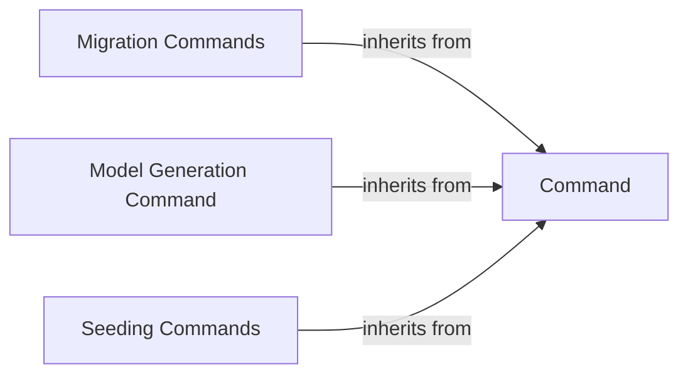

## Details

The CLI Interface subsystem encompasses all command-line functionalities provided by Orator, primarily focusing on administrative tasks such as database migrations, model generation, and data seeding. Its core is built around a foundational Command abstraction, which specific command implementations extend.

### Command
The abstract base class for all command-line interface operations. It defines the common interface, execution lifecycle, and provides utility methods for all concrete commands. This component is central as it establishes the architectural pattern for extending CLI functionality.

**Related Classes/Methods**:

- <a href="https://github.com/sdispater/orator/blob/0.9/orator/commands/command.py" target="_blank" rel="noopener noreferrer">`orator.commands.command`</a>

### Migration Commands
A specialized group of commands dedicated to managing the database schema. This includes operations like creating new migration files, running pending migrations, rolling back changes, resetting the database, and checking migration status. It's crucial for an ORM to manage schema evolution.

**Related Classes/Methods**:

- <a href="https://github.com/sdispater/orator/blob/0.9/orator/commands/migrations/__init__.py" target="_blank" rel="noopener noreferrer">`orator.commands.migrations`</a>

### Model Generation Command
A command responsible for automating the creation of new ORM model files. This streamlines the development process by providing a standardized way to scaffold data entities, aligning with the ActiveRecord pattern where models are central.

**Related Classes/Methods**:

- <a href="https://github.com/sdispater/orator/blob/0.9/orator/commands/models/make_command.py" target="_blank" rel="noopener noreferrer">`orator.commands.models.make_command`</a>

### Seeding Commands
A set of commands designed for populating database tables with initial or test data. This includes executing existing seeders and generating new seeder files, which is vital for development, testing, and initial application setup.

**Related Classes/Methods**:

- <a href="https://github.com/sdispater/orator/blob/0.9/orator/commands/seeds/__init__.py" target="_blank" rel="noopener noreferrer">`orator.commands.seeds`</a>

### [FAQ](https://github.com/CodeBoarding/GeneratedOnBoardings/tree/main?tab=readme-ov-file#faq)