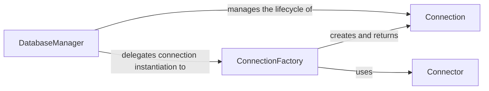

## Details

The database subsystem of orator is structured around a DatabaseManager that serves as the primary interface for managing database connections. This manager orchestrates the connection lifecycle and delegates the complex task of instantiating various connection types to a ConnectionFactory. The ConnectionFactory, in turn, leverages specific Connector implementations to establish low-level connections with different database systems and then constructs Connection objects, which provide the high-level interface for executing database operations. This clear separation of responsibilities, with Connector and Connection residing in their own dedicated modules, ensures a modular and extensible architecture for database interactions. The correction of file references for 'Connector' and 'Connection' confirms their independence and modularity, alleviating concerns about tight coupling.

### DatabaseManager
Acts as the central facade and registry for all database connections. It manages connection configurations, provides methods to obtain, disconnect, and reconnect to specific database instances, and orchestrates the overall connection lifecycle. It's the primary entry point for the application to interact with the database layer.

**Related Classes/Methods**:

- <a href="https://github.com/sdispater/orator/blob/0.9/orator/database_manager.py" target="_blank" rel="noopener noreferrer">`database_manager`</a>

### ConnectionFactory
A factory component dedicated to instantiating various types of database connections (e.g., single connections, read/write split connections) based on provided configurations. It abstracts the complexity of creating the correct Connection and Connector instances, ensuring the appropriate low-level connection mechanism is used.

**Related Classes/Methods**:

- <a href="https://github.com/sdispater/orator/blob/0.9/orator/connectors/connection_factory.py" target="_blank" rel="noopener noreferrer">`connection_factory`</a>

### Connector
Defines the abstract interface for connecting to a specific database system. Concrete implementations handle the low-level details of establishing a connection using native database drivers (e.g., psycopg2 for PostgreSQL, PyMySQL for MySQL, sqlite3 for SQLite). They also include logic for detecting database platform versions.

**Related Classes/Methods**:

- <a href="https://github.com/sdispater/orator/blob/0.9/orator/database_manager.py#L138-L139" target="_blank" rel="noopener noreferrer">`connector`:138-139</a>

### Connection
Represents an active database connection. It provides the primary interface for executing raw SQL queries (select, insert, update, delete), managing transactions (begin, commit, rollback), and integrating with query and schema grammars to prepare and process SQL statements. It acts as the direct conduit for database operations.

**Related Classes/Methods**:

- <a href="https://github.com/sdispater/orator/blob/0.9/orator/database_manager.py" target="_blank" rel="noopener noreferrer">`connection`</a>

### [FAQ](https://github.com/CodeBoarding/GeneratedOnBoardings/tree/main?tab=readme-ov-file#faq)