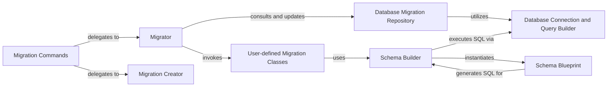

## Details

The Orator migration subsystem provides a robust framework for managing database schema changes. At its core, the Migrator orchestrates the entire migration lifecycle, interacting with the Database Migration Repository to track executed migrations and invoking User-defined Migration Classes to apply or rollback schema changes. Users interact with this system primarily through Migration Commands, which serve as the CLI interface, delegating tasks to either the Migrator or the Migration Creator for generating new migration files. Within the user-defined migration scripts, the Schema Builder offers a fluent API for defining schema modifications, which are then translated into database-specific SQL by the Schema Blueprint. All database interactions, from managing migration records to executing schema changes, are ultimately handled by the Database Connection and Query Builder. This architecture ensures a clear separation of concerns, facilitating both automated and manual management of database migrations.

### Migrator
The primary orchestrator of the migration lifecycle. Discovers, orders, and executes database migrations (calling up() or down() methods). Manages the overall migration process, including applying, rolling back, and resetting migrations.

**Related Classes/Methods**:

- <a href="https://github.com/sdispater/orator/blob/0.9/orator/migrations/migrator.py" target="_blank" rel="noopener noreferrer">`orator.migrations.migrator`</a>

### Database Migration Repository
Manages the persistent state of executed migrations. Manages the migrations table in the database, which tracks which migrations have been run. It logs executed migrations, retrieves the history, and deletes records upon rollback.

**Related Classes/Methods**:

- <a href="https://github.com/sdispater/orator/blob/0.9/orator/migrations/database_migration_repository.py" target="_blank" rel="noopener noreferrer">`orator.migrations.database_migration_repository`</a>

### Migration Creator
Generates new migration files from a predefined template, facilitating the creation of new schema change scripts for developers.

**Related Classes/Methods**:

- <a href="https://github.com/sdispater/orator/blob/0.9/orator/migrations/migration_creator.py" target="_blank" rel="noopener noreferrer">`orator.migrations.migration_creator`</a>

### Migration Commands
Provides the command-line interface (CLI) for users to interact with the migration system. It parses user arguments and dispatches appropriate actions to the Migrator or Migration Creator.

**Related Classes/Methods**:

- <a href="https://github.com/sdispater/orator/blob/0.9/orator/commands/migrations" target="_blank" rel="noopener noreferrer">`orator.commands.migrations`</a>

### Schema Builder
Offers a high-level, fluent API for defining and executing database schema operations (e.g., creating, altering, dropping tables, adding columns). It acts as an entry point for schema modifications within migration scripts.

**Related Classes/Methods**:

- <a href="https://github.com/sdispater/orator/blob/0.9/orator/schema/builder.py" target="_blank" rel="noopener noreferrer">`orator.schema.builder`</a>

### Schema Blueprint
Represents a table schema definition. It allows programmatic definition of columns, indexes, and foreign keys, and is responsible for translating these definitions into executable SQL statements specific to the database dialect.

**Related Classes/Methods**:

- <a href="https://github.com/sdispater/orator/blob/0.9/orator/schema/blueprint.py" target="_blank" rel="noopener noreferrer">`orator.schema.blueprint`</a>

### User-defined Migration Classes
Custom classes written by application developers. Each class defines a specific database schema change through its up() method (for applying the change) and down() method (for reversing it). These classes are external to the Orator framework's core source code.

**Related Classes/Methods**: _None_

### Database Connection and Query Builder
Provides the fundamental capabilities for establishing database connections, executing raw SQL queries, and building complex queries.

**Related Classes/Methods**:

- <a href="https://github.com/sdispater/orator/blob/0.9/orator/connections/connection.py" target="_blank" rel="noopener noreferrer">`orator.connections.connection`</a>
- <a href="https://github.com/sdispater/orator/blob/0.9/orator/query/builder.py" target="_blank" rel="noopener noreferrer">`orator.query.builder`</a>

### [FAQ](https://github.com/CodeBoarding/GeneratedOnBoardings/tree/main?tab=readme-ov-file#faq)