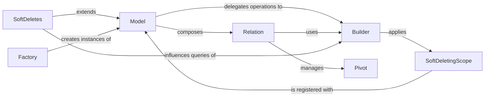

## Details

The `ORM Core` subsystem in Orator is the heart of its ActiveRecord implementation, providing the foundational components for object-relational mapping, data persistence, and business logic encapsulation.

### Model
The cornerstone of the ActiveRecord pattern, representing a single database record and encapsulating business logic. It provides an object-oriented interface for CRUD operations, attribute management, and lifecycle events. It serves as the primary interface for application logic to interact with the database.

**Related Classes/Methods**:

- <a href="https://github.com/sdispater/orator/blob/0.9/orator/orm/model.py" target="_blank" rel="noopener noreferrer">`orator.orm.model.Model`</a>

### Builder
Implements the Query Builder pattern, providing a fluent API to construct complex database queries. It translates high-level ORM operations into executable database queries, abstracting the underlying SQL.

**Related Classes/Methods**:

- <a href="https://github.com/sdispater/orator/blob/0.9/orator/orm/builder.py" target="_blank" rel="noopener noreferrer">`orator.orm.builder.Builder`</a>

### Relation
Defines and manages the logic for various types of relationships between Model instances (e.g., one-to-one, one-to-many, many-to-many). This is fundamental for navigating and querying interconnected data within the ORM.

**Related Classes/Methods**:

- <a href="https://github.com/sdispater/orator/blob/0.9/orator/orm/relations/relation.py" target="_blank" rel="noopener noreferrer">`orator.orm.relations.relation.Relation`</a>

### SoftDeletes
A mixin providing soft deletion functionality to `Model` instances. It modifies the behavior of models to mark records as deleted rather than physically removing them from the database.

**Related Classes/Methods**:

- <a href="https://github.com/sdispater/orator/blob/0.9/orator/orm/mixins/soft_deletes.py#L6-L140" target="_blank" rel="noopener noreferrer">`orator.orm.mixins.soft_deletes.SoftDeletes`:6-140</a>

### SoftDeletingScope
Applies common query constraints for soft deletion. It automatically filters out soft-deleted records from queries unless explicitly requested, ensuring consistent data retrieval.

**Related Classes/Methods**:

- <a href="https://github.com/sdispater/orator/blob/0.9/orator/orm/scopes/soft_deleting.py#L6-L141" target="_blank" rel="noopener noreferrer">`orator.orm.scopes.soft_deleting.SoftDeletingScope`:6-141</a>

### Factory
Provides a structured mechanism for creating model instances, often used for seeding databases or generating test data. It abstracts the instantiation process, allowing for consistent and repeatable model creation.

**Related Classes/Methods**:

- <a href="https://github.com/sdispater/orator/blob/0.9/orator/orm/factory.py" target="_blank" rel="noopener noreferrer">`orator.orm.factory.Factory`</a>

### Pivot
A specialized `Model` subclass that handles intermediate table data for many-to-many relationships. It represents the "pivot" table that links two related models.

**Related Classes/Methods**:

- <a href="https://github.com/sdispater/orator/blob/0.9/orator/orm/relations/pivot.py#L6-L120" target="_blank" rel="noopener noreferrer">`orator.orm.relations.pivot.Pivot`:6-120</a>

### [FAQ](https://github.com/CodeBoarding/GeneratedOnBoardings/tree/main?tab=readme-ov-file#faq)