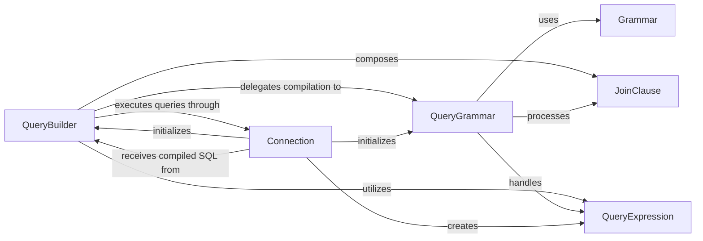

## Details

The Orator query subsystem provides a robust and extensible framework for database interaction. At its core, the `Connection` component establishes and manages the database link, serving as the primary interface for initiating queries. It instantiates `QueryBuilder` objects, which offer a fluent API for constructing complex SQL statements in an abstract manner. The `QueryBuilder` then delegates the translation of these abstract queries into concrete, database-specific SQL to the `QueryGrammar`. This separation of concerns allows for database-agnostic query construction while enabling specialized SQL generation for different database systems. Helper components like `JoinClause` and `QueryExpression` facilitate the definition of complex query parts and the inclusion of raw SQL, respectively. The `Grammar` utility class provides foundational SQL formatting capabilities, ensuring consistency across the query compilation process. This architecture promotes modularity, testability, and adaptability to various database backends.

### QueryBuilder
The central component for constructing database queries. It provides a fluent API for building various SQL queries (SELECT, INSERT, UPDATE, DELETE) in a database-agnostic manner. It manages the internal representation of the query and its associated bindings.

**Related Classes/Methods**: _None_

### QueryGrammar
Responsible for translating the abstract query structure generated by the `QueryBuilder` into concrete, database-specific SQL syntax. It handles the nuances of different database dialects.

**Related Classes/Methods**: _None_

### JoinClause
Manages the specific logic and conditions for complex SQL JOIN operations within a query, used by the `QueryBuilder`.

**Related Classes/Methods**: _None_

### QueryExpression
Allows embedding raw SQL snippets directly into the query without modification, providing flexibility for advanced or database-specific operations.

**Related Classes/Methods**: _None_

### Connection
Represents an active database connection and is responsible for the actual execution of the compiled SQL queries against the database. It also initializes `QueryBuilder` and `QueryGrammar` instances.

**Related Classes/Methods**: _None_

### Grammar
Provides common SQL string manipulation utilities, such as wrapping identifiers or formatting lists, which are utilized by `QueryGrammar` for SQL compilation.

**Related Classes/Methods**: _None_

### [FAQ](https://github.com/CodeBoarding/GeneratedOnBoardings/tree/main?tab=readme-ov-file#faq)