```mermaid
graph LR
    orator_schema_builder["orator.schema.builder"]
    orator_schema_blueprint["orator.schema.blueprint"]
    orator_schema_grammars_grammar["orator.schema.grammars.grammar"]
    orator_dbal_schema_manager["orator.dbal.schema_manager"]
    orator_dbal_platforms_platform["orator.dbal.platforms.platform"]
    orator_connections_connection["orator.connections.connection"]
    orator_connections_connection -- "provides instance of" --> orator_schema_builder
    orator_connections_connection -- "provides instance of" --> orator_dbal_schema_manager
    orator_schema_builder -- "creates instance of" --> orator_schema_blueprint
    orator_schema_blueprint -- "processed by" --> orator_schema_grammars_grammar
    orator_schema_grammars_grammar -- "leverages" --> orator_dbal_platforms_platform
    orator_dbal_schema_manager -- "relies on" --> orator_dbal_platforms_platform
```

## Details

The `Schema Management` subsystem in Orator is responsible for defining, modifying, and introspecting database schemas. Its core functionality revolves around Data Definition Language (DDL) operations. The boundaries of this subsystem are primarily defined by the `orator.schema` and `orator.dbal` packages, specifically focusing on components that handle schema creation, alteration, and introspection.

### orator.schema.builder
The primary entry point for defining and executing database schema operations. It provides a fluent API for creating, altering, and dropping tables, and checking column existence. It orchestrates the schema modification process.

**Related Classes/Methods**:

- <a href="https://github.com/sdispater/orator/blob/0.9/orator/schema/builder.py" target="_blank" rel="noopener noreferrer">`orator.schema.builder`</a>

### orator.schema.blueprint
Defines the specific DDL operations (e.g., add column, create index, drop table) to be performed on a database table. It acts as a container for column definitions, index creations, and foreign key constraints.

**Related Classes/Methods**:

- <a href="https://github.com/sdispater/orator/blob/0.9/orator/schema/blueprint.py" target="_blank" rel="noopener noreferrer">`orator.schema.blueprint`</a>

### orator.schema.grammars.grammar
Translates the abstract schema commands defined in a `Blueprint` into concrete, database-specific SQL DDL statements. It handles the syntax variations between different database systems.

**Related Classes/Methods**:

- <a href="https://github.com/sdispater/orator/blob/0.9/orator/schema/grammars/grammar.py" target="_blank" rel="noopener noreferrer">`orator.schema.grammars.grammar`</a>

### orator.dbal.schema_manager
Provides an API for introspecting the database schema. It can list tables, columns, indexes, and foreign keys for a given connection, allowing the ORM to understand the current state of the database.

**Related Classes/Methods**:

- <a href="https://github.com/sdispater/orator/blob/0.9/orator/dbal/schema_manager.py" target="_blank" rel="noopener noreferrer">`orator.dbal.schema_manager`</a>

### orator.dbal.platforms.platform
Abstracts away database-specific SQL syntax and data type mappings for DDL operations and schema introspection. Each concrete platform implementation (e.g., MySQL, PostgreSQL) provides the specific SQL dialect.

**Related Classes/Methods**:

- <a href="https://github.com/sdispater/orator/blob/0.9/orator/dbal/platforms/platform.py" target="_blank" rel="noopener noreferrer">`orator.dbal.platforms.platform`</a>

### orator.connections.connection
Provides the underlying database connection and acts as a factory for obtaining instances of `orator.schema.builder` and `orator.dbal.schema_manager`, linking the schema operations to a specific database connection.

**Related Classes/Methods**:

- <a href="https://github.com/sdispater/orator/blob/0.9/orator/connections/connection.py" target="_blank" rel="noopener noreferrer">`orator.connections.connection`</a>

### [FAQ](https://github.com/CodeBoarding/GeneratedOnBoardings/tree/main?tab=readme-ov-file#faq)