```mermaid
graph LR
    CLI_Interface["CLI Interface"]
    ORM_Core["ORM Core"]
    Query_Building_Translation["Query Building & Translation"]
    Schema_Management["Schema Management"]
    Migration_System["Migration System"]
    Database_Connectivity["Database Connectivity"]
    CLI_Interface -- "initiates actions on" --> ORM_Core
    CLI_Interface -- "initiates actions on" --> Migration_System
    ORM_Core -- "delegates data access to" --> Query_Building_Translation
    ORM_Core -- "interacts with" --> Database_Connectivity
    Query_Building_Translation -- "utilizes" --> Database_Connectivity
    Schema_Management -- "utilizes" --> Database_Connectivity
    Migration_System -- "interacts with" --> Schema_Management
    Migration_System -- "interacts with" --> Database_Connectivity
    Database_Connectivity -- "provides interface for" --> Query_Building_Translation
    Database_Connectivity -- "provides interface for" --> Schema_Management
    click CLI_Interface href "https://github.com/CodeBoarding/GeneratedOnBoardings/blob/main/orator/CLI_Interface.md" "Details"
    click ORM_Core href "https://github.com/CodeBoarding/GeneratedOnBoardings/blob/main/orator/ORM_Core.md" "Details"
    click Query_Building_Translation href "https://github.com/CodeBoarding/GeneratedOnBoardings/blob/main/orator/Query_Building_Translation.md" "Details"
    click Schema_Management href "https://github.com/CodeBoarding/GeneratedOnBoardings/blob/main/orator/Schema_Management.md" "Details"
    click Migration_System href "https://github.com/CodeBoarding/GeneratedOnBoardings/blob/main/orator/Migration_System.md" "Details"
    click Database_Connectivity href "https://github.com/CodeBoarding/GeneratedOnBoardings/blob/main/orator/Database_Connectivity.md" "Details"
```

## Details

The Orator ORM architecture is centered around the ORM Core, which acts as the primary interface for application data interaction, embodying the ActiveRecord pattern. The CLI Interface provides administrative control, initiating processes within the ORM Core and the Migration System. All data and schema operations ultimately flow through the Database Connectivity component, which abstracts away the underlying database specifics. The Query Building & Translation component constructs and translates DML queries, while Schema Management handles DDL operations, both relying on Database Connectivity for execution. The Migration System orchestrates schema evolution, leveraging Schema Management and persisting its state via Database Connectivity. This design ensures a clear, layered approach to database interaction, with distinct components responsible for query construction, schema definition, and connection management, all supporting the central ORM functionality.

### CLI Interface [[Expand]](./CLI_Interface.md)
The command-line entry point for administrative tasks, including migrations and model generation.

**Related Classes/Methods**:

- <a href="https://github.com/sdispater/orator/blob/0.9/orator/commands/command.py" target="_blank" rel="noopener noreferrer">`orator.commands.command`</a>

### ORM Core [[Expand]](./ORM_Core.md)
The central ActiveRecord component, representing database records and encapsulating business logic and data access.

**Related Classes/Methods**:

- <a href="https://github.com/sdispater/orator/blob/0.9/orator/orm/model.py" target="_blank" rel="noopener noreferrer">`orator.orm.model`</a>
- <a href="https://github.com/sdispater/orator/blob/0.9/orator/orm/builder.py" target="_blank" rel="noopener noreferrer">`orator.orm.builder`</a>
- <a href="https://github.com/sdispater/orator/blob/0.9/orator/orm/relations/relation.py" target="_blank" rel="noopener noreferrer">`orator.orm.relations.relation`</a>

### Query Building & Translation [[Expand]](./Query_Building_Translation.md)
Provides a fluent API for constructing database-agnostic SQL queries and translating them into specific database dialects.

**Related Classes/Methods**:

- <a href="https://github.com/sdispater/orator/blob/0.9/orator/query/builder.py" target="_blank" rel="noopener noreferrer">`orator.query.builder`</a>
- <a href="https://github.com/sdispater/orator/blob/0.9/orator/query/grammars/grammar.py" target="_blank" rel="noopener noreferrer">`orator.query.grammars.grammar`</a>

### Schema Management [[Expand]](./Schema_Management.md)
Manages database schema definitions and modifications (DDL operations).

**Related Classes/Methods**:

- <a href="https://github.com/sdispater/orator/blob/0.9/orator/schema/builder.py" target="_blank" rel="noopener noreferrer">`orator.schema.builder`</a>
- <a href="https://github.com/sdispater/orator/blob/0.9/orator/schema/blueprint.py" target="_blank" rel="noopener noreferrer">`orator.schema.blueprint`</a>
- <a href="https://github.com/sdispater/orator/blob/0.9/orator/schema/grammars/grammar.py" target="_blank" rel="noopener noreferrer">`orator.schema.grammars.grammar`</a>
- <a href="https://github.com/sdispater/orator/blob/0.9/orator/dbal/schema_manager.py" target="_blank" rel="noopener noreferrer">`orator.dbal.schema_manager`</a>

### Migration System [[Expand]](./Migration_System.md)
Orchestrates the lifecycle of database schema changes, including applying and rolling back migrations.

**Related Classes/Methods**:

- <a href="https://github.com/sdispater/orator/blob/0.9/orator/migrations/migrator.py" target="_blank" rel="noopener noreferrer">`orator.migrations.migrator`</a>
- <a href="https://github.com/sdispater/orator/blob/0.9/orator/migrations/database_migration_repository.py" target="_blank" rel="noopener noreferrer">`orator.migrations.database_migration_repository`</a>

### Database Connectivity [[Expand]](./Database_Connectivity.md)
Manages database connections, handles configuration, and provides the interface for executing raw SQL queries and transactions.

**Related Classes/Methods**:

- <a href="https://github.com/sdispater/orator/blob/0.9/orator/database_manager.py" target="_blank" rel="noopener noreferrer">`orator.database_manager`</a>
- <a href="https://github.com/sdispater/orator/blob/0.9/orator/connectors/connection_factory.py" target="_blank" rel="noopener noreferrer">`orator.connectors.connection_factory`</a>
- <a href="https://github.com/sdispater/orator/blob/0.9/orator/connectors/connector.py" target="_blank" rel="noopener noreferrer">`orator.connectors.connector`</a>
- <a href="https://github.com/sdispater/orator/blob/0.9/orator/connections/connection.py" target="_blank" rel="noopener noreferrer">`orator.connections.connection`</a>

### [FAQ](https://github.com/CodeBoarding/GeneratedOnBoardings/tree/main?tab=readme-ov-file#faq)