```mermaid
graph LR
    WebSocket_Server_Core["WebSocket Server Core"]
    Connected_Clients["Connected Clients"]
    Data_Ingestion_Module["Data Ingestion Module"]
    Order_Book_Processor["Order Book Processor"]
    API_Endpoint_Handlers["API Endpoint Handlers"]
    Data_Broadcasting_Module["Data Broadcasting Module"]
    Configuration_Module["Configuration Module"]
    Connected_Clients -- "establishes connection with" --> WebSocket_Server_Core
    WebSocket_Server_Core -- "sends updates to" --> Connected_Clients
    Data_Ingestion_Module -- "streams data to" --> Order_Book_Processor
    Order_Book_Processor -- "notifies of data changes" --> Data_Broadcasting_Module
    API_Endpoint_Handlers -- "queries data from" --> Order_Book_Processor
    Data_Broadcasting_Module -- "instructs to send data" --> WebSocket_Server_Core
    Configuration_Module -- "provides settings to" --> WebSocket_Server_Core
    Configuration_Module -- "provides settings to" --> Data_Ingestion_Module
    Configuration_Module -- "provides settings to" --> Order_Book_Processor
    Configuration_Module -- "provides settings to" --> API_Endpoint_Handlers
    Configuration_Module -- "provides settings to" --> Data_Broadcasting_Module
    click Connected_Clients href "https://github.com/CodeBoarding/GeneratedOnBoardings/blob/main/order_book_server/Connected_Clients.md" "Details"
```

## Details

The system is designed as a real-time market data distribution platform, primarily focusing on Hyperliquid DEX data. It ingests raw market data, processes it into structured order book information, and then broadcasts this data to connected WebSocket clients. The architecture is modular, with distinct components handling data ingestion, processing, server management, and data distribution, all configurable through a dedicated module.

### WebSocket Server Core
The central communication hub responsible for managing all incoming and outgoing WebSocket connections. It handles connection establishment, termination, and acts as the primary interface for client interactions.

**Related Classes/Methods**:

- `server::servers::websocket_server`

### Connected Clients [[Expand]](./Connected_Clients.md)
Represents the external consumers (e.g., trading bots, UI applications) that establish WebSocket connections to the server to receive real-time market data updates (L2 book, trades, L4 book).

**Related Classes/Methods**: _None_

### Data Ingestion Module
Responsible for establishing and maintaining a connection to the external Hyperliquid DEX node, ingesting raw, real-time market data streams (e.g., order book deltas, trade executions).

**Related Classes/Methods**:

- `server::listeners::order_book`

### Order Book Processor
Processes raw market data ingested by the Data Ingestion Module. It maintains the current state of the order book, applies updates, and derives aggregated data structures like the L4 book. This component ensures data integrity and consistency.

**Related Classes/Methods**:

- `server::order_book::levels`
- `server::order_book::linked_list`
- `server::order_book::multi_book`
- `server::order_book::types`

### API Endpoint Handlers
Defines and manages the logic for different data streams or "endpoints" that clients can subscribe to (e.g., /l2book, /trades, /l4book). It queries the Order Book Processor for relevant data based on client subscriptions.

**Related Classes/Methods**:

- `server::servers::websocket_server`
- `server::types::subscription`

### Data Broadcasting Module
Manages client subscriptions to specific data streams and efficiently pushes processed market data updates from the Order Book Processor to the relevant Connected Clients via the WebSocket Server Core. Implements the publisher-subscriber pattern.

**Related Classes/Methods**:

- `server::servers::websocket_server`
- `server::types::subscription`

### Configuration Module
Responsible for loading, validating, and providing access to application settings, such as Hyperliquid API endpoints, WebSocket server port, and other operational parameters.

**Related Classes/Methods**:

- `src::bin::websocket_server`

### [FAQ](https://github.com/CodeBoarding/GeneratedOnBoardings/tree/main?tab=readme-ov-file#faq)