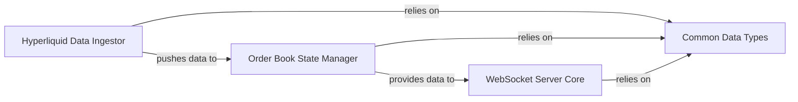

## Details

The `order_book_server` subsystem is designed to provide real-time Hyperliquid order book data to external clients via WebSocket. It comprises four central components: the **Hyperliquid Data Ingestor**, which connects to Hyperliquid nodes, ingests raw market data, and processes it; the **Order Book State Manager**, responsible for maintaining the canonical, in-memory representation of the order book by applying updates from the Ingestor; the **WebSocket Server Core**, which manages client connections, handles subscriptions, and publishes real-time data retrieved from the State Manager; and **Common Data Types**, a foundational layer defining shared data structures for consistent communication across the subsystem. The Data Ingestor continuously feeds processed market data to the Order Book State Manager, which in turn provides the updated order book state to the WebSocket Server Core for dissemination to subscribed clients. This architecture ensures a continuous flow of accurate market data from the Hyperliquid network to external consumers.

### Hyperliquid Data Ingestor
Establishes and maintains a connection to the external Hyperliquid Node, subscribing to real-time market data streams (e.g., order book updates, trade executions). It ingests raw data, performs initial parsing and validation, and forwards processed data to the Order Book State Manager.

**Related Classes/Methods**:

- `server::listeners::order_book::mod`
- `server::listeners::order_book::state`
- `server::listeners::order_book::utils`

### Order Book State Manager [[Expand]](./Order_Book_State_Manager.md)
Maintains the canonical, real-time state of the Hyperliquid order book in memory. It processes incremental updates received from the Hyperliquid Data Ingestor to ensure data consistency and accuracy, and provides queryable access to the current order book state.

**Related Classes/Methods**:

- `server::order_book::multi_book`
- `server::order_book::levels`
- `server::order_book::linked_list`
- `server::order_book::types`

### WebSocket Server Core
The primary communication hub for external clients. It manages WebSocket connections, handles client subscription requests for market data (e.g., l2book, trades), retrieves the necessary data from the Order Book State Manager, and publishes real-time updates to subscribed clients.

**Related Classes/Methods**:

- `binaries::websocket_server`
- `server::servers::websocket_server`

### Common Data Types
Defines the shared data structures and models used across the subsystem for representing market data, client subscriptions, and internal state. It ensures consistent data representation and facilitates communication between other components.

**Related Classes/Methods**:

- `server::types::node_data`
- `server::types::subscription`
- `server::types::inner`

### [FAQ](https://github.com/CodeBoarding/GeneratedOnBoardings/tree/main?tab=readme-ov-file#faq)