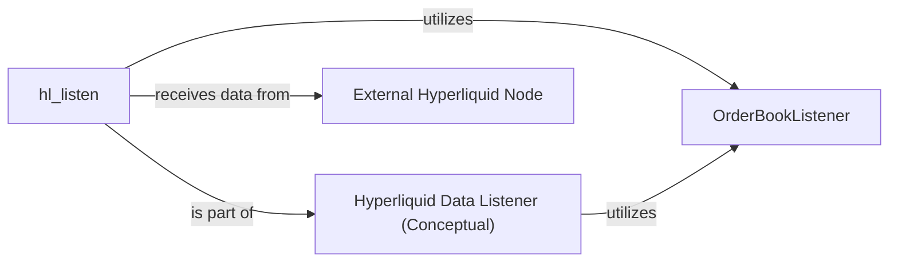

## Details

The Hyperliquid Data Listener subsystem is a critical component responsible for the real-time ingestion and processing of market data from an external source. It embodies a Data Ingestion Module pattern, acting as the primary entry point for external market data into the broader system. The core functionality revolves around actively monitoring and processing various data streams, maintaining an accurate representation of the order book, and ensuring data consistency through periodic snapshots.

### Hyperliquid Data Listener (Conceptual)
This is an overarching conceptual component representing the entire data ingestion module. It serves as the primary entry point for external real-time market data into the system, embodying the Data Ingestion Module pattern.

**Related Classes/Methods**:

- ``:1-300

### OrderBookListener
This component manages the configuration and state necessary for the data ingestion process. It holds connection details, subscription parameters, and potentially initial state or buffers for the incoming data stream. It functions as a Configuration Module and a stateful part of the Data Ingestion Module.

**Related Classes/Methods**:

- `OrderBookListener`:190-218

### hl_listen
This component implements the active logic for establishing and maintaining a WebSocket connection with the External Hyperliquid Node. It is responsible for handling the incoming data stream and continuously ingesting raw market data, acting as the core Data Stream Processor/Handler within the subsystem.

**Related Classes/Methods**:

- `hl_listen`:42-133

### External Hyperliquid Node [[Expand]](./External_Hyperliquid_Node.md)
This is an external system that functions as the publisher of real-time market data. It is a critical external dependency, providing the raw data that the Hyperliquid Data Listener subsystem consumes.

**Related Classes/Methods**: _None_

### [FAQ](https://github.com/CodeBoarding/GeneratedOnBoardings/tree/main?tab=readme-ov-file#faq)