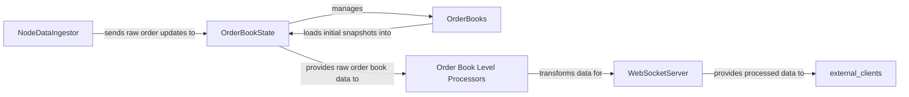

## Details

The Order Book Subsystem is a critical component responsible for maintaining real-time market depth and providing processed views of this data. It receives raw order updates from an external `NodeDataIngestor`, which are then applied to the `OrderBookState` to reflect the current market. The `OrderBookState` internally utilizes `OrderBooks` to manage multiple trading pairs and can load initial snapshots. For client consumption, `Order Book Level Processors` transform the raw order book data into aggregated Level 2 (L2) snapshots, which are then served to external clients via the `WebSocketServer`. This architecture ensures efficient data ingestion, precise state management, and timely dissemination of market information.

### NodeDataIngestor
This external component is responsible for ingesting raw node data, including order statuses and order differences, and feeding them into the order book system for processing.

**Related Classes/Methods**: _None_

### OrderBookState
This component represents the fundamental in-memory data structure for a single order book, holding the current bids and asks. It is the atomic unit for storing real-time market depth and applying incoming order updates.

**Related Classes/Methods**:

- `OrderBookState`

### OrderBooks
This component acts as a manager for multiple OrderBookState instances, likely handling different trading pairs or markets. It is responsible for orchestrating updates across various order books and facilitating the initial loading of order book snapshots.

**Related Classes/Methods**:

- `OrderBooks`
- `load_snapshots_from_json`

### Order Book Level Processors
This component encompasses the functions responsible for transforming and aggregating the raw order book data (held within OrderBookState) into specific market depth views, such as Level 2 (L2) snapshots. These views are tailored for client consumption via API endpoints.

**Related Classes/Methods**:

- `to_l2_snapshot`
- `build_l2_level`

### WebSocketServer
This external component is responsible for serving processed order book data, such as L2 snapshots, to connected clients via WebSocket connections.

**Related Classes/Methods**: _None_

### [FAQ](https://github.com/CodeBoarding/GeneratedOnBoardings/tree/main?tab=readme-ov-file#faq)