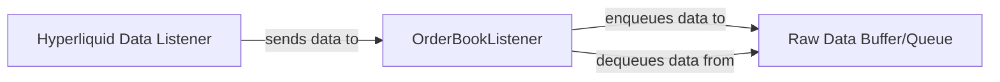

## Details

The Order Book Listener Subsystem is designed to efficiently ingest and manage real-time order book data from an external Hyperliquid Data Listener. The Hyperliquid Data Listener streams raw order book differentials and status updates, which are then received by the OrderBookListener. The OrderBookListener acts as the primary interface, responsible for establishing the connection, processing incoming data, and enqueuing it into the Raw Data Buffer/Queue. This buffer, implemented using BatchQueue instances, temporarily stores the raw data, decoupling the ingestion rate from the processing rate. The OrderBookListener also orchestrates the dequeuing of batched data from these queues for further processing, ensuring data integrity and preventing loss during high-volume periods. This architecture ensures a robust and efficient flow of real-time financial data within the system.

### Hyperliquid Data Listener [[Expand]](./Hyperliquid_Data_Listener.md)
An external data source responsible for continuously streaming raw order book differential and status updates to the system. It acts as the primary producer of real-time financial data.

**Related Classes/Methods**:

- `server::src::listeners::order_book::hl_listen`

### OrderBookListener
This component establishes and maintains the connection with the Hyperliquid Data Listener. It is responsible for ingesting the raw data streams (order book differentials and status updates) and enqueuing them into the Raw Data Buffer/Queue. It also orchestrates the retrieval of batched data from these queues for subsequent processing.

**Related Classes/Methods**:

- `server::src::listeners::order_book::OrderBookListener`

### Raw Data Buffer/Queue [[Expand]](./Raw_Data_Buffer_Queue.md)
This component represents the in-memory buffering mechanism, specifically the order_diff_cache and order_status_cache fields within the OrderBookListener. These are instances of BatchQueue and serve as temporary holding areas for raw order book differential and status updates. Their primary role is to decouple the high ingestion rate from the processing rate, ensuring data integrity and preventing loss during peak loads by allowing data to be processed in manageable batches.

**Related Classes/Methods**:

- `server::src::listeners::order_book::utils::BatchQueue`

### [FAQ](https://github.com/CodeBoarding/GeneratedOnBoardings/tree/main?tab=readme-ov-file#faq)