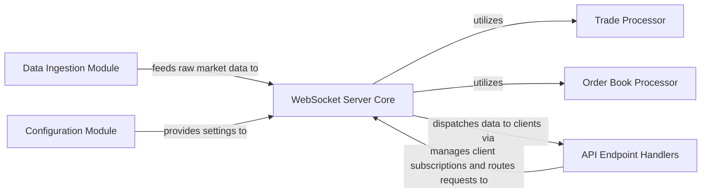

## Details

The system's core is the WebSocket Server Core, which initializes and manages client connections. It receives raw market data from the Data Ingestion Module, which connects to an external Hyperliquid node. Upon receiving internal messages, the WebSocket Server Core utilizes the Trade Processor to handle trade-related data and the Order Book Processor for order book updates. Client interactions, including subscription management and request routing, are handled by the API Endpoint Handlers. Finally, the Configuration Module provides essential operational settings to the WebSocket Server Core, ensuring proper system setup and behavior. This architecture facilitates efficient real-time market data dissemination to subscribed clients.

### WebSocket Server Core
The central component responsible for initializing the WebSocket server, managing client connections, and orchestrating the dispatch of processed market data (trades, order book updates) to subscribed clients. It acts as the primary hub for real-time data dissemination.

**Related Classes/Methods**:

- `run_websocket_server`

### Data Ingestion Module
Responsible for establishing and maintaining the connection to the external Hyperliquid node, ingesting raw market data streams (e.g., order book updates, trade events). It processes raw data into an internal message format for further processing.

**Related Classes/Methods**:

- `OrderBookListener`

### Trade Processor [[Expand]](./Trade_Processor.md)
This component processes raw fill data received from the Data Ingestion Module to identify, normalize, and extract individual trade executions. It transforms raw fill batches into structured trade information.

**Related Classes/Methods**:

- `coin_to_trades`

### Order Book Processor
Manages and updates the real-time state of the L4 order books based on raw market data diffs and status updates. It processes these updates to maintain an accurate, aggregated view of market depth.

**Related Classes/Methods**:

- `coin_to_book_updates`

### API Endpoint Handlers
This component is responsible for parsing incoming client WebSocket messages, managing client subscriptions (e.g., for l2book, trades, l4book), and routing these requests to the appropriate internal data streams or processing logic. It ensures clients receive specific subscribed data.

**Related Classes/Methods**:

- `receive_client_message`

### Configuration Module
Manages application settings and configurable parameters, such as the server address and whether to ignore spot markets. It provides a centralized way to access and manage operational settings for the server.

**Related Classes/Methods**:

- `run_websocket_server`

### [FAQ](https://github.com/CodeBoarding/GeneratedOnBoardings/tree/main?tab=readme-ov-file#faq)