```mermaid
graph LR
    WebSocket_Server_Core["WebSocket Server Core"]
    Market_Data_Ingestion["Market Data Ingestion"]
    Order_Book_State_Manager["Order Book State Manager"]
    Client_Subscription_Manager["Client Subscription Manager"]
    Application_Configuration["Application Configuration"]
    WebSocket_Server_Core -- "initiates data flow" --> Market_Data_Ingestion
    WebSocket_Server_Core -- "manages client interactions" --> Client_Subscription_Manager
    Market_Data_Ingestion -- "provides raw data" --> Order_Book_State_Manager
    Order_Book_State_Manager -- "supplies processed data" --> Client_Subscription_Manager
    Client_Subscription_Manager -- "dispatches responses" --> WebSocket_Server_Core
    Application_Configuration -- "configures" --> WebSocket_Server_Core
    Application_Configuration -- "configures" --> Market_Data_Ingestion
    click Order_Book_State_Manager href "https://github.com/CodeBoarding/GeneratedOnBoardings/blob/main/order_book_server/Order_Book_State_Manager.md" "Details"
```

## Details

This system is designed to provide real-time market data, specifically focusing on order book and trade information from the Hyperliquid DEX, to subscribed WebSocket clients. The architecture is structured around a core WebSocket server that manages client connections and orchestrates data flow, supported by modules responsible for data ingestion, order book state management, and client subscription handling. Configuration settings are applied at the application level to control operational parameters.

### WebSocket Server Core
The primary entry point for client connections, responsible for establishing and managing WebSocket sessions. It orchestrates the flow of data between clients and the internal data processing modules, acting as the central communication hub.

**Related Classes/Methods**:

- `run_websocket_server`
- `handle_socket`

### Market Data Ingestion
Connects to external data sources (Hyperliquid DEX) to ingest raw market data, including order book updates and trade fills. It acts as the initial data pipeline, converting raw node data into internal messages for further processing.

**Related Classes/Methods**:

- `OrderBookListener`
- `hl_listen`
- `InternalMessage`

### Order Book State Manager [[Expand]](./Order_Book_State_Manager.md)
Maintains the real-time state of L2 and L4 order books and processes trade data. It receives internal messages from the `Market Data Ingestion` component, updates its internal state, and provides structured data for client consumption.

**Related Classes/Methods**:

- `OrderBookListener`
- `L2Snapshots`
- `L4BookUpdates`
- `Trade`

### Client Subscription Manager
Manages client subscriptions to various data streams (L2/L4 order books, trades). It processes client requests (subscribe/unsubscribe), validates them, and dispatches the relevant data to individual clients based on their active subscriptions.

**Related Classes/Methods**:

- `SubscriptionManager`
- `ClientMessage`
- `ServerResponse`
- `Subscription`
- `receive_client_message`
- `send_socket_message`

### Application Configuration
Provides and manages application-wide settings and parameters, such as network addresses and operational flags, ensuring consistent and secure access to necessary settings across components.

**Related Classes/Methods**:

- `address`
- `ignore_spot`

### [FAQ](https://github.com/CodeBoarding/GeneratedOnBoardings/tree/main?tab=readme-ov-file#faq)