```mermaid
graph LR
    External_Hyperliquid_Node["External Hyperliquid Node"]
    Hyperliquid_Data_Listener["Hyperliquid Data Listener"]
    Raw_Data_Buffer_Queue["Raw Data Buffer/Queue"]
    Order_Book_State_Manager["Order Book State Manager"]
    Trade_Processor["Trade Processor"]
    WebSocket_Server["WebSocket Server"]
    Configuration_Manager["Configuration Manager"]
    Connected_Clients["Connected Clients"]
    External_Hyperliquid_Node -- "sends Raw Market Data to" --> Hyperliquid_Data_Listener
    Hyperliquid_Data_Listener -- "feeds Raw Data into" --> Raw_Data_Buffer_Queue
    Raw_Data_Buffer_Queue -- "provides Raw Data for L2/L4 Processing to" --> Order_Book_State_Manager
    Raw_Data_Buffer_Queue -- "provides Raw Data for Trade Processing to" --> Trade_Processor
    Order_Book_State_Manager -- "pushes L2/L4 Book Updates to" --> WebSocket_Server
    Trade_Processor -- "pushes Trade Data Updates to" --> WebSocket_Server
    WebSocket_Server -- "broadcasts Real-time Data to" --> Connected_Clients
    Configuration_Manager -- "provides Settings to" --> Hyperliquid_Data_Listener
    Configuration_Manager -- "provides Settings to" --> WebSocket_Server
    click External_Hyperliquid_Node href "https://github.com/CodeBoarding/GeneratedOnBoardings/blob/main/order_book_server/External_Hyperliquid_Node.md" "Details"
    click Hyperliquid_Data_Listener href "https://github.com/CodeBoarding/GeneratedOnBoardings/blob/main/order_book_server/Hyperliquid_Data_Listener.md" "Details"
    click Raw_Data_Buffer_Queue href "https://github.com/CodeBoarding/GeneratedOnBoardings/blob/main/order_book_server/Raw_Data_Buffer_Queue.md" "Details"
    click Order_Book_State_Manager href "https://github.com/CodeBoarding/GeneratedOnBoardings/blob/main/order_book_server/Order_Book_State_Manager.md" "Details"
    click Trade_Processor href "https://github.com/CodeBoarding/GeneratedOnBoardings/blob/main/order_book_server/Trade_Processor.md" "Details"
    click WebSocket_Server href "https://github.com/CodeBoarding/GeneratedOnBoardings/blob/main/order_book_server/WebSocket_Server.md" "Details"
    click Connected_Clients href "https://github.com/CodeBoarding/GeneratedOnBoardings/blob/main/order_book_server/Connected_Clients.md" "Details"
```

## Details

The system operates by continuously ingesting raw market data from an External Hyperliquid Node via the Hyperliquid Data Listener. This raw data is temporarily stored in a Raw Data Buffer/Queue to manage processing load. Concurrently, the Order Book State Manager processes this buffered data to maintain an accurate, real-time representation of the order book, while the Trade Processor extracts individual trade executions. Both the processed order book updates and trade data are then pushed to the WebSocket Server, which acts as the central distribution point. The WebSocket Server manages connections with Connected Clients, broadcasting the real-time market data based on client subscriptions. All operational parameters and external connections are managed and provided by the Configuration Manager, ensuring the system's adaptability and correct functioning. This design ensures a robust, scalable, and responsive market data feed.

### External Hyperliquid Node [[Expand]](./External_Hyperliquid_Node.md)
The primary external source of real-time market data (order book updates, trade executions) from the Hyperliquid Decentralized Exchange. It provides raw data streams.

**Related Classes/Methods**: _None_

### Hyperliquid Data Listener [[Expand]](./Hyperliquid_Data_Listener.md)
This component (server/src/listeners/order_book/mod.rs: hl_listen function, OrderBookListener struct) establishes and maintains a connection to the External Hyperliquid Node, ingesting raw market data. It acts as the primary entry point for external data into the system.

**Related Classes/Methods**:

- `hl_listen`
- `OrderBookListener`

### Raw Data Buffer/Queue [[Expand]](./Raw_Data_Buffer_Queue.md)
An in-memory buffer (server/src/listeners/order_book/mod.rs: OrderBookListener's order_diff_cache and order_status_cache fields, which are BatchQueue instances) that temporarily stores raw data received from the Hyperliquid Data Listener. This decouples the ingestion rate from the processing rate, ensuring data is not lost during peak loads.

**Related Classes/Methods**:

- `OrderBookListener.order_diff_cache`
- `OrderBookListener.order_status_cache`

### Order Book State Manager [[Expand]](./Order_Book_State_Manager.md)
This component (server/src/listeners/order_book/state.rs: OrderBookState struct; server/src/order_book/multi_book.rs: OrderBooks struct, load_snapshots_from_json function; server/src/order_book/levels.rs: to_l2_snapshot, build_l2_level functions) parses raw market data, applies updates, and maintains the current, consolidated state of both Level 2 (L2) and Level 4 (L4) order books in memory. It is crucial for providing accurate market depth information.

**Related Classes/Methods**:

- `OrderBookState`
- `OrderBooks`
- `load_snapshots_from_json`
- `to_l2_snapshot`
- `build_l2_level`

### Trade Processor [[Expand]](./Trade_Processor.md)
This component (server/src/servers/websocket_server.rs: coin_to_trades function) processes raw market data to identify individual trade executions, performing any necessary normalization or aggregation. It extracts actionable trade information from the raw data stream.

**Related Classes/Methods**:

- `coin_to_trades`

### WebSocket Server [[Expand]](./WebSocket_Server.md)
The central communication hub (server/src/servers/websocket_server.rs: run_websocket_server function, handle_socket function). It manages all WebSocket client connections, handles client subscriptions, and broadcasts processed data (L2/L4 book updates, trade data) to subscribed clients in real-time.

**Related Classes/Methods**:

- `run_websocket_server`
- `handle_socket`

### Configuration Manager
This component (server/src/servers/websocket_server.rs: run_websocket_server function; server/src/lib.rs: HL_NODE constant) is responsible for loading and providing application-wide settings, such as connection URLs and port numbers, to other components.

**Related Classes/Methods**:

- `run_websocket_server`
- `HL_NODE`

### Connected Clients [[Expand]](./Connected_Clients.md)
External clients connected to the WebSocket Server, consuming real-time market data.

**Related Classes/Methods**: _None_

### [FAQ](https://github.com/CodeBoarding/GeneratedOnBoardings/tree/main?tab=readme-ov-file#faq)