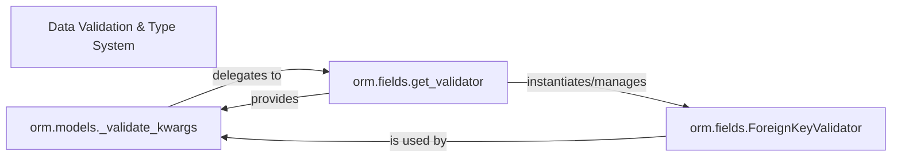

## Details

The ORM's data validation subsystem is designed to enforce data integrity and type correctness. At its core, `orm.models._validate_kwargs` orchestrates the validation process for model instances, iterating through fields and leveraging `orm.fields.get_validator` to dynamically retrieve the appropriate validator for each field type. `orm.fields.get_validator` acts as a central factory, abstracting the selection of specific validation logic, such as that provided by `orm.fields.ForeignKeyValidator` for relational integrity. This architecture ensures that data conforms to defined schemas and constraints through a modular and extensible validation pipeline, where `_validate_kwargs` drives the process, `get_validator` supplies the necessary validation tools, and concrete validators like `ForeignKeyValidator` execute the specific checks.

### Data Validation & Type System [[Expand]](./Data_Validation_Type_System.md)
Ensures data integrity by validating input against defined model schemas and handling type conversions.

**Related Classes/Methods**:

- <a href="https://github.com/encode/orm/blob/master/orm/fields.py#L272-L273" target="_blank" rel="noopener noreferrer">`orm.fields.get_validator`:272-273</a>
- <a href="https://github.com/encode/orm/blob/master/orm/models.py#L404-L413" target="_blank" rel="noopener noreferrer">`orm.models._validate_kwargs`:404-413</a>

### orm.models._validate_kwargs
This component serves as the primary orchestrator for model-level data validation. It is responsible for iterating through the fields of a model instance's input data and delegating the actual field-specific validation to appropriate validators. It ensures that the entire dataset conforms to the model's schema and constraints before any persistence operations. This is a central component because it's the entry point for applying validation rules to a complete record.

**Related Classes/Methods**:

- <a href="https://github.com/encode/orm/blob/master/orm/fields.py#L272-L273" target="_blank" rel="noopener noreferrer">`orm.fields.get_validator`:272-273</a>

### orm.fields.get_validator
This component acts as a factory or registry for retrieving the correct validator instance based on a given field's type. It abstracts the process of mapping field types to their specific validation logic, promoting extensibility and a clear separation of concerns within the ORM's type system. It's crucial for dynamically providing the right validation mechanism for each field.

**Related Classes/Methods**:

- <a href="https://github.com/encode/orm/blob/master/orm/fields.py#L272-L273" target="_blank" rel="noopener noreferrer">`orm.fields.get_validator`:272-273</a>

### orm.fields.ForeignKeyValidator
A concrete implementation of a field validator, specifically designed to enforce referential integrity for foreign key relationships. Its presence highlights the ORM's capability to handle complex data relationships and implies the existence of a broader set of specific validators (e.g., for string, integer, date types) managed by get_validator. This component represents the actual "type system" in action for a specific field type.

**Related Classes/Methods**: _None_

### [FAQ](https://github.com/CodeBoarding/GeneratedOnBoardings/tree/main?tab=readme-ov-file#faq)