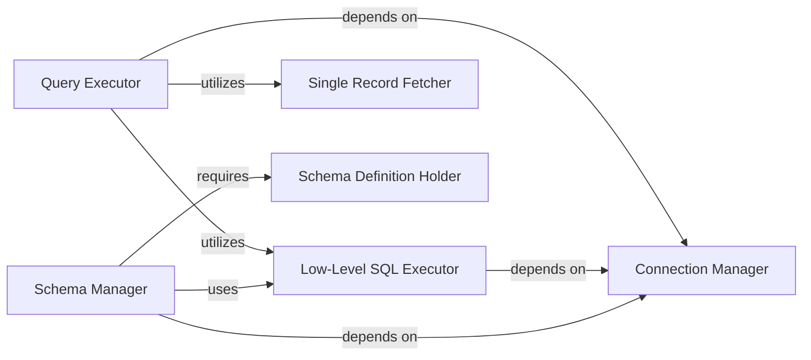

## Details

The `orm` subsystem provides a lightweight Object-Relational Mapping (ORM) solution, abstracting direct database interactions. It centers around the `Query Executor`, which orchestrates DML operations by leveraging a `Low-Level SQL Executor` for raw SQL execution and a `Single Record Fetcher` for result processing. Database connectivity is managed by the `Connection Manager`, which provides the necessary session for all database operations. Schema management, including creation and deletion of tables, is handled by the `Schema Manager`, which relies on the `Schema Definition Holder` for metadata. This design ensures a clear separation of concerns, with components focused on specific aspects of database interaction, from connection handling to query execution and schema management.

### Connection Manager
Manages the retrieval of the database connection string and handles the establishment and lifecycle of database connections, including connection pooling and session management. It provides the foundational database access.

**Related Classes/Methods**:

- <a href="https://github.com/encode/orm/blob/master/orm/models.py#L63-L72" target="_blank" rel="noopener noreferrer">`orm.models._get_database_url`:63-72</a>
- <a href="https://github.com/encode/orm/blob/master/orm/models.py#L126-L128" target="_blank" rel="noopener noreferrer">`orm.models.database`:126-128</a>

### Low-Level SQL Executor
Provides the fundamental capability to directly execute raw SQL statements against the database. It acts as a core primitive that higher-level components leverage for all database operations.

**Related Classes/Methods**:

- <a href="https://github.com/encode/orm/blob/master/orm/models.py#L108-L114" target="_blank" rel="noopener noreferrer">`orm.models.execute`:108-114</a>

### Query Executor
Serves as the primary interface for executing Data Manipulation Language (DML) operations (e.g., `select`, `insert`, `update`, `delete`) against the database. It abstracts the underlying database interaction for higher-level ORM methods, translating ORM queries into executable SQL.

**Related Classes/Methods**:

- <a href="https://github.com/encode/orm/blob/master/orm/models.py#L126-L128" target="_blank" rel="noopener noreferrer">`orm.models.database`:126-128</a>

### Single Record Fetcher
A utility component responsible for efficiently retrieving and processing a single record from a database result set. It's specialized for scenarios where only one row is expected.

**Related Classes/Methods**:

- <a href="https://github.com/encode/orm/blob/master/orm/models.py#L116-L124" target="_blank" rel="noopener noreferrer">`orm.models.fetch_one`:116-124</a>

### Schema Manager
Manages the database schema lifecycle, including the creation (`create_all`) and deletion (`drop_all`) of all defined tables based on the ORM's metadata. It handles Data Definition Language (DDL) operations.

**Related Classes/Methods**:

- <a href="https://github.com/encode/orm/blob/master/orm/models.py#L43-L51" target="_blank" rel="noopener noreferrer">`orm.models.create_all`:43-51</a>
- <a href="https://github.com/encode/orm/blob/master/orm/models.py#L53-L61" target="_blank" rel="noopener noreferrer">`orm.models.drop_all`:53-61</a>

### Schema Definition Holder
Holds the metadata defining the database schema structure, including table definitions, columns, and relationships. This metadata is used by the Schema Manager and potentially other components to understand the database layout.

**Related Classes/Methods**:

- <a href="https://github.com/encode/orm/blob/master/orm/models.py" target="_blank" rel="noopener noreferrer">`orm.models.metadata`</a>

### [FAQ](https://github.com/CodeBoarding/GeneratedOnBoardings/tree/main?tab=readme-ov-file#faq)