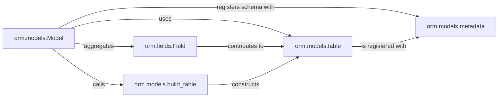

## Details

The Model Definition Layer is responsible for translating Python class definitions into database table schemas. It allows users to define ORM models using `orm.models.Model` and `orm.fields.Field`, which are then translated into SQLAlchemy `Table` objects and registered with a central `MetaData` registry for database operations.

### orm.models.Model
The foundational abstract base class for all user-defined ORM models. It provides the declarative mechanism for defining table names, primary keys, and orchestrates the mapping of Python attributes to database columns. It serves as the entry point for defining the structure of database tables as Python objects.

**Related Classes/Methods**:

- <a href="https://github.com/encode/orm/blob/master/orm/models.py#L487-L596" target="_blank" rel="noopener noreferrer">`orm.models.Model`:487-596</a>

### orm.fields.Field
Represents individual columns within a model. This component defines the data type, constraints (e.g., nullability, uniqueness), default values, and validation logic for each attribute, acting as the bridge between Python data types and database column types.

**Related Classes/Methods**:

- <a href="https://github.com/encode/orm/blob/master/orm/fields.py" target="_blank" rel="noopener noreferrer">`orm.fields.Field`</a>

### orm.models.metadata
A central registry (typically an instance of SQLAlchemy's `MetaData`) that collects and manages all declared table schemas. It acts as the authoritative source for schema information, crucial for DDL operations like `create_all` and `drop_all`.

**Related Classes/Methods**:

- <a href="https://github.com/encode/orm/blob/master/orm/models.py" target="_blank" rel="noopener noreferrer">`orm.models.metadata`</a>

### orm.models.table
Refers to the SQLAlchemy `Table` object, which is the direct, low-level representation of a database table. This component is derived from the `Model` and `Field` definitions and is used by the ORM's query interface to construct SQL statements.

**Related Classes/Methods**:

- <a href="https://github.com/encode/orm/blob/master/orm/models.py#L523-L525" target="_blank" rel="noopener noreferrer">`orm.models.table`:523-525</a>

### orm.models.build_table
A utility or internal method responsible for dynamically constructing the SQLAlchemy `Table` object based on the `Model`'s defined fields and metadata. This is a key internal mechanism for translating the Python model definition into a database-mappable structure.

**Related Classes/Methods**:

- <a href="https://github.com/encode/orm/blob/master/orm/models.py#L514-L521" target="_blank" rel="noopener noreferrer">`orm.models.build_table`:514-521</a>

### [FAQ](https://github.com/CodeBoarding/GeneratedOnBoardings/tree/main?tab=readme-ov-file#faq)