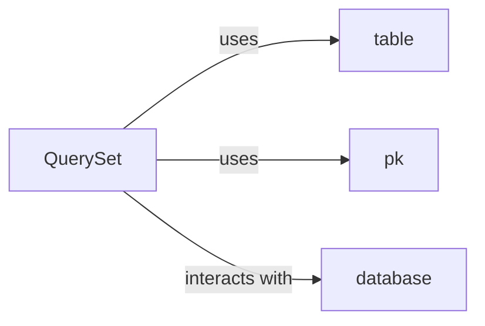

## Details

Analysis of the ORM project, focusing on core components and their interactions, with an emphasis on resolving missing source code references for key internal methods and the database component.

### QuerySet
Manages database queries and object retrieval.

**Related Classes/Methods**:

- <a href="https://github.com/encode/orm/blob/master/orm/models.py#L104-L484" target="_blank" rel="noopener noreferrer">`QuerySet`:104-484</a>
- <a href="https://github.com/encode/orm/blob/master/orm/models.py#L200-L277" target="_blank" rel="noopener noreferrer">`_filter_query`:200-277</a>
- <a href="https://github.com/encode/orm/blob/master/orm/models.py#L143-L176" target="_blank" rel="noopener noreferrer">`_build_select_expression`:143-176</a>
- <a href="https://github.com/encode/orm/blob/master/orm/models.py#L480-L484" target="_blank" rel="noopener noreferrer">`_prepare_order_by`:480-484</a>

### table
Represents a database table.

**Related Classes/Methods**:

- <a href="https://github.com/encode/orm/blob/master/orm/models.py#L523-L525" target="_blank" rel="noopener noreferrer">`table`:523-525</a>

### pk
Primary key field.

**Related Classes/Methods**:

- <a href="https://github.com/encode/orm/blob/master/orm/models.py#L504-L506" target="_blank" rel="noopener noreferrer">`pk`:504-506</a>

### database
Handles database connections and operations.

**Related Classes/Methods**:

- <a href="https://github.com/encode/orm/blob/master/" target="_blank" rel="noopener noreferrer">`orm.database`</a>

### [FAQ](https://github.com/CodeBoarding/GeneratedOnBoardings/tree/main?tab=readme-ov-file#faq)