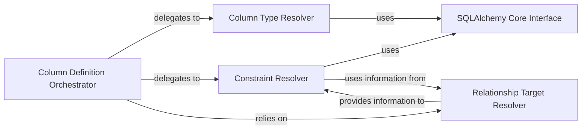

## Details

The SQLAlchemy Core Integration subsystem acts as the crucial bridge between the ORM's high-level model definitions and SQLAlchemy Core's low-level SQL expression capabilities. It is responsible for translating ORM field definitions into concrete SQLAlchemy constructs, managing column types, constraints, and relationships.

### SQLAlchemy Core Interface
This component serves as the direct bridge to SQLAlchemy Core, providing the fundamental, low-level SQLAlchemy constructs (e.g., Column, String, Integer, ForeignKeyConstraint, PrimaryKeyConstraint, UniqueConstraint). It acts as a factory or registry, abstracting the direct instantiation of these SQLAlchemy objects from other ORM components.

**Related Classes/Methods**:

- <a href="https://github.com/encode/orm/blob/master/orm/sqlalchemy_fields.py" target="_blank" rel="noopener noreferrer">`orm.sqlalchemy_fields`</a>

### Column Definition Orchestrator
The primary entry point for converting an ORM field definition into a complete SQLAlchemy Column object. It orchestrates the resolution of column types, constraints, and relationship targets by delegating to specialized resolvers.

**Related Classes/Methods**:

- <a href="https://github.com/encode/orm/blob/master/orm/fields.py#L200-L217" target="_blank" rel="noopener noreferrer">`orm.fields.get_column`:200-217</a>

### Column Type Resolver
Determines and returns the appropriate SQLAlchemy data type (e.g., String, Integer, DateTime) for a given ORM field based on its definition.

**Related Classes/Methods**:

- <a href="https://github.com/encode/orm/blob/master/orm/fields.py#L275-L276" target="_blank" rel="noopener noreferrer">`orm.fields.get_column_type`:275-276</a>

### Constraint Resolver
Identifies and constructs SQLAlchemy-specific constraints (e.g., PrimaryKeyConstraint, UniqueConstraint, ForeignKeyConstraint, nullable) that apply to an ORM field.

**Related Classes/Methods**:

- <a href="https://github.com/encode/orm/blob/master/orm/fields.py#L45-L46" target="_blank" rel="noopener noreferrer">`orm.fields.get_constraints`:45-46</a>

### Relationship Target Resolver
Resolves the target of a relationship or a foreign key, crucial for establishing correct SQLAlchemy ForeignKey constructs. This involves identifying the referenced table and column.

**Related Classes/Methods**:

- <a href="https://github.com/encode/orm/blob/master/orm/fields.py" target="_blank" rel="noopener noreferrer">`orm.fields.target`</a>

### [FAQ](https://github.com/CodeBoarding/GeneratedOnBoardings/tree/main?tab=readme-ov-file#faq)