```mermaid
graph LR
    Model_Definition_Layer["Model Definition Layer"]
    Data_Validation_Type_System["Data Validation & Type System"]
    SQLAlchemy_Core_Integration["SQLAlchemy Core Integration"]
    Query_Interface_QuerySet_["Query Interface (QuerySet)"]
    Data_Persistence_Manager["Data Persistence Manager"]
    Database_Connection_Execution_Layer["Database Connection & Execution Layer"]
    Model_Definition_Layer -- "defines schema for" --> Data_Validation_Type_System
    Model_Definition_Layer -- "generates constructs for" --> SQLAlchemy_Core_Integration
    Data_Validation_Type_System -- "provides validation rules to" --> Model_Definition_Layer
    Data_Validation_Type_System -- "validates input for" --> Data_Persistence_Manager
    SQLAlchemy_Core_Integration -- "receives definitions from" --> Model_Definition_Layer
    SQLAlchemy_Core_Integration -- "provides SQL expressions to" --> Query_Interface_QuerySet_
    SQLAlchemy_Core_Integration -- "provides SQL expressions to" --> Data_Persistence_Manager
    Query_Interface_QuerySet_ -- "constructs queries using" --> Model_Definition_Layer
    Query_Interface_QuerySet_ -- "constructs queries using" --> SQLAlchemy_Core_Integration
    Query_Interface_QuerySet_ -- "executes queries via" --> Database_Connection_Execution_Layer
    Data_Persistence_Manager -- "operates on" --> Model_Definition_Layer
    Data_Persistence_Manager -- "persists/modifies data via" --> Database_Connection_Execution_Layer
    Database_Connection_Execution_Layer -- "executes expressions from" --> Query_Interface_QuerySet_
    Database_Connection_Execution_Layer -- "executes expressions from" --> Data_Persistence_Manager
    click Model_Definition_Layer href "https://github.com/CodeBoarding/GeneratedOnBoardings/blob/main/orm/Model_Definition_Layer.md" "Details"
    click Data_Validation_Type_System href "https://github.com/CodeBoarding/GeneratedOnBoardings/blob/main/orm/Data_Validation_Type_System.md" "Details"
    click SQLAlchemy_Core_Integration href "https://github.com/CodeBoarding/GeneratedOnBoardings/blob/main/orm/SQLAlchemy_Core_Integration.md" "Details"
    click Query_Interface_QuerySet_ href "https://github.com/CodeBoarding/GeneratedOnBoardings/blob/main/orm/Query_Interface_QuerySet_.md" "Details"
    click Database_Connection_Execution_Layer href "https://github.com/CodeBoarding/GeneratedOnBoardings/blob/main/orm/Database_Connection_Execution_Layer.md" "Details"
```

## Details

The `orm` library implements a layered architecture where the Model Definition Layer serves as the foundational schema, validated by the Data Validation & Type System. This schema is then translated into database-compatible constructs by the SQLAlchemy Core Integration. Application-level interactions occur through the Query Interface (QuerySet) for data retrieval and the Data Persistence Manager for data manipulation. Both these components rely on the Database Connection & Execution Layer to perform asynchronous operations against the database. This design ensures a clear separation of concerns, promoting maintainability, testability, and efficient asynchronous data management.

### Model Definition Layer [[Expand]](./Model_Definition_Layer.md)
Defines the structure of database tables as Python objects, including fields, relationships, and metadata. It's the blueprint for all data interactions.

**Related Classes/Methods**:

- <a href="https://github.com/encode/orm/blob/master/orm/models.py#L487-L596" target="_blank" rel="noopener noreferrer">`orm.models.Model`:487-596</a>
- <a href="https://github.com/encode/orm/blob/master/orm/models.py#L514-L521" target="_blank" rel="noopener noreferrer">`orm.models.build_table`:514-521</a>
- <a href="https://github.com/encode/orm/blob/master/orm/models.py#L523-L525" target="_blank" rel="noopener noreferrer">`orm.models.table`:523-525</a>
- <a href="https://github.com/encode/orm/blob/master/orm/models.py" target="_blank" rel="noopener noreferrer">`orm.models.metadata`</a>
- <a href="https://github.com/encode/orm/blob/master/orm/fields.py" target="_blank" rel="noopener noreferrer">`orm.fields.Field`</a>

### Data Validation & Type System [[Expand]](./Data_Validation_Type_System.md)
Ensures data integrity by validating input against defined model schemas and handling type conversions.

**Related Classes/Methods**:

- <a href="https://github.com/encode/orm/blob/master/orm/fields.py#L272-L273" target="_blank" rel="noopener noreferrer">`orm.fields.get_validator`:272-273</a>
- <a href="https://github.com/encode/orm/blob/master/orm/models.py#L404-L413" target="_blank" rel="noopener noreferrer">`orm.models._validate_kwargs`:404-413</a>

### SQLAlchemy Core Integration [[Expand]](./SQLAlchemy_Core_Integration.md)
Acts as the bridge to SQLAlchemy Core, translating ORM-specific definitions and operations into low-level SQL expressions and managing SQLAlchemy constructs.

**Related Classes/Methods**:

- <a href="https://github.com/encode/orm/blob/master/orm/sqlalchemy_fields.py" target="_blank" rel="noopener noreferrer">`orm.sqlalchemy_fields`</a>
- <a href="https://github.com/encode/orm/blob/master/orm/fields.py#L200-L217" target="_blank" rel="noopener noreferrer">`orm.fields.get_column`:200-217</a>

### Query Interface (QuerySet) [[Expand]](./Query_Interface_QuerySet_.md)
Provides the high-level API for constructing and executing read-based database queries (e.g., filter, get, all).

**Related Classes/Methods**:

- <a href="https://github.com/encode/orm/blob/master/orm/models.py#L104-L484" target="_blank" rel="noopener noreferrer">`orm.models.QuerySet`:104-484</a>
- <a href="https://github.com/encode/orm/blob/master/orm/models.py#L178-L187" target="_blank" rel="noopener noreferrer">`orm.models.filter`:178-187</a>
- <a href="https://github.com/encode/orm/blob/master/orm/models.py#L383-L394" target="_blank" rel="noopener noreferrer">`orm.models.get`:383-394</a>
- <a href="https://github.com/encode/orm/blob/master/orm/models.py#L372-L381" target="_blank" rel="noopener noreferrer">`orm.models.all`:372-381</a>
- <a href="https://github.com/encode/orm/blob/master/orm/models.py#L367-L370" target="_blank" rel="noopener noreferrer">`orm.models.count`:367-370</a>
- <a href="https://github.com/encode/orm/blob/master/orm/models.py#L342-L345" target="_blank" rel="noopener noreferrer">`orm.models.exists`:342-345</a>

### Data Persistence Manager
Manages the lifecycle of data records, handling creation, updating, and deletion operations within the database.

**Related Classes/Methods**:

- <a href="https://github.com/encode/orm/blob/master/orm/models.py#L415-L425" target="_blank" rel="noopener noreferrer">`orm.models.create`:415-425</a>
- <a href="https://github.com/encode/orm/blob/master/orm/models.py#L527-L539" target="_blank" rel="noopener noreferrer">`orm.models.update`:527-539</a>
- <a href="https://github.com/encode/orm/blob/master/orm/models.py#L541-L545" target="_blank" rel="noopener noreferrer">`orm.models.delete`:541-545</a>
- <a href="https://github.com/encode/orm/blob/master/orm/models.py#L427-L431" target="_blank" rel="noopener noreferrer">`orm.models.bulk_create`:427-431</a>
- <a href="https://github.com/encode/orm/blob/master/orm/models.py#L547-L557" target="_blank" rel="noopener noreferrer">`orm.models.load`:547-557</a>
- <a href="https://github.com/encode/orm/blob/master/orm/models.py#L457-L466" target="_blank" rel="noopener noreferrer">`orm.models.get_or_create`:457-466</a>
- <a href="https://github.com/encode/orm/blob/master/orm/models.py#L468-L478" target="_blank" rel="noopener noreferrer">`orm.models.update_or_create`:468-478</a>

### Database Connection & Execution Layer [[Expand]](./Database_Connection_Execution_Layer.md)
Handles direct, asynchronous interaction with the underlying database, managing connections and executing SQL commands.

**Related Classes/Methods**:

- <a href="https://github.com/encode/orm/blob/master/orm/models.py#L126-L128" target="_blank" rel="noopener noreferrer">`orm.models.database`:126-128</a>
- <a href="https://github.com/encode/orm/blob/master/orm/models.py" target="_blank" rel="noopener noreferrer">`orm.models.execute`</a>
- <a href="https://github.com/encode/orm/blob/master/orm/models.py" target="_blank" rel="noopener noreferrer">`orm.models.fetch_one`</a>
- <a href="https://github.com/encode/orm/blob/master/orm/models.py#L43-L51" target="_blank" rel="noopener noreferrer">`orm.models.create_all`:43-51</a>
- <a href="https://github.com/encode/orm/blob/master/orm/models.py#L53-L61" target="_blank" rel="noopener noreferrer">`orm.models.drop_all`:53-61</a>
- <a href="https://github.com/encode/orm/blob/master/orm/models.py#L63-L72" target="_blank" rel="noopener noreferrer">`orm.models._get_database_url`:63-72</a>

### [FAQ](https://github.com/CodeBoarding/GeneratedOnBoardings/tree/main?tab=readme-ov-file#faq)