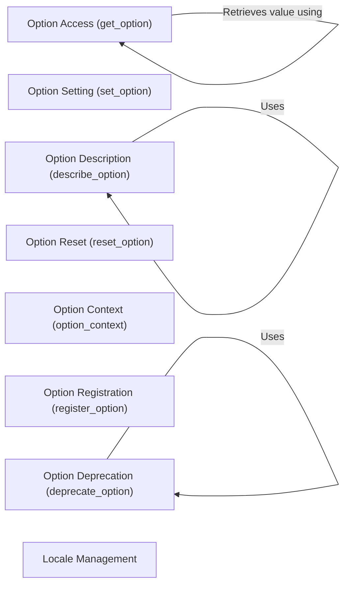

## Component Details

The Configuration and Customization component in pandas allows users to tailor the library's behavior to their specific needs. It provides mechanisms for setting, retrieving, and managing global options that control various aspects of pandas, such as display settings, I/O parameters, and computational configurations. The core functionality revolves around the `get_option` and `set_option` functions, which serve as the primary interface for accessing and modifying configuration settings. Additional features include the ability to describe options, reset them to their default values, and manage them within specific contexts using `option_context`. The system also supports registering new options and deprecating existing ones, ensuring a smooth transition as the library evolves.

### Option Access (get_option)
This component provides the primary interface for retrieving the value of a specified option within pandas. It handles the lookup and retrieval process, potentially utilizing helper functions to access the underlying configuration data.
- **Related Classes/Methods**: `pandas._config.config:get_option`, `pandas._config.config:_get_single_key`

### Option Setting (set_option)
This component allows users to modify the value of a specified option, enabling customization of pandas' behavior. It's a core function for configuring the library according to user preferences.
- **Related Classes/Methods**: `pandas._config.config:set_option`

### Option Description (describe_option)
This component provides detailed information about a specific option, including its purpose, valid values, and other relevant details. It helps users understand the available configuration settings and their impact.
- **Related Classes/Methods**: `pandas._config.config:describe_option`, `pandas._config.config:_build_option_description`

### Option Reset (reset_option)
This component allows users to revert a specified option to its default value, effectively undoing any previous customizations. It provides a way to restore the original configuration settings.
- **Related Classes/Methods**: `pandas._config.config:reset_option`

### Option Context (option_context)
This component provides a context manager for temporarily setting options within a specific scope. It allows users to apply configuration settings for a limited duration, reverting to the previous settings when the context is exited.
- **Related Classes/Methods**: `pandas._config.config:option_context`

### Option Registration (register_option)
This component enables developers to add new configuration settings to pandas. It allows them to define new options and make them available for customization.
- **Related Classes/Methods**: `pandas._config.config:register_option`

### Option Deprecation (deprecate_option)
This component marks an option as deprecated, indicating that it will be removed in a future version. It helps users migrate to new configuration settings and avoid using outdated options.
- **Related Classes/Methods**: `pandas._config.config:deprecate_option`, `pandas._config.config:_warn_if_deprecated`

### Locale Management
This component manages the locale settings for pandas, allowing users to customize the library's behavior based on their regional preferences. It includes functions for checking locale validity and retrieving current locale settings.
- **Related Classes/Methods**: `pandas._config.localization:can_set_locale`, `pandas._config.localization:_valid_locales`, `pandas._config.localization:get_locales`
