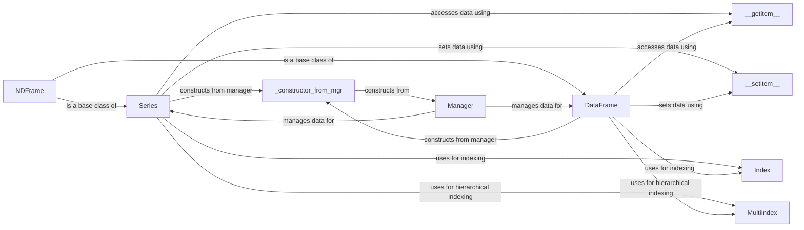

## Component Details

The Core Data Structures component in pandas defines the fundamental building blocks for data storage and manipulation. It encompasses the Series and DataFrame classes, which represent one-dimensional and two-dimensional labeled data structures, respectively. These structures are built upon Index objects, which provide labeling and alignment capabilities. The interaction between these components enables efficient data access, manipulation, and analysis within the pandas library.

### Series
Represents a one-dimensional labeled array capable of holding any data type. It provides methods for data manipulation, alignment, and indexing. Series objects are the building blocks for DataFrame columns.
- **Related Classes/Methods**: `pandas.core.series.Series`, `pandas.core.series.NDFrame`

### DataFrame
Represents a two-dimensional labeled data structure with columns of potentially different types. It provides methods for data manipulation, alignment, indexing, and reshaping. DataFrame objects are the primary data structure for tabular data in pandas.
- **Related Classes/Methods**: `pandas.core.frame.DataFrame`, `pandas.core.generic.NDFrame`

### Index
Represents an immutable sequence of labels used for indexing and alignment in Series and DataFrame objects. It provides methods for label-based data access and manipulation.
- **Related Classes/Methods**: `pandas.core.indexes.base.Index`

### MultiIndex
Represents a hierarchical index, allowing for multiple levels of indexing within a Series or DataFrame. It provides a more complex and flexible way to label data, enabling operations on subsets of data based on multiple criteria.
- **Related Classes/Methods**: `pandas.core.indexes.multi.MultiIndex`

### __getitem__
Enables accessing elements of Series and DataFrames using the [] operator. It interacts with Index to resolve labels and retrieve the corresponding data.
- **Related Classes/Methods**: `pandas.core.series.Series:__getitem__`, `pandas.core.frame.DataFrame:__getitem__`, `pandas.core.indexes.base.Index:__getitem__`

### __setitem__
Enables setting elements of Series and DataFrames using the [] operator. It interacts with Index to resolve labels and set the corresponding data.
- **Related Classes/Methods**: `pandas.core.series.Series:__setitem__`, `pandas.core.frame.DataFrame:__setitem__`

### _constructor_from_mgr
A constructor method used to create new Series or DataFrame objects from a Manager object (internal representation of data).
- **Related Classes/Methods**: `pandas.core.series.Series:_constructor_from_mgr`, `pandas.core.frame.DataFrame:_constructor_from_mgr`

### NDFrame
Base class for Series and DataFrame, providing common functionalities and data management.
- **Related Classes/Methods**: `pandas.core.generic.NDFrame`

### Manager
Internal representation of data within a DataFrame or Series. Handles the underlying data storage and manipulation.
- **Related Classes/Methods**: `pandas.core.internals.managers.BaseBlockManager`
