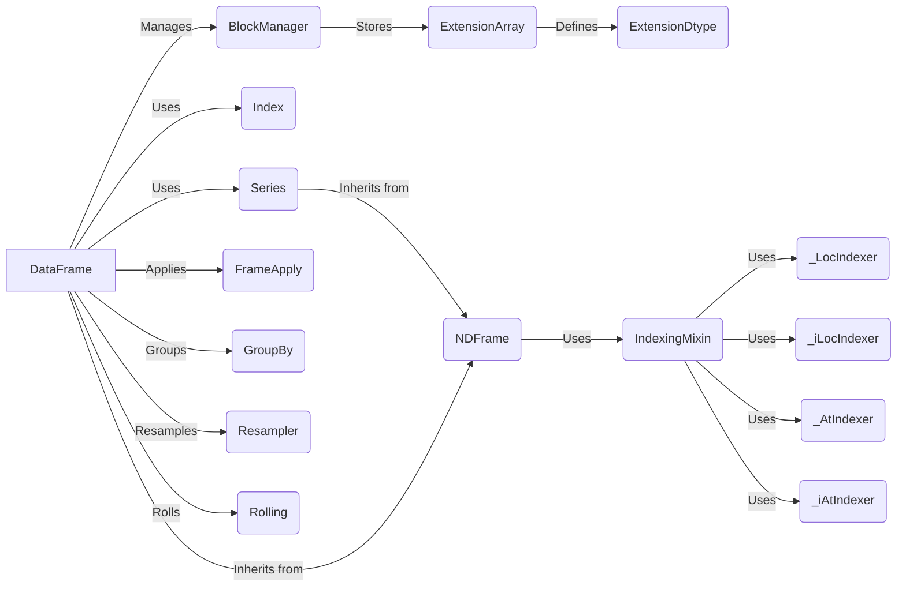

## Component Descriptions:

**DataFrame:** Represents a two-dimensional tabular data structure with labeled axes. It manages data through a `BlockManager`, utilizes `Index` for row and column labels, and can contain multiple `Series`. It supports operations like applying functions (`FrameApply`), grouping (`GroupBy`), resampling (`Resampler`), and rolling window calculations (`Rolling`).
*Relevant source files*: `pandas.core.frame.DataFrame`

**BlockManager:** Manages the underlying data blocks of a DataFrame, providing functionalities for data storage, retrieval, and manipulation. It stores data in `ExtensionArray` objects.
*Relevant source files*: `pandas.core.internals.managers.BlockManager`

**Index:** Represents an immutable sequence used for indexing and alignment, providing functionalities for label-based data access. It is used by `DataFrame` for managing row and column labels.
*Relevant source files*: `pandas.core.indexes.base.Index`

**Series:** Represents a one-dimensional labeled array capable of holding any data type. It is a fundamental data structure within a `DataFrame`.
*Relevant source files*: `pandas.core.series.Series`

**FrameApply:** Applies a function along an axis of the DataFrame, supporting various function types and execution engines. It is used by `DataFrame` to apply functions to rows or columns.
*Relevant source files*: `pandas.core.apply.FrameApply`

**GroupBy:** Enables grouping operations on DataFrame or Series, allowing aggregation, transformation, and filtering of data based on specified criteria. It is used by `DataFrame` to group data based on column values.
*Relevant source files*: `pandas.core.groupby.groupby.GroupBy`

**Resampler:** Provides time series resampling functionalities, allowing conversion of time series data to different frequencies. It is used by `DataFrame` to resample time series data.
*Relevant source files*: `pandas.core.resample.Resampler`

**Rolling:** Enables rolling window calculations on DataFrame or Series, allowing computation of statistics over a sliding window of data. It is used by `DataFrame` to perform rolling window calculations.
*Relevant source files*: `pandas.core.window.rolling.Rolling`

**ExtensionArray:** Abstract base class for extension arrays, providing a way to extend pandas with custom data types. It is used by `BlockManager` to store data.
*Relevant source files*: `pandas.core.arrays.base.ExtensionArray`

**ExtensionDtype:** Abstract base class for extension dtypes, defining the type of data stored in an ExtensionArray. It defines the data type of an `ExtensionArray`.
*Relevant source files*: `pandas.core.dtypes.base.ExtensionDtype`

**NDFrame:** Abstract base class for DataFrame and Series, providing common functionalities such as data alignment, arithmetic operations, and basic indexing. Both `DataFrame` and `Series` inherit from it.
*Relevant source files*: `pandas.core.generic.NDFrame`

**IndexingMixin:** Provides the .loc, .iloc, .at, and .iat accessors for indexing, enabling label-based and integer-position based data selection. It is used by `NDFrame` to provide indexing functionalities.
*Relevant source files*: `pandas.core.indexing.IndexingMixin`

**_LocIndexer:** Enables label-based indexing using the .loc accessor, allowing selection of data based on row and column labels. It is used by `IndexingMixin` to implement label-based indexing.
*Relevant source files*: `pandas.core.indexing._LocIndexer`

**_iLocIndexer:** Enables integer-position based indexing using the .iloc accessor, allowing selection of data based on row and column integer positions. It is used by `IndexingMixin` to implement integer-position based indexing.
*Relevant source files*: `pandas.core.indexing._iLocIndexer`

**_AtIndexer:** Enables label-based scalar lookups using the .at accessor, allowing fast retrieval of single values based on row and column labels. It is used by `IndexingMixin` to implement label-based scalar lookups.
*Relevant source files*: `pandas.core.indexing._AtIndexer`

**_iAtIndexer:** Enables integer-position based scalar lookups using the .iat accessor, allowing fast retrieval of single values based on row and column integer positions. It is used by `IndexingMixin` to implement integer-position based scalar lookups.
*Relevant source files*: `pandas.core.indexing._iAtIndexer`
