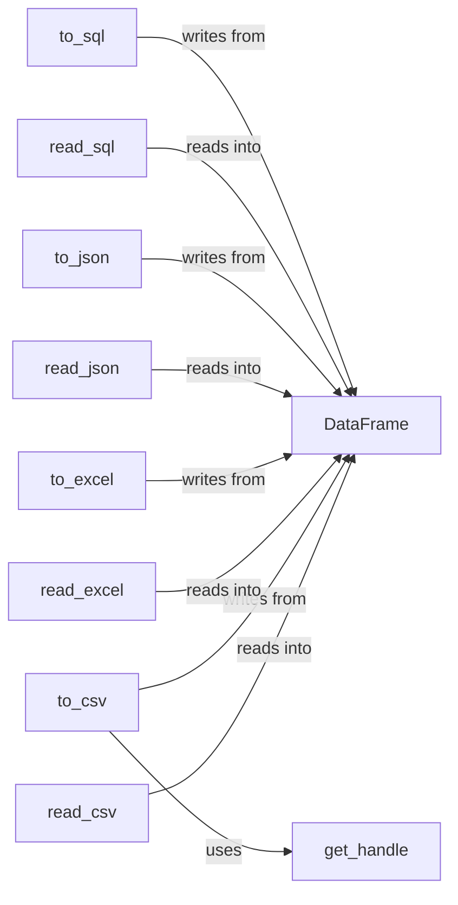

## Component Details

The Data I/O subsystem in pandas is responsible for reading and writing data between pandas data structures (primarily DataFrames) and various external file formats and data sources. It provides a consistent interface for importing data from CSV, Excel, JSON, SQL databases, and Parquet files, as well as exporting data to these formats. The core functionality revolves around functions like `read_csv`, `read_excel`, `read_json`, `read_sql`, and `read_parquet` for reading data, and corresponding `to_csv`, `to_excel`, `to_json`, `to_sql`, and `to_parquet` methods for writing data. Utility functions like `get_handle` are used internally to manage file handles, and classes like `ExcelWriter`, `CSVParser`, and `ExcelFile` handle format-specific parsing and writing logic. The `NDFrame` and `DataFrame` classes provide the base data structures and methods for I/O operations.

### DataFrame
The DataFrame is a central data structure in pandas, representing a two-dimensional labeled table with columns of potentially different types. It serves as the primary target for data read operations and the source for data write operations.
- **Related Classes/Methods**: `pandas.core.frame.DataFrame`

### read_csv
The `read_csv` function reads data from a CSV file and creates a DataFrame. It handles parsing the CSV data, inferring data types, and constructing the DataFrame object.
- **Related Classes/Methods**: `pandas.io.parsers.readers:read_csv`

### to_csv
The `to_csv` method writes a DataFrame to a CSV file. It handles formatting the data, managing file handles using `get_handle`, and writing the CSV data to the file.
- **Related Classes/Methods**: `pandas.core.generic.NDFrame:to_csv`

### read_excel
The `read_excel` function reads data from an Excel file and creates a DataFrame. It uses the `ExcelFile` class to parse the Excel file and extract data into a DataFrame.
- **Related Classes/Methods**: `pandas.io.excel._base:read_excel`

### to_excel
The `to_excel` method writes a DataFrame to an Excel file. It utilizes the `ExcelWriter` class to handle the Excel file format and write the DataFrame's data.
- **Related Classes/Methods**: `pandas.core.generic.NDFrame:to_excel`

### read_json
The `read_json` function reads data from a JSON string or file and creates a DataFrame. It handles parsing the JSON data and constructing the DataFrame object.
- **Related Classes/Methods**: `pandas.io.json:read_json`

### to_json
The `to_json` method writes a DataFrame to a JSON string or file. It handles formatting the data into JSON and writing it to the specified output.
- **Related Classes/Methods**: `pandas.io.json:to_json`

### read_sql
The `read_sql` function reads data from a SQL database and creates a DataFrame. It executes SQL queries and retrieves data into a DataFrame.
- **Related Classes/Methods**: `pandas.io.sql:read_sql`

### to_sql
The `to_sql` method writes a DataFrame to a SQL database. It handles creating tables and inserting data into the database.
- **Related Classes/Methods**: `pandas.io.sql:to_sql`

### get_handle
The `get_handle` function is a utility for opening and managing file handles. It's used by various I/O functions to ensure proper file handling and resource management.
- **Related Classes/Methods**: `pandas.io.common:get_handle`
