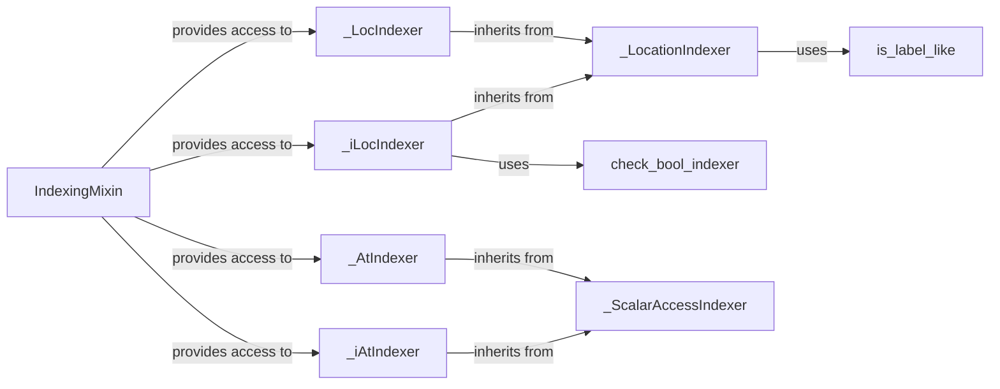

## Component Details

The Data Indexing and Selection component in pandas provides a flexible way to access and modify subsets of data within Series and DataFrames. It encompasses label-based, integer-based, and boolean indexing, allowing users to extract specific data based on their needs. The core of this component revolves around the `IndexingMixin` class, which provides the foundation for the `.loc`, `.iloc`, `.at`, and `.iat` indexers. These indexers are implemented by specialized classes like `_LocIndexer`, `_iLocIndexer`, `_AtIndexer`, and `_iAtIndexer`, each tailored to handle specific indexing methods. The `_LocationIndexer` class serves as a base for both `.loc` and `.iloc` indexers, providing common functionalities. Scalar access is facilitated by `_ScalarAccessIndexer`, which is inherited by `_AtIndexer` and `_iAtIndexer`. Helper functions like `check_bool_indexer` and `is_label_like` provide validation and type checking during the indexing process.

### IndexingMixin
Provides the base implementation for the indexing attributes `.loc`, `.iloc`, `.at`, and `.iat`. It's the entry point for accessing these indexers on pandas objects, adding the indexing functionality to pandas DataFrames and Series.
- **Related Classes/Methods**: `pandas.core.indexing.IndexingMixin`

### _LocationIndexer
Base class for label-based and integer-based indexers (`.loc`, `.iloc`). It handles the common logic for key validation, ellipsis expansion, and tuple conversion, providing a shared foundation for the location-based indexers.
- **Related Classes/Methods**: `pandas.core.indexing._LocationIndexer`

### _LocIndexer
Handles label-based indexing using `.loc`. It inherits from `_LocationIndexer` and implements specific logic for label-based selection, including handling iterables, slices, and multi-index scenarios, enabling flexible data selection based on labels.
- **Related Classes/Methods**: `pandas.core.indexing._LocIndexer`

### _iLocIndexer
Handles integer-based indexing using `.iloc`. It inherits from `_LocationIndexer` and implements specific logic for integer-based selection, including handling slices and setting items with indexers, providing integer-based data selection capabilities.
- **Related Classes/Methods**: `pandas.core.indexing._iLocIndexer`

### _ScalarAccessIndexer
Handles scalar access using `.at` and `.iat`. It provides methods for getting and setting single values based on labels or integer positions, enabling efficient single-element access.
- **Related Classes/Methods**: `pandas.core.indexing._ScalarAccessIndexer`

### _AtIndexer
Handles label-based indexing using `.at`. It provides methods for getting and setting single values based on labels, offering label-based scalar access.
- **Related Classes/Methods**: `pandas.core.indexing._AtIndexer`

### _iAtIndexer
Handles integer-based indexing using `.iat`. It provides methods for getting and setting single values based on integer positions, providing integer-based scalar access.
- **Related Classes/Methods**: `pandas.core.indexing._iAtIndexer`

### check_bool_indexer
Validates boolean indexers, ensuring that boolean indexers are valid and can be used for data selection.
- **Related Classes/Methods**: `pandas.core.indexing.check_bool_indexer`

### is_label_like
Checks if a key is label-like, helping to determine whether a given key can be used for label-based indexing.
- **Related Classes/Methods**: `pandas.core.indexing.is_label_like`
