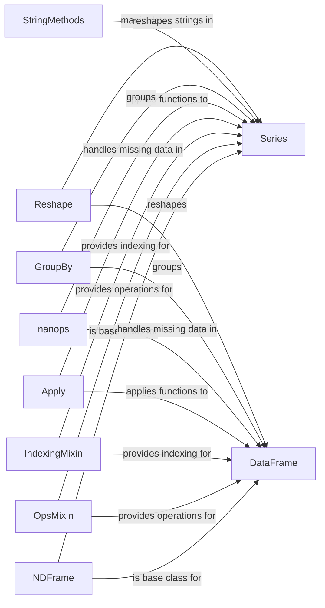

## Component Details

The Data Transformation and Computation component in pandas encompasses a wide range of functionalities for manipulating and analyzing data within Series and DataFrames. It provides tools for data cleaning, such as handling missing values, and transformation, including applying mathematical, statistical, and string operations. This component also supports aggregation, reshaping, and merging of data, enabling users to derive insights and create new data representations. The core of this component relies on the NDFrame base class, which provides fundamental data manipulation capabilities, extended by Series and DataFrame classes for one-dimensional and two-dimensional data, respectively. Key functionalities are implemented through mixins like OpsMixin and IndexingMixin, and specialized modules like nanops, GroupBy, Resampler, and StringMethods.

### NDFrame
Base class for pandas data structures (Series, DataFrame). Provides core functionalities like arithmetic operations, data cleaning, indexing, and basic statistics.
- **Related Classes/Methods**: `pandas.core.generic.NDFrame`

### Series
Represents a one-dimensional labeled array capable of holding any data type. Extends NDFrame and provides methods for data alignment, arithmetic operations, statistics, string manipulation, time series functionality, and plotting.
- **Related Classes/Methods**: `pandas.core.series.Series`

### DataFrame
Represents a two-dimensional labeled data structure with columns of potentially different types. Extends NDFrame and provides methods for data alignment, arithmetic operations, statistics, reshaping, merging, grouping, and plotting.
- **Related Classes/Methods**: `pandas.core.frame.DataFrame`

### OpsMixin
Provides implementations for binary arithmetic and comparison operations, enabling element-wise operations on array-like classes.
- **Related Classes/Methods**: `pandas.core.arraylike.OpsMixin`

### IndexingMixin
Provides the .loc, .iloc, .at, and .iat accessors for indexing and selecting data within pandas objects.
- **Related Classes/Methods**: `pandas.core.indexing.IndexingMixin`

### Apply
Handles the application of functions to DataFrames and Series, including aggregation and transformation operations.
- **Related Classes/Methods**: `pandas.core.apply.Apply`, `pandas.core.apply.FrameApply`, `pandas.core.apply.SeriesApply`

### nanops
Provides implementations of statistical functions that handle missing data (NaN values).
- **Related Classes/Methods**: `pandas.core.nanops`

### GroupBy
Enables grouping data based on column values and applying aggregation, transformation, and filtering operations to each group.
- **Related Classes/Methods**: `pandas.core.groupby.generic.SeriesGroupBy`, `pandas.core.groupby.generic.DataFrameGroupBy`, `pandas.core.groupby.groupby.GroupBy`

### StringMethods
Provides a collection of string manipulation methods that can be applied to Series containing strings.
- **Related Classes/Methods**: `pandas.core.strings.accessor.StringMethods`

### Reshape
Includes functions for reshaping pandas objects, such as concatenation, merging, pivoting, and melting.
- **Related Classes/Methods**: `pandas.core.reshape.concat`, `pandas.core.reshape.merge`, `pandas.core.reshape.pivot`, `pandas.core.reshape.melt`, `pandas.core.reshape.reshape`
