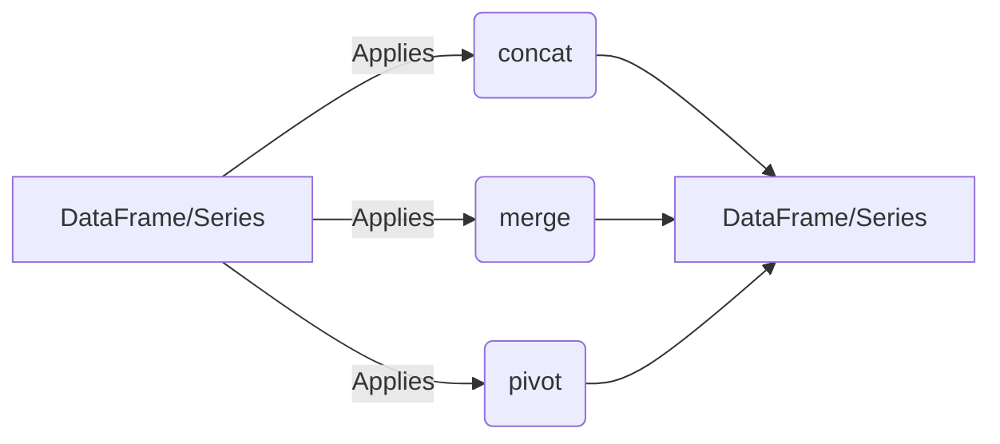

## Data Transformation Component Overview

This section provides an overview of the Data Transformation component in pandas, focusing on how data is reshaped, merged, and concatenated. The diagram illustrates the flow of data through these operations, highlighting the key components involved.

### Component Descriptions:

*   **DataFrame/Series:** The initial data structure, either a DataFrame (2D) or a Series (1D), that requires transformation. It serves as the input for the transformation operations.
    *   **Purpose:** Holds the data to be transformed.
    *   **Interaction:** Provides the data to `concat`, `merge`, and `pivot` functions.
    *   **Relevant source files:** `pandas.core.frame.DataFrame`, `pandas.core.series.Series`

*   **concat:** This function concatenates pandas objects along a particular axis (rows or columns). It's used to combine multiple DataFrames or Series into a single, larger DataFrame or Series.
    *   **Purpose:** Combines multiple DataFrames/Series.
    *   **Interaction:** Receives DataFrames/Series as input and outputs a combined DataFrame/Series.
    *   **Relevant source files:** `pandas.core.reshape.concat.concat`

*   **merge:** This function merges two DataFrames based on a common column or index. It's similar to SQL joins and allows for combining data from different sources.
    *   **Purpose:** Joins two DataFrames based on common columns/indexes.
    *   **Interaction:** Receives two DataFrames as input and outputs a merged DataFrame.
    *   **Relevant source files:** `pandas.core.reshape.merge.merge`

*   **pivot:** This function reshapes a DataFrame from long to wide format. It uses the values from one column to create new columns and another column to populate the values.
    *   **Purpose:** Reshapes a DataFrame from long to wide format.
    *   **Interaction:** Receives a DataFrame as input and outputs a reshaped DataFrame.
    *   **Relevant source files:** `pandas.core.reshape.pivot.pivot`

*   **DataFrame/Series:** The resulting data structure after the transformation. It represents the reshaped, merged, or concatenated data.
    *   **Purpose:** Holds the transformed data.
    *   **Interaction:** Output of `concat`, `merge`, and `pivot` functions.
    *   **Relevant source files:** `pandas.core.frame.DataFrame`, `pandas.core.series.Series`
