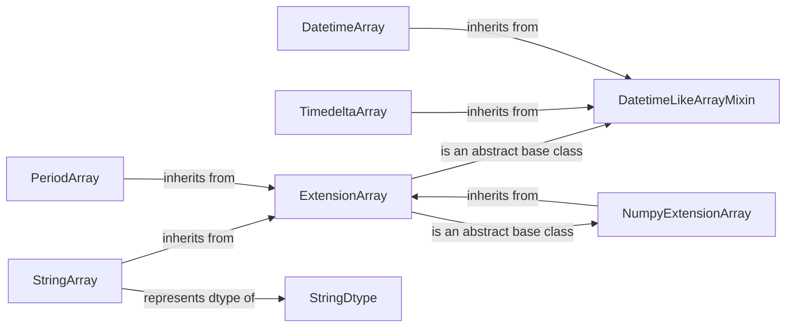

## Component Details

The Extension Data Types component in pandas enables users to define custom data types that seamlessly integrate with pandas' data structures. This system revolves around the `ExtensionArray` abstract class, which serves as the foundation for creating custom array implementations. Concrete implementations like `NumpyExtensionArray`, `DatetimeArray`, `TimedeltaArray`, `StringArray`, and `PeriodArray` provide specialized handling for different data types, such as NumPy arrays, datetime values, timedelta values, strings, and period values, respectively. Mixin classes like `DatetimeLikeArrayMixin` offer shared functionalities for datetime-like arrays. The `StringDtype` component represents the dtype for string arrays, defining the data type stored in `StringArray`.

### ExtensionArray
Abstract base class for custom array implementations in pandas. It defines the interface that custom arrays must implement to be compatible with pandas. It provides default implementations for many methods, but subclasses must override certain methods to handle data storage and manipulation specific to the custom array type.
- **Related Classes/Methods**: `pandas.core.arrays.base.ExtensionArray`

### NumpyExtensionArray
A concrete implementation of ExtensionArray that uses a NumPy array as the underlying data storage. It provides a simple way to create custom arrays based on NumPy arrays, inheriting the performance and functionality of NumPy.
- **Related Classes/Methods**: `pandas.core.arrays.numpy_.NumpyExtensionArray`

### DatetimeLikeArrayMixin
Mixin class for ExtensionArrays that represent datetime-like data. It provides common methods and functionalities for handling datetime and timedelta data, such as arithmetic operations, formatting, and timezone conversions.
- **Related Classes/Methods**: `pandas.core.arrays.datetimelike.DatetimeLikeArrayMixin`

### TimedeltaArray
Concrete implementation of ExtensionArray for storing timedelta values. It inherits from DatetimeLikeArrayMixin and provides specific methods for timedelta operations, such as addition, subtraction, and division.
- **Related Classes/Methods**: `pandas.core.arrays.timedeltas.TimedeltaArray`

### DatetimeArray
Concrete implementation of ExtensionArray for storing datetime values. It inherits from DatetimeLikeArrayMixin and provides specific methods for datetime operations, such as timezone conversions and localization.
- **Related Classes/Methods**: `pandas.core.arrays.datetimes.DatetimeArray`

### StringDtype
Represents the dtype for string arrays in pandas. It defines the type of data stored in StringArray and provides methods for constructing and manipulating string dtypes.
- **Related Classes/Methods**: `pandas.core.arrays.string_.StringDtype`

### StringArray
Concrete implementation of ExtensionArray for storing string values. It provides methods for string-specific operations, such as string manipulation, searching, and comparison.
- **Related Classes/Methods**: `pandas.core.arrays.string_.StringArray`

### PeriodArray
Concrete implementation of ExtensionArray for storing Period values. It represents fixed-frequency time intervals.
- **Related Classes/Methods**: `pandas.core.arrays.period.PeriodArray`
