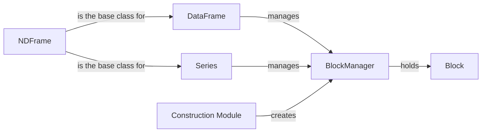

## Component Details

The Internal Data Management component in pandas is responsible for efficiently storing, accessing, and manipulating the data within pandas data structures like Series and DataFrames. It revolves around the BlockManager, which manages a collection of Blocks, each containing data of a specific type. This design optimizes memory usage and performance by allowing pandas to handle heterogeneous data types within a single data structure. The construction module provides the functionality to create BlockManagers from various inputs, ensuring seamless integration with different data sources.

### NDFrame
The NDFrame class serves as the foundation for both Series and DataFrame in pandas. It encapsulates the core functionalities and attributes shared by these data structures, including data storage, metadata management (like index and column names), and basic data manipulation methods. It provides the common interface for accessing and modifying data, regardless of whether it's a one-dimensional Series or a two-dimensional DataFrame.
- **Related Classes/Methods**: `pandas.core.generic.NDFrame`

### Series
The Series is a fundamental one-dimensional labeled array in pandas, built upon the NDFrame. It can hold data of any type and is indexed by labels. Series objects are essential for representing time series data, statistical data, and any other data that can be organized in a single column.
- **Related Classes/Methods**: `pandas.core.series.Series`

### DataFrame
The DataFrame is a two-dimensional labeled data structure in pandas, built upon the NDFrame. It consists of columns, each of which can be of a different data type. DataFrames are the primary data structure for tabular data in pandas, allowing for efficient storage and manipulation of data with rows and columns.
- **Related Classes/Methods**: `pandas.core.frame.DataFrame`

### BlockManager
The BlockManager is the central component responsible for managing the internal data storage of DataFrames and Series. It holds a collection of Blocks, each containing data of a specific data type. The BlockManager handles data manipulation, consolidation, and accessing data within the blocks, optimizing performance and memory usage.
- **Related Classes/Methods**: `pandas.core.internals.managers.BlockManager`

### Block
A Block represents a contiguous block of data with a specific data type within a DataFrame or Series. It provides methods for accessing and manipulating the data within the block. Blocks are the fundamental units of data storage within the BlockManager, allowing for efficient handling of homogeneous data.
- **Related Classes/Methods**: `pandas.core.internals.blocks.Block`

### Construction Module
The Construction Module contains functions responsible for constructing BlockManagers from various data inputs like arrays, dictionaries, and existing DataFrames/Series. It handles data homogenization, index extraction, and block creation, ensuring seamless integration with different data sources and enabling the creation of pandas data structures from diverse input formats.
- **Related Classes/Methods**: `pandas.core.internals.construction`
