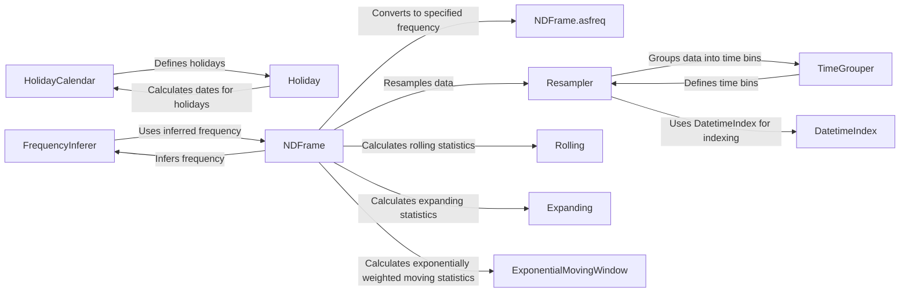

## Component Details

The Time Series Functionality component in pandas provides a comprehensive suite of tools for analyzing and manipulating time-dependent data. It encompasses functionalities for handling date and time information, resampling time series data, inferring frequencies, defining custom holiday calendars, and calculating rolling and expanding window statistics. These components work together to enable users to extract meaningful insights and patterns from time series data, facilitating tasks such as trend analysis, forecasting, and anomaly detection.

### HolidayCalendar
The HolidayCalendar component defines custom holiday calendars with specific rules for calculating holiday dates. It allows users to define their own holiday schedules, taking into account factors such as fixed dates, day-of-week occurrences, and date offsets. This component interacts with Holiday objects to represent individual holidays and their dates, providing a flexible way to incorporate holiday effects into time series analysis.
- **Related Classes/Methods**: `pandas.tseries.holiday.Holiday`, `pandas.tseries.holiday.AbstractHolidayCalendar`, `pandas.tseries.holiday.HolidayCalendarMetaClass`, `pandas.tseries.holiday:HolidayCalendarFactory`

### FrequencyInferer
The FrequencyInferer component infers the frequency of a time series based on the time deltas between data points. It analyzes the time intervals between consecutive data points to determine the underlying frequency rule, such as daily, weekly, or monthly. This component is crucial for automatically detecting the periodicity of time series data, enabling subsequent resampling and analysis operations.
- **Related Classes/Methods**: `pandas.tseries.frequencies:infer_freq`, `pandas.tseries.frequencies._FrequencyInferer`

### NDFrame.asfreq
The NDFrame.asfreq component converts a time series (represented as a Series or DataFrame) to a specified frequency. It uses the index of the NDFrame and the desired frequency to resample the data, filling in missing values or aggregating existing values as needed. This component is essential for aligning time series data to a common frequency, facilitating comparisons and joint analysis.
- **Related Classes/Methods**: `pandas.core.generic.NDFrame:asfreq`

### Resampler
The Resampler component provides resampling functionality for time series data, allowing upsampling and downsampling based on time intervals. It groups the data into time bins using TimeGrouper and applies aggregation functions to the resampled data. This component is fundamental for changing the frequency of time series data, enabling analysis at different time scales.
- **Related Classes/Methods**: `pandas.core.resample.Resampler`, `pandas.core.resample.DatetimeIndexResampler`, `pandas.core.resample.PeriodIndexResampler`, `pandas.core.resample:get_resampler`, `pandas.core.resample:get_resampler_for_grouping`

### TimeGrouper
The TimeGrouper component defines the binning logic for resampling time series data based on time intervals. It interacts with the index of the data to create time bins and group the data accordingly. This component is a key part of the resampling process, determining how the data is aggregated or interpolated when changing the frequency.
- **Related Classes/Methods**: `pandas.core.resample.TimeGrouper`

### Rolling
The Rolling component calculates rolling window statistics for time series data, such as sum, mean, and standard deviation. It interacts with the data to create rolling windows and applies aggregation functions to each window. This component is widely used for smoothing time series data and identifying trends over time.
- **Related Classes/Methods**: `pandas.core.window.rolling.Rolling`, `pandas.core.window.rolling.RollingAndExpandingMixin`, `pandas.core.window.rolling.BaseWindow`

### Expanding
The Expanding component calculates expanding window statistics for time series data, where the window size increases with each data point. It interacts with the data to create expanding windows and applies aggregation functions to each window. This component is useful for calculating cumulative statistics and observing how the data evolves over time.
- **Related Classes/Methods**: `pandas.core.window.expanding.Expanding`

### ExponentialMovingWindow
The ExponentialMovingWindow component calculates exponentially weighted moving statistics for time series data, giving more weight to recent data points. It interacts with the data to create exponentially weighted windows and applies aggregation functions to each window. This component is particularly effective for capturing recent trends and reducing the impact of older data points.
- **Related Classes/Methods**: `pandas.core.window.ewm.ExponentialMovingWindow`

### DatetimeIndex
The DatetimeIndex component represents a datetime index, providing methods for date and time manipulation and indexing. It interacts with other components to perform operations such as timezone conversion, localization, and formatting. This component is fundamental for working with time series data in pandas, enabling efficient indexing and alignment of data based on dates and times.
- **Related Classes/Methods**: `pandas.core.indexes.datetimes.DatetimeIndex`
